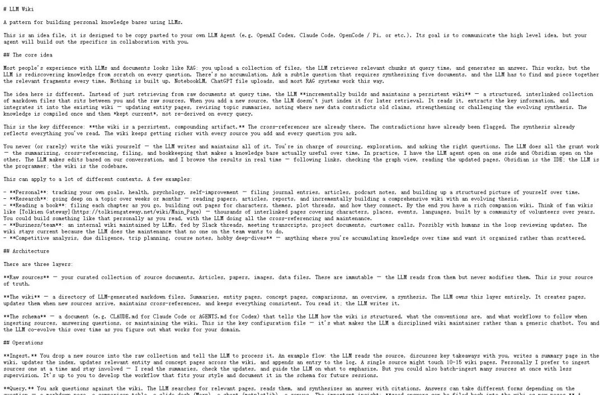
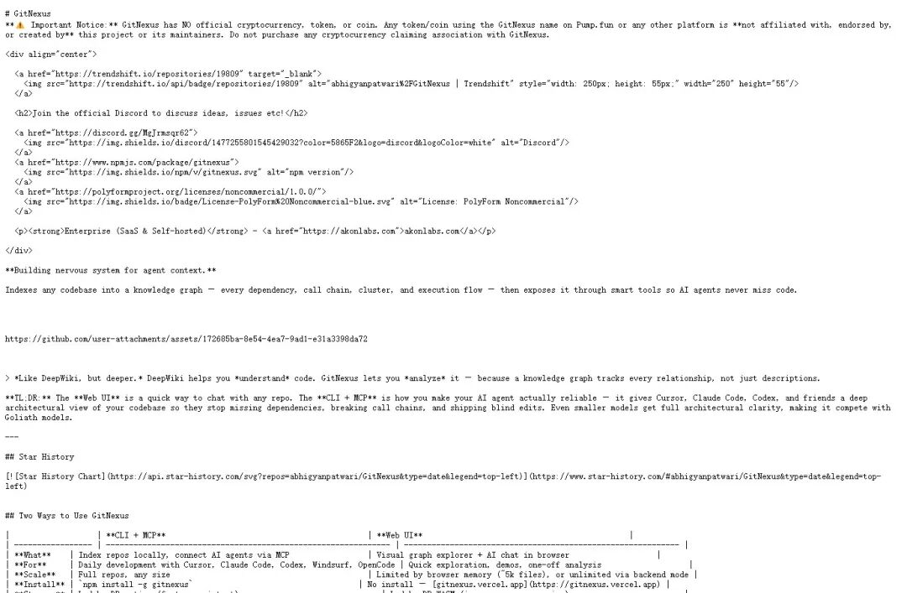
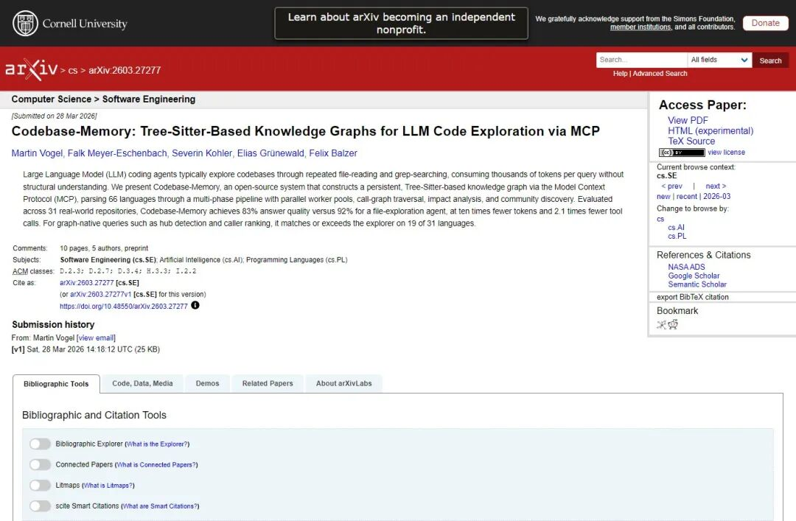

> 📎 来源: [硅基与token](https://mp.weixin.qq.com/s?__biz=MzYzOTgyOTA1Ng==&mid=2247483992&idx=1&sn=b18a8ab1d542996829dc34296b066b3e&chksm=f13bd7d536c9d85382c0cb307648b3ba0328e7754fee4758f5f67b00073e14a7cb0cff7d9ff8&mpshare=1&scene=1&srcid=0528MnjgKlUoBt4VOQ4mgHSB&sharer_shareinfo=ac5a7cb127fc2e4f346e41a93a4f946e&sharer_shareinfo_first=ac5a7cb127fc2e4f346e41a93a4f946e) | 时间: 2026-05-28 20:35

---

GitNexus 把代码仓库做成了一个可查询、可追踪、可更新的结构化知识库。

这条线正好接上 Karpathy 4 月那篇 

```
LLM Wiki
```

：让大模型先把原始资料编译成一套持续生长的 wiki，而不是每次提问都从一堆文件里临时翻答案。

放到代码场景里，问题就变成了：AI 编程助手到底应该临时 grep 代码，还是先拥有一张代码仓库地图。

Karpathy 在 

```
LLM Wiki
```

 里批评的不是 RAG 本身，而是“每次重新理解”的成本。

普通 RAG 的典型流程是：上传一批文件，提问时召回片段，再生成回答。这个流程能用，但知识没有积累。今天问一个问题，模型临时拼一次；明天换一个角度，它又要重新找、重新拼、重新判断。

Karpathy 提出的替代方案，是让 LLM 维护一套持久 wiki。

新资料进来之后，LLM 不只是索引它，而是把关键信息合并到已有页面里：实体页要更新，主题摘要要修订，互相矛盾的说法要标出来，相关页面之间要建立链接。用户负责给材料、提问题、做判断，LLM 负责整理、交叉引用和维护结构。



这套思路用在代码仓库上，会更直接。

因为代码天然不是一堆平铺文本。一个函数背后有调用方，一个接口背后有实现类，一个路由背后有 service、repository、数据库表和测试。工程师看代码时，真正消耗时间的也不是“读到某个文件”，而是把这些关系串起来。

长上下文能缓解一部分问题，但它没有改变对象形态。

把更多文件塞进窗口，本质上还是让模型临时读。仓库越大，临时阅读越容易漏掉跨文件关系、隐式依赖、调用链和修改影响面。

GitNexus 做的事，是先把代码仓库编译成图。

从 README 看，它的 CLI 会索引仓库，抽取依赖、调用链、cluster 和 execution flow，再通过 MCP 暴露给 Cursor、Claude Code、Codex、Windsurf 这类 AI 编程工具。Web UI 则提供浏览器里的可视化图谱和 AI chat，适合快速探索。

它的入口也很直接：

```
npx gitnexus analyze
```

这个命令会在本地索引仓库，生成 agent skills，注册 Claude Code hooks，并创建 

```
AGENTS.md
```

 / 

```
CLAUDE.md
```

 这类上下文文件。后续通过 

```
gitnexus mcp
```

，AI agent 就能查询这张图。



更关键的是它暴露出来的工具形态。

不是只给一个“搜索代码”的接口，而是提供 

```
query
```

、

```
context
```

、

```
impact
```

、

```
detect_changes
```

、

```
rename
```

、

```
cypher
```

 等工具。

这几个词已经把方向说清楚了。

```
query
```

 解决怎么找。

```
context
```

 解决一个符号的上下游关系。

```
impact
```

 解决改它会影响谁。

```
detect_changes
```

 解决当前 diff 会波及哪些流程。

```
rename
```

 解决重命名这种跨文件操作。

```
cypher
```

 则把底层图查询能力暴露出来。

这和普通代码搜索不是一个层级。搜索返回的是候选文件，图谱返回的是结构关系。前者让 agent 自己继续猜，后者把“应该看哪些关系”提前算好。

这也是 2026 年几篇代码知识图谱论文反复指向的问题。

```
Codebase-Memory
```

 这篇 arXiv 预印本把代码仓库构造成基于 Tree-sitter 的持久知识图谱，再通过 MCP 给 LLM coding agent 使用。论文在 31 个真实仓库上对比后发现，它在回答质量接近传统文件探索 agent 的同时，token 消耗低一个数量级，工具调用也明显减少。

另一篇 

```
Reliable Graph-RAG for Codebases
```

 更直接：向量检索擅长找主题相似的片段，但遇到 controller 到 service 到 repository 这种多跳架构推理时容易断。它比较了纯向量、LLM 生成知识图谱、AST 派生确定性图谱三条路线，结论是基于 AST 的确定性图在覆盖率、成本和多跳 grounding 上更可靠。



这解释了 GitNexus 为什么会和 Karpathy 的 

```
LLM Wiki
```

 放在同一条线上。

Karpathy 讲的是个人知识库：不要每次从 raw documents 里重算，要把知识沉淀成持续维护的 wiki。

GitNexus 讲的是代码仓库：不要每次让 agent 从文件树里盲搜，要把仓库沉淀成持续查询的结构图。

对象不同，机制相似。

一个面向论文、笔记、网页、材料。

一个面向函数、类、依赖、调用链、执行流。

共同点是把“临时上下文”变成“持久结构”。

这对 AI 编程的意义很实际。

过去我们总说 coding agent 不够强，常见解决办法是换更强模型、塞更长上下文、加更多 grep。可很多线上 bug 不是因为模型没读到某一行，而是它不知道这一行在系统里连着谁。

一个 

```
validateUser
```

 的返回值改了，真正重要的不是它当前文件怎么写，而是谁调用它、哪些流程依赖它、哪些测试会被影响、有没有跨 repo contract 会断。

这些问题天然适合图，不适合只靠片段召回。

所以 GitNexus 最值得看的地方，不是它又做了一个代码问答界面。

它把 agent 的上下文入口，从“文件内容”往前挪到了“仓库结构”。

如果 repo 很小，

```
rg
```

、IDE 跳转和人工阅读已经够用。代码规模一旦进入多模块、多服务、多 agent 协作，结构化代码记忆就会从锦上添花变成基础设施。

AI 编程下一步缺的不是更会聊天的助手，而是更少迷路的助手。
