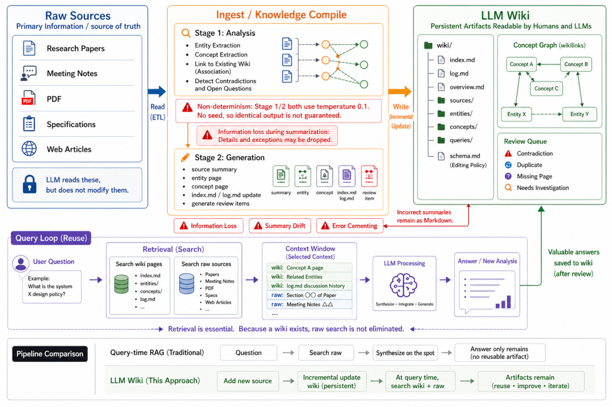

> 📎 来源: [技术极简主义](https://mp.weixin.qq.com/s?__biz=MjM5NzA1NzMyOQ==&mid=2247487035&idx=1&sn=16227b052787487b3c93004bbe5ee198&chksm=a75f3a3941d7d6e99f653913c3471903f464de1ebc947eff677c6c656d26763afcbf8efddb20&mpshare=1&scene=1&srcid=0522xaThv1OZoEchRg2SsEjU&sharer_shareinfo=6d1d8d5847f0d26addd3c790e30b0bb4&sharer_shareinfo_first=6d1d8d5847f0d26addd3c790e30b0bb4) | 时间: 2026-05-22 12:18

---

如果一个 LLM 工作流每次都在检索相似片段、重新总结同一批资料，那么答案也许有用，但知识并没有真正留下来。

Karpathy 在 

```
llm-wiki.md
```

[1] 里提出了一个很有意思的方向：让 LLM 在上下文窗口之外维护一个 Markdown Wiki。后来，

```
nashsu/llm_wiki
```

[2] 社区把这个想法做成了桌面开源应用。

LLM Wiki 的价值，在于把模型逐渐形成的理解沉淀成可读、可修改、可追溯的 Markdown 知识 artifact。随着对话和任务推进，知识能够被持续整理、补充和复用。

这篇文章就围绕一个问题展开：LLM Wiki 到底解决了什么，又留下了什么问题？

## 为什么需要 LLM Wiki？

今天我们使用 LLM 的方式，已经从「问一个问题，拿一个答案」，逐渐走向「让模型长期参与一个项目」。它可能要读代码、看文档、整理会议记录、分析论文、追踪需求变化。

但问题也随之出现：一次对话里模型很聪明，换一个会话之后，很多理解又要重新建立。

长上下文可以缓解这个问题，但它不是万能解。上下文越长，噪声越多，成本越高，模型也未必总能抓住真正重要的结构。RAG 则解决了另一个关键问题：需要资料时，把相关片段找回来。

可 RAG 的典型工作方式，是在用户提问时检索原始材料，然后现场综合回答。这个过程很有效，但如果每次都在相同资料上重新做同一轮综合，知识就没有沉淀下来。

**RAG 更像是「把资料找出来」，LLM Wiki 试图解决的是「把读过的资料组织起来」。**

这就是 LLM Wiki 出现的位置。它不是再发明一个聊天记录，也不是简单把文档切块丢进向量库，而是在模型上下文之外，维护一套可以持续更新的 Markdown 知识库。

这样一来，重点就从「这次回答得怎么样」，逐渐转向「这次处理过的知识，之后还能不能继续复用」。

## Karpathy 的 Markdown 知识库模式

Karpathy 的 

```
llm-wiki.md
```

 有一个非常直接的设想：让 LLM 在上下文窗口之外维护一个 Markdown Wiki。

这个设想之所以有意思，是因为它没有把长期记忆藏进一个完全不可见的数据库里，而是选择了最朴素的 Markdown 文件。Markdown 对人可读，对模型也友好；可以被 Git 管理，可以被人工审阅，也可以被自动生成和修改。

这里的关键不是 Markdown 本身，而是「Wiki」这种组织方式。Wiki 不是一篇总结文档，而是一组互相链接、分层组织、持续演化的页面。

比如一个项目知识库里，可能有入口页、概览页、来源页、实体页、概念页、查询记录页。它们共同构成一个外部知识结构，供人类阅读，也供下一轮 LLM 调用读取。

```
nashsu/llm_wiki
```

 可以看作这个思路的一个桌面开源实现。它把抽象的 Markdown Wiki 模式具体化为一个应用：导入资料，分析内容，生成 Wiki 页面，再在后续查询中持续复用这些页面。

但要注意，LLM Wiki 不是 RAG 的替代品。

**它更准确的定位，是在 RAG 之外增加一层可持久化、可编辑、可审计的知识 artifact。**

传统 RAG 在查询时合成答案，LLM Wiki 则把一部分合成提前到资料导入阶段，并把中间成果保存下来。这个差别很小，但影响很大：知识不再只存在于某一次回答里，而是变成了可以被检查、修改、链接和复用的文件。

## LLM Wiki 的架构设计原理



如果把 LLM Wiki 的架构摊开看，它大致可以分成四个部分：Raw Sources、Ingest / Knowledge Compile、Markdown Wiki 文件树，以及 Query / Update Loop。

```
Raw Sources  ↓Ingest / Knowledge Compile  ↓Markdown Wiki 文件树  ↓Query / Update Loop
```

### Raw Sources：事实来源不能被替代

Raw Sources 是左侧的原始资料层。它可以是论文、网页、PDF、会议记录、代码仓库、规格文档，也可以是项目过程中的各种笔记。

这一层很重要，因为它是真相来源。Wiki 页面再有用，也只是对原始资料的组织、压缩和解释。如果一个摘要看起来可疑，系统必须能够回到原始资料重新核对。

**Raw Sources 是地图背后的地形，Wiki 是地图，不是领土。**

对于合同条款、实验条件、关键数字、法规原文这类内容，Wiki 不应该成为最终证据。它最多是入口，是导航，是帮助你更快找到原文的结构化线索。

### Ingest / Knowledge Compile：把资料编译成知识 artifact

中间层是 LLM Wiki 的核心，也就是 Ingest / Knowledge Compile。在 

```
nashsu/llm_wiki
```

 里，这个过程分成两个阶段：Stage 1 analysis 和 Stage 2 generation。

Stage 1 主要做分析：读取原始资料，抽取实体、概念、关系、与已有 Wiki 的连接、潜在矛盾和开放问题。它更像是在判断「这份资料应该如何进入知识体系」。

Stage 2 则负责生成：基于第一阶段的分析，写出来源摘要、实体页面、概念页面、

```
index.md
```

、

```
log.md
```

，以及需要人工处理的 review items。

这个拆分很合理。它把「结构判断」和「页面写作」分开，让模型在真正写入文件之前，先暴露出关系、冲突和缺口。

但它也带来一个根本问题：这不是确定性的编译器。LLM 的抽取、归纳和措辞都可能变化，哪怕温度很低，也不能保证同一份资料每次都会生成完全相同的 Wiki。

### Markdown 文件树：知识最后落在哪里

右侧留下来的，是一组 Markdown 文件，而不是一段会话记录。

一个典型的 LLM Wiki 文件树可以这样理解：

| 文件或目录 | 作用 |
| --- | --- |
| ``` index.md ``` | 知识库入口，提供导航和索引 |
| ``` log.md ``` | 记录导入、更新、查询等操作历史 |
| ``` overview.md ``` | 提供整体概览和高层摘要 |
| ``` sources/ ``` | 保存或引用原始资料来源 |
| ``` entities/ ``` | 存放人物、项目、组织等实体页面 |
| ``` concepts/ ``` | 存放抽象概念、主题、方法论页面 |
| ``` queries/ ``` | 存放查询过程、问题、回答和中间结果 |

这套结构的意义在于，它让「知识」不再只是被向量化的片段，也不只是聊天窗口里的临时回答，而是变成一组可以被人类打开、编辑、审查、版本管理的文件。

在这个基础上，还可以叠加概念图谱和 review queue。概念图谱通过 wikilinks 暴露页面之间的关系；review queue 则记录矛盾、重复、缺页、待研究问题，让人工判断有地方落脚。

### Query / Update Loop：查询仍然需要检索

很多人容易误解 LLM Wiki，以为有了 Wiki，就不需要检索了。恰恰相反，LLM Wiki 并没有让检索消失。

当用户提出问题时，系统仍然要搜索 Wiki 页面，也要在必要时回到 Raw Sources。随后，它把选中的 Wiki 页面、原文片段、日志历史打包进上下文窗口，再由 LLM 进行推理、整合和回答。

如果这次回答有价值，它可以被保存回 Wiki。但这个保存动作应该被视为一次可审阅更新，而不是自动成为真理。

**LLM Wiki 的关键不在「生成了一堆 Markdown」，而在这些 Markdown 会成为下一轮理解、查询和更新的上下文基础。**

## LLM Wiki vs RAG、笔记软件、传统知识库

为了准确理解 LLM Wiki，最好的方式不是把它孤立出来，而是放到几种常见知识系统旁边比较。

| 方案 | 核心机制 | 优点 | 局限 |
| --- | --- | --- | --- |
| RAG | 查询时检索原始片段，再交给模型回答 | 保留原文依据，启动成本低 | 不一定沉淀结构化理解，容易重复综合 |
| 笔记软件 | 人手动整理资料和观点 | 可控、准确、符合个人习惯 | 维护成本高，更新速度慢 |
| 传统知识库 | 人或系统维护稳定文档 | 规范、稳定、便于治理 | 很难跟随资料快速演化 |
| LLM Wiki | LLM 辅助维护 Markdown Wiki | 可读、可改、可复用、可持续更新 | 可能出现摘要漂移、错误固化和非确定性 |

RAG 的优势在于事实锚点强。它从原始材料里找片段，再让模型基于这些片段回答，非常适合问答、客服、内部文档检索这类场景。

但 RAG 不一定会沉淀「理解后的结构」。比如你让模型连续十次分析同一个代码仓库，它可能每次都重新检索、重新归纳、重新解释架构。

笔记软件刚好相反。它可以沉淀结构，但主要依赖人来维护。人的判断更稳定，错误更可控，但当资料量很大、变化很快时，维护成本会明显上升。

传统知识库更强调稳定、规范和治理。它适合写最终文档，却不一定适合承接那些还在演化中的理解、假设、冲突和中间分析。

LLM Wiki 的位置，就在这些方案之间。

**它不是最终事实库，而是长期项目中的「可读知识中间层」。**

它把 RAG 找回来的资料、模型读过的内容、项目中不断形成的理解，组织成一套 Markdown Wiki。RAG 负责把资料找回来，Wiki 负责让已经形成的理解不要消失。

所以，更好的架构往往不是「RAG 或 LLM Wiki 二选一」，而是两者配合：RAG 保持原文依据，LLM Wiki 保存可复用的知识结构。

## 风险、适用场景与实践建议

LLM Wiki 最容易被高估的地方，是「自动维护」。听起来只要把资料丢进去，模型就会自动生成一个越来越好的知识库。

现实没有这么简单。只要 LLM 参与摘要、抽取、归纳和改写，风险就一定存在。

第一类风险是信息损失。原始资料被压缩成摘要时，细节、限制条件、例外情况都可能被丢掉。如果后续查询只读 Wiki，不回到原文，就很容易把一个简化版本当成完整事实。

第二类风险是摘要漂移。一个概念页可能随着不同资料的导入被多次改写，每次变化都不大，但长期下来，重点和措辞可能逐渐偏离原始材料。

第三类风险是冻结错误。一个错误摘要、一条模糊关系、一个不准确的实体链接，一旦写进 Markdown，就可能成为后续查询的上下文。错误不只是被记录下来，还会被复用。

第四类风险是非确定性。同样一份资料，不同时间、不同模型状态、不同提示词细节，都可能生成略有差异的页面结构。这意味着 LLM Wiki 不应该被当成严格意义上的确定性知识编译器。

**LLM Wiki 是由 LLM 维护的动态草稿，不是自动正确的知识库。**

这并不削弱它的价值，反而说明了它应该如何使用。

它适合个人研究资料整理、长期项目知识库、代码仓库理解、团队内部资料汇总、技术写作素材库，以及 AI Agent 的长期工作记忆。只要资料会被反复阅读、比较、更新，LLM Wiki 就有机会让知识产生复利。

但在法律、医疗、金融、合规审计等强事实一致性场景里，它必须非常谨慎。Wiki 页面可以作为入口，不能替代原始证据；模型生成的更新可以作为建议，不能绕过人工审阅。

如果要落地，我的建议是从最小结构开始，而不是一上来追求完整系统：

1. 1. 保留 

   ```
   raw/
   ```

   ，不要让 Wiki 替代原始资料。
2. 2. 建立 

   ```
   wiki/index.md
   ```

    和 

   ```
   wiki/log.md
   ```

   ，先保证入口和变更记录。
3. 3. 每个重要页面都保留来源链接，方便回查。
4. 4. 对关键概念页设置人工 review，不让模型直接决定最终版本。
5. 5. 增加 lint 规则，检查断链、孤立页面、缺失来源和过期表述。

真正重要的，不是文件夹有多复杂，而是这套 Wiki 是否能被持续阅读、更新和验证。

如果没人读，也没人复用，那么经典 RAG 可能已经足够；如果同一批资料会被反复分析、反复追问、反复用于决策，那么 LLM Wiki 就开始有意义。

LLM Wiki 提出的，其实是上下文工程里的一个新问题：我们不只要关心上下文窗口有多大，还要关心处理过的知识能不能成为可验证的外部 artifacts。

**当模型的理解可以被保存、审阅、修改、回滚和再次使用，知识才真正开始从「一次性回答」变成「长期资产」。**

#### 引用链接

`[1]` llm-wiki.md: *https://gist.github.com/karpathy/442a6bf555914893e9891c11519de94f*
`[2]` nashsu/llm\_wiki: *https://github.com/nashsu/llm\_wiki*

**既然看到这里了，如果觉得有启发，随手点个赞、推荐、转发三连吧，你的支持是我持续分享干货的动力。**

推荐阅读：[一文看懂三种 RAG 架构：Classic RAG、Graph RAG 与 Agentic RAG](https://mp.weixin.qq.com/s?__biz=MjM5NzA1NzMyOQ==&mid=2247487030&idx=1&sn=56fe90c11ecdea36008f0a6773cfe3af&scene=21#wechat_redirect)
