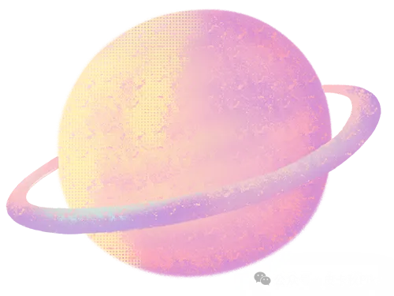

> 📎 来源: [皮卡秋Pika](https://mp.weixin.qq.com/s?__biz=MzA3ODUwMzU1NQ==&mid=2648042773&idx=1&sn=29fdf9a2726c7221a6480ac35846e126&chksm=86c27be430efd7c236502d7c75c12c87efc0407b606a70ca82a43c6d5f5e861c605d9f8d19b3&mpshare=1&scene=1&srcid=0525OwmfIw5xrP8tYhnb8ku6&sharer_shareinfo=e749f48e98c5666737146e8538d2e184&sharer_shareinfo_first=e749f48e98c5666737146e8538d2e184) | 时间: 2026-05-25 22:43

---


**LLM Wiki**是基于大语言模型构建个人知识库的方法论与工具集合，核心理念源自 Andrej Karpathy 提出的 LLM Wiki Pattern。

**核心洞察**：传统 RAG 系统是「查询时检索」，每次提问模型都像第一次接触材料。LLM Wiki 则是「知识编译器」，知识被编译一次并持续更新，让答案可以回写成页面而非消失在聊天记录里。


**📚 本项目适合以下人群研读：**

- **知识工作者**：研究员、分析师、作家
- **学习者**：进行长期课题研究的学生和终身学习者
- **开发者**：管理技术文档的开发团队
- **产品经理**：跟踪行业动态的产品从业者
- **团队**：需要构建和维护内部知识库的跨职能团队


**一、核心架构解析**


## | 层级 | 说明 | 职责划分 | | --- | --- | --- | | **Raw Sources** | 原始资料库（文章、论文、图片等） | 不可变，LLM 仅读取不修改 | | **Wiki** | LLM 生成的 Markdown 文件集合 | LLM 创建和维护，用户阅读 | | **Schema/Config** | 指导 LLM 行为的配置文档 | 定义结构规范、命名规则、更新时机 | - 人类负责资源筛选、方向把控和深度思考； - LLM 承担繁琐的维护工作（更新交叉引用、保持摘要一致、标记矛盾内容）


**二、操作流程介绍**


##

### 2.1 Ingest（摄取）

将新资料编译进 Wiki 的过程：

1. 分析阶段：LLM 读取源文件 → 提取关键实体、概念、论点

**2. 关联发现**：识别与现有 Wiki 内容的关联，发现矛盾与张力

**3. 生成阶段**：基于分析生成 Wiki 文件

- 源摘要页面（含 YAML frontmatter）
- 相关实体/概念页面（含交叉引用）
- 更新的 index.md 和 log.md
- 供人工判断的审核项
- 后续研究的搜索查询

### 2.2 Query（查询）

在现有 Wiki 基础上回答问题：

1. 基于分词的初步搜索（支持中英文）

2. 可选：向量语义搜索（LanceDB）

3. 知识图谱扩展（四信号相关性模型）

4. 预算控制与上下文组装

### 2.3 Lint（检查）

定期健康检查，关注点：

- 页面间矛盾内容
- 被新资料取代的过时断言
- 孤立页面（无入站链接）
- 缺失的交叉引用
- 可通过网络搜索填补的知识空白

##


**三、导航与索引机制**


##

### index.md（内容目录）

- 按类别组织（实体、概念、来源等）
- 每页面包含：链接、一句话摘要、可选元数据
- LLM 在每次摄取时更新
- 回答查询时先读索引再深入

### log.md（操作日志）

- 追加式记录（摄取、查询、审查操作）
- 一致前缀格式：`## [2026-04-02] ingest | Article Title`
- 支持 Unix 工具解析：`grep "^## \[" log.md | tail -5`
- 帮助 LLM 理解近期完成的工作

##


**四、相似项目追踪**


##

### 4.1 nashsu/llm\_wiki（桌面应用）

**适合需要一个开箱即用的完整桌面应用，希望可视化浏览知识网络。**

**技术栈**：Tauri v2 + React 19 + TypeScript + Vite

**核心特性**：

**三栏布局**：知识树/文件树（左侧）+ 对话（中心）+ 预览（右侧）

**两阶段链式思考摄取**：分析 → 生成，质量更高

**四信号相关性模型**：

- 直接链接（×3.0）
- 来源重叠（×4.0）
- Adamic-Adar 指数（×1.5）
- 类型亲和度（×1.0）

**知识图谱可视化**：sigma.js + graphology + ForceAtlas2

**Louvain 社区发现**：自动识别知识聚类

**深度研究**：Web 搜索 + 自动摄取

**Chrome 扩展**：网页一键剪藏

**多格式支持**：PDF、DOCX、PPTX、XLSX、图片、音视频

### 4.2 nvk/llm-wiki（Agent 插件）

**适合已经是 Claude Code 或 Codex 用户，希望在命令行环境中以工作流方式管理 Wiki。**

**形态**：Claude Code / OpenAI Codex 插件，或通用 AGENTS.md

**核心特性**：

**并行多智能体研究**：

标准模式：5 个智能体（学术、技术、应用、新闻、反向）

深度模式：8 个智能体（加历史、邻近、数据）

Retardmax 模式：10 个智能体，激进覆盖

**论文驱动研究**（/wiki:thesis）：

提出假设 → 分解变量 → 平衡智能体 → 证据编译 → 判定

**反确认偏误机制**：第二轮自动加大较弱证据侧搜索力度

**智能输入检测**：自动判断输入是主题还是问题

**仓库评估**：Gap 分析 repo 与 Wiki 研究及市场的匹配度

**命令示例**：

```
/wiki:research "nutrition" --new-topic   # 创建 Wiki + 研究
```

###

### 4.3 Karpathy 原型文档（方法论起源）

纯理念性设计文档

适合复制粘贴到 LLM Agent 使用

刻意保持抽象性，提供设计模式而非具体实现

为后续工程化实现奠定概念基础

##


**五、知识图谱详解**


### 四信号相关性模型

| 信号 | 权重 | 说明 |
| --- | --- | --- |
| **直接链接** | ×3.0 | [[wikilinks]] 连接的页面 |
| **来源重叠** | ×4.0 | frontmatter sources[] 共享相同来源 |
| **Adamic-Adar** | ×1.5 | 共享共同邻居，按邻居度数加权 |
| **类型亲和度** | ×1.0 | 相同页面类型获得额外加分 |

###

### 图可视化特性

- 节点颜色：按页面类型或社区着色
- 节点大小：按链接数开方缩放
- 边缘样式：绿色为强关联，灰色为弱关联
- 悬停交互：邻居高亮，非邻居变暗
- 社区发现：Louvain 算法 + 内聚度评分
- 知识差距识别：孤立页面、稀疏社区、桥节点

##


**六、应 用 场 景**


**核心适用条件**：工作特点是「持续读、持续想、持续更新判断」。

| 场景 | 说明 |
| --- | --- |
| **个人知识管理** | 日记、文章摘录、课程笔记、播客记录 |
| **研究型学习** | 长期课题研究，形成概念页、人物页、综述 |
| **读书伴随** | 边读边维护角色、主题、事件线关系 |
| **团队知识库** | 会议纪要、项目文档、客户访谈沉淀 |
| **行业研究** | 持续跟踪竞品和市场动态 |
| **课程学习** | 阶段总结、对比分析、专题训练 |

##


**七、项 目 对 比**


| 特性 | nashsu/llm\_wiki | nvk/llm-wiki |
| --- | --- | --- |
| **形态** | 桌面应用程序 | Agent 插件 |
| **技术栈** | Tauri + React | 纯 Agent 指令集 |
| **知识图谱** | sigma.js 可视化 + Louvain | 概念层支持 |
| **并行研究** | 基础 | 5-10 个并行智能体 |
| **向量搜索** | LanceDB 可选 | 依赖外部工具 |
| **文档格式** | PDF/DOCX/PPTX/XLSX | 文本为主 |
| **部署方式** | 下载安装 | 插件安装 |

##


**八、项 目 价 值**


- **知识复利**：让知识随资料增加而复合增长
- **答案沉淀**：让答案可回写成页面而非消失在聊天记录
- **结构演化**：让 Wiki 逐渐形成稳定结构而非散乱笔记
- **智能维护**：让 LLM 成为知识库维护者而不仅是问答助手

##

## 相关链接

## Karpathy 原型：https://gist.github.com/Wanglaisi/c0224af24c22fbb769a6a20ee089d607

## nashsu/llm\_wiki：https://github.com/nashsu/llm\_wiki

## nvk/llm-wiki：https://github.com/nvk/llm-wiki

##

往期文章：

[生产级智能体系构建指南](https://mp.weixin.qq.com/s?__biz=MzA3ODUwMzU1NQ==&mid=2648042164&idx=1&sn=76818b4725c61f885bbd19cc77da1a2f&scene=21#wechat_redirect)

[构建智能体的“最后一英里”](https://mp.weixin.qq.com/s?__biz=MzA3ODUwMzU1NQ==&mid=2648042105&idx=1&sn=f20dcf19adcf43fb5ce20d25a22b4a6b&scene=21#wechat_redirect)

[智能体的质量控制](https://mp.weixin.qq.com/s?__biz=MzA3ODUwMzU1NQ==&mid=2648042078&idx=1&sn=17fbb3b3f545c9af6db03620156794c0&scene=21#wechat_redirect)

[智能体⼯具与MCP](https://mp.weixin.qq.com/s?__biz=MzA3ODUwMzU1NQ==&mid=2648041951&idx=1&sn=58186f77181ff22231c5ffaf59f1769b&scene=21#wechat_redirect)

[上下文工程：会话与记忆](https://mp.weixin.qq.com/s?__biz=MzA3ODUwMzU1NQ==&mid=2648041926&idx=1&sn=a878e7df1927780ced421ea6d911247f&scene=21#wechat_redirect)

[2025年末Agent 工程趋势与实践现状](https://mp.weixin.qq.com/s?__biz=MzA3ODUwMzU1NQ==&mid=2648042701&idx=1&sn=eaa43c5dad3c6f6cef0c4cfcf38678eb&scene=21#wechat_redirect)

[Anthropic经济学报告的五大发现](https://mp.weixin.qq.com/s?__biz=MzA3ODUwMzU1NQ==&mid=2648042734&idx=1&sn=e3fe7b34ca1851f4bfcb1486c6fc18d7&scene=21#wechat_redirect)

**长按二维码关注**




**微信号｜***PikachicCherie*
