> 📎 来源: [De-仓鼠](https://mp.weixin.qq.com/s?__biz=MzIyOTkzNTkwNQ==&mid=2247488978&idx=1&sn=eddc251dc7304ce701fe0894bd3ed08b&chksm=e90500b2386bdb69d65699e8a971fe50f6fc5e4a852aa424d80356d24ca3bc7d75694689d90f&mpshare=1&scene=1&srcid=0523Genlga27lt9p9p2cDotK&sharer_shareinfo=bd35379fe92beee5fcb2cf12289b1f8a&sharer_shareinfo_first=bd35379fe92beee5fcb2cf12289b1f8a) | 时间: 2026-05-23 01:00

---

```
Karpathy
```

的

```
LLM Wiki
```

原生方式需要手动构建知识库，而

```
graphify
```

扩展了能力，也只是便于

```
Agent
```

去使用，现在有一个适合人阅读的

```
LLM Wiki
```

工具。

## 介绍

```
LLM Wiki
```

是一款跨平台桌面应用程序，可自动将您的文档转换为一个结构清晰、相互关联的知识库。与传统的 

```
RAG
```

（每次都从头开始检索和回答问题）方式不同，

```
LLM
```

会根据您的资源逐步构建并维护一个持久化的

```
Wiki
```

。知识库只需编译一次即可保持最新，无需每次查询都重新生成。

该项目基于

```
Karpathy
```

的

```
LLM Wiki
```

模式——一种利用

```
LLM
```

构建个人知识库的方法论。我们将其核心理念实现为一个功能齐全的桌面应用程序，并进行了显著的增强。

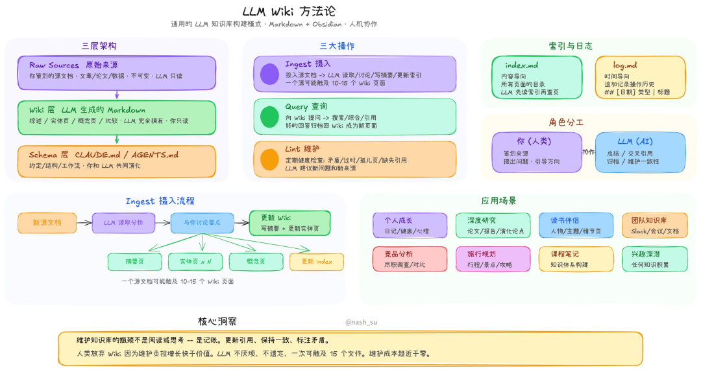

> ★

> 内容来自：https://github.com/nashsu/llm\_wiki#what-is-this

## 安装

访问发布界面

```
https://github.com/nashsu/llm_wiki/releases/tag/v0.3.10
```

选择对应平台的安装程序：

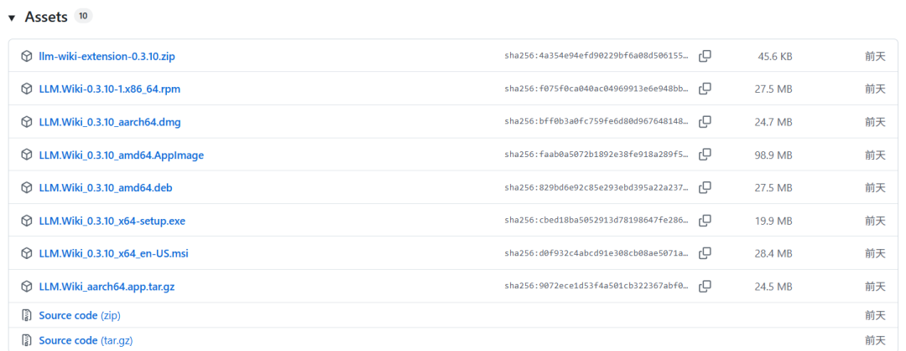

安装过程（略）。

## 使用

### 运行程序

安装后，会提示是否马上允许，或者点击桌面图标：


### 创建项目

运行后，弹出界面如下，初次使用选择"

```
New Project
```

"：

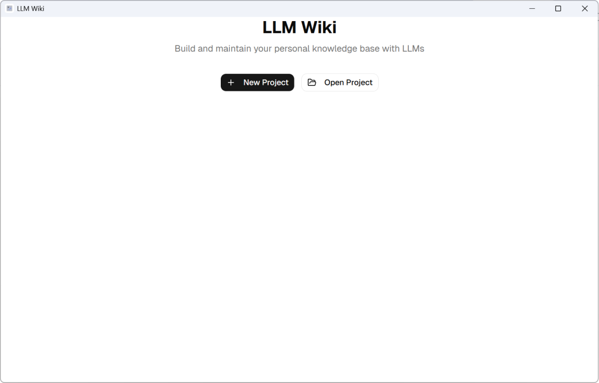

> ★

> 已经使用

> ```
> Karpathy
> ```

> 的

> ```
> LLM Wiki
> ```

> 模式构建的知识库不知道能否点击”Open Project“打开。

给项目命名并选择一个存放位置和知识库用途，最后，点击"

```
Create
```

":

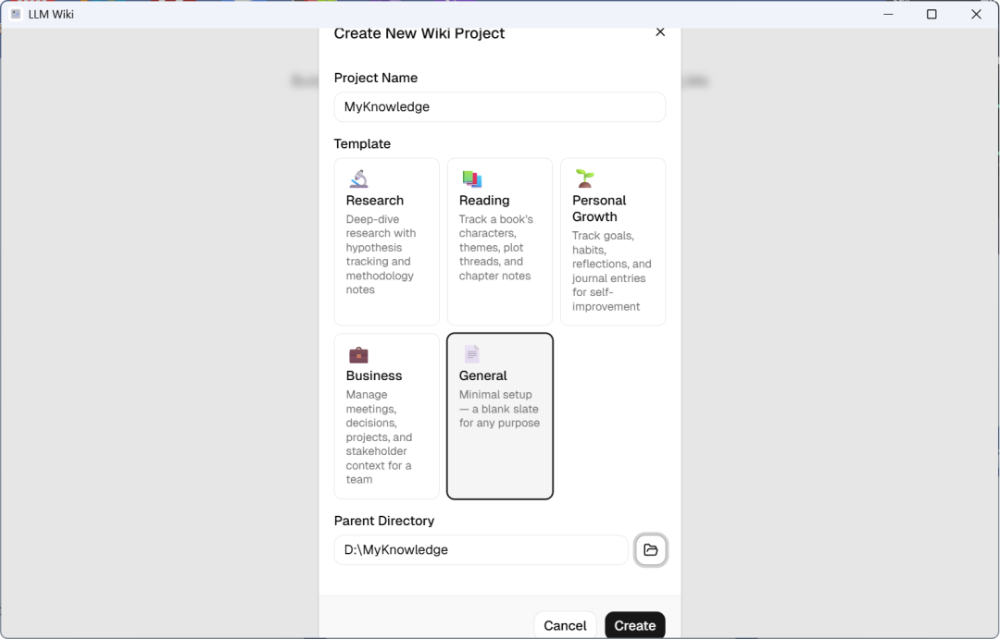

项目创建完毕后，显示界面如：

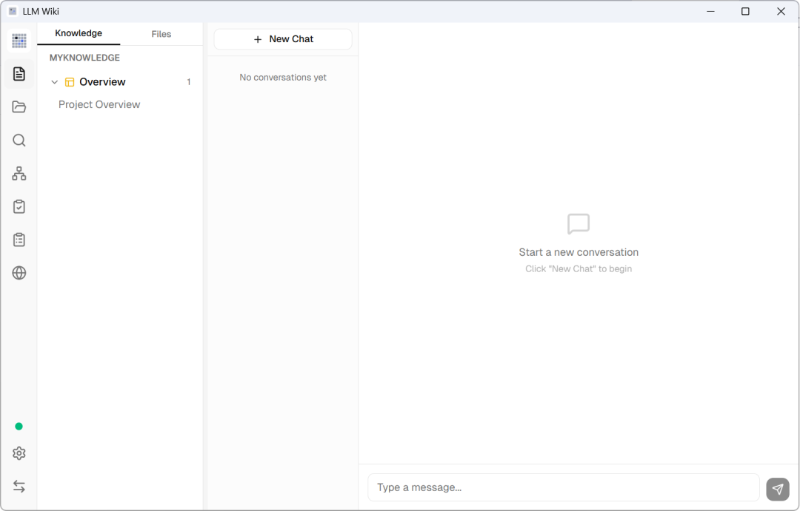

### 偏好设置

首先，设置显示语言为中文，点击左下角的"齿轮"按钮：


在弹出的界面中选择"

```
Interface
```

"，选择"中文"后点击"

```
Save
```

"：

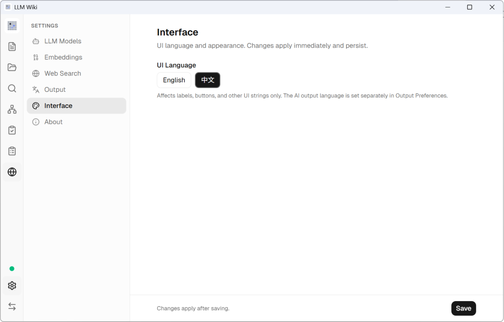

其次，设置大模型，比如：选择

```
DeepSeek
```

，添加对应的

```
API Key
```

:

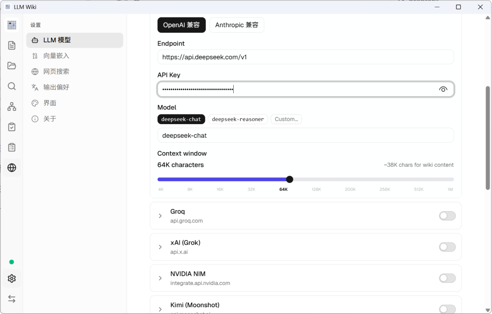

大模型设置后，一定要点击右上角的按钮开启：

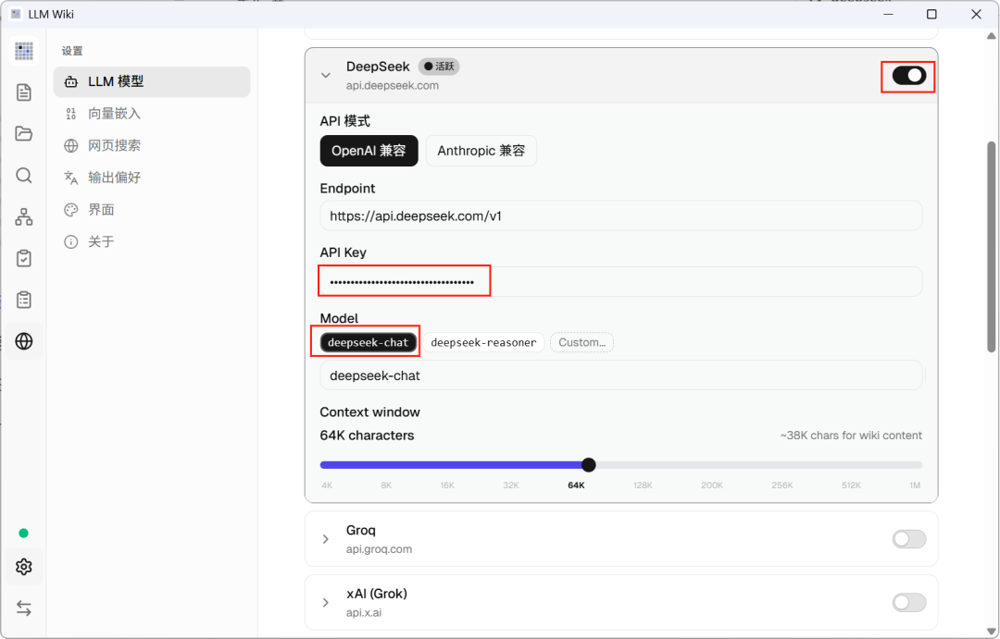

其他设置根据个人需要设置：

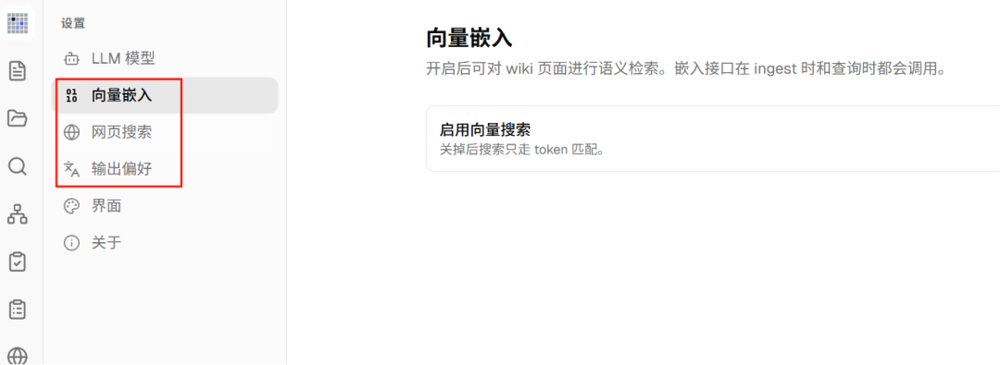

### 工作界面

在笔记界面查看知识库结构，可以看见是根据

```
LLM Wiki
```

结构生成的目录：

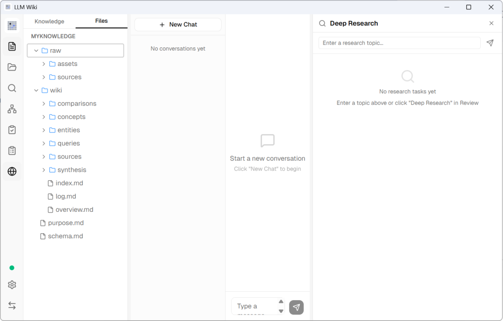

### 导入文件

这一步对应原始的"

```
ingest
```

"，点击侧边栏的文件夹按钮：

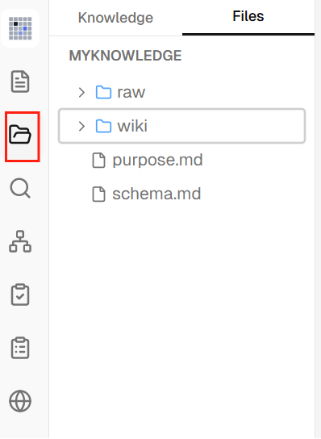

在弹出界面中点击"导入"，选择上传文件，然后等待左下角处理流程完成：

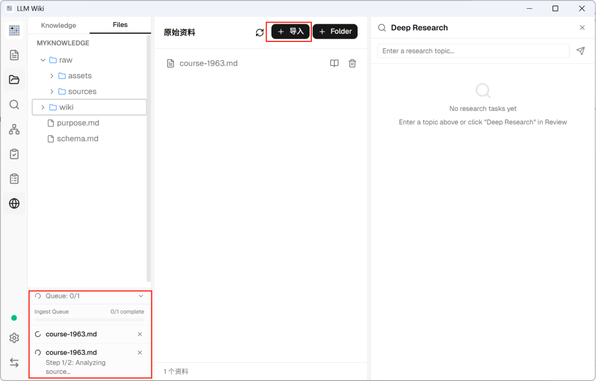

> ★

> 这个过程就是知识编译过程。

处理流程完成结果：

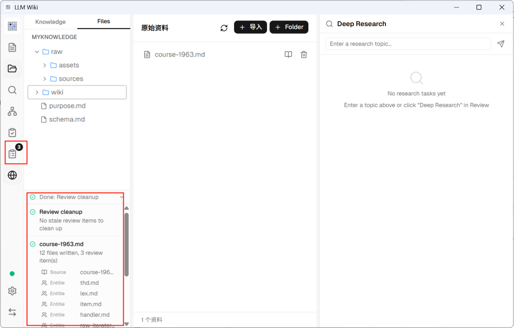

同时，侧边栏有一个审阅按钮，提示需要构建页面，直接点击

```
Create Page
```

即可：

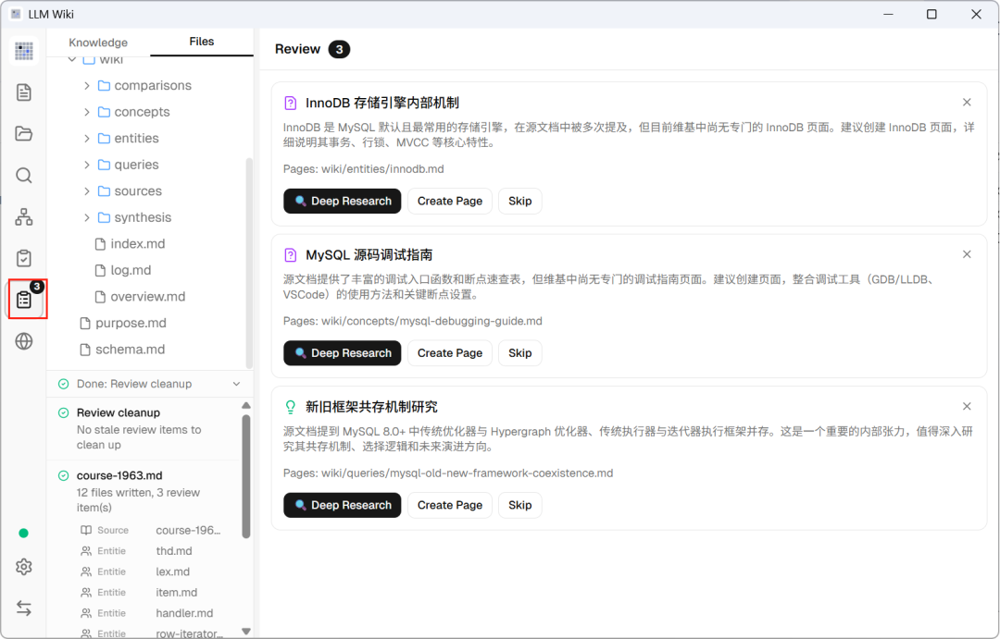

点击侧边栏的图谱，显示文档生成的图谱如：

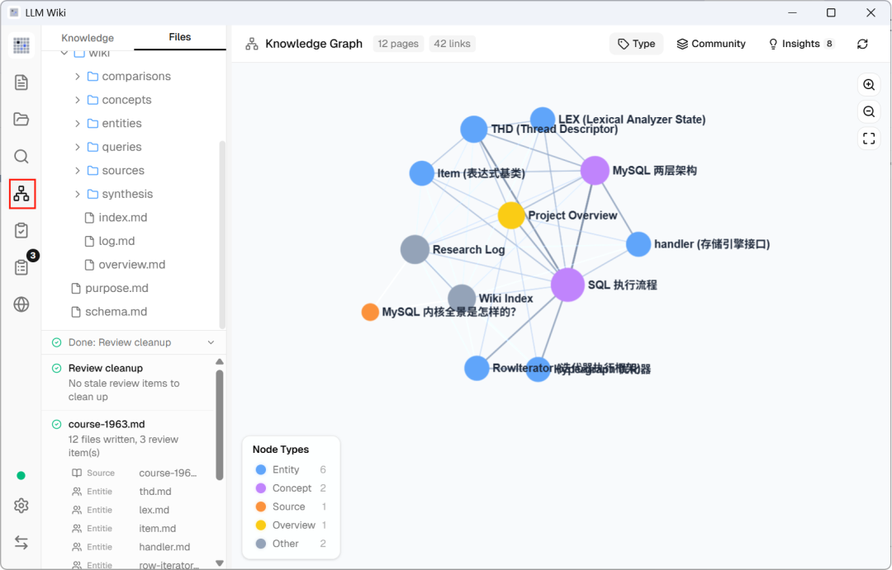

### 查询知识

这一步对应的是原始的"

```
query
```

"，点击侧边栏的放大镜按钮，输入查询内容：

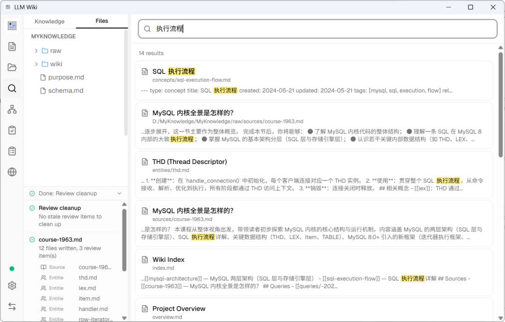

任意点击一个查询内容，不仅可以查看编译好的知识，还可以通过与

```
AI
```

对话检索编译好的知识：

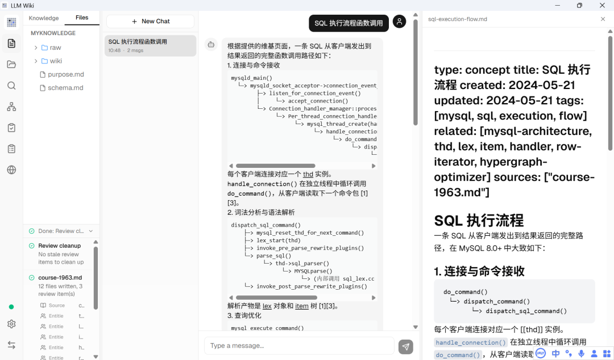

到此，

```
LLM Wiki
```

这个知识管理工具的使用就简单上手了。
