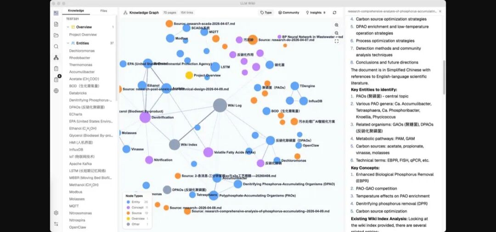
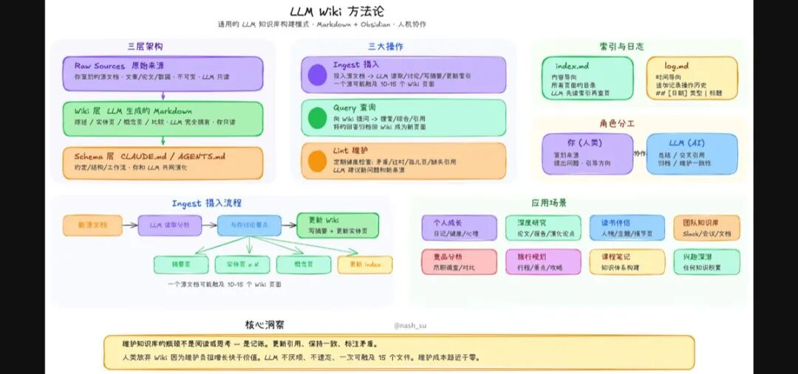
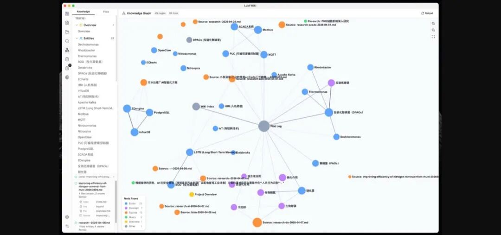
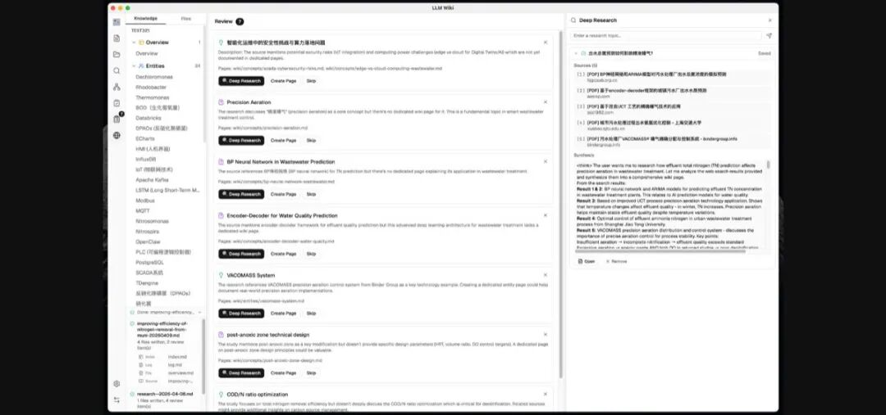
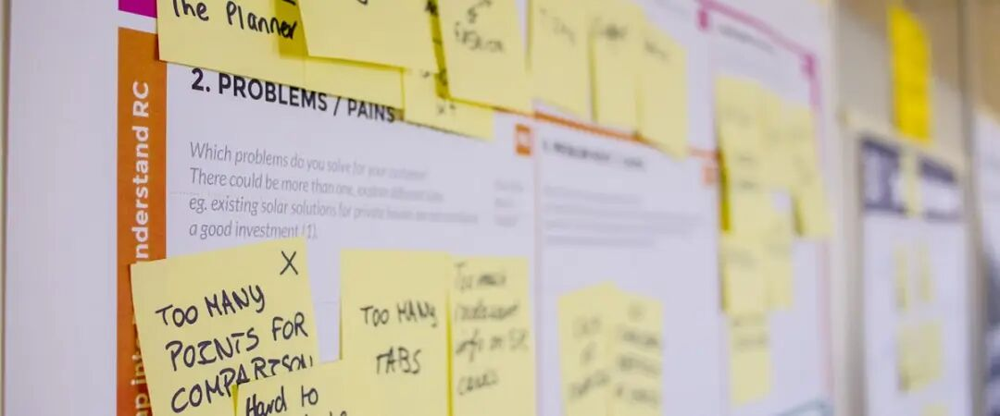
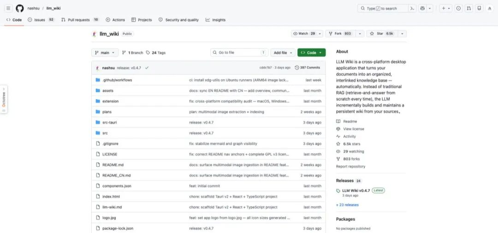

> 📎 来源: [blue桃之夭夭](https://mp.weixin.qq.com/s?__biz=MzAxMjMwMTk4MQ==&mid=2247486020&idx=1&sn=32a8ef58a41ab811dc566ea5c3e48538&chksm=9a50d8763b19ab6eef0f396042fe6278f61f84e6295d033ce653a17c1b4fbdcb5f0d0a528f5a&mpshare=1&scene=1&srcid=0510pBMqT7Lzify74r7NPy5t&sharer_shareinfo=f0b1f2580f7876f7f7e8330644aaed2f&sharer_shareinfo_first=f0b1f2580f7876f7f7e8330644aaed2f) | 时间: 2026-05-10 15:53

---

开源前沿 · 2026年5月


你一定有过这样的经历——

读了一篇论文，觉得里面的观点很重要，顺手存到某个文件夹。过了两个月，需要用的时候，翻遍了硬盘也找不到。或者找到了，但忘了里面具体说了什么，要从头再读一遍。

你用过 Notion、Obsidian、语雀，但**记笔记的速度永远跟不上读东西的速度**。你也试过 RAG 应用，把文档扔进去然后提问，但它每次都要**从零开始检索**，没有记忆、没有积累，同一个问题问法不同结果就不同。

现在，有人把 **Andrej Karpathy**（前特斯拉AI总监、OpenAI联合创始人）提出的一个理念做成了产品：**让AI帮你读文档，自动构建一个持续生长的知识Wiki**。

这个产品叫 **LLM Wiki**，开源不到一个月，GitHub **6,400+ 星**。

— · —

## 一、它和RAG有什么本质区别？

先说清楚这一点，因为这是 LLM Wiki 最核心的创新。

传统 RAG（检索增强生成）的工作方式是：你问一个问题 → 系统从文档库里检索相关片段 → 把片段喂给大模型 → 生成回答。**每次问答都从零开始**，没有积累，知识不会沉淀。

LLM Wiki 的方式完全不同：

|  |  |  |
| --- | --- | --- |
| 维度 | 传统 RAG | LLM Wiki |
| 知识处理 | 每次查询时临时检索 | 导入时就编译成结构化知识 |
| 知识形态 | 原始文档片段 | 结构化Wiki页面+交叉引用 |
| 知识关联 | 无，孤立片段 | 自动建立知识图谱 |
| 可读性 | 只有AI能读 | 人也能直接阅读和编辑 |
| 知识积累 | 没有积累，无状态 | 持续增长，越用越聪明 |

> Karpathy 的原话："知识应该被编译一次，然后持续维护，而不是每次查询时从头推导。"

— · —

## 二、产品全貌：一眼看懂它长什么样

LLM Wiki 是一个**跨平台桌面应用**（macOS / Windows / Linux），基于 Tauri v2 构建。打开后是一个三栏布局：左边是知识树/文件树，中间是对话区，右边是文档预览。



上面这张是实际运行截图。你可以看到左边的知识树已经自动整理出了多个主题分类，中间的知识图谱展示了概念之间的关联（节点大小反映连接数量，颜色区分类型），右侧是Wiki页面的详细内容。

侧边栏有七个功能入口：**Wiki浏览、文件管理、搜索、知识图谱、Lint检查、Review审核、深度研究、设置**。每一个都不是摆设。

— · —

## 三、Karpathy 的方法论：三层架构

LLM Wiki 的底层设计忠实地遵循了 Karpathy 发表的

```
llm-wiki.md
```

 方法论。核心是**三层架构**：



**Raw Sources（原始资料层）** — 你导入的所有文档，不可变。PDF、Word、Markdown、网页，原样保存，永不修改

**Wiki（知识层）** — LLM自动生成和维护的结构化知识页面，带Markdown格式、YAML元数据、双向链接

**Schema（规则层）** — 定义Wiki的结构规则、页面类型、分类体系。加上LLM Wiki新增的 purpose.md（定义Wiki的方向和目标）

三个核心操作：**Ingest（导入）**读取新文档并生成Wiki页面，**Query（查询）**基于已编译的知识回答问题，**Lint（校验）**检查Wiki的一致性和健康度。

这套架构的精妙之处在于**关注点分离**：原始资料和知识产出完全隔离，你可以随时回溯"这个知识是从哪篇文档来的"；规则层又和内容层分开，改变分类体系不会丢失知识本身。

— · —

## 四、两步思维链：比RAG聪明得多的导入方式

LLM Wiki 最大的技术创新之一是**两步思维链导入（Two-Step Chain-of-Thought Ingest）**。

传统做法是让LLM一边读一边写——读到什么就记什么。LLM Wiki 把这个过程拆成了**两次独立的LLM调用**：

```
第一步：分析（Analysis）
LLM 读取原始文档 → 输出结构化分析报告
  - 提取关键实体、概念、论点
  - 与已有Wiki内容的关联
  - 与已有知识的矛盾和张力
  - Wiki结构调整建议

第二步：生成（Generation）
LLM 基于分析报告 → 生成Wiki页面
  - 带YAML元数据的摘要页面
  - 实体页面、概念页面（带交叉引用）
  - 更新 index.md / log.md / overview.md
  - 生成需要人工审核的条目
```

为什么要分两步？因为**"理解"和"表达"是两种不同的认知活动**。让LLM先充分理解文档（包括和已有知识的关系），再去写Wiki页面，产出质量显著更高。

而且每次导入都会做 **SHA256 增量缓存**——内容没变的文件自动跳过，节省API调用费用。


— · —

## 五、四信号知识图谱——不只是连线

LLM Wiki 内置了一套**四信号相关性模型**来构建知识图谱，这远不是简单的"提到了就连一条线"。



|  |  |  |
| --- | --- | --- |
| 信号 | 权重 | 含义 |
| Direct Link（直接链接） | ×3.0 | 通过 [[wikilink]] 显式连接的页面 |
| Source Overlap（来源重叠） | ×4.0 | 共享同一原始文档的页面 |
| Adamic-Adar（共邻分析） | ×1.5 | 共享邻居节点的页面（按邻居度加权） |
| Type Affinity（类型亲和） | ×1.0 | 同类型页面间的关联加成 |

在图谱之上，LLM Wiki 还跑了 **Louvain 社区检测算法**——自动发现哪些知识自然聚成一堆。低内聚度的社区（<0.15）会被标记警告，提示你这些知识之间的关联可能还不够充分。

— · —

## 六、图谱洞察：意外关联 + 知识缺口

这是 LLM Wiki 最让人惊喜的功能之一。系统会**自动分析图谱结构**，主动告诉你两件事：

**意外关联（Surprising Connections）**

检测跨社区的边、跨类型的链接、边缘节点与中心节点的耦合。用复合惊喜分数排序，最出人意料的关联排在最前面。

**知识缺口（Knowledge Gaps）**

**孤立页面**：连接度≤1的页面，说明这块知识和其他内容缺乏关联。**稀疏社区**：内部交叉引用太少的知识群。**桥接节点**：连接3个以上社区的关键页面——它们是知识体系的"咽喉要道"。

更厉害的是：点击任何一条知识缺口，可以直接触发**深度研究（Deep Research）**——LLM 会基于你的 Wiki 上下文自动生成搜索主题，联网检索补充资料，然后把结果自动导入Wiki。

换句话说，**Wiki 不只是被动接收知识，它会主动发现自己的不足并寻求补充**。

— · —

## 七、深度研究：让Wiki自己"读书"



Deep Research 是 LLM Wiki 在 Karpathy 原始方法论之外**最大的创新**。它的工作方式：

**Step 1**：LLM 读取 overview.md + purpose.md，理解你的知识库方向

**Step 2**：基于知识缺口或你的指定主题，生成优化的搜索查询

**Step 3**：多查询联网搜索（通过 Tavily API）

**Step 4**：搜索结果自动走 Ingest 流程，编译成Wiki页面

你甚至可以在搜索前编辑搜索主题和查询词——系统给你一个可编辑的确认框，让你微调方向。这是一个**"人引导 + AI执行"**的优雅设计。

— · —

## 八、技术栈解剖

LLM Wiki 的技术选型相当现代且克制：

|  |  |
| --- | --- |
| 层 | 技术 |
| 桌面框架 | Tauri v2（Rust 后端，比 Electron 轻10倍） |
| 前端 | React 19 + TypeScript + Vite |
| UI组件 | shadcn/ui + Tailwind CSS v4 |
| 编辑器 | Milkdown（ProseMirror所见即所得） |
| 知识图谱 | sigma.js + graphology + ForceAtlas2 |
| 向量检索 | LanceDB（Rust，嵌入式，可选） |
| LLM | OpenAI / Anthropic / Google / Ollama / 自定义 |

特别注意两个选择：**Tauri 而非 Electron**——同样功能的桌面应用，Tauri 的安装包只有几MB（Electron动辄上百MB），内存占用也低得多。**LanceDB 而非 Pinecone/Weaviate**——嵌入式向量数据库，不需要额外部署服务，数据完全在本地。

— · —

## 九、Obsidian 兼容 + Chrome 网页剪藏

LLM Wiki 生成的 Wiki 目录**可以直接作为 Obsidian Vault 打开**。所有的 [[wikilink]]、YAML frontmatter、Markdown 格式都和 Obsidian 完全兼容。

这意味着你可以两边同时用：**LLM Wiki 负责自动化建设**，Obsidian 负责手动精读和标注，互不冲突。

项目还附带了一个 **Chrome 网页剪藏扩展**——看到有价值的网页，一键剪藏，自动走 Ingest 流程，变成Wiki的一部分。



— · —

## 十、5分钟上手指南

LLM Wiki 提供了各平台的预编译安装包，不需要自己编译：

**Step 1：下载安装**

macOS: .dmg（Apple Silicon + Intel） | Windows: .msi | Linux: .deb / .AppImage

**Step 2：配置LLM**

Settings → 选择 LLM 提供商（OpenAI / Claude / Gemini / Ollama）→ 填入 API Key

**Step 3：导入文档，开始提问**

Sources → 导入 PDF/Word/Markdown → 看着 Activity Panel 里 LLM 自动建设Wiki → Chat 开始提问

内置了五种**场景模板**：Research（学术研究）、Reading（读书笔记）、Personal Growth（个人成长）、Business（商业分析）、General（通用）。每种模板会预配置不同的 purpose.md 和 schema.md，帮你快速开始。

— · —

## 十一、GitHub 仓库实况



项目由开发者 nashsu 主导，目前版本 v0.4.7，5位贡献者，TypeScript（83.7%）+ Rust（9.9%）。迭代非常活跃——最近两周内持续推送新功能，包括向量搜索（LanceDB）、多模态图片导入、Review系统等。

如果你想从源码构建，需要 Node.js 20+ 和 Rust 1.70+：

```
git clone https://github.com/nashsu/llm_wiki.git
cd llm_wiki
npm install
npm run tauri dev      # 开发模式
npm run tauri build    # 生产构建
```

— · —

## 十二、为什么它很重要？

LLM Wiki 代表了AI工具的一个重要转向：**从"一问一答"到"知识积累"**。

过去两年，大量AI产品都在做"对话"——你问我答，答完就忘。但真正有价值的知识工作不是对话，而是**积累、关联、发现**。一个研究者需要的不是一个能回答问题的聊天机器人，而是一个**能帮他整理思路、发现盲区、持续成长的知识助手**。

LLM Wiki 的回答是：把 LLM 从"聊天伙伴"变成"知识管家"。**你负责读和想，它负责整理、关联、查漏补缺**。而且这个知识库是你自己的——Markdown 文件存在本地，Obsidian 可以读，Git 可以管，不依赖任何云服务。

知识应该被编译一次，然后持续维护

而不是每次查询时从头推导 —— Andrej Karpathy

如果你的工作涉及大量阅读和知识管理——研究者、分析师、产品经理、律师、投资人——LLM Wiki 值得你认真试试。它不是又一个笔记工具，而是**一个能帮你思考的第二大脑**。

项目信息

GitHub：github.com/nashsu/llm\_wiki

MIT 开源协议 · TypeScript + Rust · Tauri v2 桌面应用 · 6.4K+ Stars

基于 Andrej Karpathy 的 llm-wiki.md 方法论

— END —
