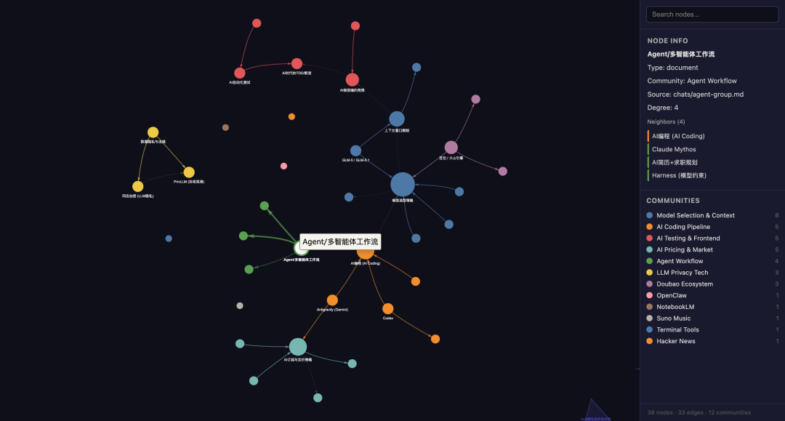

> 📎 来源: [AI作弊码](https://mp.weixin.qq.com/s?__biz=MzI2MzA5NjA4MQ==&mid=2665365507&idx=1&sn=8efb2e3bb093dcbda21aed892627d696&chksm=f0b55c874732098417a3449228e82b5f66c3a38cd953f81c9b92246e50287f2f756e66c5af15&mpshare=1&scene=1&srcid=0524bnmeryqY5MyzNH2JiM4F&sharer_shareinfo=cf2b67afd89fe19ecd113e262556c24a&sharer_shareinfo_first=cf2b67afd89fe19ecd113e262556c24a) | 时间: 2026-05-24 11:58

---


🔬 Karpathy LLM知识库系列 · 第三篇

# Wechat-Cli + Graphify — 从加密数据库到结构化知识图谱的完整链路。

wechat-cli ⭐ 425 Stars · 🍴 273 Forks · Apache-2.0 · 纯本地/只读/零网络

📌 本系列的前篇

**上一篇**：[Graphify：把 Karpathy 的 LLM Wiki 从理念变成了产品](https://mp.weixin.qq.com/s?__biz=MzI2MzA5NjA4MQ==&mid=2665365309&idx=1&sn=e217eba5dcde14452dde395ad411315f&scene=21#wechat_redirect) 给出了 LLM Wiki 产品化落地方案。
**本篇**：把数据源扩展到**微信聊天记录**。你的群聊讨论、技术分享、项目决策——这些「暗知识」一直被锁在微信的加密数据库里，现在可以被释放了。

     

## 一、为什么微信聊天记录值得变成知识库？

Karpathy的理念是「用LLM编译知识」。前两篇我们处理的数据源是代码仓库和文档——这些是**显性知识**，本来就结构化、可索引。

但你日常工作中真正高价值的决策信息，大量藏在微信群聊里：产品经理在群里敲定的需求变更、架构师随口给出的技术建议、团队讨论中达成的共识。这些是**暗知识**——有价值，但从未被记录到正式文档中。

💡 从「暗知识」到「编译知识」

微信聊天记录的困境：**数据在你自己的电脑上，但你访问不到**。微信Mac版把所有消息存在SQLCipher加密的SQLite数据库中——AES-256-CBC逐页加密，密钥藏在进程内存里。没有官方API，没有导出功能。

wechat-cli用一段320行的C代码扫描微信进程内存，提取密钥，逐页透明解密，把你自己的聊天数据变成可查询的结构化接口。结合Graphify，就能把群聊讨论编译成知识图谱。

## 二、wechat-cli：11条命令解锁微信数据

wechat-cli（github.com/huohuoer/wechat-cli）是一个纯本地的命令行工具。默认输出JSON，专为AI agent和LLM工具调用设计。

3步解密

C程序扫描进程内存提取密钥 → AES-256-CBC逐页透明解密 → 结构化SQL查询输出JSON

密钥只在init阶段提取一次，保存在本地配置目录。后续查询不需要sudo，数据全程不离开本机。

**sessions** — 最近会话列表（带未读数、最后消息预览）

**history** — 指定联系人/群的聊天记录（支持时间范围、类型过滤）

**search** — 全局/指定聊天内关键词搜索（可跨多群同时搜索）

**export** — 导出为Markdown或纯文本（**知识库导入的关键命令**）

**contacts** — 联系人搜索与详情

**stats** — 群聊统计（发言排行、消息类型分布、24小时活跃度）

**favorites** — 收藏夹查询（按类型筛选：文章/图片/视频/文本）

**new-messages** — 增量新消息（自上次检查后的所有新消息，适合自动化）

其中

```
export
```

命令是打通知识库的关键——它能将任意聊天导出为Markdown文件，自动带上时间戳、发言人、消息类型标注。而Markdown恰好是Graphify最擅长处理的输入格式。数据链路闭合了。

## 三、安装实战：我踩过的坑你不用再踩

wechat-cli提供了npm和pip两种安装方式。**我的建议：从源码安装**。原因很简单——这个工具需要sudo权限扫描进程内存，你不应该把这种操作交给一个预编译的不透明二进制。

⚠️ 为什么不建议 npm install

```
npm install -g @canghe_ai/wechat-cli
```

 安装的是一个10MB的**预编译Mach-O二进制**（PyInstaller打包），你无法审计它实际执行的代码。对于一个需要root权限读取进程内存的工具，这是不可接受的。仓库里有完整的Python源码和C源码（find\_all\_keys\_macos.c，仅320行），应该从源码构建。

Step 1

从源码安装：审计后再执行

# 1. 克隆源码

git clone https://github.com/huohuoer/wechat-cli.git
cd wechat-cli

# 2. 审计核心文件（建议至少看这两个）

cat wechat\_cli/bin/find\_all\_keys\_macos.c    # 320行，内存扫描逻辑
cat wechat\_cli/core/crypto.py             # 78行，AES解密逻辑

# 3. 从源码编译C二进制（替换仓库自带的预编译版本）

cd wechat\_cli/bin
cc -O2 -o find\_all\_keys\_macos.arm64 find\_all\_keys\_macos.c -framework Foundation
cd ../..

# 4. 创建虚拟环境并安装（需要 Python 3.10+）

python3 -m venv .venv && source .venv/bin/activate
pip install -e .

Step 2

签名微信：macOS的安全攻防

这一步是整个流程最「硬核」的环节。wechat-cli需要通过

```
task_for_pid
```

读取微信进程内存，而macOS的安全策略默认禁止这个操作。你需要给微信添加

```
get-task-allow
```

调试权限并重新签名。

⚠️ 踩坑提醒：直接对 /Applications 签名会失败

macOS的App Management安全策略会阻止对

```
/Applications/
```

下的App做codesign，即使用sudo也报

```
Operation not permitted
```

。解决方案：**把微信复制到用户目录下操作**。另外，ad-hoc签名和原版的sandbox权限冲突，需要在签名时移除sandbox相关的entitlement。

# 1. 复制微信到用户目录（绕开 /Applications 的保护）

mkdir -p ~/Applications
cp -R /Applications/WeChat.app ~/Applications/WeChat.app

# 2. 用 Python 正确提取并修改 entitlements

# （codesign 输出的 DER 格式用 PlistBuddy 解析会报错，用 Python 最稳）

python3 -c "
import subprocess, plistlib
r = subprocess.run(['codesign','-d','--entitlements',':-',
  '$HOME/Applications/WeChat.app'], capture\_output=True)
data = r.stdout
try: ent = plistlib.loads(data)
except:
  idx = data.find(b'xml')</span
  ent = plistlib.loads(data[idx:]) if idx>=0 else {}
# 移除 sandbox 相关权限（ad-hoc 签名不兼容）
for k in ['com.apple.security.app-sandbox',
  'com.apple.application-identifier',
  'com.apple.developer.team-identifier',
  'com.apple.security.application-groups']:
  ent.pop(k, None)
ent['com.apple.security.get-task-allow'] = True
with open('wechat\_ent.plist','wb') as f:
  plistlib.dump(ent, f, fmt=plistlib.FMT\_XML)
"

# 3. 用修改后的 entitlements 签名

codesign --force --deep --sign - \
  --entitlements wechat\_ent.plist ~/Applications/WeChat.app
rm wechat\_ent.plist

# 4. 退出当前微信，从用户目录启动签名版本

open ~/Applications/WeChat.app

Step 3

初始化并验证

# 确保微信已登录，然后执行（需要 sudo）

sudo wechat-cli init

# 如果看到 "Matched 17/20 keys to known DBs" 这样的输出，就成功了

# 验证：查看最近会话

wechat-cli sessions --limit 5 --format text

# 验证：全文搜索

wechat-cli search "你要搜索的关键词" --limit 10 --format text

看到会话列表和搜索结果正常返回，wechat-cli就算装好了。密钥提取只需要做一次，后续所有查询都不需要sudo。

## 四、完整链路：从微信到知识图谱

wechat-cli装好后，把微信聊天变成知识库只需要两步：

🔧 第一步：导出聊天记录为Markdown

```
export
```

命令支持按聊天名称、时间范围、消息数量过滤导出。输出的Markdown文件自带时间戳、发言人标注、消息类型标记（图片、链接、文件等），是干净的结构化文本。

# 创建知识库目录

mkdir -p wiki/chats

# 导出技术讨论群最近3个月的聊天记录

wechat-cli export "你的技术群" --format markdown \
  --start-time "2026-01-11" --output wiki/chats/tech-group.md

# 批量导出多个关键群聊

for g in "产品讨论" "架构评审" "技术交流"; do
  wechat-cli export "$g" --format markdown \
    --output "wiki/chats/${g}.md"
done

导出的Markdown长这样：每条消息一行，格式统一，Graphify可以直接处理。

# 聊天记录: 技术交流群

- [2026-04-08 23:32] 某工程师: 周末用Codex，半天把毕业设计写完了

- [2026-04-09 10:38] 某架构师: 前端用Gemini，后端用Claude，运维用Codex

- [2026-04-09 16:16] 某同事: 你说的智能体是指比如Claude Code？

- [2026-04-10 09:18] 某PM: [图片] (local\_id=234)

🔧 第二步：用Graphify编译成知识图谱

Graphify是一个AI编码助手的skill（支持Claude Code、Gemini CLI、Codex等）。在你的AI助手中执行

```
/graphify wiki/
```

即可。它会用LLM从聊天记录中提取实体（人名、项目名、技术栈）、构建关系、用Leiden算法做社区聚类，生成可交互的知识图谱。

# 安装 Graphify（需要 Python 3.10+）

pip install graphifyy
graphify install    # 自动检测你的编码助手

# 在你的 AI 编码助手中执行

/graphify wiki/

# 生成的知识图谱在 graphify-out/ 下：

graphify-out/
  graph.html        # 可交互的可视化图谱
  GRAPH\_REPORT.md   # 关键节点、社区结构、推荐问题
  graph.json        # 可查询的持久化图谱

然后你就可以用自然语言提问了：「上个月技术群讨论过哪些架构选型？」「关于缓存方案的所有讨论帮我整理成文档」——不是全文搜索，是语义级的理解检索。

## 五、持续同步：让知识库跟上对话节奏

wechat-cli的

```
new-messages
```

命令维护本地状态文件，每次只返回上次检查之后的新消息。配合cron，可以让知识库每天自动更新：

# 增量追加新消息到知识库

wechat-cli new-messages --format text >> wiki/chats/daily.md

# 定时任务：每天晚上 10 点自动同步

crontab -e
0 22 \* \* \* wechat-cli new-messages >> wiki/daily.md

## 六、安全边界：你应该知道的事

把聊天记录导入知识库，安全是第一位的。从源码审计的角度说：

🔧 wechat-cli的安全边界

**C源码（320行）**：只做一件事——用

```
mach_vm_read
```

扫描进程内存中的

```
x''
```

模式，匹配到密钥后写入本地JSON文件。没有网络调用，没有数据外发。
**Python代码**：使用pycryptodome做AES解密，click做CLI框架，zstandard做压缩。3个依赖，都是主流库。
**纯只读**：不发送、不修改、不删除任何消息。

⚠️ 合规提醒

wechat-cli只读取**你自己设备上的数据**，不破解他人账户，不绕过微信服务端。但群聊记录涉及其他人的发言，导入知识库前请确保符合你所在地区的隐私法规。建议仅用于个人学习和工作复盘场景。如果使用云端LLM（非本地模型）处理Graphify，聊天文本片段会被发送到API——请评估是否可接受。

🔗 暗知识编译

微信群聊讨论 → Markdown导出 → Graphify知识图谱——释放团队沟通中从未被文档化的隐含价值

🔒 可审计的全链路

C源码320行 + Python解密78行 + 3个依赖——每一行代码都可以审计。从源码编译，不信任预编译二进制

🤖 AI原生接口

JSON默认输出、语义化参数名、增量轮询接口——11条命令天然适配LLM function call

⏰ 增量同步

cron + new-messages接口——知识库每天自动追加最新对话，维护成本为零

## 七、技术栈速查

**语言** — Python 90% / C 8%（内存扫描） / JavaScript 2%（npm包装器）

**依赖** — click + pycryptodome + zstandard（共3个）

**系统要求** — macOS（主要支持）/ Python 3.10+

**协议** — Apache License 2.0

**搭配** — Graphify（pip install graphifyy，⭐ 20.3k Stars）

🔭 真实结果展示



在真实技术群聊中由 Graphify 生成的知识图谱：
清晰聚类了模型选型、隐私技术、订阅定价等核心社区节点
