> 📎 来源: [敲行代码再睡觉](https://mp.weixin.qq.com/s?__biz=MzIwNzUxNzU0OA==&mid=2247485438&idx=1&sn=44fce145198d298aa3545bd13501571d&chksm=969348c5f56a73cb1a6cf15e2a7671d8a07120bac7488e3408efe1b8b1d3d0cc4348f6a307b1&mpshare=1&scene=1&srcid=0511CGHIF0tTsXy0NwnAPpoc&sharer_shareinfo=4ea3cdbbf5b09b2e498dff7f97fc667a&sharer_shareinfo_first=4ea3cdbbf5b09b2e498dff7f97fc667a) | 时间: 2026-05-11 00:11

---

你有没有遇到过这种情况：同一个问题，上周问过 AI，这周又要重新问一遍，因为上次的回答根本没留下任何痕迹。

这是 RAG 模式的天花板——它擅长"回答"，但不擅长"积累"。每一次对话都是一次性的，AI 从文档堆里捞出片段、拼出答案，然后什么都没留下。下次再问，重头再来。

换一种玩法：把 AI 变成你的 Wiki 编辑，而不是临时顾问。

## RAG 到底差在哪里？

用 RAG 处理知识的流程大家都熟悉：把文件上传进去，提问，AI 检索片段，组合成一个答案。单次使用没问题，但它有一个结构性缺陷——每次查询都是无状态的。

跨文档的综合性问题尤其吃亏。假设你想问一个涉及五篇论文的问题，AI 需要在运行时把散落各处的线索实时拼凑起来，既慢又容易丢失细节。

LLM Wiki 的思路反过来：不是等你提问再去找，而是提前让 AI 把知识整理好，写成一组互相链接的 Markdown 页面，持续维护，持续更新。知识在文件里沉淀，而不是在对话里蒸发。

## 用 Obsidian Web Clipper 做素材采集

第一步，在浏览器安装 Obsidian Web Clipper 扩展。

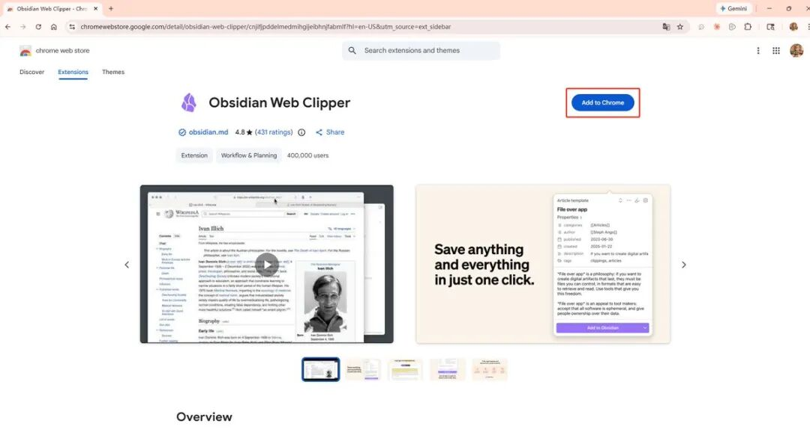

article-media-1


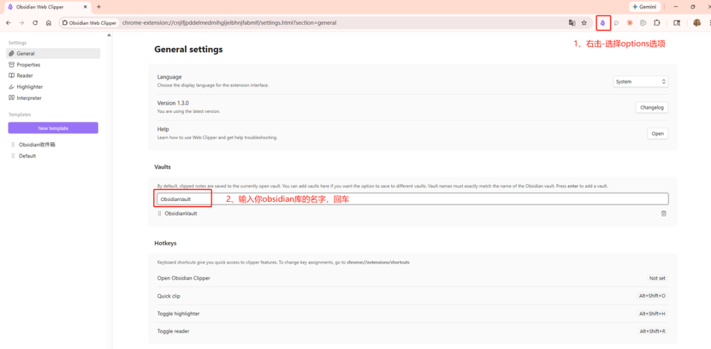

article-media-2


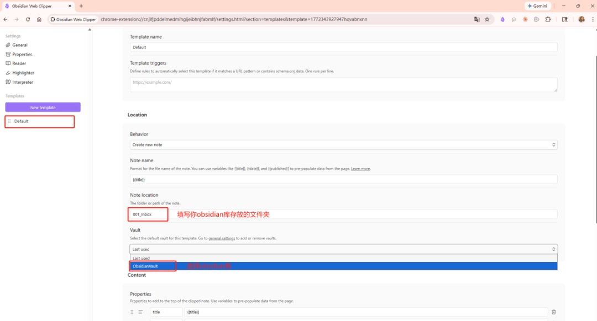

article-media-3

第二步，打开任意网页文章，点击扩展图标，选择 Add to Obsidian。

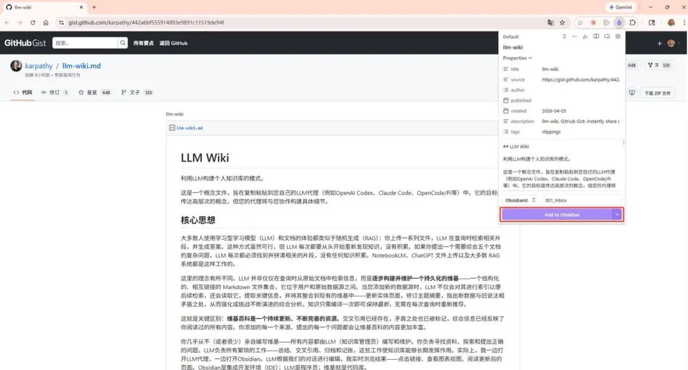

article-media-4

第三步，保存后文章自动转为 Markdown 出现在 Obsidian 里。

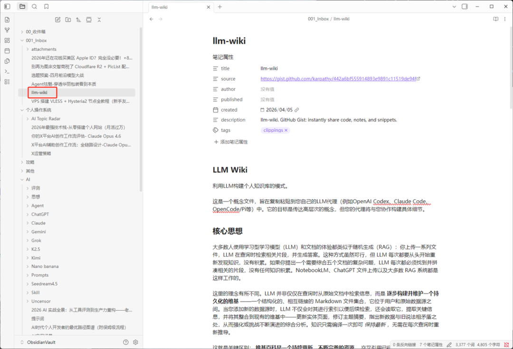

article-media-5

## 图片不本地化，迟早是定时炸弹

Web Clipper 剪下来的文章，图片默认还是远程链接。这有两个隐患：一是图床随时可能失效，文章图片变成一堆叉；二是 AI 无法访问失效的外链，这些图片对它来说等于不存在。

解决办法只需要配置一次。

**第一步：统一附件存储路径**

打开设置 → 文件与链接 → 找到附件存储路径 → 设为当前文件夹下指定的子文件夹，子文件夹名称设为 

```
attachments
```

。

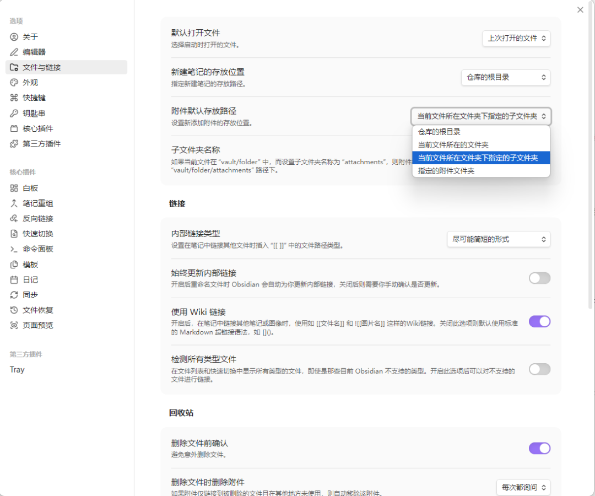

article-media-6

**第二步：绑定下载快捷键**

设置 → 快捷键 → 搜索"下载" → 绑定快捷键 Ctrl+Shift+D。

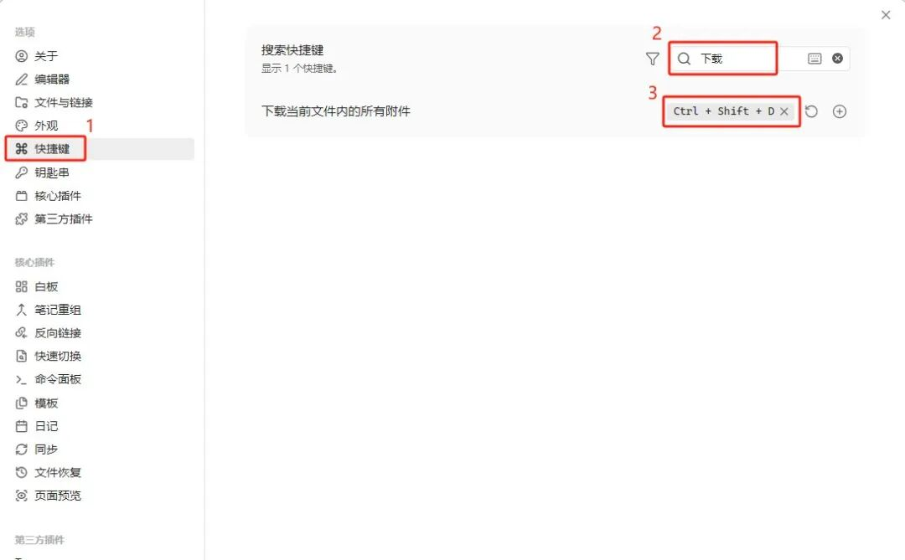

article-media-7

之后每剪一篇文章，顺手按一次 Ctrl+Shift+D，图片就落到本地了。这个习惯一旦养成，知识库里的内容就真正属于你，AI 也能完整读取每一张图。

## 图谱视图：让知识库的健康状况一目了然

Obsidian 的 Graph View 是一张实时生成的关系地图。每个 Wiki 页面是一个节点，页面之间凡是有双向链接的地方，就会自动连上一条线。打开方式：点击左侧边栏的图谱图标，或直接按 Ctrl+G。

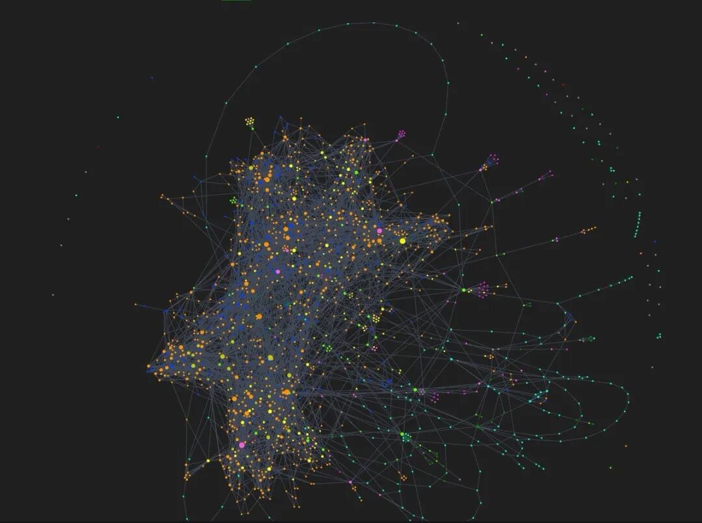

article-media-8

这张图结合 AI 有两个具体用途：

1. 1. **检查孤岛页面**：没有任何入链的节点悬在图谱边缘，说明这个页面还没有被其他内容引用，让 AI 去补上交叉链接。
2. 2. **找到应该但还没有建立的页面**：一个概念如果被多个页面提及却没有自己的专页，它会在图谱里以灰色幽灵节点的形式出现——这正是知识库里的空白，值得让 AI 补上。

## Dataview：给知识库装上自动报表

Dataview 是 Obsidian 的社区插件，核心能力是把 YAML frontmatter 当成数据库字段来查询，在页面里动态渲染出表格和列表。安装路径：设置 → 第三方插件 → 社区插件市场 → 搜索 "Dataview" → 安装并启用。

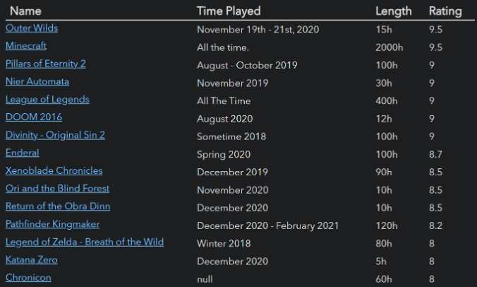

article-media-9

和 LLM Wiki 配合的方式是：让 AI 在创建或更新每个页面时，顺带写入结构化的 frontmatter，例如：

```
type: sourcetitle: "文章标题"date: 2026-04-05tags: [AI, knowledge-base]source_count: 3
```

有了这些元数据，随便在哪个页面写一段 Dataview 查询：

```
TABLE title, date, tagsFROM "wiki/sources"SORT date DESC
```

就能自动拉出按时间排序的素材清单。知识库越大，这类查询的价值就越高——人工整理费时费力的东西，Dataview 几行代码就搞定。

## Marp：Wiki 内容直接变成可用的幻灯片

Marp 是基于 Markdown 的幻灯片标准，在 Obsidian 里装上 Marp Slides 插件就能本地预览和导出。安装路径：设置 → 社区插件 → 搜索 "Marp Slides" → 安装并启用。

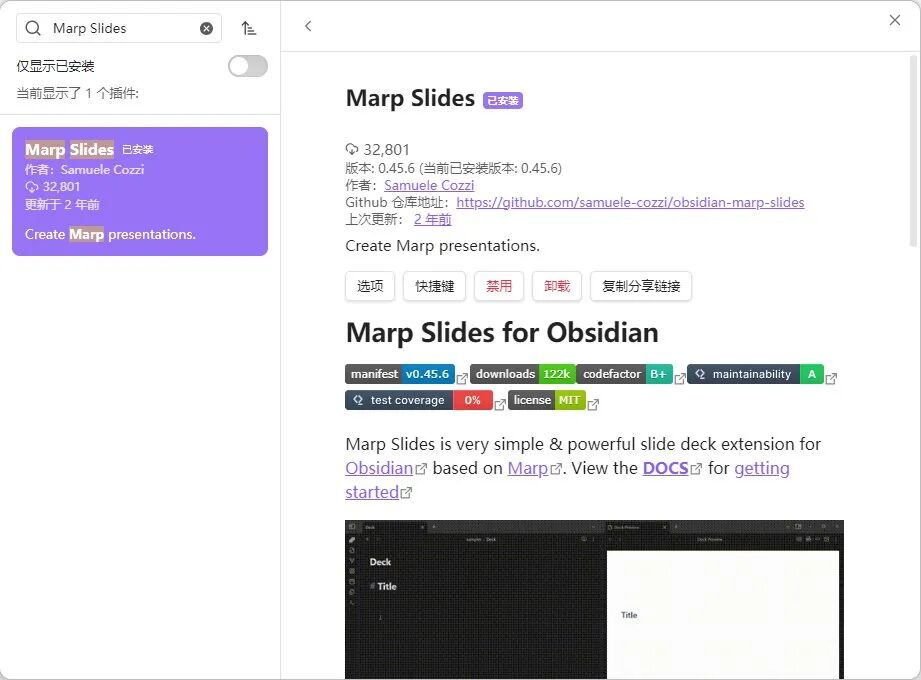

article-media-10

格式很简单：文件开头写 

```
marp: true
```

，然后每页之间用 

```
---
```

 分隔。写完在 Obsidian 里直接预览，导出支持 PDF、HTML、PPTX 三种格式。

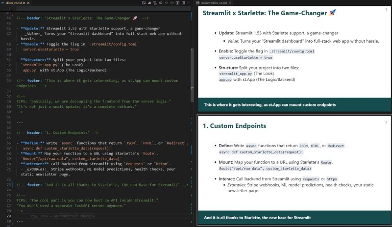

article-media-11

实际场景：把某个主题的 Wiki 页面喂给 AI，让它直接输出 Marp 格式的初稿，你只需要调整细节，几分钟就能出一份像样的演示文稿。

## Git：AI 改文件，你需要一道保险

安装路径：设置 → 第三方插件 → 社区插件市场 → 搜索 "git" → 安装并启用。

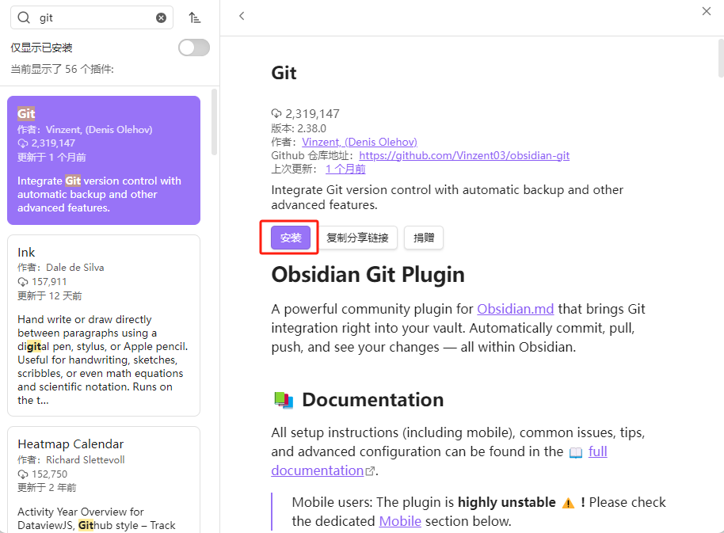

article-media-12

如果 Vault 还没有 Git 仓库，先初始化：

1. 1. 打开终端，cd 到你的 Vault 目录，执行 

   ```
   git init
   ```

    初始化仓库。

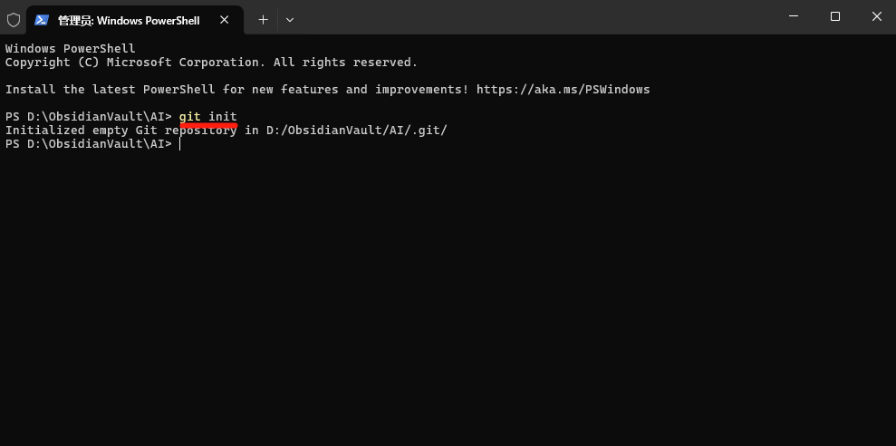

article-media-13

1. 2. 在 GitHub 上新建一个**私有**仓库（知识库是个人数据，不要设成公开）。

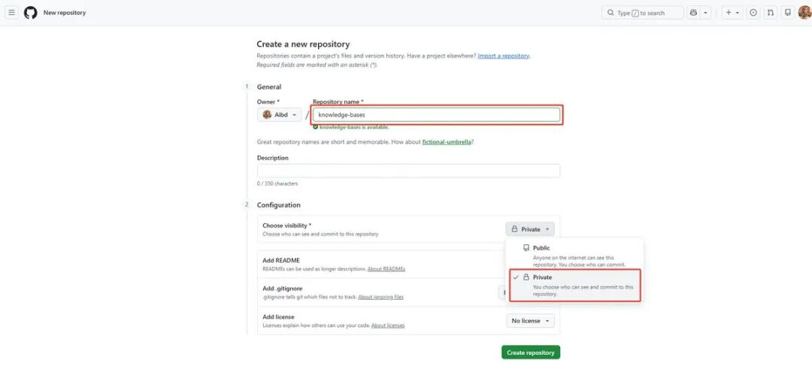

article-media-14

1. 3. 把本地仓库推上去：

```
git branch -M maingit remote add origin https://github.com/你的用户名/knowledge-bases.gitgit add .git commit -m "init: 初始化知识库"git push -u origin main
```

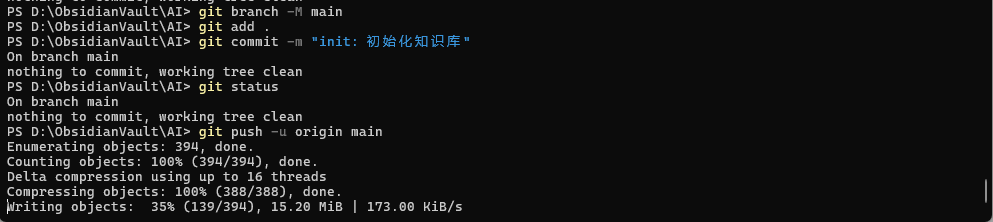

article-media-15

插件装好后，把 Auto commit-and-sync interval 调成 10 分钟，之后不用再管它。

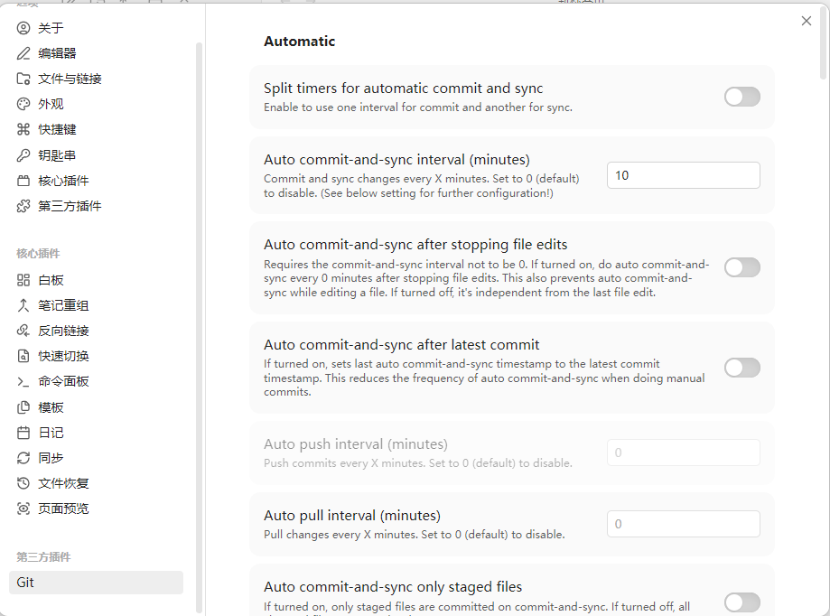

article-media-16

为什么 Git 是必选项？因为 AI 可以一次改动十几个文件，一旦出错，没有版本历史就很难回溯。提交记录就是一张安全网，AI 的能力越强，这张网就越重要。

## qmd：知识库大了之后的搜索方案

页面数量还少的时候，维护一个 

```
index.md
```

 作为目录就够用了，AI 靠它就能在知识库里找到路。

等到页面积累到几百个，检索速度开始下降，这时候可以引入 qmd——一个纯本地运行的 Markdown 全文搜索引擎。不用急着现在就装，等真正感到慢了再说。

## 这套方法为什么能长期运转？

知识库做不下去，通常不是因为没有内容，而是因为维护太累：每加一条新知识，就要手动更新所有相关页面的引用，检查有没有矛盾，补上缺失的交叉链接……页面一多，人就撑不住了。

AI 在这件事上有结构性优势：它不会因为重复劳动而厌倦，不会漏掉需要更新的页面，而且可以在一次操作里同时处理大量文件。把这部分工作交给它，维护成本就从"随规模增长"变成了近乎固定。

你需要做的，是决定读什么、想清楚问什么、判断哪些值得记录。整理、归档、串联这些事，AI 来。

Obsidian Web Clipper + 图片本地化 + Git + Claude，这四件套就够搭出一个真正能用、能长大、能活下去的个人知识库。

**——END——**

**点点关注，一起学习~**
