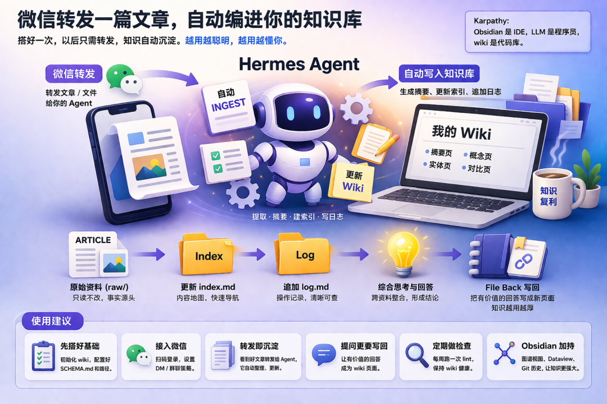
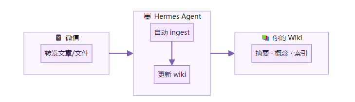
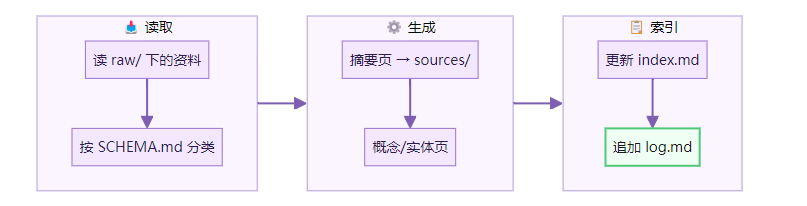
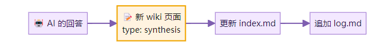
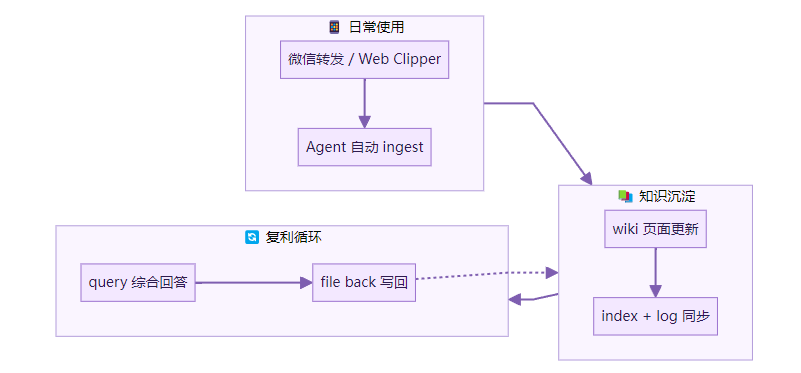

> 📎 来源: [AI赋能说](https://mp.weixin.qq.com/s?__biz=MzI3NjE4OTAyMg==&mid=2247488416&idx=1&sn=75307472a5300ceb231d6464b9d8721d&chksm=ea4367ac675a3292046b31b905443aa8b8b1557635a0d42c3155d6ea790d18409969e8598cdf&mpshare=1&scene=1&srcid=0511Ee6USr3EajG0IWfVLndr&sharer_shareinfo=10eab089cf84751b86ff6710494c2e3d&sharer_shareinfo_first=10eab089cf84751b86ff6710494c2e3d) | 时间: 2026-05-11 10:52

---



这篇是教程。

上一篇聊了飞轮为什么能转起来。这篇把它搭起来。

读完这篇，你能做到一件事：在微信里转发一篇文章给你的 Agent，它自动把文章编进你的个人 wiki，更新索引，追加日志。下次你提问，它已经。

先看搭完后的样子。



整个过程分三个阶段。搭 wiki → 接微信 → 日常循环。

前提条件：

- 一台能装 Python 的电脑（Mac / Linux / WSL 都行）
- 一个微信号
- 已安装 Hermes Agent（

  ```
  pip install hermes-agent
  ```

  ，如果还没装）
- 可选：Obsidian[1] + Obsidian Web Clipper[2] 浏览器扩展

## 阶段一：搭你的 LLM Wiki

### 第一步：初始化 wiki

打开终端，一条命令。

```
hermes wiki init my-research
```

它会自动建好目录结构。

```
my-research/├── raw/              ← 原始资料，只读不改│   ├── articles/│   ├── papers/│   ├── repos/│   ├── data/│   └── images/├── wiki/             ← Agent 维护的知识层│   ├── index.md      ← 内容地图（按类别）│   ├── log.md        ← 操作日志（按时间）│   ├── hot.md        ← 热缓存（会话上下文）│   ├── overview.md│   ├── concepts/     ← 概念页│   ├── entities/     ← 实体页│   ├── sources/      ← 来源摘要│   └── comparisons/  ← 对比页├── outputs/          ← 日期化报告└── SCHEMA.md         ← 规则文件，告诉 Agent 怎么干活
```

三层。raw/ 是仓库，wiki/ 是车间，SCHEMA.md 是规矩。

做完这一步，打开 my-research/ 目录看看。文件都在就对了。

### 第二步：锁定 raw/ 目录

raw/ 是事实的源头。Agent 只读不改。但这只是口头约定。加一道文件系统锁更保险。

```
chmod -R a-w my-research/raw/
```

以后要往 raw/ 里放新资料，先解锁。

```
chmod -R u+w my-research/raw/# 放完资料后再锁回去chmod -R a-w my-research/raw/
```

这一步不是必须的。但它能防止 Agent 误改你的原始资料。

### 第三步：写好 SCHEMA.md

```
hermes wiki init
```

 会生成一个默认的 SCHEMA.md。打开看看，确认几件事写清楚了。

一个好的 SCHEMA.md 至少要包含这些内容。

```
# Wiki Schema## 目录结构- raw/ 存放原始资料，只读不改- wiki/ 存放整理后的知识页面- wiki/index.md 是内容地图，每次更新 wiki 后必须同步更新- wiki/log.md 是操作日志，每次操作后追加一条记录- wiki/hot.md 是热缓存，记录当前会话上下文（约500词以内）## 页面类型与命名- 摘要页：wiki/sources/summary-{来源标题}.md- 概念页：wiki/concepts/concept-{概念名}.md- 实体页：wiki/entities/entity-{实体名}.md- 对比页：wiki/comparisons/compare-{主题}.md## YAML Frontmatter（每页必须有）---title: 页面标题type: source | concept | entity | comparisoncreated: 2026-04-17updated: 2026-04-17tags: [tag1, tag2]sources: [raw/articles/xxx.md]---## 交叉引用- 页面之间用 [[wikilink]] 互相引用- 提到已有页面的实体或概念时，必须建立链接- 新概念被多次提及但缺独立页面时，创建新页面## 回写规则- 每次回答用户问题后，检查有没有值得写回的结论- 有价值的回答写成新页面，标注 type: synthesis- 更新 index.md，追加 log.md## 更新策略- 单次更新超过 10 个页面时，先列出清单让用户确认- 不确定的内容标注 [!needs-verification]- 发现矛盾时标注 [!contradiction] 并说明冲突来源## 人工复核- AI 不确定的内容，在 frontmatter 加 status: needs-review- 涉及数据、结论、判断的页面，标注 [!needs-verification]
```

这就是 Karpathy 说的 Schema 层。看着长。但没有它，wiki 三天就乱了。

核心原则：越具体，Agent 越稳定。

### 第四步：配置 Hermes 的 wiki 路径

告诉 Hermes 你的 wiki 在哪。

```
hermes config set wiki.path ~/my-research
```

或者直接编辑 

```
config.yaml
```

。

```
skills:  config:    wiki:      path: ~/my-research
```

验证配置是否生效。

```
hermes config show
```

看到 

```
wiki.path
```

 指向你的目录就对了。

### 第五步：准备第一批资料

不要贪多。3 到 5 篇就够。

找一个你最近反复在看的主题。把相关文章的 Markdown 文件放进 

```
raw/articles/
```

。

如果是网页文章，用 Obsidian Web Clipper[3] 浏览器扩展把网页转成 Markdown，直接存进去。

如果是 PDF 论文，放进 

```
raw/papers/
```

。

记得先解锁 raw/ 目录再放文件。

```
chmod -R u+w my-research/raw/# 放入文件...chmod -R a-w my-research/raw/
```

### 第六步：做第一次 ingest

告诉 Agent 处理 raw/ 里的资料。

```
hermes wiki ingest
```

或者在对话里说。

```
请阅读 raw/ 目录下的所有资料，按照 SCHEMA.md 的规则生成 wiki 页面。
```

Agent 会做这些事。



一次 ingest 可能触碰 10-15 个 wiki 页面。因为知识是连着的。一篇新文章里提到的概念，可能在好几个已有页面里需要补充。

如果 Agent 打算更新超过 10 个页面，它会先列出清单让你确认。这是 SCHEMA.md 里写的规则。

做完后打开 wiki/ 目录。你应该能看到：

- sources/ 下有新的摘要页，带 YAML frontmatter
- concepts/ 或 entities/ 下可能有新页面
- index.md 里列出了所有页面和一行摘要
- log.md 里有一条格式为 

  ```
  ## [2026-04-17] ingest | 来源名
  ```

   的记录

验证：index.md 里的页面列表和 wiki/ 目录下的文件一一对应，没有遗漏。

## 阶段二：接上微信

Wiki 搭好了。现在让微信成为它的入口。

### 第七步：安装微信依赖

```
pip install aiohttp cryptography qrcode
```

aiohttp 负责 HTTP 长轮询。cryptography 负责 AES-128-ECB 加密的 CDN 媒体传输。qrcode 负责终端显示二维码。

### 第八步：运行微信设置向导

```
hermes gateway setup
```

提示中选择 **Weixin**。

向导会做这些事：请求二维码 → 在终端显示（或给你一个 URL）→ 你用手机微信扫码 → 手机上确认登录 → 凭证自动保存到 

```
~/.hermes/weixin/accounts/
```

。

成功后终端会显示：

```
微信连接成功，account_id=your-account-id
```

。

记下这个 account\_id。下一步要用。

### 第九步：配置环境变量

打开 

```
~/.hermes/.env
```

，加入以下配置。

```
WEIXIN_ACCOUNT_ID=your-account-id# 私聊策略# open=任何人可聊（默认）# allowlist=白名单# disabled=关闭# pairing=配对模式WEIXIN_DM_POLICY=open# 如果用白名单模式，在这里加用户ID# WEIXIN_ALLOWED_USERS=user_id_1,user_id_2# 可选：定时任务/通知的主频道# WEIXIN_HOME_CHANNEL=chat_id# WEIXIN_HOME_CHANNEL_NAME=Home
```

```
your-account-id
```

 换成上一步拿到的值。

群聊默认是关闭的。个人微信可能在几十个群里，全开会被消息淹没。如果需要开启：

```
# 群策略：open=所有群，allowlist=白名单群WEIXIN_GROUP_POLICY=open
```

### 第十步：启动网关

```
hermes gateway
```

适配器恢复凭证，连接 iLink API，开始长轮询接收消息。

终端保持运行。用另一个微信号发一条消息给你。看终端有没有收到。

收到了就说明通了。

验证：发一条「你好」，Agent 在微信里回复了，终端有日志输出。

### 第十一步：转发一篇文章试试

在微信里给你的 Agent 转发一篇文章。

Agent 收到后，会自动执行 ingest——提取文章内容，生成摘要页，更新索引和日志。

打开 wiki/ 目录看看。新的摘要页出现了。

验证：wiki/sources/ 下有新文件，index.md 多了一条记录，log.md 有 ingest 日志。

## 阶段三：日常循环

搭完之后，日常使用不再是线性步骤。而是三个操作的循环。

### Query — 向 wiki 提问

不要只问「帮我总结第一篇文章」。那和普通的 AI 对话没区别。

要问一个需要综合多份资料才能回答的问题。

```
根据 wiki 里的内容，目前 AI Agent 的主要架构模式有哪几种？各自的优缺点是什么？
```

Agent 会从 index.md 开始导航，找到相关页面，综合出一个带 

```
[[wikilink]]
```

 引用的回答。

**关键一步：把有价值的回答写回 wiki。**

```
刚才的回答很有价值。请按照 SCHEMA.md 的回写规则，把这个结论写成一页新的 wiki 页面（type: synthesis）。更新index.md 和log.md
```



这就是 file back。回答不再消失在聊天记录里。下次问相关问题，Agent 已经知道这个结论了。

什么样的回答值得写回？

- 跨多篇资料的综合对比
- 你自己的判断和决策依据
- 发现了资料之间的矛盾或联系
- 形成了新的概念框架

什么不值得写回？

- 对单篇文章的简单摘要（ingest 已经做了）
- 一般性的常识回答

### Lint — 定期健康检查

每周跑一次。十分钟就够。

```
请对 wiki 做一次完整的 lint 检查。
```

Hermes 会跑 8 类检查。

| 检查项 | 在找什么 |
| --- | --- |
| 孤立页面 | 没有任何其他页面链接到它 |
| 死链 | `[[wikilink]]` 指向了不存在的页面 |
| 矛盾检测 | 两个页面里说法冲突 |
| 缺失页面 | 被多次提到但还没独立页面的概念 |
| 未链接提及 | 提到了某个实体但没建立 `[[链接]]` |
| 不完整元数据 | frontmatter 缺字段 |
| 空白段落 | 页面里有标题但没内容 |
| 过期索引 | index.md 和实际文件不一致 |

Agent 会列出问题清单和修复建议。你确认后它自动修。

不跑 lint 的 wiki，三个月后就变成一堆散乱的文件。跑了 lint 的 wiki，越长越健康。

### hot.md — 会话接力

每次开新对话，Agent 要重新理解「我们上次聊到哪了」。这浪费 2-3K token。

hot.md 解决这个问题。它是一个约 500 词的热缓存，记录当前工作上下文。Agent 每次开始会话时先读 hot.md，直接接上之前的工作。

你不需要手动维护它。Agent 会自动更新。

## Obsidian 集成

wiki 目录天然就是一个 Obsidian Vault。

直接用 Obsidian 打开 my-research/ 目录。

几个好用的功能。

**Graph View。** 打开图谱视图，你能看到所有 wiki 页面之间的 

```
[[wikilink]]
```

 关系。哪些概念是中心节点，哪些是孤立页面，一目了然。

**Dataview 插件。** 安装后可以用 SQL 风格的语法查询 YAML frontmatter。比如列出所有 

```
status: needs-review
```

 的页面。

```
TABLE title, updated, tagsFROM "wiki"WHERE status = "needs-review"SORT updated DESC
```

**Git 版本历史。** 在 my-research/ 目录初始化一个 git 仓库。

```
cd my-researchgit initgit add -Agit commit -m "initial wiki"
```

以后每次 ingest 完，提交一次。wiki 就有了免费的版本历史。想看 Agent 改了什么，

```
git diff
```

 一目了然。

**Web Clipper。** 浏览网页时看到好文章，点一下 Obsidian Web Clipper[4] 扩展，直接转成 Markdown 存进 raw/articles/。

## 完整流程一览



转发 → ingest → 更新 → 提问 → 写回。每转一圈，wiki 厚一点。

## 第一次做的建议

用最小规模练手。3 篇文章，一个主题。别一上来就把整个收藏夹喂进去。

最容易卡的地方是 SCHEMA.md。如果 Agent 生成的页面格式不对、命名乱跑、frontmatter 缺字段，九成是规则写得不够具体。回去把模板写死。

最容易被跳过但最重要的一步：file back。问完就走了，回答消失在聊天记录里。养成习惯——每次 query 之后检查一下，有没有值得写回 wiki 的结论。

第一次 lint 会发现一堆问题。不要慌。这说明 lint 在工作。逐条修完，wiki 就干净了。

## 容易踩的坑

**扫码登录过期。** 微信登录凭证有有效期。报错 

```
errcode=-14
```

 就是过期了。重新跑一次 

```
hermes gateway setup
```

 扫码就行。

**提示缺少 WEIXIN\_TOKEN。** 说明上一次扫码没成功保存凭证。重新跑 

```
hermes gateway setup
```

。

**机器人不回复私聊。** 检查 

```
WEIXIN_DM_POLICY
```

 是不是设成了 

```
allowlist
```

，而发送者不在白名单里。

**机器人不回复群消息。** 群策略默认 

```
disabled
```

。需要在 .env 里设置 

```
WEIXIN_GROUP_POLICY=open
```

 或 

```
allowlist
```

。

**终端二维码显示不出来。** 装一下 

```
pip install qrcode
```

。或者用终端上方打印的 URL 链接在浏览器里扫。

**SCHEMA.md 太模糊。** 只写「生成摘要」不够。写清楚摘要多长、什么 frontmatter 字段、文件名怎么起、交叉引用怎么做。越具体越好。

**从不做 lint。** Wiki 用久了会出现死链、矛盾、孤立页面。每周跑一次 lint。不跑的话，wiki 慢慢就腐烂了。

**一上来喂太多。** 先用 3-5 篇跑通整个流程。确认 SCHEMA.md 好使了再扩大。Karpathy 的 wiki 在大约 100 篇资料、40 万词的规模下运行良好。超过这个规模可能需要引入 qmd 等混合搜索工具辅助检索。

**错误复合传播。** Agent 写错了一个结论，后续的 ingest 和 query 可能基于这个错误继续推导。所以 SCHEMA.md 里要写矛盾标记规则（

```
[!contradiction]
```

），加上定期 lint 和人工复核。Karpathy 说过：Human owns verification。

## 最后

1945 年，Vannevar Bush 设想了一种叫 Memex 的私人知识系统。没人愿意持续维护，所以从未落地。

80 年后，Agent 解决了维护问题。

上次搭的 wiki，输入靠手动。

这次，输入靠转发。

摩擦降到最低。飞轮才转得起来。

试试看。从微信里挑一篇你最近看过的好文章，转发给你的 Agent。看它会不会帮你把知识留下来。

转发即沉淀。用完，不忘。

参考资料：Karpathy llm-wiki.md gist[5] · Hermes Agent GitHub[6] · Hermes Agent 官方文档[7] · Hermes Agent 快速上手[8] · Obsidian Web Clipper[9] ·

Reference

[1] 

Obsidian: *https://obsidian.md*

[2] 

Obsidian Web Clipper: *https://obsidian.md/clipper*

[3] 

Obsidian Web Clipper: *https://obsidian.md/clipper*

[4] 

Obsidian Web Clipper: *https://obsidian.md/clipper*

[5] 

Karpathy llm-wiki.md gist: *https://gist.github.com/karpathy/442a6bf555914893e9891c11519de94f*

[6] 

Hermes Agent GitHub: *https://github.com/NousResearch/hermes-agent*

[7] 

Hermes Agent 官方文档: *https://hermes-agent.nousresearch.com/docs/*

[8] 

Hermes Agent 快速上手: *https://hermes-agent.nousresearch.com/docs/getting-started/quickstart/*

[9] 

Obsidian Web Clipper: *https://obsidian.md/clipper*

**下方是赋能君的AI学习交流永久免费星球，想学习更多内容，欢迎扫码加入。**


🙌 如果你阅读到这里，说明我们对信息的认可区域是有一定交集的，可以说我们是同道中人，所以如果你有自认为不错的信息获取渠道，欢迎留言或者私聊我，谢谢。

都看到这里了，就给个关注吧👀：

喜欢我的文章，可以请你右下角顺手来一波点赞&在看&分享三连么👉
