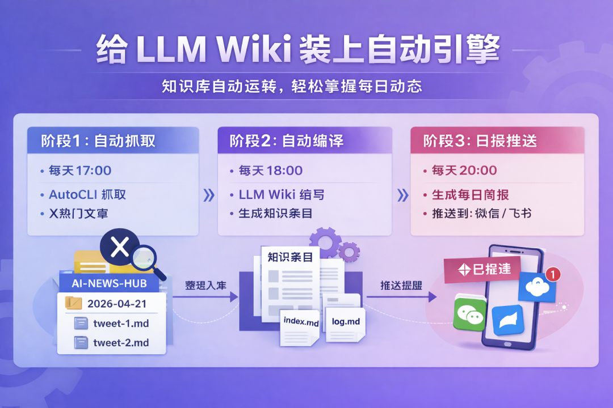
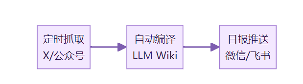
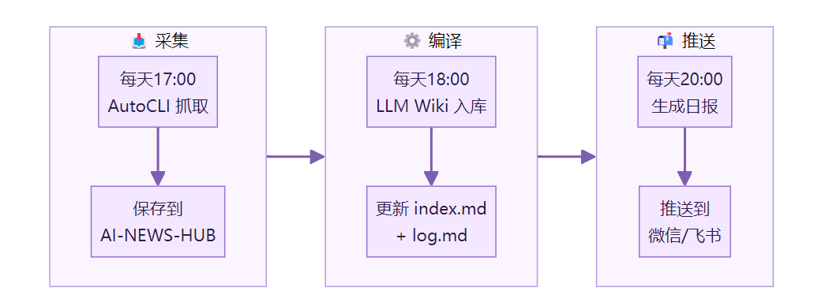

> 📎 来源: [AI赋能说](https://mp.weixin.qq.com/s?__biz=MzI3NjE4OTAyMg==&mid=2247488513&idx=1&sn=39101e627527ce328fe1142bdfaea832&chksm=ea5a7d06d393bba1cc2517aa7163b0941cd23f21747eef5cb1b8e0df34db8d125c8dac6272b6&mpshare=1&scene=1&srcid=0522ZaR5EOa5Ig2SgnoZ34Xu&sharer_shareinfo=19c591cf41c7edc2eabf5ca96749008f&sharer_shareinfo_first=19c591cf41c7edc2eabf5ca96749008f) | 时间: 2026-05-22 22:21

---



上一篇聊了为什么知识库搭完之后还是会荒废。核心问题是「人在给 AI 打工」。

这篇把解决方案落地。

如果你跟着我之前的教程搭过 LLM Wiki 知识库。这篇是续集。

教你把手动维护的知识库。升级成自动运转的。

搭完之后。信息自己进来。自己整理。整理完了还会推送告诉你。

先看流程。



三个阶段。每个阶段独立可用。串起来效果最好。

前提条件。

你需要一台能跑 AI Agent 的电脑。Hermes、Claude Code、Kiro 都行。

需要 Chrome 浏览器。并且已经登录了你想抓取的平台。

需要一个已经搭好的 Obsidian 知识库。如果还没搭。先看我上一篇教程。

## 阶段一：让信息自己进来

这个阶段解决「每天手动找文章」的问题。

**第一步：安装 AutoCLI**

AutoCLI 是一个开源的浏览器信息抓取工具。GitHub 搜 autocli-skill 就能找到。

不需要 API Key。直接复用你 Chrome 里已有的登录态。支持 X、公众号、B站、知乎、Reddit 等平台。

打开你的 AI Agent。告诉它。

```
帮我安装 AutoCLI 的 skill
```

Agent 会自动完成安装和配置。

装完之后。先测试一下。

```
用 AutoCLI 抓取 X 上今天 AI 相关的点赞 Top 10
```

我第一次跑这条命令的时候。等了大概两分钟。然后10篇推文整整齐齐地出现在终端里。

如果能正常返回内容。说明抓取通道没问题。

**第二步：在 Obsidian 里建一个收件箱**

在你的知识库根目录下。建一个文件夹。

```
my-wiki/├── raw/├── wiki/├── AI-NEWS-HUB/    ← 新建这个│   └── x-ai-top10-daily/├── AGENTS.md
```

```
AI-NEWS-HUB
```

 是所有自动抓取内容的落地点。

```
x-ai-top10-daily
```

 是 X 平台每日 Top 10 的专属目录。

以后想加公众号、Reddit。在 

```
AI-NEWS-HUB
```

 下面再建子目录就行。

**第三步：设置定时抓取**

在 

```
AI-NEWS-HUB
```

 路径下。告诉 Agent。

```
每天下午5点，自动抓取 X 上 AI 相关的点赞 Top 10，保存到 x-ai-top10-daily 目录，按日期建子文件夹归档
```

Agent 会创建一个定时任务。每天自动执行。

抓取的内容会按这样的结构存放。

```
x-ai-top10-daily/├── 2026-04-19/│   ├── tweet-1.md│   ├── tweet-2.md│   └── ...├── 2026-04-20/│   └── ...
```

验证：第二天下午五点过后。打开目录。有新的日期文件夹和内容。就对了。

## 阶段二：让信息自己变成知识

这个阶段解决「素材堆了一堆但没整理」的问题。

**第四步：让 Agent 编译 wiki**

还是在知识库路径下。告诉 Agent。

```
把 AI-NEWS-HUB/x-ai-top10-daily 目录下今天的文章，按照 AGENTS.md 的规则编译成 wiki 页面，更新 index.md 和 log.md
```

Agent 会调用 LLM Wiki 的规则。把原始推文转化成结构化的知识页面。

我第一次跑的时候。10篇推文被压缩成了4个概念页和1个对比页。重复的信息合并了。关键观点提炼出来了。

生成的 wiki 页面会出现在 

```
wiki/
```

 目录下。带摘要。带来源标注。带双链。

**第五步：把编译也设成定时任务**

```
每天下午6点，自动把 AI-NEWS-HUB 目录下当天的内容编译成 wiki 页面
```

为什么是6点。因为抓取任务5点跑。留一个小时的缓冲。确保抓取完成后再编译。

验证：第二天晚上。打开 

```
wiki/
```

 目录和 

```
index.md
```

。有新增的页面。就对了。

## 阶段三：让知识库主动找你

这个阶段解决「知识库更新了但你不知道」的问题。

**第六步：接入推送渠道**

微信和飞书都可以。告诉 Agent。

```
帮我接入个人微信渠道
```

Agent 会配置微信接入。完成后给你一个二维码链接。

用微信扫这个二维码。等几秒。Agent 会提示「连接成功」。

如果用飞书。告诉 Agent「帮我创建一个飞书机器人」。它会给你一个 webhook 地址。复制到飞书群设置里就行。

整个过程大概五分钟。

**第七步：设置日报推送**

```
每天晚上8点，生成今日知识库更新日报，包含新增了哪些内容、有哪些值得关注的信息，推送到我的微信
```

日报不需要长。一屏能看完就好。标题加一句话摘要。

验证：当天晚上8点。微信收到日报消息。就对了。

## 完整流程一览



三个定时任务。串成一条链。每天自动跑。

## 第一次做的建议

先只跑阶段一。确认抓取没问题。

跑两三天之后。再加阶段二。确认编译质量。

最后再接推送。

不要一口气全配完。出了问题不知道是哪一层的。

用最小的数据量练手。先只抓 X 一个平台。Top 10 就够了。

等整条链跑顺了。再加公众号、Reddit、Hacker News。

## 容易踩的坑

第一个坑。Chrome 没登录目标平台。

AutoCLI 复用的是浏览器的登录态。Chrome 没登录 X。它就抓不到东西。抓取前确认一下登录状态。

第二个坑。定时任务的时间间隔太短。

抓取和编译之间至少留一个小时。如果编译任务在抓取还没完成时就启动了。会漏掉内容。

第三个坑。AGENTS.md 没有更新。

你原来的 AGENTS.md 是为手动 ingest 写的。现在多了自动抓取的内容。需要加一些规则。

建议在 AGENTS.md 里加一段。

```
## 自动抓取规则- AI-NEWS-HUB/ 下的内容由定时任务自动写入，不手动修改- 编译时按来源平台分类（X、公众号、Reddit 等）- 自动生成的 wiki 页面标注 [来源：自动抓取]- 与 raw/ 手动资料的 wiki 页面区分命名
```

第四个坑。日报太长没人看。

日报的目的是提醒你「知识库今天更新了」。不是把所有内容复述一遍。控制在一屏以内。

上次搭的是骨架。这次装的是引擎。

骨架让知识库能记住东西。引擎让它自己转起来。

试试看。从一个定时抓取开始。

你会发现。不用动手。它也能自己长大。

这是 LLM Wiki 系列的第三篇。第一篇搭骨架。第二篇找问题。这篇装引擎。

后面如果有新的玩法。我会继续写。

参考资料：

[1] Karpathy LLM Wiki gist：https://gist.github.com/karpathy/442a6bf555914893e9891c11519de94f

[2] Karpathy「LLM Knowledge Bases」长帖：https://x.com/karpathy/status/2039805659525644595

[3] AutoCLI — 开源浏览器信息抓取工具：https://github.com/nashsu/autocli-skill

[4] AutoCLI 官网：https://autocli.ai/

**下方是赋能君的AI学习交流永久免费星球，想学习更多内容，欢迎扫码加入。**


🙌 如果你阅读到这里，说明我们对信息的认可区域是有一定交集的，可以说我们是同道中人，所以如果你有自认为不错的信息获取渠道，欢迎留言或者私聊我，谢谢。

都看到这里了，就给个关注吧👀：

喜欢我的文章，可以请你右下角顺手来一波点赞&在看&分享三连么👉
