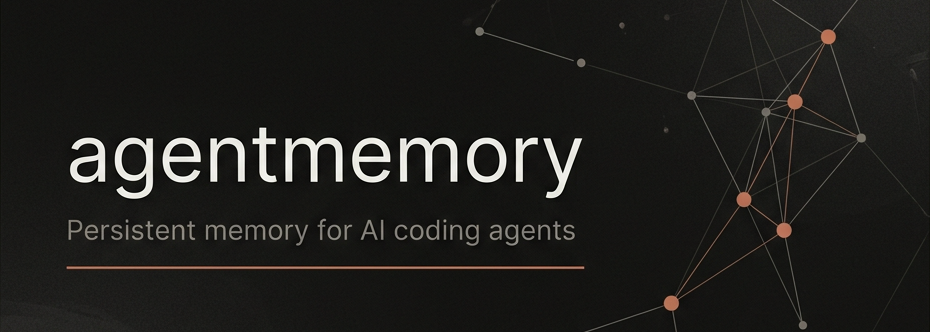
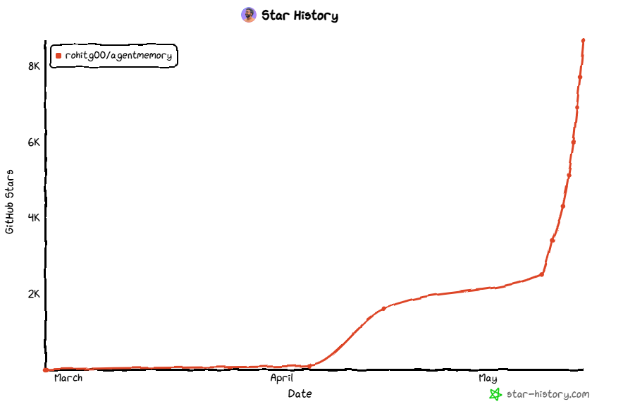
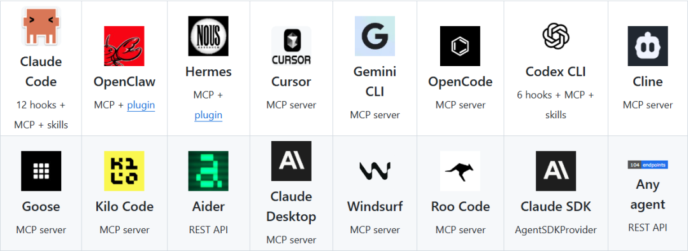

> 📎 来源: [硅基苔藓](https://mp.weixin.qq.com/s?__biz=MzIxMDYwODQ4Nw==&mid=2247484745&idx=1&sn=460d50296c05947c28f0ccbeedc60bbf&chksm=9695a70b214ca199f5e6117db47abc9187a95617f238a63f069c8e7feee1479c100941e6705e&mpshare=1&scene=1&srcid=0522vXyt8lawVbRHmkK50OIU&sharer_shareinfo=391e2625d56d29a2474e2890e73600d5&sharer_shareinfo_first=391e2625d56d29a2474e2890e73600d5) | 时间: 2026-05-22 02:50

---



2026.05.14 · 硅基苔藓 · agentmemory

—— AI Coding Agents 永久记忆 ——

*这是融合知识图谱、混合搜索并扩展了 Karpathy 的 LLM Wiki 模式项目。*

*The gist extends Karpathy's LLM Wiki pattern with confidence scoring, lifecycle, knowledge graphs, and hybrid search: agentmemory is the implementation.*

*5月份 Star 趋势*



*支持所有具备 hooks, MCP, or REST API 的 Agent 或编程工具。*



为什么 AI 编码代理天生失忆?

AI 编码代理的'健忘'不是 bug，是架构决定的。

每一个会话本质上是一个独立的上下文窗口。Claude Code 的 MEMORY.md、Cursor 的 .cursorrules、Cline 的 memory bank——这些所谓的'记忆'，本质上是便利贴。你把关键信息写在一个文本文件里，每次会话开始时把它塞进 context window。

便利贴有几个致命问题：

第一，容量有限。CLAUDE.md 超过 200 行就会变成噪音。240 条观察占 22K+ tokens，每多一条都在消耗你的上下文预算。

第二，不可检索。当 MEMORY.md 里积累了 50 个项目的各种笔记，代理没法区分哪些是'当前项目用的'，哪些是'上周那个项目留下的'。它只能全加载进来，或者全不加载。

第三，不会过期。三个月前你记录'用 axios 发 HTTP 请求'，后来改成了 fetch。MEMORY.md 里两条都还在，代理不知道该信哪一条。

这就像你有一个非常聪明的实习生，但他没有笔记本。每次见面你都得重新教一遍。教了十次之后，不是他变聪明了，是你变得不耐心了。

三层记忆 + RRF 融合检索

agentmemory 的核心思路很简单：把'便利贴'换成'搜索引擎'。

但实现不简单。它用了三层索引结构，在长程记忆检索基准 LongMemEval-S 上达到了 95.2%% 的 R@5 召回率——比纯 BM25 高 9 个百分点，比纯向量检索高 12 个百分点。

三层分别是：

第一层：BM25 关键词索引。基于 SQLite FTS5，本地运行，不需要任何外部服务。最新的 v0.9.12 加入了 CJK tokenizer，中文检索不再是玄学。

第二层：向量索引。使用 `all-MiniLM-L6-v2` 本地嵌入模型，零 API 费用。语义相似度匹配让'数据库性能优化'能召回 'N+1 query fix'。

第三层：知识图谱。这是 agentmemory 与其他方案最显著的区别。它不只是存键值对，而是在内存条目之间建立关系网络。当你查询'认证'时，图谱会连带召回相关的中间件、测试、依赖库。

三层结果通过 RRF（Reciprocal Rank Fusion） 融合：BM25 权重 0.4，向量权重 0.6，图谱排名作为 tie-breaker。最终只返回 Top-K 结果注入上下文。

这意味着每次会话只消耗约 1,900 tokens。按年计算：大约 17 万 tokens，折合 10 美元。对比传统 LLM 摘要方案（每年约 65 万 tokens，500 美元），节省了 92%% 的 token 开销。

一条命令，跨代理共享

agentmemory '无感' 设计。

安装命令：

```
npx @agentmemory/agentmemory
```

它在后台启动一个内存服务器（端口 3111），挂一个实时查看器（端口 3113）。当你打开 Claude Code 或者 Cursor 时，通过 MCP 协议连接到这个服务器。

从这一刻开始，agentmemory 通过 12 个自动钩子默默工作：

SessionStart 时，它扫描你的历史记忆，把最相关的上下文注入系统提示。UserPromptSubmit 时，它提取当前意图，触发检索。PreToolUse / PostToolUse 时，它记录每一次工具调用——文件读写、命令执行、API 调用。

你不需要告诉它'记住这个'。它自己判断什么是值得记住的。一个 JWT 认证的实现值得记住，因为你大概率会在后续功能中复用。一次 `git log` 的结果不值得记住，因为它太临时了。

SessionEnd 时，它把一整天的观察压缩成结构化记忆。不是简单的摘要，而是带置信度评分的条目。高置信度的进入长期存储，低置信度的进入缓冲区，等待下一次确认。

第二天你再打开代理，它已经你的中间件架构、测试覆盖情况、甚至你选择 jose 而不是 jsonwebtoken 的原因。你不需要再说一句解释的话。

与 mem0、Letta、内置记忆的对比

agentmemory 不是第一个做 AI 记忆的项目。但它在几个关键维度上做出了差异化的选择。

mem0（55,618 stars）是最流行的 AI 记忆层。它提供 `add()` API，开发者手动调用。好处是控制精确，坏处是你得先写代码让代理学会什么时候调用 `add()`。mem0 需要外部向量数据库（Qdrant / pgvector），无法零依赖运行。LongMemEval-S 上 R@5 只有 68.5%%。

Letta / MemGPT（22,693 stars）是另一个方向——它不是一个记忆层，而是一个完整的 agent runtime。你必须在 Letta 框架里运行你的 agent。框架锁定成本高，但记忆精度尚可（R@5 83.2%%）。Letta 需要 Postgres + 向量数据库。

内置记忆（CLAUDE.md / .cursorrules）最轻量，但也最脆弱。没有检索能力，全加载进上下文，容量天花板明显。

agentmemory 的选择是：不做 agent runtime，只做记忆引擎。通过 MCP 协议和 REST API，它可以插到任何支持这两种协议的代理中。目前支持 Claude Code、Codex CLI、Cursor、Gemini CLI、Cline、Windsurf、Roo Code、OpenCode、Goose 等 16 个平台。

一个内存服务器，所有代理共享同一份记忆。你在 Claude Code 里做的项目，切换到 Cursor 时记忆还在。这是其他方案做不到的。

记忆生命周期：会遗忘才是好记忆

agentmemory 四层记忆生命周期。

大多数记忆系统只做'存'和'取'。agentmemory 多了两个阶段：衰减和< hlb>自动遗忘。

每条记忆有一个置信度评分和保留分。高频被检索的记忆，保留分增加——它证明了自己的价值。长期无人问津的记忆，保留分递减——它在告诉系统'这条可能过时了'。

当保留分降到阈值以下，记忆被自动删除。不是直接删，而是进入一个回收缓冲区，给你留了撤销的窗口。

这让我想起人脑。我们不会记住每一次路过的商店名字，但会记住常去的那几家。遗忘不是缺陷，是记忆系统保持高效的核心机制。

agentmemory 把这种机制编码到了系统里。你不需要手动清理 MEMORY.md——系统自己会清理。

局限与未来

agentmemory 不是完美的。

第一，依赖 iii-engine。这是一个 Rust 编写的运行时引擎，不在 npm 或 PyPI 上。你需要从 GitHub Releases 下载二进制文件。macOS/Linux 用户有 sh 安装脚本，Windows 用户需要手动解压 zip。对非技术用户来说门槛不低。

第二，LLM 压缩可选但昂贵。默认的 no-op 模式不消耗 token，但功能有限——只有 BM25 压缩。开启 `AGENTMEMORY_AUTO_COMPRESS` 后，每次工具调用都会调用 LLM 做压缩，token 消耗显著增加。这是一个精度与成本的 tradeoff。

第三，记忆注入可能干扰代理。注入太多无关上下文会稀释真正重要的信息。目前的 RRF 融合策略在基准测试中表现优秀，但在真实项目中，'相关'的定义远比 benchmark 复杂。

未来的方向值得关注。v0.9.0 引入了 记忆槽（slots）机制——类似 Letta 的可编辑固定记忆区，但受大小限制，支持 persona、user\_preferences、tool\_guidelines 等预定义类型。v0.9.12 加入了文件系统连接器（`@agentmemory/fs-watcher`），可以自动监控项目文件变化并更新记忆。

如果记忆槽与自动文件系统监控结合，agentmemory 可能不只是'记住你说过什么'，而是'理解你的项目状态'。这会是一个从'记忆层'到'理解层'的跨越。

我已经在自己的开发工作流里用了一周。最大的变化不是代理变聪明了，而是我变轻松了。不再需要反复教同一个东西，不再担心 MEMORY.md 过期。代理自己记住了该记住的，忘了该忘的。

这是'硅基苔藓' —— 数字世界的岩石表面，缓慢地、静静地，覆盖上一层不会轻易消失的记忆。

---

信息来源

[1] agentmemory · Persistent memory for AI coding agents · 7650 stars

[2] mem0 · Universal memory layer for AI Agents · 55,618 stars

[3] Letta · Platform for building stateful agents with advanced memory · 22,693 stars

[4] LongMemEval · Benchmark for long-context memory in LLM agents (ICLR 2025)

[5] iii-engine · Rust runtime for agent memory backends

[6] LLM Wiki · Karpathy's pattern for building knowledge bases (design inspiration)

[7] agentmemory benchmark · LongMemEval-S retrieval accuracy report

[8] Star History · agentmemory growth chart

感谢阅读~
