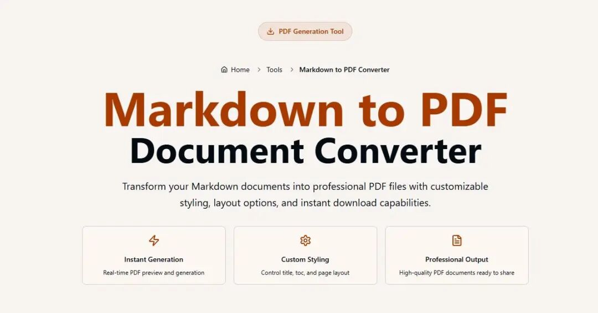

> 📎 来源: [杜乡Talk](https://mp.weixin.qq.com/s?__biz=MzE5ODQ5ODU3MA==&mid=2247484338&idx=1&sn=319f17d96e1447b7b2ad6854b391f99a&chksm=9781d6660d10a5f23d3de3335303883faa165c867d2c90618e6cc6fc555987aafe443c42e741&mpshare=1&scene=1&srcid=0511qtmkPQvQ0QO8jW9dCCCa&sharer_shareinfo=e2d2523fcbcdca90aff6a4d3171ffb39&sharer_shareinfo_first=e2d2523fcbcdca90aff6a4d3171ffb39) | 时间: 2026-05-11 02:53

---

MarkItDown 是 Microsoft 推出的一个开源工具，主打一个很实用的能力—— **把各种格式文件快速转换成 Markdown** 。如果你平时做文档处理、AI输入预处理、知识库整理，这个工具会非常顺手。

我帮你用“能不能用、值不值得用”的角度讲清楚👇



---

# 🧠 一句话理解

**MarkItDown = 万物转 Markdown 的“统一接口”**

---

# 🚀 它能干什么？

MarkItDown 支持把多种常见文件转换成 Markdown，比如：

- 📄 PDF（论文、合同）
- 📝 Word（.docx）
- 📊 Excel（表格转 Markdown 表格）
- 📽️ PowerPoint（提取文本内容）
- 🌐 HTML / 网页
- 📧 邮件（.eml）
- 📦 甚至 ZIP（批量处理）

👉 转换后统一变成 Markdown，方便：

- 喂给大模型（RAG / embedding）
- 做知识库（Notion / Obsidian）
- 自动化处理（脚本 / pipeline）

---

# 🔥 为什么它火了？

### 1️⃣ 专为 AI 时代设计

传统工具只是“转换文件”，但 MarkItDown 更像是为 AI 做的：

- 输出干净 Markdown（比 HTML 更适合 LLM）
- 保留结构（标题、列表、表格）
- 降低 token 噪音

👉 很适合：

- RAG 知识库
- AI 文档问答
- 自动摘要 / 分析

---

### 2️⃣ 一行命令搞定

安装：

```
pip install markitdown
```

使用：

```
markitdown input.pdf > output.md
```

就是这么简单。

---

### 3️⃣ 可编程（开发者友好）

你可以在 Python 里直接用：

```
from markitdown import MarkItDownmd = MarkItDown()result = md.convert("test.pdf")print(result.text_content)
```

👉 非常适合你这种做：

- 自动化流程（Node / Python）
- 后端服务（API化）
- AI pipeline

---

# ⚙️ 核心优势总结

### ✔️ 格式统一

所有内容 → Markdown
👉 解决“多格式输入”问题

### ✔️ 结构保留好

比很多 PDF 解析工具更清晰
👉 标题层级不会乱

### ✔️ 轻量 & 开源

不像一些商业工具那样复杂

---

# ⚠️ 也要说点真实的缺点

### ❗ PDF 复杂布局不完美

- 扫描版 PDF 识别一般（不是 OCR 工具）
- 多栏排版可能乱

👉 需要搭配：

- PaddleOCR
- 或其他 OCR

---

### ❗ 图片内容不会解析

它只处理文本，不会理解图片

---

### ❗ 不是“格式还原工具”

它目标是“适合 AI”，不是“还原原文样式”

---

# 🧩 典型使用场景（重点）

结合你现在在做的东西，这几个场景非常适合你👇

---

## 🧠 场景1：做 AI 知识库（强烈推荐）

流程：

```
PDF/Word → MarkItDown → Markdown → 向量数据库
```

👉 用于：

- 文档问答
- 企业知识库
- AI客服

---

## ⚙️ 场景2：自动化文档处理

你可以配合：

- Node
- Python
- 定时任务

做一个：

👉 “文件上传 → 自动转 Markdown → AI分析”

---

## 📚 场景3：内容整理

比如：

- 论文整理
- 技术文档
- 公众号素材

👉 转成 Markdown 后直接进 Obsidian

---

# 🆚 和其他工具对比

| 工具 | 特点 |
| --- | --- |
| MarkItDown | ✅ AI友好、统一输出 |
| Pandoc | 功能强但偏复杂 |
| PDF解析库 | 专一但格式差 |
| OCR工具 | 识别图片但不结构化 |

👉 **MarkItDown = 中间层神器**

---

# 💡 一句话建议

如果你在做这些👇

- AI / RAG
- 自动化处理
- 文档分析

👉 **这个工具基本属于“必装级别”**
