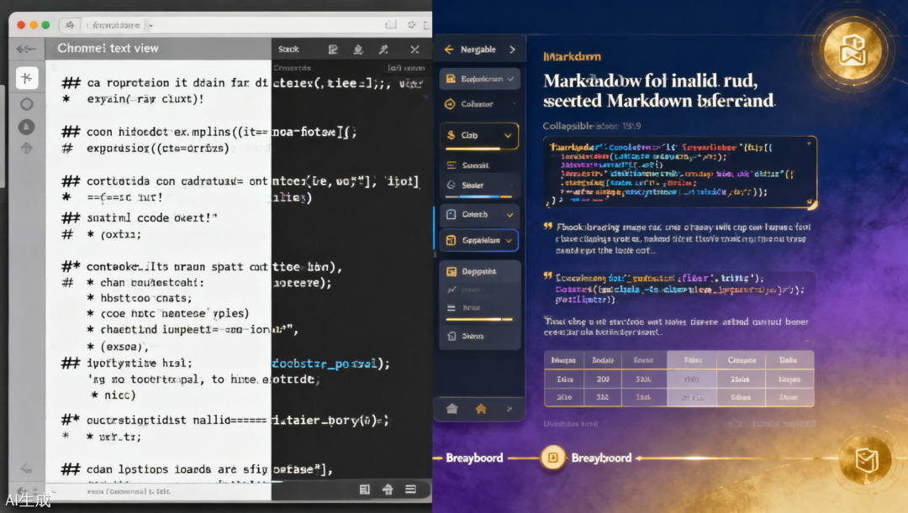
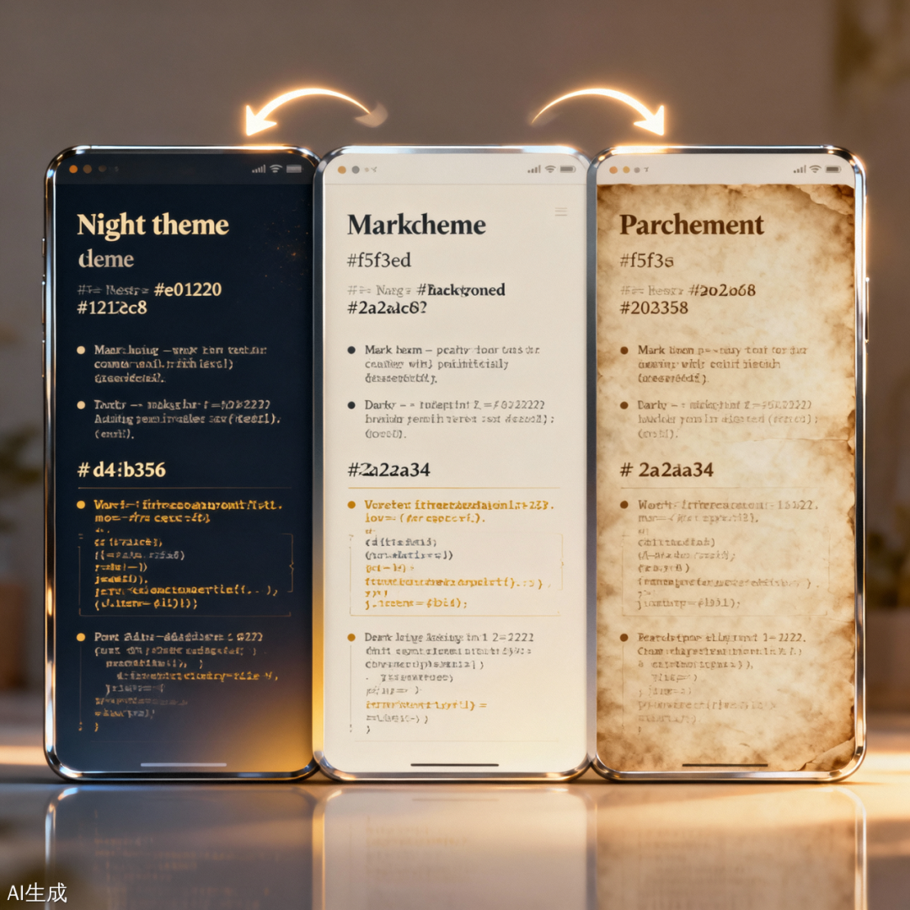
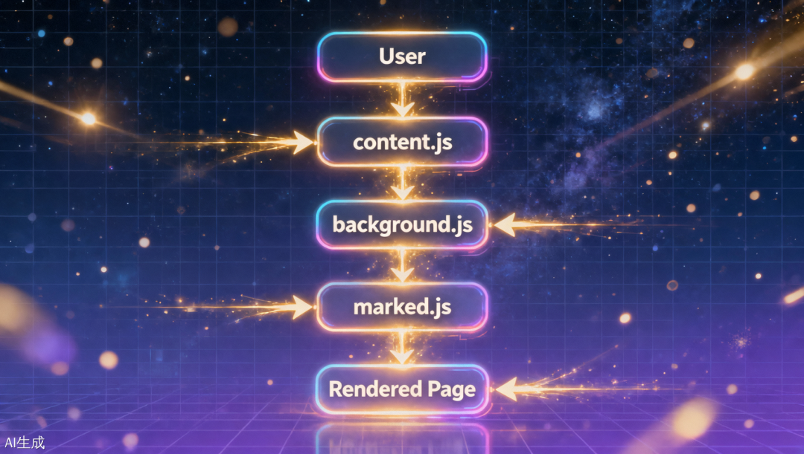

> 📎 来源: [武始舞终悟无极](https://mp.weixin.qq.com/s?__biz=MjM5NzEwNjkzMg==&mid=2448260614&idx=1&sn=02f4e3722288e8b9afe7611a14aadad7&chksm=b365cb3ec0b3900cee20bb792d5b2755e8ef67edaf89f9b5bbcaeb31711d2c410ac78674d15a&mpshare=1&scene=1&srcid=05222w9M3zL3h6DqY3MelInQ&sharer_shareinfo=89f4d775a2038b30151cc39c2bbe7e3e&sharer_shareinfo_first=89f4d775a2038b30151cc39c2bbe7e3e) | 时间: 2026-05-22 02:06

---

> 不到 1000 行代码，让本地 

> ```
> .md
> ```

>  文件在浏览器里拥有在线一样的阅读体验。**最好的工具，是让你忘记它存在的工具。**

---

## 开场痛点

你有没有这种经历：

- 用 Obsidian / VS Code 写好的 Markdown 笔记，想在浏览器里打开看看效果，结果 Chrome 弹出来的是满屏的 

  ```
  #
  ```

   号和 

  ```
  **
  ```

   加粗标记？
- **想分享给同事预览，对方却说「打不开，全是乱码」**
- **装过几个插件，要么要注册账号，要么配置复杂到劝退**

Chrome 默认把 

```
.md
```

 文件当纯文本处理。市面上有插件，但要么太重，要么装完还要配一堆设置。

花一个晚上，我造了一个——**打开即用，零配置**。一个晚上的产出，抵得上一周的配置时间。

---

## 效果展示

任意本地 

```
.md
```

 文件拖进浏览器，看到的是：

- ✅ **渲染后的排版**（标题层级、表格、代码高亮、引用块）
- ✅ **三档主题切换**（🌙 暗夜 / ☀️ 白昼 / 📜 羊皮卷），刷新不丢失
- ✅ **左侧常驻文件目录**（📂 按钮切换）
- ✅ **顶部面包屑导航**
- ✅ **浮动目录**
- ✅ **Wiki 风格内链**（

  ```
  [[概念页]]
  ```

  ）自动跳转



左：Chrome 原生显示的纯文本 Markdown | 右：插件渲染后的精美页面



三档主题平滑切换效果：暗夜 → 白昼 → 羊皮卷

---

## 架构设计

插件由三个核心文件驱动：

| 文件 | 职责 |
| --- | --- |
| ``` manifest.json ``` | Chrome 扩展声明，MV3 协议 |
| ``` content.js ``` | 页面注入、渲染、主题、交互 |
| ``` background.js ``` | Service worker，处理 file:// 目录请求和跨页导航 |
| ``` 404.html ```   +   ``` 404.js ``` | 兜底 404 页面 |

外加 

```
lib/marked.min.js
```

——GitHub 同款 GFM（GitHub Flavored Markdown）解析器，单文件零依赖。

### 工作流程时序图

```
sequenceDiagram    participant User as 用户    participant Content as content.js    participant BG as background.js    participant Marked as marked.js    User->>Content: 拖入 .md 文件    Note over Content: 拦截 Chrome 原生渲染    Content->>BG: 请求读取文件内容    Note over BG: 代理 fetch file:// 资源    BG-->>Content: 返回文件文本    Content->>Marked: 调用 parse() 解析    Marked-->>Content: 返回 HTML    Content->>User: 注入完整页面 DOM    Note over User: 渲染完成，主题/目录/导航就绪
```



插件工作流程：用户 → content.js → background.js → marked.js → 渲染完成

---

## 六个有意思的技术点

### 1. 主题系统靠 CSS 变量

不写多套 CSS，只声明一套变量，三个主题各定义一次值：

```
/* 默认主题 + 暗夜主题共用一套变量 */:root, [data-theme="night"] {  --bg: #121220;      /* 深邃夜空蓝 */  --text: #e0dcc8;    /* 暖米白 */  --gold: #d4b356;    /* 复古金 */  --accent: #8fa0d4;  /* 紫罗兰 */}/* 白昼主题覆盖变量值 */[data-theme="day"] {  --bg: #f5f3ed;      /* 羊皮纸白 */  --text: #2a2a34;    /* 深灰黑 */  --gold: #a8841e;    /* 琥珀金 */  --accent: #4a6098;  /* 深海蓝 */}
```

切换主题只改一行 

```
document.documentElement.dataset.theme
```

，所有元素自动跟随。主题记忆走 

```
localStorage
```

，打开新页不丢失。

**限制不是障碍，是创造力的催化剂。**

---

### 2. Content script 注入了整页 DOM

普通的 content script 是在已有页面上"打补丁"——插按钮、改颜色。但这个插件要做的更彻底：**把整个页面换成自己的 HTML**。

```
// 拦截 Chrome 原生文件渲染，用自己的 bodyHTML 替换document.body.innerHTML = bodyHTML;
```

```
bodyHTML
```

 是一个完整的页面模板字符串，包含顶栏、侧边栏、内容区、目录浮层、404 页。CSS 也以 

```

```
