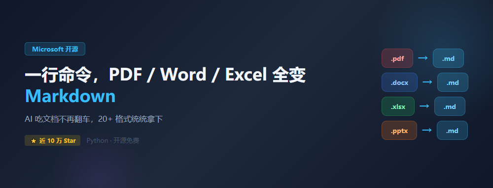
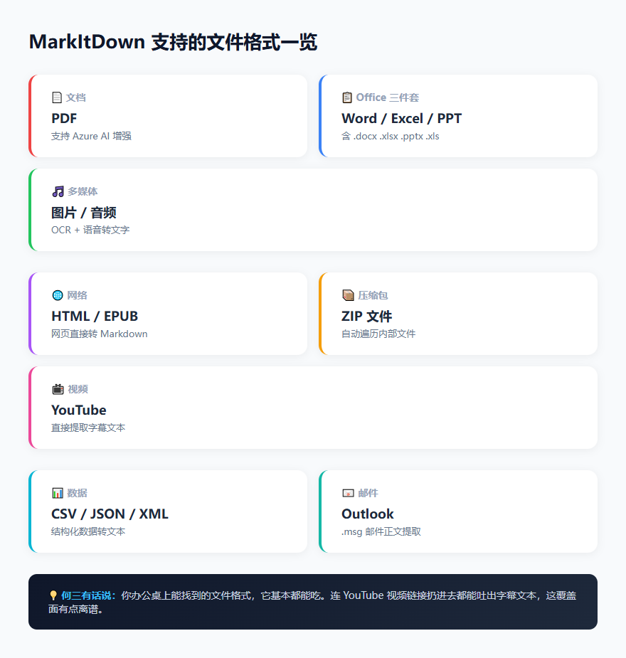
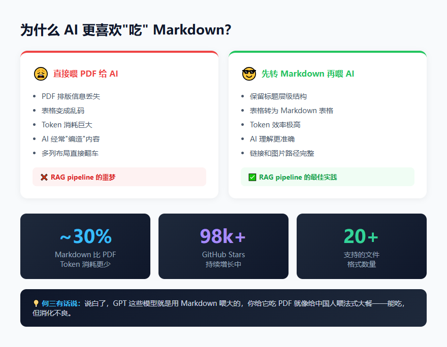

> 📎 来源: [何三笔记](https://mp.weixin.qq.com/s?__biz=MzA4NTI3OTcyMA==&mid=2649632238&idx=1&sn=7f7f06b2a76bb449e807635aa195a9e5&chksm=86e0e6ffe5f40d224315e5a9a7c11bbbc25df80cf136d40cea1b5cf1b3ab7a0c6b4494f9b0ff&mpshare=1&scene=1&srcid=0522sRTV2Z1Nkflwu6McLFnU&sharer_shareinfo=3f65698371d0b97009cc632874f38564&sharer_shareinfo_first=3f65698371d0b97009cc632874f38564) | 时间: 2026-05-22 02:08

---

大家好，我是何三，独立开发者

## 做过 RAG 的人都知道这个痛

如果你搭过 RAG（检索增强生成）系统，一定踩过同一个坑——把 PDF 丢给 AI，然后看着它一本正经地胡说八道。

这不是 AI 的问题，是"食物"的问题。PDF 里面充满了复杂的排版信息、嵌套表格、多列布局，LLM 吃下去以后跟人啃带骨头的鸡差不多，不是噎着就是吐骨头。Hacker News 上有个哥们说得更直白："PDF 是给人类看的，不是给机器读的。"

解决办法其实很简单：**先把文档转成 Markdown，再喂给 AI。**

道理谁都懂，但做起来嘛……PDF 转换 SDK 一大堆，每个配置都不一样，Office 文件又得用另一套库，表格、图片、音频、视频全要处理——光是写这个预处理 pipeline 就能搞一整天。

微软的 AutoGen 团队估计也受够了这个事，直接搞了个开源工具，**一行命令搞定所有格式的转换**。

它叫 MarkItDown，GitHub 上已经快 10 万 Star 了。



cover

## 一行命令能干嘛？

先看支持的格式清单：



formats

PDF、Word、Excel、PPT 这"Office 四大天王"是基本盘。除此之外，图片（OCR 识别）、音频（语音转文字）、HTML 网页、EPUB 电子书、CSV/JSON/XML 数据文件，甚至 ZIP 压缩包和 YouTube 视频链接——全都能一键转成 Markdown。

你没看错，把一个 YouTube 视频链接扔进去，它能把字幕文本给你扒出来。这个覆盖面说实话有点离谱。

核心用法就一条命令：

```
markitdown path-to-file.pdf > document.md
```

或者指定输出文件：

```
markitdown path-to-file.pdf -o document.md
```

还能通过管道直接喂内容：

```
cat path-to-file.pdf | markitdown
```

就这么简单。不需要配置文件，不需要各种 SDK，装好就能用。

## 为什么 AI 更喜欢 Markdown？

这里有个很多人忽略的事实：**主流 LLM 几乎都是用海量的 Markdown 文本训练出来的。** GPT-4o 经常在你没要求的情况下就主动用 Markdown 格式回复，这不是巧合——它"母语"就是这个。



comparison

跟 PDF 比起来，Markdown 有几个天然优势：

- **Token 效率高**。没有乱七八糟的排版标记，纯粹的结构化文本，同样的内容消耗的 Token 大概能省 30% 左右。
- **结构清晰**。标题层级、列表、表格、链接这些信息在 Markdown 里有明确标记，AI 读起来就是"一目了然"，而不是在一堆乱码里猜。
- **幻觉更少**。信息越干净，AI 编造就越少。这是做 RAG 的人用血泪换出来的经验。

说白了，GPT 这些模型就是用 Markdown 喂大的，你给它吃 PDF 就像给中国人喂法式大餐——能吃，但消化不良。

## 上手试试

### 安装

MarkItDown 是个 Python 包，安装很简单：

```
pip install 'markitdown[all]'
```

```
[all]
```

 会把所有格式的依赖都装上。如果你只需要处理特定格式，可以按需安装：

```
pip install 'markitdown[pdf, docx, xlsx]'
```

只需要 PDF、Word 和 Excel 的话，这样装就够了，省空间。

### Python API 用法

除了命令行，在代码里调用也很方便：

```
from markitdown import MarkItDownmd = MarkItDown()result = md.convert("report.pdf")print(result.text_content)
```

转换 Excel 表格：

```
from markitdown import MarkItDownmd = MarkItDown()result = md.convert("financial_data.xlsx")print(result.text_content)
```

### 用 AI 增强图片描述

MarkItDown 还支持调用 LLM 来生成图片的描述文本。比如转换 PPT 的时候，里面嵌入的图片不是简单跳过，而是让 AI 帮你写一段文字描述：

```
from markitdown import MarkItDownfrom openai import OpenAIclient = OpenAI()md = MarkItDown(    llm_client=client,    llm_model="gpt-4o")result = md.convert("presentation.pptx")print(result.text_content)
```

这个设计挺聪明的。PPT 里面大量信息是靠图片和图表传达的，纯文本转换会丢失这些信息，用 Vision 模型补充描述，内容完整度一下子就上去了。

### Azure Document Intelligence 增强

如果你有 Azure 账号，可以用 Document Intelligence 服务来获得更好的 PDF 转换效果，尤其是处理扫描件和复杂排版的 PDF：

```
markitdown path-to-file.pdf -o document.md -d -e ""
```

这个是付费服务，但对商业级文档处理确实提升明显。

### Docker 部署

不想装 Python 环境？直接用 Docker：

```
docker build -t markitdown:latest .docker run --rm -i markitdown:latest < ~/your-file.pdf > output.md
```

### MCP Server 集成

最近 MarkItDown 还加了 MCP（Model Context Protocol）支持。这意味着你可以在 Claude Desktop 这类 AI 应用里直接调用它，让 AI 帮你处理文档转换的事：

```
# 安装 MCP 包pip install markitdown-mcp
```

然后在 Claude Desktop 的配置里加上对应的 MCP server 配置就行。Reddit 上已经有不少人在折腾这个集成了，虽然配置过程偶尔有点坑，但一旦跑通体验还是不错的。

## 插件系统

MarkItDown 还有个插件机制，第三方可以扩展它的能力。

比如 

```
markitdown-ocr
```

 插件，能对 PDF、DOCX、PPTX、XLSX 里面嵌入的图片做 OCR 识别：

```
pip install markitdown-ocrpip install openai
```

```
from markitdown import MarkItDownfrom openai import OpenAImd = MarkItDown(    enable_plugins=True,    llm_client=OpenAI(),    llm_model="gpt-4o",)result = md.convert("document_with_images.pdf")print(result.text_content)
```

插件默认是关闭的，需要手动启用。想看装了哪些插件：

```
markitdown --list-plugins
```

## 谁适合用这个？

老实说，MarkItDown 的目标受众很明确：

- **做 RAG 的开发者**——这是最核心的使用场景。文档预处理是 RAG pipeline 的第一关，MarkItDown 直接帮你把这个最烦人的环节一条龙解决了。
- **需要批量处理文档的团队**——比如把历史积累的大量 Word/PPT 归档转成 Markdown，方便搜索和检索。
- **给 AI 喂资料的研究人员**——与其手动复制粘贴，不如直接转换后整个丢给 AI。
- **内容创作者**——把 PDF/Word 转成 Markdown 后，在任何支持 Markdown 的编辑器里都能愉快编辑。

## 一句话总结

**MarkItDown 就是文档到 AI 之间的"翻译官"**——你丢什么文件进去，它都能吐出干净的 Markdown，让 AI 准确理解你的文档内容。近 10 万 Star 不是白拿的，微软这次确实干了个实用活。

安装只需一行 

```
pip install 'markitdown[all]'
```

，下次再给 AI 喂文档的时候，记得先让它过一遍 MarkItDown。

关注公众号“何三笔记” 回复 “python” 获取python“不传秘籍”

*本文使用 MGO 编辑并发布*

> 关注"何三笔记"，回复"mgo" 免费下载使用
