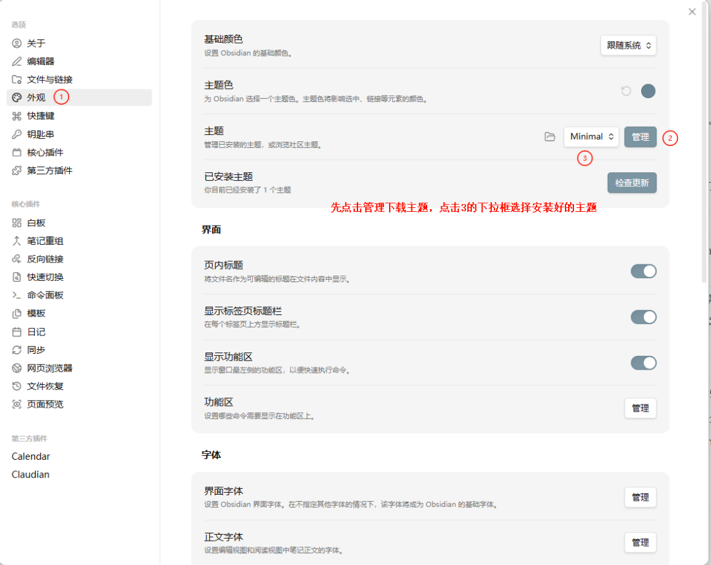
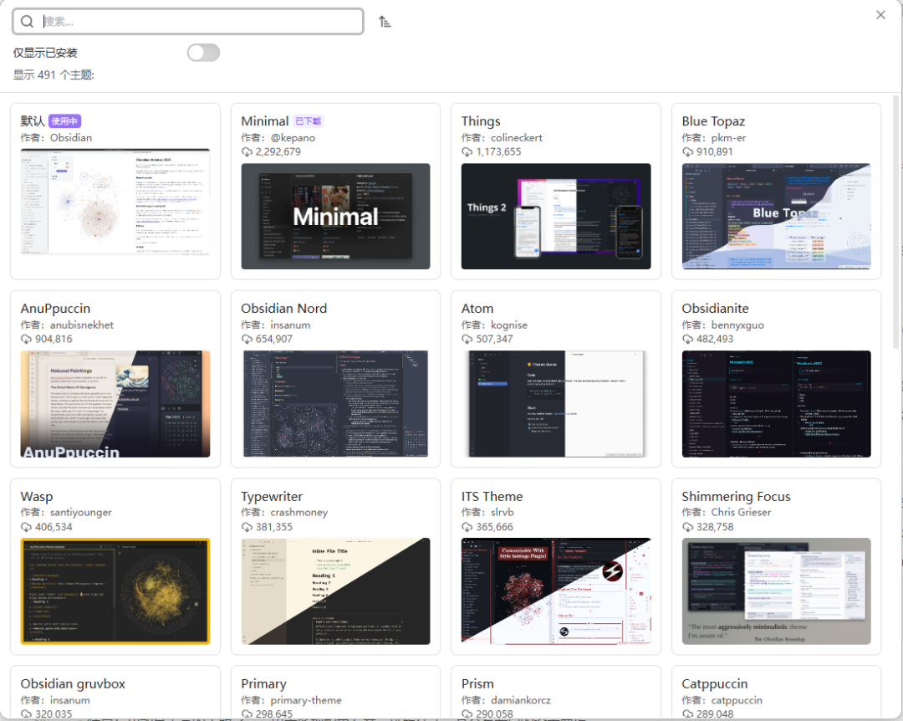
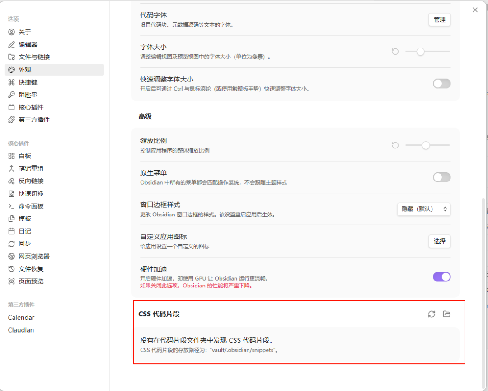
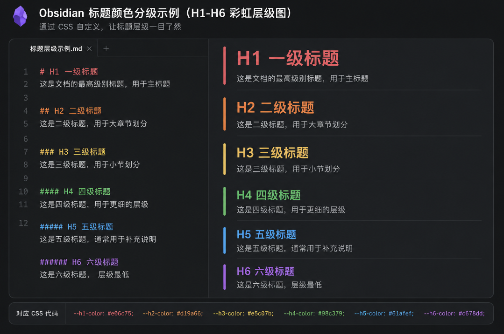
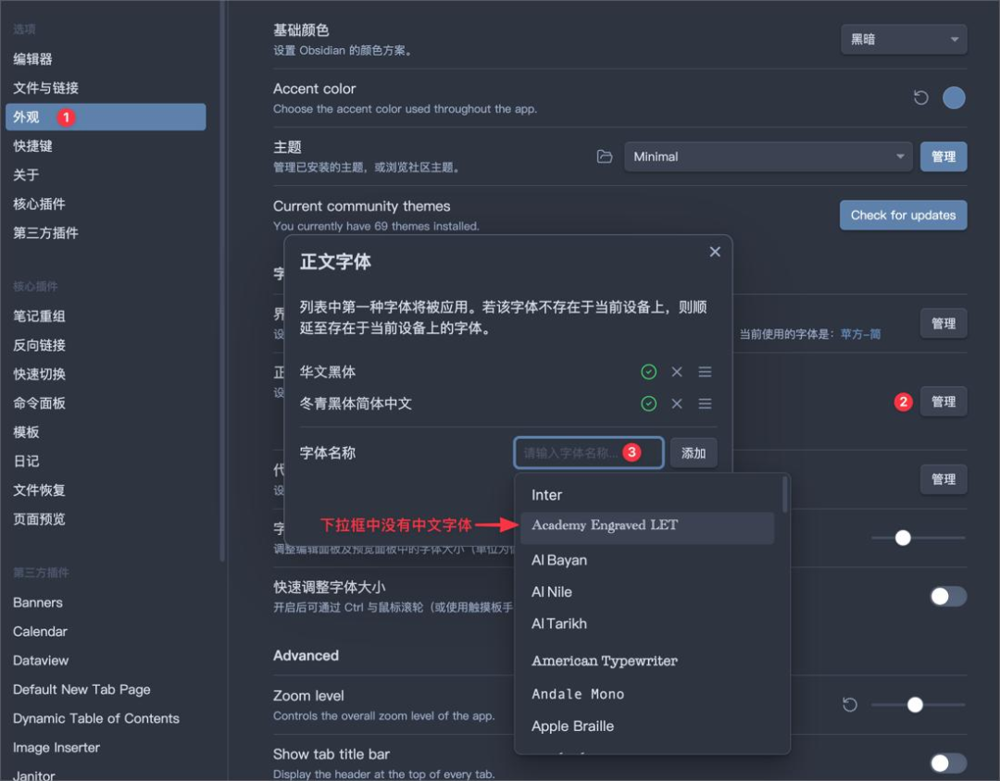

> 📎 来源: [胡巍&amp;互为螺旋](https://mp.weixin.qq.com/s?__biz=MzU2NzgzMzYwNQ==&mid=2247499382&idx=1&sn=7d2cd624e690fc046c9797fd7f2b5c6b&chksm=fd1c3a08ca84b046b6ae1d0da27eb6b65b13f04d9f85a3a560a8dc6063cdca3a4b2eeaeac790&mpshare=1&scene=1&srcid=0524ObkKqWdK8BCc4JSqN72T&sharer_shareinfo=5ba6f44f53cd468102589d1697356755&sharer_shareinfo_first=5ba6f44f53cd468102589d1697356755) | 时间: 2026-05-24 11:56

---

# 20 分钟，让你的 Obsidian 从”能用”变成”想用”

你每天要在 Obsidian 里待多久？一小时？三小时？还是几乎一整天？

如果你要和一个工具朝夕相处，那它的长相就很重要了。不是说"好看就行"，而是——赏心悦目的界面会让你更愿意打开它，更愿意在里面写东西。这跟买一把舒服的椅子是一个道理：工具的体验，直接决定你用它的频率。

Obsidian 默认的界面属于"够用"级别。不丑，但也没什么辨识度。好消息是，Obsidian 的可定制性极强——从主题、字体到 CSS 细节，几乎你能看到的每一个像素都可以改。

今天这篇，我们就把 Obsidian 从"能用"变成"想用"。

---

## 一、官方主题切换：别急着装社区主题

很多新用户一上来就直奔社区主题，其实 Obsidian 内置的主题已经做了不错的优化。

**切换路径：** 设置 → 外观

你会看到两个选项：

- **浅色主题（Light）**：默认的浅色方案，适合白天使用
- **深色主题（Dark）**：深色背景，适合夜间或暗光环境

**跟随系统自动切换：** 在"外观"设置里，你可以选择让 Obsidian 跟随系统的深浅色模式。macOS 和 Windows 10/11 都支持定时切换深浅色，搭配这个选项，白天浅色、晚上深色，全自动。



别小看内置主题。如果你只是想要一个干净的工作环境，默认深色主题配上合适字体，已经能提供非常舒服的阅读体验。

---

## 二、社区主题安装：5 个值得一试的主题

内置主题不够？社区有上百个主题可选。

**安装方法：**

1. 1. 打开 设置 → 外观
2. 2. 点击「管理」按钮（在"主题"一栏旁边）
3. 3. 浏览或搜索社区主题
4. 4. 点击「安装并使用」



**切换已安装的主题：** 设置 → 外观 → 主题下拉菜单，选择已安装的主题即可。

**5 个推荐主题：**

**1. Minimal**

- 特点：极简主义设计，留白充足，信息密度低，阅读体验极佳
- 适合人群：喜欢干净界面、专注写作的用户；也是社区最受欢迎的主题
- 额外福利：搭配 Minimal Theme Settings 插件，可以细粒度调整配色、字体大小等

**2. Blue Topaz**

- 特点：功能最丰富的主题之一，内置多种配色方案、排版样式，甚至有专门的设置面板
- 适合人群：喜欢折腾、想要"一站式"美化方案的用户
- 注意：安装后记得看一下它的设置面板，选项非常多

**3. Prism**

- 特点：主打色彩方案，内置大量预设配色，可以快速切换不同视觉风格
- 适合人群：喜欢换颜色换心情的用户，或者对不同颜色有敏感度的设计师

**4. Things**

- 特点：灵感来自 Things 3（知名 GTD 应用），界面简洁优雅，层次分明
- 适合人群：喜欢 Apple 设计语言、追求"好看但不花哨"的用户

**5. Sanctum**

- 特点：暗黑哥特风格，深沉的配色，独特的排版细节，有一种"古老图书馆"的感觉
- 适合人群：夜猫子、喜欢暗色调、写作型用户

---

## 三、CSS Snippets：不写代码也能自定义样式

社区主题覆盖了大方向，但你可能还想要一些细节调整。比如"标题能不能换个颜色？""笔记能不能窄一点？"

这就是 CSS Snippets 登场的时刻。

**什么是 CSS Snippets？**

简单说，就是一段 CSS 代码，保存为一个 

```
.css
```

 文件，放到 Obsidian 的 snippets 文件夹里。然后在设置里开启对应的开关，样式就生效了。不需要懂 CSS 原理，大部分时候复制粘贴现成 snippet 即可。

**开启方法：**

1. 1. 设置 → 外观 → 滑到底部找到「CSS 代码片段」
2. 2. 点击文件夹图标，打开 snippets 文件夹
3. 3. 把 

   ```
   .css
   ```

    文件放进去
4. 4. 回到设置页面，点击刷新按钮

   

**snippets 文件夹位置：**

snippets 文件夹位于你的 Vault 内：

- Windows：

  ```
  你的仓库路径\.obsidian\snippets\
  ```
- macOS：

  ```
  你的仓库路径/.obsidian/snippets/
  ```

最简单的方法：
直接在「设置 → 外观 → CSS Snippets」里点击文件夹图标打开。

### 5 个常用 CSS Snippet

**① 隐藏顶栏工具栏**

让编辑区更沉浸，鼠标移上去才显示工具栏。

```
/* 隐藏顶栏，hover 显示 */.workspace-tabs .workspace-tab-header-container {  opacity: 0;  transition: opacity 0.2s ease;}.workspace-tabs:hover .workspace-tab-header-container {  opacity: 1;}
```

不同主题的类名可能略有不同，
如果 snippet 无效，可以查看主题文档或社区版本。

**② 笔记宽度限制**

默认笔记会撑满整个编辑区，宽屏下阅读体验不好。限制到 800px，像读一本书。

```
/* 限制笔记阅读宽度 */.markdown-source-view.mod-cm6 .cm-content,.markdown-reading-view {  max-width: 800px;  margin: 0 auto;}
```

**③ 标题颜色分级**

****

让 H1 到 H6 各有不同颜色，一眼看出层级。

```
/* 标题颜色分级 */body {  --h1-color: #e06c75;  --h2-color: #d19a66;  --h3-color: #e5c07b;  --h4-color: #98c379;  --h5-color: #61afef;  --h6-color: #c678dd;}
```

**④ 高亮文本样式美化**

让 

```
==高亮==
```

 的样式更好看，带圆角和柔和颜色。

```
/* 高亮文本美化 */.markdown-source-view.mod-cm6 .cm-highlight,.markdown-reading-view mark {  background-color: rgba(255, 208, 0, 0.3);  border-radius: 3px;  padding: 1px 4px;}
```

**⑤ 深色模式下图片亮度调整**

深色模式下图片可能太刺眼，稍微降低亮度让整体更协调。

```
/* 深色模式图片降亮度 */.theme-dark img {  opacity: 0.85;  transition: opacity 0.3s ease;}.theme-dark img:hover {  opacity: 1;}
```

每个 snippet 保存为单独的 

```
.css
```

 文件（比如 

```
hide-toolbar.css
```

、

```
note-width.css
```

），放到 snippets 文件夹，然后在设置里开启。不想要了？关掉开关就行，不用删文件。

---

## 四、字体配置：提升阅读体验的最小成本

字体对阅读体验的影响，比主题还大。一个合适的字体，能让你的 Obsidian 从"别人的软件"变成"你自己的笔记本"。

**配置路径：** 设置 → 外观 → 字体

你会看到三个字体设置项：

- **界面字体**：侧边栏、菜单等界面文字
- **正文编辑字体**：编辑区和阅读区的笔记内容
- **等宽字体**：代码块和行内代码

**推荐字体组合：**

**正文：霞鹜文楷（LXGW WenKai）**

- 开源免费，中文显示效果极佳
- 有一种手写质感，但不会太潦草，长时间阅读不累
- 下载地址：GitHub 搜索"LXGW WenKai"，选 Releases 下载 

  ```
  .ttf
  ```

   或 

  ```
  .otf
  ```

**等宽：JetBrains Mono 或 Fira Code**

- JetBrains Mono：JetBrains 出品，字间距舒适，连字支持好
- Fira Code：经典编程字体，连字效果出色
- 两个都是免费字体，Google Fonts 可以下载

**字体安装方法：**

- **Windows**：下载 

  ```
  .ttf
  ```

   文件 → 右键 → 安装（或双击打开后点安装）
- **macOS**：下载 

  ```
  .ttf
  ```

   或 

  ```
  .otf
  ```

   文件 → 双击 → 在"字体册"中点击"安装字体"

安装完成后，在 Obsidian 的字体设置里填入字体名称即可。比如正文填 

```
LXGW WenKai
```

，等宽填 

```
JetBrains Mono
```

。



---

## 五、界面布局优化：打造你的工作台

Obsidian 的界面由几个核心面板组成：左侧边栏、编辑区、右侧边栏、底栏。合理的布局能大幅提升效率。

**推荐布局：**

- **左侧栏**：文件列表（核心），搜索（偶尔用），标签面板（按需）
- **中间**：主编辑区
- **右侧栏**：反向链接（核心），大纲（按需），日记（按需），插件侧边栏

**布局调整技巧：**

**隐藏不需要的面板：** 每个面板右上角都有个 X，直接关掉。侧边栏需要手动设置快捷键来切换：设置 → 快捷键，搜索"折疊/展开左侧边栏(Toggle left sidebar)"和"折疊/展开左侧边栏(Toggle right sidebar)"，分别绑定你喜欢的快捷键（推荐 

```
Ctrl/Cmd + Shift + 1
```

 和 

```
Ctrl/Cmd + Shift + 2
```

）。

**标签页管理：** Obsidian 支持标签页拖拽。你可以把一个标签拖到编辑区的左半边或右半边，实现分屏。垂直方向也能分屏。按住 

```
Alt/Option
```

 点击链接，会在新分屏中打开。

**状态栏定制：** 底部状态栏显示字数、光标位置等信息。如果装了某些插件，状态栏可能会变得很拥挤。可以在插件设置里关闭不需要的状态栏信息。

---

## 六、图标与美化插件

### Icon Folder

给文件夹和笔记加图标，让文件列表不再是清一色的文字。

**安装：** 设置 → 第三方插件 → 浏览 → 搜索"Icon Folder" → 安装并启用

**使用方法：**

1. 1. 在文件列表中右键点击文件夹或笔记
2. 2. 选择「Change icon」
3. 3. 从图标库中选择一个图标

它内置了 Lucide 图标库（几百个图标），也支持自定义 emoji。你可以给不同类型的文件夹设置不同图标——比如 📚 给读书笔记、💡 给灵感笔记、🏠 给生活记录。

### Homepage 插件

设置一个笔记作为 Obsidian 的启动页。每次打开 Obsidian，自动显示这个笔记。

**安装：** 设置 → 第三方插件 → 浏览 → 搜索"Homepage" → 安装并启用

**使用方法：**

1. 1. 创建一个笔记作为首页（比如 

   ```
   00-首页.md
   ```

   ）
2. 2. 在 Homepage 插件设置里指定这个笔记
3. 3. 可以设置首页显示在工作区的指定位置

首页里放什么？可以放你的每日日记链接、最近在做的项目、常用笔记的快捷入口。相当于你自己的"仪表盘"。

---

## 七、一个小提醒

美化是锦上添花，不是主菜。

我见过太多人花了两天时间调 CSS、换主题、改字体，然后发现自己还是没写几篇笔记。

**正确的顺序是：**

1. 1. 先把内容工作流跑起来——能记笔记、能检索、能关联
2. 2. 等你用了一两周，发现"这个颜色真不顺眼""笔记太宽了读着累"
3. 3. 再回来针对性地优化

**推荐的"20 分钟方案"：**

- 选一个社区主题（Minimal 或 Things，闭眼选都不会错）
- 加 2-3 个 CSS Snippet（笔记宽度限制 + 标题颜色分级 + 高亮美化）
- 换一个正文字体（LXGW WenKai）
- 完成

这一套下来，你的 Obsidian 已经比 90% 的用户好看了。剩下的细节，等你有感觉了再调。

---

## 💬 互动话题

**晒图时间！** 你的 Obsidian 长什么样？截图发到评论区，点赞最高的下期我帮你分析配色方案。

还没调的？选 Minimal 主题 + LXGW WenKai 字体，如果只是切换主题和字体，10 分钟内基本就能完成，回来交作业。

---

**下一篇：知识图谱思维——Zettelkasten、原子笔记和 MOC，让你的知识从线性变成网状。**

> Tip

> 我整理了一份Obsidian安装包和常用插件(持续更新)。
> 需要的可以：
> 👉 点个赞 + 在看
> 👉 后台回复：Obsidian
> 我把整套直接发你。
