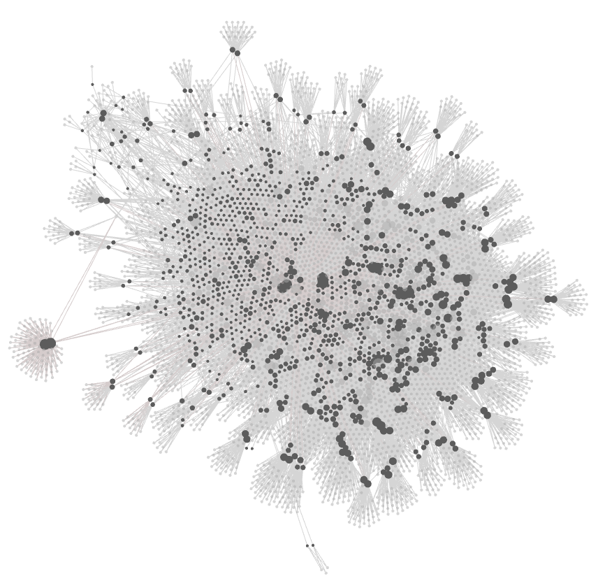
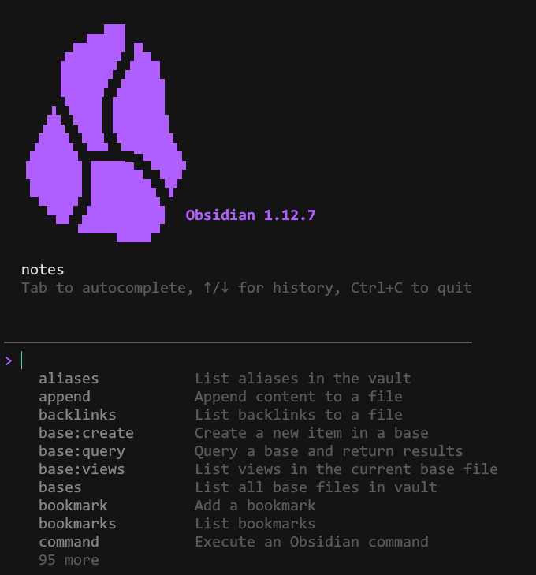

> 📎 来源: [ferlich](https://mp.weixin.qq.com/s?__biz=MzYyNTQ0MTgwMQ==&mid=2247484219&idx=1&sn=eb378ad0a10afdf35f3310ccb8fb034e&chksm=f1c050ed97777e71b6d84b72590a0d802f163df2b04a42ad04f7b79c98b7eca051d9dc95bb02&mpshare=1&scene=1&srcid=05153hUVZCc2cGidsq58pF8Z&sharer_shareinfo=8b7b7620e70ada06999e9ba17817ff33&sharer_shareinfo_first=8b7b7620e70ada06999e9ba17817ff33) | 时间: 2026-05-15 03:48

---

最近有个话题特别火。

特斯拉的前AI总监，OpenAI的创始成员，一个叫Karpathy的大神，在社交平台上分享了自己搭建个人知识库的方法。

这条动态一发出来，直接爆了。

两天时间，一千八百万人看过。评论区里挤满了各路高手。

Obsidian的创始人去了。Lex Fridman去了。各种各样的开发者都在下面讨论。

很快，这股风就吹到了国内。

公众号、小红书、视频号，到处都是相关教程。大家都在教你如何搭建“Karpathy式知识库”。

满屏都是Obsidian的关系图谱截图。看起来每个人都突然有了一个“第二大脑”。

很多人跟着做，很多人也在问。

到底该怎么搭？搭完之后，然后呢？

今天这篇文章，我想从两个层面来聊聊这件事。

**第一层，是工具层面**。我会带你走一遍整个搭建流程。从三个文件夹开始，到自动化工作流结束。

**第二层，是思维层面**。我想说说很多人忽略的东西。为什么大多数模仿者只学到了皮毛？怎么让知识库真正为你所用？

两部分加起来，大概五千字。你可以按需阅读。

先点一下关注吧！

准备好了吗？我们开始。

---

## Part 1：搭建指南篇

### 1. 为什么这套方法能火？

要理解一件事为什么火，得先看看它解决了什么问题。

在Karpathy分享这套方法之前，大家用AI处理知识，主流方式是RAG。

简单说，就是你上传文件，AI帮你分析、总结。聊得挺好。

但有个致命问题：对话一关，一切归零。

下次你再问同样的问题，AI又得从头开始分析。它不记得上次聊过什么，也不记得你上传过什么文件。

你以为你在积累知识？其实你只是在重复消费。

Karpathy的方法，核心是换了个思路。

他不让AI每次从零开始。他让AI维护一个持续生长的Wiki。

这个Wiki就像代码库。AI是程序员，你是产品经理。

程序员写好的代码，提交到仓库，下次直接调。知识也应该这样：编译一次，持续维护，不断复利。

具体怎么实现呢？三层结构。

最底层叫raw。你读过的文章、论文、截图，原封不动扔进去。AI只读不改。

中间层叫wiki。AI自动生成的Markdown文件。每个概念、每个人物、每个工具，都有独立页面。页面之间互相链接。

最上层叫schema。一个纯文本文件，告诉AI这个知识库的规则是什么。

你负责喂素材、定方向、提问题。AI负责总结、链接、归档、检查。

分工明确，效率翻倍。

很多人以前犯的错误是：什么都想记，然后什么都不整理。现在有了AI，很多人犯的错误是：什么都让AI记，然后什么都不思考。

这套方法，试图解决的就是这个问题。

### 2. 核心：三层架构

三层架构听起来复杂，其实很简单。

想象一下图书馆。

raw文件夹就是图书馆的入库区。新书来了，先放这里。杂乱无章，没关系。

wiki文件夹就是图书馆的阅览区。AI把书整理好，分门别类放上书架。每本书都有摘要，相关书籍之间还有指引。

schema文件就是图书馆的管理手册。告诉AI怎么编目、怎么分类、怎么建立索引。

AI在这个系统里干三件事。

第一件，消化。新文章来了，AI读一遍，提取关键信息。更新相关页面，建立交叉引用。

第二件，查询。你提问，AI在wiki里搜索。综合出一个带引用的答案。好的答案直接写回wiki。

第三件，检查。定期扫描，找矛盾、找孤立页面、找过期内容。

这三件事，以前每件都要人来做。枯燥，繁琐，没人坚持得住。

现在全扔给AI，完美。

这里面最关键的是schema文件，也就是通常说的CLAUDE.md。

Karpathy自己说，他的schema“超级简单”。没有数据库，没有插件，没有第三方依赖。

一个纯文本文件，加上几条清晰的规则，够了。

说句实在话，schema写得好不好，比你选什么工具重要十倍。

规则清晰，AI才懂你要什么。规则混乱，再好的工具也白搭。

### 3. 动手：从零搭建

好，理论讲完了。现在开始动手。 建一个文件夹叫做“my-knowledge-base”（起啥名都可以） 然后在这个文件夹中再建三个文件夹，分别叫做raw，wiki和outputs。

三个文件夹，就是整个系统的骨架。

raw放原始素材。什么格式都行，乱一点没关系。

wiki是AI的产出区。你别动这里的文件。

outputs存AI生成的报告、分析、总结。

Karpathy自己就用这么简单的结构。没有嵌套五六层的目录，没有复杂的标签系统，扁平到不能再扁平。

很多人卡在这一步。

建好文件夹，盯着空荡荡的raw，不知道该放什么。开始纠结要不要先分类，要不要统一命名。

这个想法多余。

你手边有什么就放什么。浏览器里囤了半年的书签，直接导出。微信收藏的文章，复制出来存成txt。开会记的笔记、下载的PDF、截图、思维导图，全部塞进去。

格式乱没关系，文件名随意也没关系。整理是AI的事，你不用操心。

我自己第一次往里扔，十几个个文件，markdown、纯文本、截图混在一起，乱成一锅粥。完全不影响后面AI的处理。

接下来，在项目根目录新建一个文本文件。

文件名可以叫CLAUDE.md，也可以叫AGENTS.md，或者README.md。这个文件是给AI的工作手册。

它要告诉AI几件事。

第一，这个知识库是干什么的。主题是什么，关注哪些方向。

第二，目录结构是什么样的。哪个文件夹放什么，不能动什么。

第三，整理的规则是什么。文件怎么命名，摘要怎么写，怎么建立链接。

第四，操作流程是什么。新素材来了怎么处理，提问怎么回答，怎么定期检查。

你可以从简单的模板开始。

比如这样：

```
# 我的知识库## 主题[这里写你的主题，比如“AI应用开发”]## 目录说明raw文件夹：原始素材，AI只读不改wiki文件夹：整理后的内容，AI全权维护outputs文件夹：AI生成的报告和分析## 整理规则每个重要话题单独建一个md文件文件开头写一段100字左右的摘要用[[话题名]]的格式建立页面之间的链接维护一个INDEX.md文件作为总目录新素材来了要更新相关的wiki页面## 我关注的方向1. [方向一]2. [方向二]3. [方向三]
```

这个模板很简单，但够用。

如果你想用更详细的版本，这里还有一个完整模板：

```
# LLM 知识库 - Schema## 概述个人知识库，主题是 [你的主题]。原始材料在 raw/，编译过的 wiki 在 wiki/。你（AI）维护所有 wiki 内容。我定方向，你执行编译、维护、查询。## 目录结构- raw/ - 原始材料（你只读，我负责往这里加文件）- wiki/index.md - 总索引- wiki/log.md - 操作日志（追加式）- wiki/concepts/ - 一个概念一个文件- wiki/entities/ - 人物、组织、工具- wiki/sources/ - 每篇原始材料一个摘要- wiki/outputs/ - 我提问题的答案## 文件规范- 文件名：kebab-case 小写（active-inference.md）- 源摘要命名：{作者}-{年份}-{短标题}.md- 每个页面顶部必须有 YAML frontmatter：---  title: "页面标题"  date_created: YYYY-MM-DD  date_modified: YYYY-MM-DD  summary: "一两句话说明"  tags: [主题, 领域]  type: concept | entity | source | output---- 内部交叉引用全部用 [[双链]]## 操作### INGEST 摄入（我加了新原始材料）1. 读新材料2. 在 wiki/sources/ 写摘要3. 找出概念和实体，没有的页面就新建4. 已有页面用追加更新（不要重写）5. 用 [[双链]] 把新内容连到现有页面6. 更新 wiki/index.md7. 追加到 wiki/log.md### QUERY 查询（我提问）1. 读 wiki/index.md2. 读相关 wiki 页面3. 综合一个带引用的答案4. 存到 wiki/outputs/{问题slug}.md5. 更新 index.md 和 log.md### LINT 巡检（定期健康检查）1. 找页面之间的矛盾2. 找孤儿页面（没有任何入链）3. 找坏链4. 找缺失的 frontmatter5. 标出过期内容6. 给被频繁引用但还没有自己的页面的概念建议7. 输出报告，能自动修的就修## 建页面阈值- 一个概念在 2 篇及以上原始材料里出现 → 建完整页- 只在一处出现 → 建 stub（frontmatter + 一句定义 + 链回原始材料）- 永远不要让 [[双链]] 指向不存在的页面## 质量标准- 摘要：200-500 字，要合成不要照抄- 所有论断要追溯到具体源页面- 矛盾用 ⚠️ 标出，两边立场都写- 来源冲突时优先采用更新的
```

这个文件保持简洁。每一行都在吃你的上下文窗口。忍住过度规范化的冲动，上面这版刻意控制在 80 行以下。

如果你想更详细，可以加上文件命名规范、frontmatter格式、操作步骤等等。

但记住一点：简洁为王。

每一行都在消耗你的上下文窗口。规则越复杂，AI理解越吃力，执行越容易出错。

控制在八十行以内，最好。

素材有了，规则定了，现在让AI开始工作。

打开你用的AI工具。Claude Code、codex、opencode都行，只要能访问本地文件系统。

进入项目目录，给AI下指令。

我通常这么说：“请扫描raw文件夹里的所有文件，按照CLAUDE.md里的规则，在wiki文件夹里生成知识库。每个核心话题建一个独立文件，文件之间用双链关联，最后生成一个INDEX.md作为导航。”

然后你就可以走开了。

等AI跑完，打开wiki文件夹看看。

你会看到一批整理好的文件。每篇开头有摘要，文章之间有链接。有些你自己都没注意到的关联，AI帮你找出来了。

这里有个重点：wiki里的内容，从此以后全由AI维护。

你的角色是读者和提问者，不是编辑者。

手动改wiki文件，反而会打乱AI的整理逻辑。它不知道你改了什么，下次更新可能覆盖你的修改。

最后一步，可视化。

用Obsidian打开你的vault，按Ctrl+G(MacOs: Cmd+G)打开图谱视图。

所有笔记变成一张网络。点是页面，线是链接。



这是我创建的关于计算化学的wiki

点任何一个[[概念]]，如果页面存在就跳过去，如果不存在Obsidian会问你要不要新建。

wiki就这样有机生长。

到这一步，你已经有一个能跑的知识库了。后面所有的操作，都是让它长得更好。

### 4. 进阶工具：Obsidian技能生态

基本的搭建流程说完了。现在聊聊进阶的部分。

如果你用Claude Code，有个很强大的东西叫Obsidian Skills。这是一套专门为Obsidian设计的插件集。其github网址为：https://github.com/kepano/obsidian-skills

有了这些技能，Claude Code能直接操作你的Obsidian vault，完成各种复杂任务。

常用的Obsidian Skills有几个。

**defuddle**：网页抓取工具。它有个好处，能自动去掉网页上的导航栏、广告、侧边栏这些杂七杂八的东西，只留下正文内容，输出成干净的Markdown。跟直接用WebFetch抓比，token消耗能省不少，还能获取原文内容。

**obsidian-cli**：CLI界面（Command line interface，命令行界面）, 命令行操作工具。这使得Claude Code能够直连obsidian，不用打开Obsidian界面。打开方式为：点击 设置--> 高级，命令行界面 即可。然后打开终端，输入obisidian，看到如下的界面即表明成功开通了。

|  |  |
| --- | --- |
|  |  |

**obsidian-markdown**：Markdown语法工具。处理各种Markdown格式问题。

**obsidian-bases**：数据库视图工具。这个很厉害，它能把你vault里的所有Markdown文件当作数据库来查询和展示。

**json-canvas**：画布文件工具。处理Obsidian的canvas文件。

这些技能组合起来，能覆盖内容管理的全部环节。

比如你可以用defuddle抓网页存到raw，用obsidian-bases建数据库视图管理所有文章，用json-canvas维护选题规划canvas。

如果你用Claude Code写了文章，或者产生任何文字材料，都可以让Claude Code将其保存到obsidian里面。

---

## Part 2：深度思考篇

好了，关于“器”的部分，我们聊得差不多了。

接下来，我想谈谈“道”。这部分内容，往往是那些热衷于展示技巧的教程里所缺失的。

最近我密集地观察了许多实践案例，一个清晰的感受浮出水面：不少人的方向，似乎走岔了。

问题不在于Karpathy设计的路径本身。那条路径构思精巧，逻辑自洽。

真正的偏差发生在模仿环节。许多人只复刻了最表层的动作，却绕开了最需要心智投入的核心步骤。

### 6. 表象的陷阱

一个典型的模仿流程，往往是这样的：

遇到一篇觉得不错的资料，一键保存到笔记软件。 然后，召唤AI，让它自动提取概念、生成摘要。 再命令AI，在这些自动生成的概念之间画上连接线。 最后，截下那张由点和线构成的、看起来错综复杂的网络图，分享出去。 流程结束。

从表面看，成果似乎和Karpathy展示的相差无几？

但内核有着天壤之别。

在Karpathy的体系里，人的“鉴别力”是贯穿全程的脉搏。而在上述流程里，人在按下第一个“保存”键后，就基本退场了。

他们越过了筛选信息的关卡：这份材料真的配进入我的系统吗？ 他们跳过了审视AI产出的环节：这个总结是否准确？这个概念是否关键？ 他们也省略了最富探索性的步骤：基于已整理的内容，我还能提出什么新问题？

最终，他们收获的是一堆由机器代笔的文档，和一张视觉上颇具冲击力的图表。

但这些成果，未曾经过自己思维的淬炼。

这像极了上一个十年：我们在“收藏”按钮上倾注热情，然后便与那些文章永不相见。 如今，技术迭代，我们开始让机器替我们“思考”，然后便停止了真正的思考。 工具外壳焕然一新，但内核的惰性依然如故。

我将此称为“知识的表演性管理”。 我们沉醉于图谱的视觉奇观，追求笔记数量的指数增长，沉迷于调试工具的每一个复杂参数。 却忘记了那个最原始的叩问：这些外部的符号，有多少真正转化为了我内心的认知？

### 7. 内核：一个有机的过程

基于一年多的深度使用，我逐渐形成一种认知：知识管理本质上是一个动态的、有机的“生长过程”，而非一个静态的、可供展示的“竣工成果”。

它不是说，你今天借助AI批量生产了数十份文档，并让它们彼此链接，形成一张大网，任务就宣告完成。

真正的知识管理，是一个完整的代谢循环：从信息的摄入、消化、吸收，到最终融入你自身的认知肌体。

我自己的框架，借鉴了“锻造”的意象。

**第一阶段：采集矿石。**各类信息如同散落的原始矿石，被收集到“原料场”。此时不求精细，只求不遗漏可能有价值的素材。

**第二阶段：破碎与精选。**这是我阅读、观看、聆听原始材料的过程。如同将大块矿石破碎，初步筛选出含有金属的矿砂。此时它们仍是粗糙的、混合的。

**第三阶段：冶炼与提纯。**这是我动笔写作、整理笔记、记录思考的过程。通过高温般的专注思考，将矿砂中的杂质去除，提炼出较为纯净的金属锭。这是经过个人深度处理的半成品。

**第四阶段：锻造与成型。**这是我形成个人观点、构建理论框架、掌握领域脉络的过程。将提纯后的金属，通过千锤百炼，打造成具有特定形态和功能的工具或构件。它成为了你认知体系中稳固的一部分。

这个结构的关键，不在于你的仓库（文件夹）有多么井然有序。

它的灵魂在于，每一个阶段跃迁，都必须经历一次主动的“能量注入”和“形态转变”。

矿砂不会自动变成金属锭，金属锭也不会自动组装成精密的仪器。 每一步都需要你投入专注的“火”与用心的“锤”——识别核心、重新阐释、联结已知。

这个过程或许不够“高效”，甚至显得有些“笨拙”。

但正是这种“低效”与“笨拙”，构成了知识内化的真实筋骨。如果让AI替你省略了所有这些锤炼的环节，那么即便你拥有一个看起来无比辉煌的武器库，你的手臂依然无力举起其中最轻的一件。

AI无法让空洞的头脑变得丰盈。它只能为丰盈的头脑插上翱翔的翅膀。 知识管理的真谛，与此同源。

说到这里，我需要再次澄清：这绝非对Karpathy方法的否定。

他的方案精准地击中了一个痛点：传统问答模型每次都是“白手起家”，没有记忆。他的“个人维基”思路让知识得以持续沉淀、迭代生长。这在提升研究效率层面，是一个显著的突破。

方法从来无罪，问题在于你将它置于何种目的之下。

### 8. 划清界限：两个“大脑”的分工

Obsidian创始人那条有趣的评论切中了要害：应该将“个人思考库”与“AI研究库”物理分离。

你的个人库必须保持极高的“信噪比”和“血统纯正”，里面的每一句话都应能追溯到你个人的理解或审慎采纳的源头。一旦让AI的泛化输出大量渗入，这个库便不再纯粹是“你的思想”了。

我深以为然。 这两个库服务于截然不同的目标：

**AI研究库，是“外脑”，解决广度与速度问题。**它像一支高效的侦察队，快速绘制知识领域的全景地图，标注出关键地标和潜在路径。

**个人知识库，是“内脑”，解决深度与内化问题。**它像你的家园和工坊，只将侦察队带回的最珍贵蓝图和材料，亲手打磨、组装，变成你身体记忆的一部分。

前者是后者的“侦察兵”与“筛子”。

先用AI库扫描森林，识别出那些真正值得深入探究的树木。然后，走到树下，亲自观察它的纹理，触摸它的质地，理解它的生态。

混淆两者的角色是危险的。

许多人将两者杂糅，结果便是个人知识库变得臃肿不堪，充斥着未经消化的二手信息。每次打开，扑面而来的是机器的语言，却寻不见自己思想的痕迹。

久而久之，这个库便会失去活力，你既不愿再向其中增添任何东西，也无法从中有效提取任何价值。

### 9. 从占有到掌握：一些实践建议

指出了问题，更需建设的方案。若你想让这套系统真正为己所用，不妨尝试以下几点：

**第一，建立“审计”机制。**

系统存在一个隐蔽的风险，正如某条评论所指：一旦AI生成的、包含错误的内容被存入知识库，它便会在后续的引用中被不断“正名”和放大，形成谬误的循环。

应对之道，是定期进行“数据健康检查”。

可以定期让AI自查：库中是否存在事实矛盾？哪些关键概念有提及却未展开？哪些结论缺乏原始素材的支撑？

养成这个习惯，初期花费的少许精力，将避免未来巨大的认知纠偏成本。

**第二，从“生成”转向“对话”。**

当你的维基初具规模，乐趣才真正开始。

不要满足于让AI单向输出笔记。要把它变成“苏格拉底”，不断向它提问。

例如：“基于我库中所有关于神经网络优化和硬件特性的材料，推断下一个可能的技术瓶颈在哪里？”

或者：“对比X和Y两位作者对同一事件的论述，分析其立场差异及论据有效性。”

这些问题的答案，完全源自你精心积累的私人材料库，而非泛化的网络信息。你可以将这些高质量的对话产出，作为新的“晶石”或“金属锭”存入系统。

每一次高质量的问答，都是对知识库的一次淬炼和升级。

**第三，恪守“工具简约”原则。**围绕Karpathy的分享，涌现出大量关于插件、模板、工作流的讨论。

但Karpathy本人被问及工具栈时，他的回答极简：一个朴素的文件夹，一些Markdown文件，仅此而已。

我的体验与之共鸣。

绝大多数时候，一个命令行窗口加上一个可靠的文本编辑器，便已足够。

说句实在话，我见过太多人将热情挥洒在“打磨工具”上，反复调试插件、美化界面、设计复杂流程，以至于用于“真正思考”的时间所剩无几。

这仿佛昨日重现：工具本身成为了追逐的终点，而非辅助思考的桥梁。

一个结构清晰的文件夹，一份定义明确的规则文档，其长期效用往往胜过绝大多数华丽而沉重的“全能套装”。

**最终的回响**

让我们再回顾一下这个核心循环：建立结构，投入素材，设定规则，启动引擎。

Karpathy的分享获得了数万次的“收藏”。

但“收藏”是世界上最简单的动作。而“行动”，才是唯一能改变现状的力量。

这个周末，不妨选择一个你持续关注的议题，将四处散落的灵感、文章、笔记汇聚一处，让AI作为你的研究助理，帮你完成第一次梳理。

你很可能会发现那些曾被忽视的线索与关联。

但请永远铭记：在知识管理的漫长演进中——从剪报到数字笔记，从手动链接到智能关联——工具形态不断翻新，方法论持续迭代。

唯有一件事物恒定不变：你自身思维的质量，无可替代。

AI可以是你强大的协作者，负责信息的整理、关联与维护。

但它无法替代你去理解一个概念的微妙之处，无法替代你形成独立的判断，更无法替代你构建起那座独一无二的、属于你自己的认知大厦。

这些，必须经由你那个或许缓慢、却无比珍贵的“内在熔炉”来完成。

“工欲善其事，必先利其器。”现在，器已备好。

然而，器再锋利，最终执器起舞、开凿出属于自己道路的，依然是你自己。

本文为技术分享，不构成任何使用建议，工具选择请根据个人需求决定
