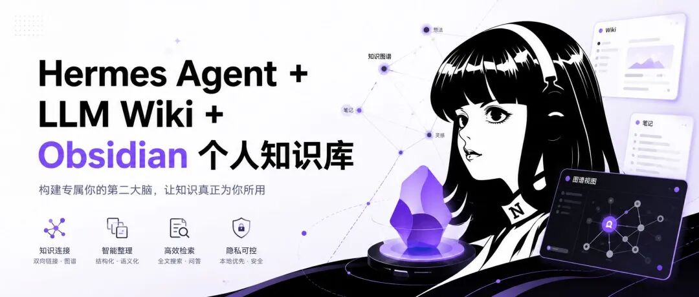
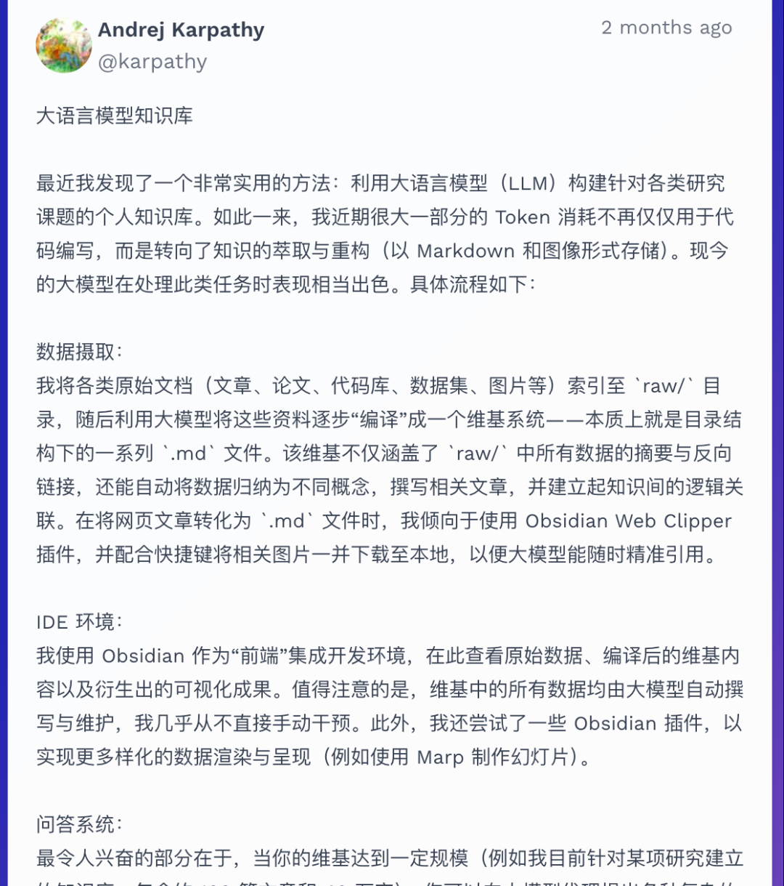
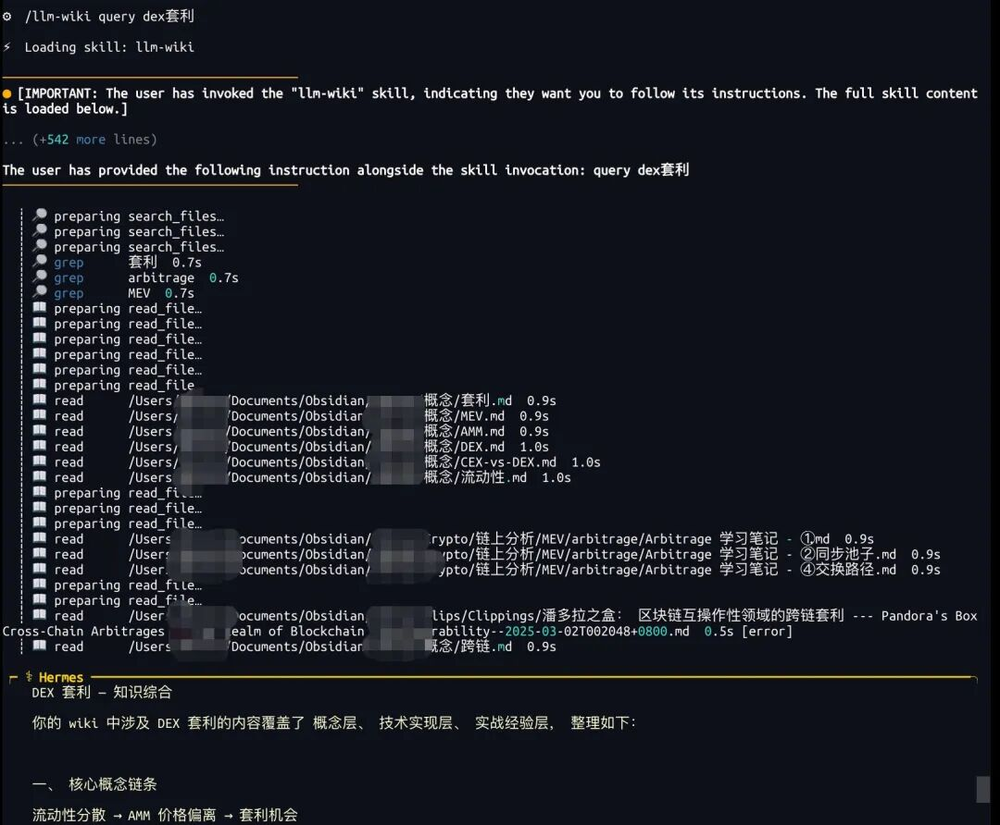
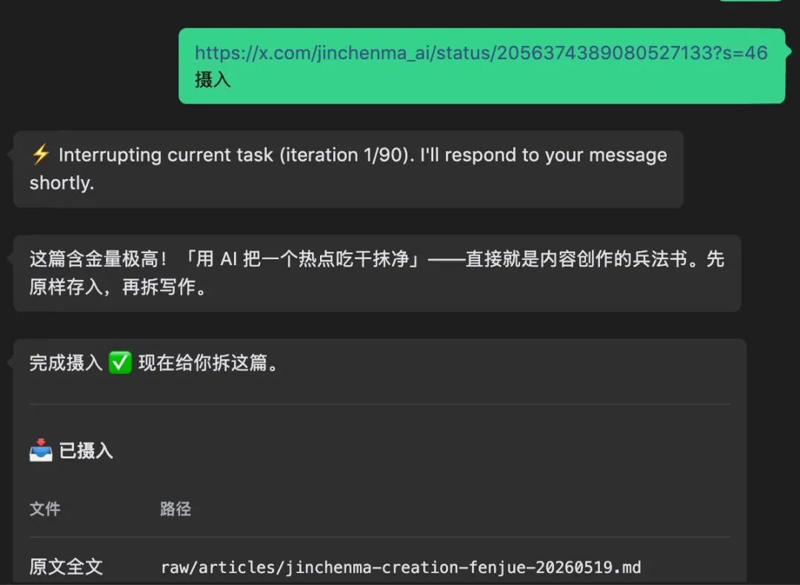
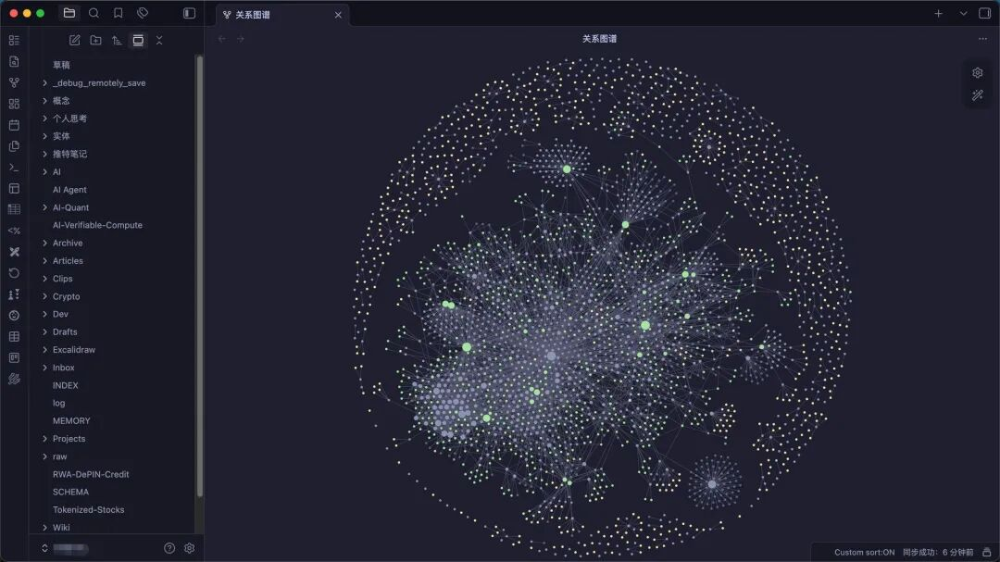

> 📎 来源: [从AI到Web3的探索之旅](https://mp.weixin.qq.com/s?__biz=MzcxMDE2MTg1OQ==&mid=2247483983&idx=1&sn=5dc8d9f46cd31eee1435a6fcf64a7086&chksm=f49defa18ee7adbb23d123584dfb6ebf96e5c783deb79a185aefdea891afffd6fa185d96e6ff&mpshare=1&scene=1&srcid=0531FjK5E3MJU8mS2oNOfddZ&sharer_shareinfo=54cb4b477f030d011cc34e37dc938906&sharer_shareinfo_first=54cb4b477f030d011cc34e37dc938906) | 时间: 2026-05-31 17:09

---



现在的 AI 已经完全可以当做以前的搜索引擎使用了，但是随着与 AI 的交流次数越来越多，研究的项目和课题越来越丰富，导致个人或者团队的资料越来越复杂，甚至每次与 AI 对话的时候，相当于全部清零，所有的关键信息全部没有了，又要从头开始梳理一遍

虽然现在的 Agent 记忆功能非常强大，但是每次研究的话题都要自己手动记录到笔记软件当中，时间长了，笔记越来越多，内容越来越乱

OpenClaw 24万星标，Hermes Agent 两个月破10万用户——虽然两者都有非常强大的记忆系统，但是随着会话和任务越来越多，记忆就会变得零碎

主要问题在于：**知识没有被消化**。

- OpenClaw 的 Active Memory 只是“记录对话”
- RAG 只是“检索原文”
- 你需要的是让 AI **把知识编译成笔记**

就在今年 Karpathy 提出了 **LLM Wiki**：**由 AI 代理（AI Agent）全自动构建、维护和更新的结构化知识库，构建你的第二大脑**



## 什么是 LLM Wiki?

一个标准的 LLM Wiki 由三个核心层级组成：

### 1. Raw Sources（原始资料层）

你丢进去的 PDF、网页、论文、代码文件。**这是“真理的源头”，只读，永远不会被修改。**

### 2. The Wiki（维基层）

一个包含无数 Markdown 文件的文件夹，**完全由 AI 编写和掌管**。AI 在这里生成：

- **实体页（Entity Pages）**：人物、项目、产品
- **概念页（Concept Pages）**：技术、方法论、思想
- **主题总结**：跨文档的综合分析

这些页面通过 `[[双向链接]]` 串联成知识图谱。

### 3. The Schema（指令层）

一个配置文件（如 `CLAUDE.md` 或 `SCHEMA.md`），告诉 AI：

- 你的核心目标是什么
- 应该遵循什么格式和规则来编写维基
- 如何组织和链接知识

**目录结构示例**：

```
my-wiki/ ├── raw/                    # 原始资料层（只读） │   ├── papers/ │   ├── articles/ │   └── notes/ ├── wiki/                   # 维基层（AI 管理） │   ├── entities/ │   │   ├── andrej-karpathy.md │   │   └── hermes-agent.md │   ├── concepts/ │   │   ├── llm-wiki.md │   │   └── rag-vs-wiki.md │   └── INDEX.md └── SCHEMA.md               # 指令层
```

**核心区别**：

| 方式 | RAG | LLM Wiki |
| --- | --- | --- |
| 工作原理 | 每次检索原文 | 读已整理的笔记 |
| 知识积累 | ❌ 无积累 | ✅ 越用越密 |
| 可见性 | 黑盒 | 全量 markdown |
| 部署 | 向量库+GPU | 本地文件夹 |

**一句话：**RAG 是“查资料”，LLM Wiki 是“翻笔记”

## Hermes Agent 自带 LLM WIKI，开箱即用

```
# 1. 安装 Hermes（需要 Python 3.10+） pip install hermes-agent  # 2. 初始化 hermes init  # 3. 配置 LLM Wiki 技能 hermes skill enable llm-wiki  # 4. 开始使用 hermes chat > /llm-wiki ingest https://xxx.org/abs/xxxx
```

Hermes 会自动：

- 读取文章
- 创建实体页、概念页
- 建立交叉链接
- 更新索引

**查询知识库**：

```
> /llm-wiki query "XXXX"
```



**聊天工具对话：**

当然你可以直接在聊天工具中 “摄入+链接”或者询问



AI 读完内容，拆成多个页面：实体页记录核心事实，概念页提炼技术内涵，对比分析做结构化比较，查询归档按主题归档调研结果。

每个页面都包含 wikilinks，指向关联页面。知识网络像乐高一样拼起来。

## Obsidian 让知识「看得见」

LLM Wiki 本身就是 markdown 文件目录，天然兼容 Obsidian，所以结合 Obsidian 非常完美

不需要学新工具，不需要部署复杂的知识库平台。打开 Obsidian，指向 wiki 目录，就得到：

- Graph View：一眼看清哪些概念是孤岛、哪些知识互联了
- 双向链接：`[[wikilink]]` 语法让 AI 写页面时自动建立交叉引用
- Dataview 插件：按标签、类型做动态查询
- 标签系统：一目了然的分类体系

AI 负责录入、整理、链接、更新。你负责浏览、阅读、补充、纠错。人机协作的完美分工



## 写在最后

**LLM Wiki 提供方法论，Hermes Agent 负责自动执行，Obsidian 让一切可见可控——这就是让 AI 构建你的个人知识库完整解决方案**
