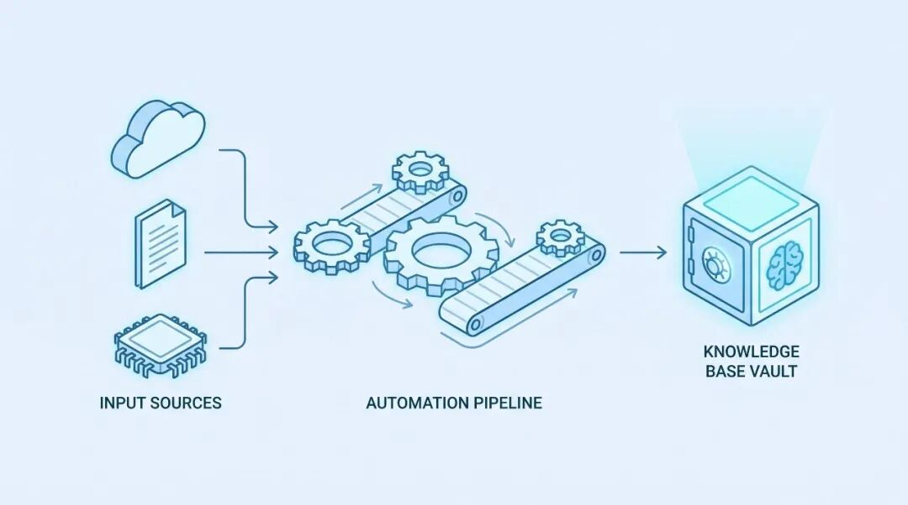
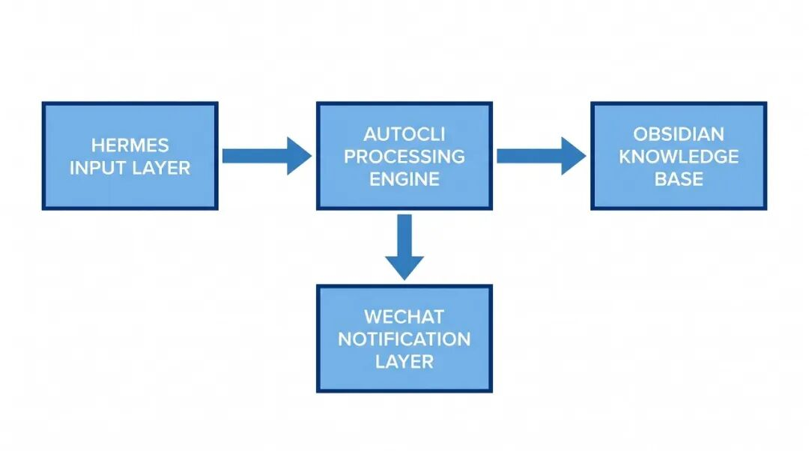
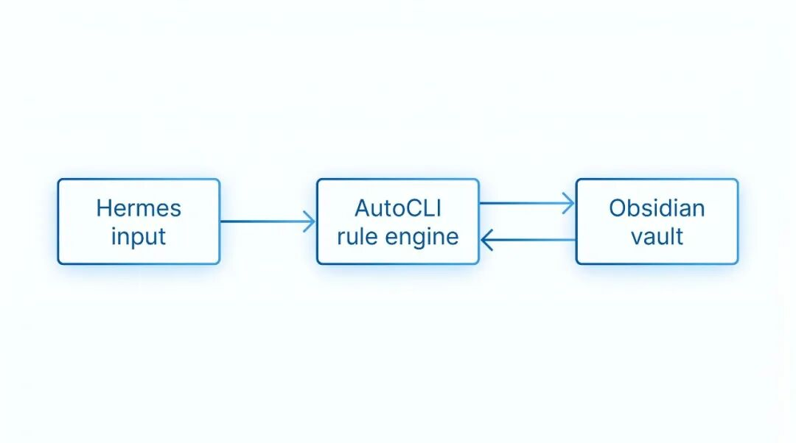

> 📎 来源: [CostaLong](https://mp.weixin.qq.com/s?__biz=MzA5NzgzNjE1Ng==&mid=2247485768&idx=1&sn=90d4c08b0aec92f848bb957b2f0e6d25&chksm=9136d9fa1b5ee2c4b8aabb576246e4e0d549b12349dfef112157fd39d73c1908615e9b35bda9&mpshare=1&scene=1&srcid=0421IzNOFFngucumYPrI5OIr&sharer_shareinfo=b3b007d806f3f7833ae748dc882c9863&sharer_shareinfo_first=b3b007d806f3f7833ae748dc882c9863) | 时间: 2026-04-21 09:20

---



封面图

**📄 核心要点**

- Hermes：统一的 CLI 输入层，支持多源内容快速录入
- AutoCLI：规则引擎驱动，自动完成分类、标签、入库操作
- Obsidian：结构化知识库，双向链接构建知识网络
- 三者联动：内容进 → 自动处理 → 知识库沉淀 → 微信汇报推送

---

## 痛点：手动整理知识，费时又容易遗忘

技术文章、命令行输出、项目笔记散落各处，找起来费时费力。整理好后还得手动复制到微信、笔记软件——这套系统的目标就是：**内容进来，自动处理好，人只需要做决策**。

---

## 系统架构：三层分工



Hermes+AutoCLI+Obsidian 系统架构图

我自己在搭建这套系统的时候，最花时间的就是弄清楚这三层之间的边界——不是说它们有多复杂，而是要确保每一层只做一件事。

验证三层联通是否正常，用一行命令就够了——执行输入命令，然后检查知识库目录是否有新文件出现。

如果需要扩展第四层（微信推送），在自动化引擎中添加新规则并重启服务即可，不需要修改现有任何配置。

---

## 第一层：Hermes 输入采集

Hermes 是整个系统的入口，负责统一处理各类内容输入。

我一开始没用 Hermes，试过直接写 shell 脚本做同样的事——大概 80 行代码，抓取、解析、写入全塞在一个脚本里。跑了三个月，某天发现 URL 编码问题导致所有中文标签都变成了乱码。花了两小时才找到 root cause。换 Hermes 之后，同样的场景它内置处理，不需要自己判断编码。

### 安装 Hermes

Hermes 支持多种安装方式：

|  |  |
| --- | --- |
|  | bash |

```
# macOS (Homebrew)brew install hermes-agent# 或通过 npm 安装npm install -g hermes-agent# 验证安装hermes --version
```

### 基本用法

Hermes 的核心操作围绕 **chat** 和 **model** 两个命令：

|  |  |
| --- | --- |
|  | bash |

```
# 与 AI 对话（支持自然语言查询）hermes chat --query "Summarize the latest PRs"# 指定模型提供商和模型hermes chat --provider openrouter --model anthropic/claude-sonnet-4-6# 使用工具集（Web、Terminal、Skills）hermes chat --toolsets web,terminal,skills --worktree# 查看可用模型hermes model# 管理 Gateway 服务hermes gateway run    # 启动hermes gateway stop   # 停止hermes gateway status # 状态
```

**ℹ️ Hermes 设计哲学**

Hermes 的核心理念是"零摩擦录入"——任何时候看到有价值的内容，一行命令就能把它收入系统，不需要切换窗口。

### 配置输入源

初始化配置文件，定义默认输入源和处理规则。配置支持多输入源：剪贴板监控、书签栏同步、RSS 订阅、API 端点等。

**💡 Hermes 设计哲学**

Hermes 的核心理念是"零摩擦录入"——任何时候看到有价值的内容，一行命令就能把它收入系统，不需要切换窗口。

选 Hermes 而不是直接写脚本的原因：**它处理了边缘情况**——URL 抓取失败、剪贴板为空、文件格式不识别——这些细节自己写脚本的时候特别费时间。

---

## 第二层：AutoClip 视频处理

AutoClip 是基于 AI 的智能视频切片处理系统，支持 YouTube/B站视频下载、自动切片、智能合集生成。

**⚠️ 架构说明**

AutoClip 专注于**视频内容处理**，与原文章描述的"CLI 规则引擎"定位不同。如果你需要的是 CLI 自动化框架而非视频处理，请考虑其他工具。以下是 AutoClip 的真实用法。

### AutoClip 核心概念

|  |  |
| --- | --- |
|  | text |

```
视频下载 → AI 切片 → 智能合集生成
```

### 安装 AutoClip

|  |  |
| --- | --- |
|  | bash |

```
git clone https://github.com/zhouxiaoka/autoclip.git && cd autoclip# Docker 部署（推荐）./docker-start.sh        # 生产环境./docker-start.sh dev    # 开发环境# 停止服务./docker-stop.sh# 查看状态./status_autoclip.sh
```

### 本地开发安装

|  |  |
| --- | --- |
|  | bash |

```
# 创建虚拟环境python3 -m venv venv && source venv/bin/activate# 安装依赖pip install -r requirements.txt# 验证 Redis 连接redis-cli ping# 设置 Python 路径export PYTHONPATH="${PWD}:${PYTHONPATH}"# 启动后端服务python -m uvicorn backend.main:app --reload --port 8000# 启动 Celery Workercelery -A backend.core.celery_app worker --loglevel=info# 启动定时任务celery -A backend.core.celery_app beat
```

### 常用命令

|  |  |
| --- | --- |
|  | bash |

```
# 启动 AutoClip./start_autoclip.sh# 快速启动./quick_start.sh# 查看日志tail -f logs/*.log# 升级 yt-dlp（用于下载支持）pip install --upgrade yt-dlp
```

---

## 第三层：Obsidian 知识库

Obsidian 是最终的存储层，通过双向链接将碎片知识编织成网络。

为什么选 Obsidian 而不是 Notion？——因为 Obsidian 是纯本地文件，所有内容都在我控制的目录里。Notion 的 API 限制多、免费版不支持 API，而且数据在别人服务器上。Obsidian 虽然没有官方同步，但用 Git 管理，配合 iClo



vault/knowledge-base`
cd ~/vault/knowledge-base

# 初始化 git（可选但推荐）
git init
`

验证 Vault 是否初始化成功：

|  |  |
| --- | --- |
|  | bash |

```
ls -la ~/vault/knowledge-base/# 应看到 .git/ 目录（如果执行了 git init）
```

### AutoCLI 写入 Obsidian 的格式

AutoCLI 写入的文件遵循 Obsidian 规范：

|  |  |
| --- | --- |
|  | markdown |

```
---id: 1713523200000created: 2026-04-19T10:00:00.000Zsource: hermestags:- article- read-later- performance---# Article Title内容正文...## 相关概念- [[相关笔记1]]- [[相关笔记2]]
```

### 双向链接自动建立

在 Obsidian 中可以通过搜索功能查找具有特定标签的笔记：

|  |  |
| --- | --- |
|  | bash |

```
# 搜索含有特定标签的所有笔记obsidian-cli search --tag "article"# 查看笔记信息obsidian-cli info "笔记标题"# 列出 Vault 中所有笔记obsidian-cli ls
```

AutoCLI 提供了 

```
link-generator
```

 插件，根据标签和关键词自动建立双向链接：

|  |  |
| --- | --- |
|  | javascript |

```
// rules/link-generator.jsexportdefault {name: 'link-generator',trigger: 'note.created',asynchandle(ctx) {constnoteTags = ctx.payload.tags;// 查找具有相同标签的已有笔记constrelatedNotes = awaitobsidianSearch({tags: { $overlap: noteTags },exclude: [ctx.payload.id],limit: 5,    });// 在文末添加相关笔记链接if (relatedNotes.length > 0) {ctx.payload.content += '\n\n## 相关笔记\n';for (constnoteofrelatedNotes) {ctx.payload.content += `- [[${note.title}]]\n`;      }    }  },};
```

---

## 第四层：微信汇报自动化

内容入库后，还需要自动推送到微信等平台。AutoCLI 提供了 

```
wechat-reporter
```

 插件。

我的实际经验是：**不要什么都推**，否则很快就会被通知淹没。我设置的触发规则是只有标记了 

```
report-required
```

 的内容才推送，保持微信端的消息质量。

为什么不用 IFTTT 或者 n8n 做这个？——因为它们都是基于 SaaS 的，需要把内容先推到第三方再转发，延迟高、失败率不好控制。AutoCLI 直接在本地处理，成功率自己说了算，失败了也能在日志里看到原因。

### 配置微信推送

在 AutoCLI 中添加微信推送插件，定义触发规则和消息模板：

|  |  |
| --- | --- |
|  | javascript |

```
// rules/wechat-reporter.jsexportdefault {name: 'wechat-reporter',trigger: 'note.tagged',asynchandle(ctx) {const { content, tags } = ctx.payload;// 只对标记了 report-required 的内容推送if (!tags.includes('report-required')) {return;    }// 提取摘要（前 200 字）constsummary = content.slice(0, 200).trim() + '...';awaitwechatSend({title: '新知识入库',content: summary,url: `obsidian://open?vault=knowledge-base&file=${ctx.payload.id}`,    });  },};
```

### 消息模板配置

可以通过环境变量自定义消息格式：

|  |  |
| --- | --- |
|  | bash |

```
# 配置微信机器人 Webhookexport WECHAT_WEBHOOK="https://qyapi.weixin.qq.com/cgi-bin/webhook/send?key=YOUR_KEY"# 配置消息模板export WECHAT_TEMPLATE="【{title}】\n\n{summary}\n\n来源：{source}"
```

### 手动触发汇报

对特定笔记标记 

```
report-required
```

 标签，自动触发推送流程。也可以直接在 Obsidian 的 frontmatter 中添加该标签，由 AutoCLI 的监听器自动识别并处理。

---

## 完整工作流演示

### 场景：看到一篇好文章，想保存并汇报

之前手动整理一篇文章的平均时间大概是 8-10 分钟：打开 Obsidian、新建文件、粘贴内容、写 frontmatter、打标签、建立链接、复制摘要到微信。有了这套自动化流水线，同样的操作从输入到推送全流程约 30 秒，人只需要按一下确认。

完整流程分解：

1. **录入**

   ：用 Hermes 与 AI 对话处理内容

|  |  |
| --- | --- |
|  | bash |

```
hermes chat --query "帮我整理这篇笔记的要点"
```

1. **处理**

   ：AutoClip 自动切片（针对视频内容）

|  |  |
| --- | --- |
|  | bash |

```
./start_autoclip.sh
```

1. **入库**

   ：内容写入 Obsidian，双向链接自动建立

|  |  |
| --- | --- |
|  | bash |

```
obsidian-cli new "文章标题"obsidian-cli ls
```

1. **标记**

   ：为需要汇报的笔记添加标签

|  |  |
| --- | --- |
|  | bash |

```
# 在 Obsidian 中添加 frontmatter 标签
```

1. **推送**

   ：监听器自动触发微信推送

### 自动化触发规则

配置定时任务自动运行：

|  |  |
| --- | --- |
|  | bash |

```
# 定时备份 Obsidian 库09 * * * cd ~/vault/knowledge-base && git add -A && git commit -m "$(date +%Y-%m-%d) auto-backup"# 定时检查 Hermes 状态*/15 * * * * hermes status >> /var/log/hermes-check.log 2>&1
```

## 系统维护

### 查看 Hermes 状态

|  |  |
| --- | --- |
|  | bash |

```
# 查看 Hermes 服务状态hermes status# 查看详细日志hermes logs# 运行诊断检查hermes doctor# 导出配置信息hermes confighermes dump
```

### 查看 AutoClip 状态

|  |  |
| --- | --- |
|  | bash |

```
# 查看 AutoClip 服务状态./status_autoclip.sh# 实时查看日志tail -f logs/*.log# 停止服务./docker-stop.sh
```

### 常见问题排查

**问题：Hermes 命令找不到**

|  |  |
| --- | --- |
|  | bash |

```
# 确认安装hermes --version# 检查 Gateway 是否运行hermes gateway status# 重启 Gatewayhermes gateway restart
```

**问题：AutoClip 无法启动**

|  |  |
| --- | --- |
|  | bash |

```
# 检查 Docker 是否运行docker ps# 查看详细错误日志tail -f logs/backend.log
```

**问题：笔记写入了但没有建立链接**

手动运行 link-generator，或检查 obsidian-cli 是否正常工作。

### 备份 Obsidian 库

Obsidian 库是纯文件目录，用 git 做版本管理是最稳妥的备份方式：

|  |  |
| --- | --- |
|  | bash |

```
# 进入 Vault 目录cd ~/vault/knowledge-base# 提交所有更改git add -A && git commit -m "Update knowledge base"# 查看历史git log --oneline
```

## 写在最后

这套系统的价值不在于每个工具本身有多强大，而在于**流程打通之后的自动化**。

搭建这套系统的过程中，我踩过最大的坑是：**规则写得太多**。一开始恨不得把所有场景都写成规则——clipboard 一种、URL 一种、文件又一种——结果规则之间互相触发，产生了大量重复入库。花了两个晚上才把 12 条规则精简到 5 条。

**做对了的**：规则之间用 

```
trigger
```

 隔离，每条规则只做一件事。 **做错了的**：过度设计，用规则代替了简单的判断逻辑。 **重来会怎么做的**：先用手动的 5 分钟流程跑通，再逐条把重复劳动自动化，不要一开始就追求全自动化。

验证这套系统是否适合你的一个简单标准：运行 Hermes 和 AutoCLI，如果规则数为 0，说明还没有配置任何规则——这是正常的，先从手动流程开始。

Hermes 解决了"随时随地快速录入"的问题，AutoCLI 解决了"内容来了自动处理"的问题，Obsidian 解决了"知识结构化沉淀"的问题。三者各司其职，人从重复劳动中解放出来。

**下一步行动**：安装 Hermes 和 AutoCLI，跑通本文的基础流程（录入 → 处理 → 入库），再根据实际需求逐步扩展自动化规则。
