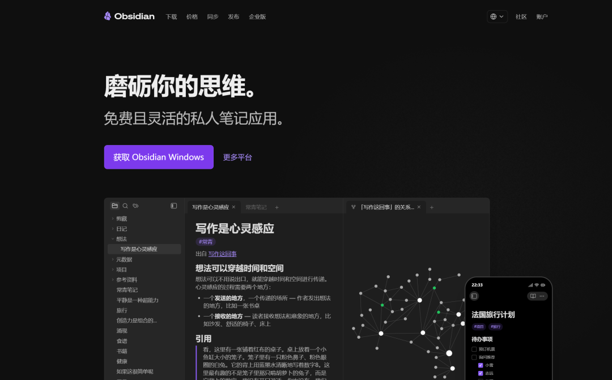

> 📎 来源: [Lua实验室](https://mp.weixin.qq.com/s?__biz=MzcwMjI3MzkwNg==&mid=2247483735&idx=1&sn=46444119db13188e121a6a6f5af71b2e&chksm=f5ae9211660275361cb8ebb5f7441c467f16e0491a36095286049f62ab0bfacc425e181a802b&mpshare=1&scene=1&srcid=0517ORfUO8aHSu2pY4ULahsS&sharer_shareinfo=d7ffa7cc0be6dbef2cdab9dfc7781d3d&sharer_shareinfo_first=d7ffa7cc0be6dbef2cdab9dfc7781d3d) | 时间: 2026-05-17 23:51

---

# Obsidian + LLM-Wiki 入门实战：从零搭一个可追问的个人知识库

> 不管你已经在用 Obsidian，还是刚准备开始，都可以先用一个小主题跑通“记录 -> Wiki -> 追问”的闭环。

如果你想搭个人知识库，先别急着找“完美工具”。

更现实的问题是：资料是存进去了，但需要的时候不好找。明明当初攒了很多，最后能翻出来的还是那几篇。

文章收藏了，PDF 下载了，读书摘录也写了，真到写文章、做方案、查资料，还是重新搜索一遍。说白了，不是没记，是记完之后基本放那儿吃灰。

用 Obsidian 的人也一样。刚开始双链、标签、Graph View 玩得挺开心，几个月后 vault 越来越厚，标签越来越随缘。你知道自己肯定记过，但就是想不起来在哪儿。

这篇就做一件事：把 Obsidian 当成本地知识库底座，再用 LLM-Wiki 插件，把一个小主题里的笔记整理成能翻、能跳转、还能问两句的小型 Wiki。

先跑通一个小闭环，别一开局就整“个人知识宇宙”。

## 这篇适合谁？

如果你已经在用 Obsidian，这篇适合你。你缺的不是记笔记的工具，缺的是让笔记别老躺着装睡。

如果你还没用 Obsidian，但想搭个人知识库，这篇也适合你。你可以先从一个新 vault 开始，不用一口气迁移所有旧资料。

两类人的坑其实一样：资料不是没有，问题是用的时候找不回来、串不起来、问不出来。

## 为什么用 Obsidian 做底座？

如果只是写几篇文档，Notion、飞书、语雀、Word 都能用，没必要把 Obsidian 捧上神坛。

但长期个人知识库，我更看重它三点：

- **本地 Markdown**：笔记是一个个 

  ```
  .md
  ```

   文件，备份、迁移、脚本处理都方便。
- **双链和主题网络**：

  ```
  RAG
  ```

   可以连到 

  ```
  Embedding
  ```

  、

  ```
  向量数据库
  ```

  、

  ```
  个人知识库
  ```

  ，时间长了会长出一张知识网。
- **适合长期积累**：读书笔记、项目复盘、文章素材、研究资料，都能慢慢养。

它的问题也很明显：不会自动变整齐，相关的知识也不会自己手拉手站好。

你完全不维护或者很少维护，Obsidian 最后也只是一个高级文件夹。文件很多，链接不少，但该找不到还是找不到。

所以我对它俩的分工理解很简单：Obsidian 负责“东西放哪儿、能不能长期保存”，LLM-Wiki 负责帮你做第一轮整理、连接和追问。



## LLM-Wiki 不是摘要插件

很多人一听 AI 插件，以为就是“帮我总结笔记”。

有点像，但不止这个。

LLM-Wiki 更像是把一组笔记整理成 Wiki。它关心的是：这批笔记里有哪些概念？哪些内容应该单独成页？哪些页面之间应该互相链接？我能不能围绕这些笔记提问？

以 

```
green-dalii/obsidian-llm-wiki
```

 为例，思路大概是：

```
一组零散笔记-> Ingest from Folder-> 生成 wiki/ 目录和索引页-> 形成概念页与双链-> Query Wiki 提问-> 回到原文校验
```

它的重点不是让 AI 写几段漂亮话，也不是让它回答“请谈谈 AI 未来”这种大而空的问题，而是把原来散在各处的材料，整理成一个能浏览、能跳转、还能追问的小知识库。

## 第一步：准备一个小主题

这里千万别贪大。

还没用 Obsidian 的，先下载 Obsidian，新建一个 vault，比如 

```
AI Notes
```

。已经有 Obsidian 笔记库的，也别处理整个 vault，先复制一个小主题文件夹出来试水。

第一次控制在 10-20 篇笔记就够了。主题要集中，比如：

- ```
  AI/RAG
  ```
- ```
  写作素材/知识管理
  ```
- ```
  项目复盘/会议纪要
  ```
- ```
  读书笔记/AI 工具
  ```

示例目录：

```
Obsidian Vault/  LLM-Wiki-Test/    01-RAG-基础.md    02-向量数据库.md    03-个人知识库.md    04-Obsidian-笔记方法.md
```

笔记别太碎。每篇最好有标题、有几段完整内容；摘录要保留来源链接；自己的想法要写清上下文。

AI 不是神仙。你喂进去一堆半截句子，它吐出来的东西也很难干净。别拿厨房剩菜要求它端出满汉全席，这不现实。

## 第二步：安装 LLM-Wiki 插件

以 

```
green-dalii/obsidian-llm-wiki
```

 为例，目前更适合手动安装。

步骤如下：

1. 到 GitHub Releases 下载 

   ```
   main.js
   ```

   、

   ```
   manifest.json
   ```

   、

   ```
   styles.css
   ```

   。
2. 打开 Obsidian，进入 

   ```
   Settings -> Community plugins
   ```

   。
3. 打开已安装插件目录。
4. 新建一个插件文件夹，比如 

   ```
   llm-wiki
   ```

   。
5. 把三个文件放进去。
6. 回到 Obsidian 刷新插件列表，启用 Karpathy LLM Wiki（插件显示名）。

插件目录是在：

```
你的 vault/.obsidian/plugins/
```

最后是长这样：

```
.obsidian/  plugins/    llm-wiki/      main.js      manifest.json      styles.css
```

第一次手动装插件，目录别放错。插件列表里看不到时，先怀疑路径，别先怀疑人生。

## 第三步：配置模型

插件装好之后，就要去设置里配模型了。

它支持 Anthropic、Gemini、OpenAI、DeepSeek、Kimi、GLM、Ollama、OpenRouter 这些常见 provider，也支持自定义兼容接口。第一次试，别在模型选择上卡太久。

配置项一般就这几个：

- provider
- API key
- model
- 连接测试

手里哪个 API key 稳，就先用哪个。先让流程跑起来，比研究“哪个模型最适合知识管理”更重要。

如果笔记里有私人资料，可以优先考虑 Ollama 本地模型。但本地模型吃机器配置，电脑扛不住，体验会很拧巴。

## 第四步：导入笔记，生成 Wiki

模型能连上后，把 

```
LLM-Wiki-Test
```

 文件夹丢进去试试。

在 Obsidian 命令面板里找 

```
Ingest from Folder
```

 这类入口。插件会读取笔记，抓出概念、主题和关联。

生成结果类似这样：

```
Wiki/  index.md  RAG.md  Embedding.md  向量数据库.md  个人知识库.md  Obsidian.md
```

具体目录以插件实际生成结果为准，这里只是方便理解。

第一次生成后，先别急着嫌排版丑，也别急着骂“不够智能”。先看四件事：

- 打开 

  ```
  index.md
  ```

   文件，看看能不能看出这个小知识库在讲什么；
- ```
  RAG.md
  ```

   有没有连到 

  ```
  Embedding.md
  ```

  ；
- ```
  个人知识库.md
  ```

   有没有连到 

  ```
  Obsidian.md
  ```

  ；
- 生成页面能不能回到原始笔记。

它不需要一把整理出传世名著。只要能帮你少干一点手工活，把原来没连起来的知识点和笔记连起来，就已经不是纯玩具。

## 第五步：追问这个知识库

Wiki 页面和索引生成后，在命令面板里找 

```
Query Wiki
```

 一类入口。

别问这种大而空的问题：

> 给我讲讲 AI。

这种问题不依赖你的笔记库，随便哪个聊天机器人都能答。

要问和自己材料绑定的问题：

> 我这些笔记里，关于 RAG 和个人知识库的共同观点是什么？

> 哪些笔记提到了“向量数据库”，观点有什么差异？

> 如果我要写一篇 AI 知识管理文章，已有笔记能支持哪些论点？

> 哪些内容只有结论，没有来源，需要补充？

好答案不是写得长。长不值钱，准才值钱。

它至少要能回到原文，能指出关联。如果还能提醒你“这里缺案例”“这里缺来源”，那就更有用了。

到这一步，Obsidian 就不只是仓库，而是有点像能陪你翻旧账、理线索的工作台。

## 最后：生成完别急着信

LLM-Wiki 有意思，但不要神化，它只是个工具。

它会错。比如你写的是“这个方案不适合小团队”，它可能没抓住否定，最后总结成“适合团队协作”。

它也会乱连。两个词长得像，不代表它们在你的知识库里真有关。

它还会把很薄的碎片包装得很高级。你原文只有一句“这个工具不错”，它能扩成一段像模像样的评价，读着顺，但信息含量很虚。

每次生成后，至少扫一遍：

- 重要结论能不能回到原文；
- 双链是不是真的相关；
- 有没有把不同概念混在一起；
- 有没有无来源的漂亮总结；
- 有没有敏感内容被送到云端模型。

这些过不了，就别急着说自己有了 AI 知识库。那只是多了一堆 AI 生成的 Markdown，本质上还是知识垃圾搬家，只是包装看起来更高级。

## 先让一个小知识库真的用起来

这篇不是为了证明 Obsidian 比其他笔记工具高级，也不是把 LLM-Wiki 吹成自动知识管理神器。

它更适合作为一个起点。

如果你还没用 Obsidian，从一个小 vault 开始；如果你已经有一堆 Obsidian 笔记，从一个小主题文件夹开始。

先跑通这个闭环：

```
记录 -> 生成 Wiki -> 追问 -> 校验 -> 补充
```

跑通以后，再慢慢扩展到写作素材、项目复盘、读书笔记、研究资料。

个人知识库这事儿，真别一口吃成胖子。

先让一个小知识库能被浏览、被链接、被追问，再谈完整系统。
