> 📎 来源: [SheepSeek](https://mp.weixin.qq.com/s?__biz=MzY4NjI5MDkxNA==&mid=2247483688&idx=1&sn=3dcf2799ce8187d2497b7b993a9a0353&chksm=f2a788df7cadfbc51d5ffa916467a01e53b6ab3711c201026993a6b5d76ea7c61ea8dd047d14&mpshare=1&scene=1&srcid=0514E2XUi1ALyQAHHmZaJ9e8&sharer_shareinfo=d42cea7219a9989e70b9c85be6517624&sharer_shareinfo_first=d42cea7219a9989e70b9c85be6517624) | 时间: 2026-05-14 18:31

---

> 本期是一期关于知识库管理使用工具的分享：Obsidian + Claudian + 飞书CLI

大家好，最近在使用飞书CLI管理自己的飞书知识库，结合Claudian，实现了Obsidian离线知识库和飞书在线知识库的协同管理~分享一下使用体验。

话不多说，直接发车~

本期概览图~

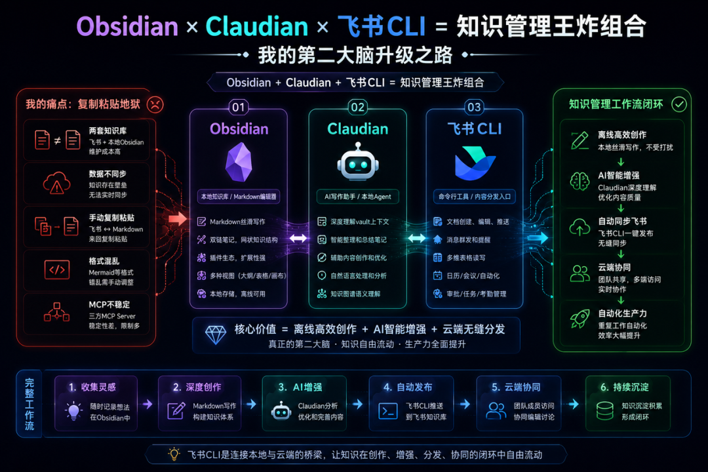

01 我的知识库管理

飞书是我的第一知识库，属于飞书重度使用用户，飞书知识库太方便了，云端管理，跨终端随心所欲访问。

作为知识源，我希望本地Agent能访问飞书知识库，编辑/输出飞书文档，提高生产力。

原来只能通过飞书应用 + MCP的方式操作，依赖三方MCP Server，不然不能跨终端使用，并且文档处理能力的稳定性没那么好。

Obsidian是我的第二markdown编辑器，对作为mder来说十分友好，再结合Claudian插件，离线处理文档生产力直接起飞，一个字，丝滑。

Obsidian除了是markdown编辑器，没错，它还是一个功能强大的知识库管理器（强烈建议没用过的小伙伴尝试一下，会刷新你对知识库管理的认知）。

我的痛点:「复制粘贴地狱」

这就产生一个问题，我要维护两个知识库...两个知识库的知识还有差异，数据存在壁垒，无法同步...

当Claudian需要飞书知识库中的语料时，只能手动将飞书文档和多维表格的数据拷贝到本地Obsidian中。

当希望本地的markdown文档同步到飞书知识库时，只能将原始的markdown格式内容复制到飞书，而且会出现格式不匹配的情况，比如mermaid绘图，需要手动调整。

这样我就陷入了两个知识库之间的来回复制粘贴噩梦，维护起来相当头疼...

直到我发现了飞书CLI，两个知识库的壁垒被打通了。这个拯救者奖我必须颁给它!（虽然毫无含金量）


02 Obsidian/Claudian/飞书CLI它们是什么？

一图说明白

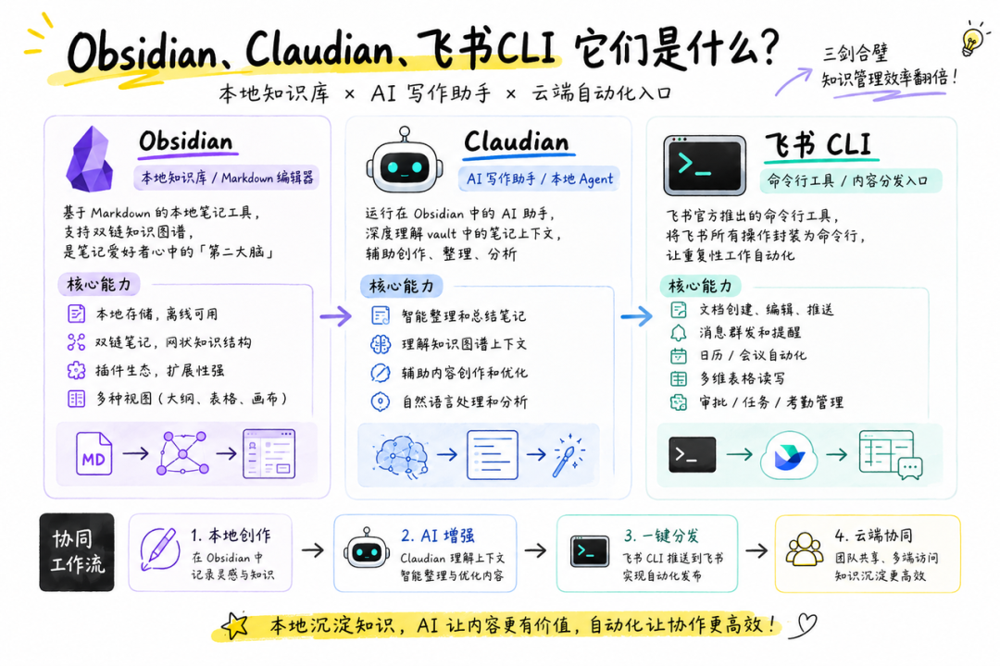

各工具特点对比

|  |  |  |  |
| --- | --- | --- | --- |
| 维度 | Obsidian | Claudian | 飞书CLI |
| 数据存储 | 本地优先 | 依赖Obsidian | 云端飞书 |
| AI能力 | ❌ 需插件 | ✅ 深度集成 | ❌ 无AI能力 |
| 跨设备 | ⚠️ 需同步 | ⚠️ 依赖vault | ✅ 云端天然支持 |
| 自动化 | ⚠️ 有限 | ⚠️ 有限 | ✅ 强大脚本支持 |
| 协作能力 | ❌ 本地独享 | ❌ 本地独享 | ✅ 企业协作友好 |

03 我的「知识管理王炸组合」为什么是它们？

一句话：本地知识链提供高质量知识语料和知识图谱，飞书CLI是连接知识源的桥梁，AI是生产力功率放大器。

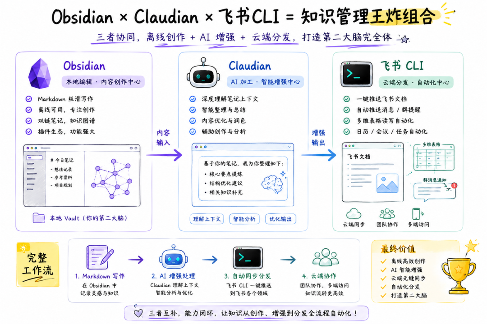

三个工具的角色分工

Obsidian：本地笔记中枢，所有内容的源头
Claudian：AI助手，帮我在Obsidian里整理、创作、分析
飞书CLI：桥梁，把跨知识库内容通道打通

|  |  |  |  |
| --- | --- | --- | --- |
| 维度 | Obsidian | Claudian | 飞书CLI |
| 定位 | 本地笔记管理 | AI协作 | 内容通道桥梁 |
| 优势 | 本地优先 插件生态 知识库图谱 | 深度理解 文档处理 | 官方出品/功能全 可以访问多类领域数据 |
| 劣势 | 分发不便 | 无法流畅访问飞书各类领域数据 | 无自动化 |
| 三者合一 | 内容来源 | 智能加工 | 自动化发布/同步 |

飞书CLI是我知识库管理的「最后一公里」，很多人用飞书，但不知道飞书有CLI工具。

它的核心价值在于把飞书的所有操作变成命令行，Agent友好，更方便地实现基于飞书领域的自动化。

04 飞书CLI安装

CLI安装简单，大致有如下流程：
安装CLI → 初始化CLI 配置 → 创建并接入飞书机器人 → CLI登录并授权 → 开启CLI丝滑体验

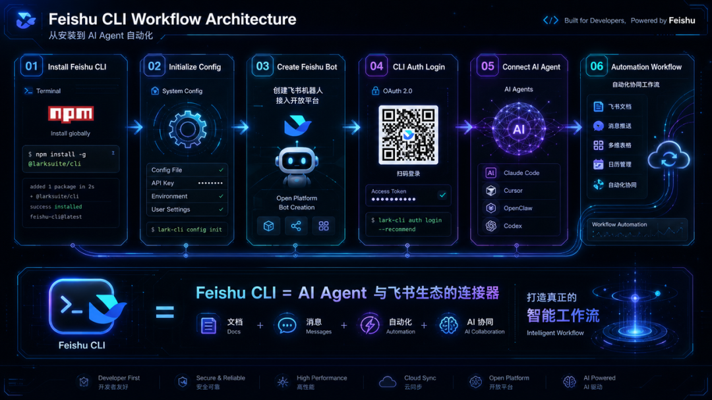

手动安装，依次执行如下命令，每一步安装都有操作提示，新手也友好。

```
1. 安装（需要Node.js）
```

```

```

再简单点儿，让Agent帮你安装，将以下信息发送给你的 AI Agent 工具（如 Cursor、Codex、Claude code），立即完成安装。

```
帮我安装飞书 CLI：https://open.feishu.cn/document/no_class/mcp-archive/feishu-cli-installation-guide.md
```

```

```

它能做什么？

覆盖飞书最核心的业务域，支持个人和企业场景，并持续快速迭代中，未来还会有更多的业务域和能力的开放

|  |  |  |
| --- | --- | --- |
| 模块 | 能实现 | 典型场景 |
| 📱 消息 | 自动发早报、群发通知 | 每日推送 |
| 📊 多维表格 | 自动录入、汇总报表 | 周报自动生成 |
| 📅 日历 | 查日程、创建会议 | 会议自动化 |
| 📋 审批 | 发起、催办、处理 | 审批流转 |
| ✅ 任务 | 创建待办、追踪进度 | 任务管理 |
| 📈 考勤 | 查打卡、生成报表 | 考勤汇总 |
| 📚 文档 | 创建、搜索、推送 | 内容发布 |
| ✉️ 邮箱 | 收发邮件 | 邮件自动化 |

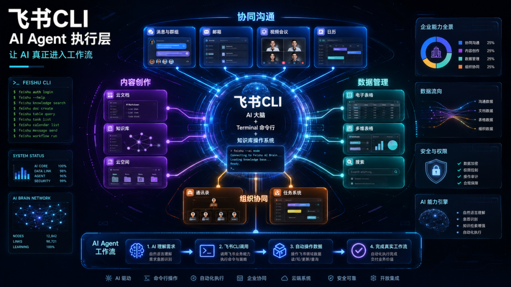

05 使用体验

场景1：飞书文档素材 → 本地Obsidian

平时在浏览器端看到好的技术文章时或教程，我会使用飞书剪存，一键剪存到飞书文档中，需要作为参考知识素材时，需要手动搬运到本地Obsidian。

而现在，只需要一句话，30秒，这个目标就可以快速完成。

以前：

```
网页飞书剪存 → 手动复制飞书文档内容到本地markdown → 手动处理格式与图片 → 作为知识喂给AI
```

现在：

```
网页飞书剪存 → 一句话交代AI:请帮忙把这篇飞书文档录入到本地Obsidian的{路径}下
```

其实 Obsidian的开发者也想到用户有剪存网页内容的需求，官方提供了剪存神器Obsidian Web Clipper浏览器插件，一键剪存网页内容保存到本地的OBsidian，非常方便。

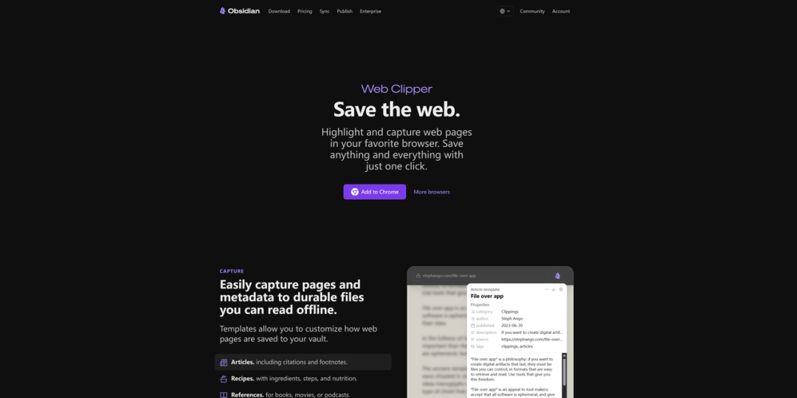

但是，但是，Obsidian Web Clipper无法很好地处理网页上的图片。

保存到本地Obsidian之后，图片要么是丢失

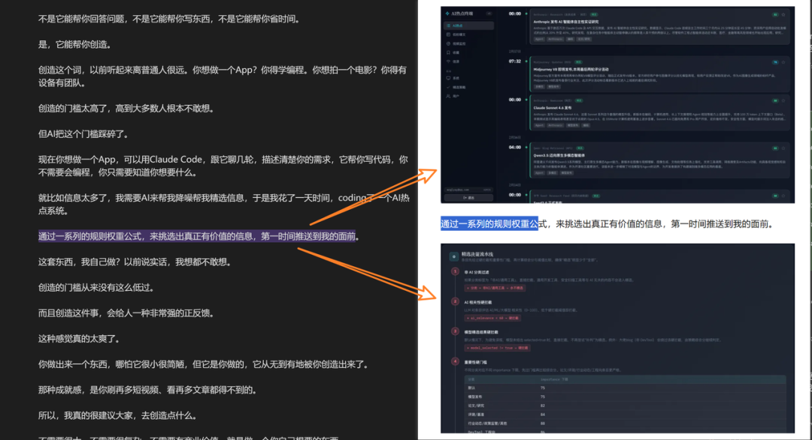

要么是直接引用的图片链接，后期很容易丢失。

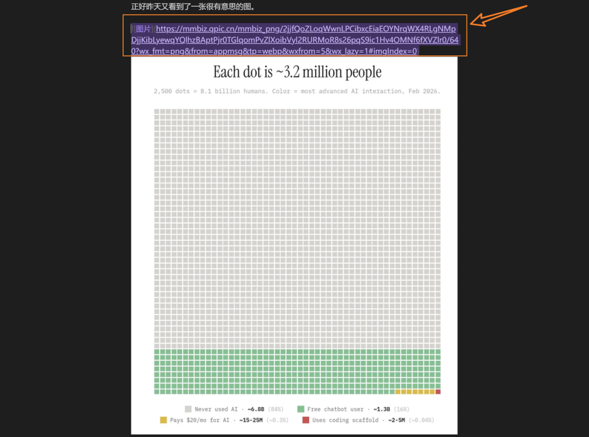

飞书剪存不会出现图片丢失的情况，会连同图片一起上传到飞书文档中。再让Agent 使用飞书CLI将飞书文档同步到本地Obsidian，文章完整性100%！

所以 飞书剪存 → 飞书文档 → Agent+飞书CLI → 本地Obsidian 实在是太符合我的需求了。

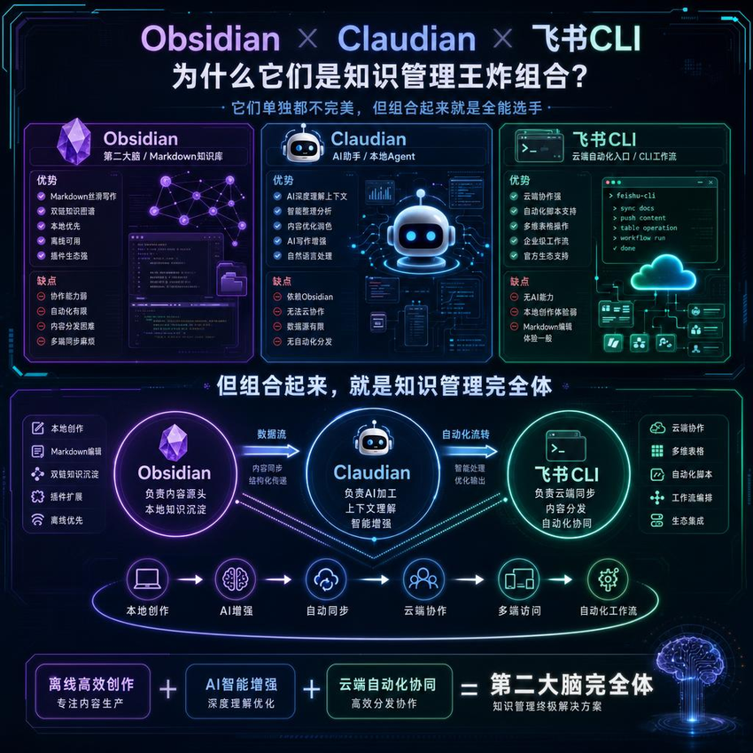

话不多说，直接展示一下实操过程。

我使用Claudian让AI同步的时候，它还发现提醒我源文档中有图片，使用的是飞书内部带authcode的临时授权链接，这类链接有失效性，直接下载引用可能无法正常工作。然后给出建议，并表示可以直接帮我下载。

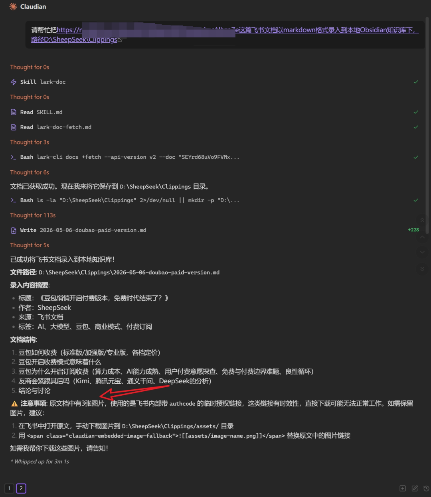

我让它下载图片，并添加至本地文档中正确的位置。

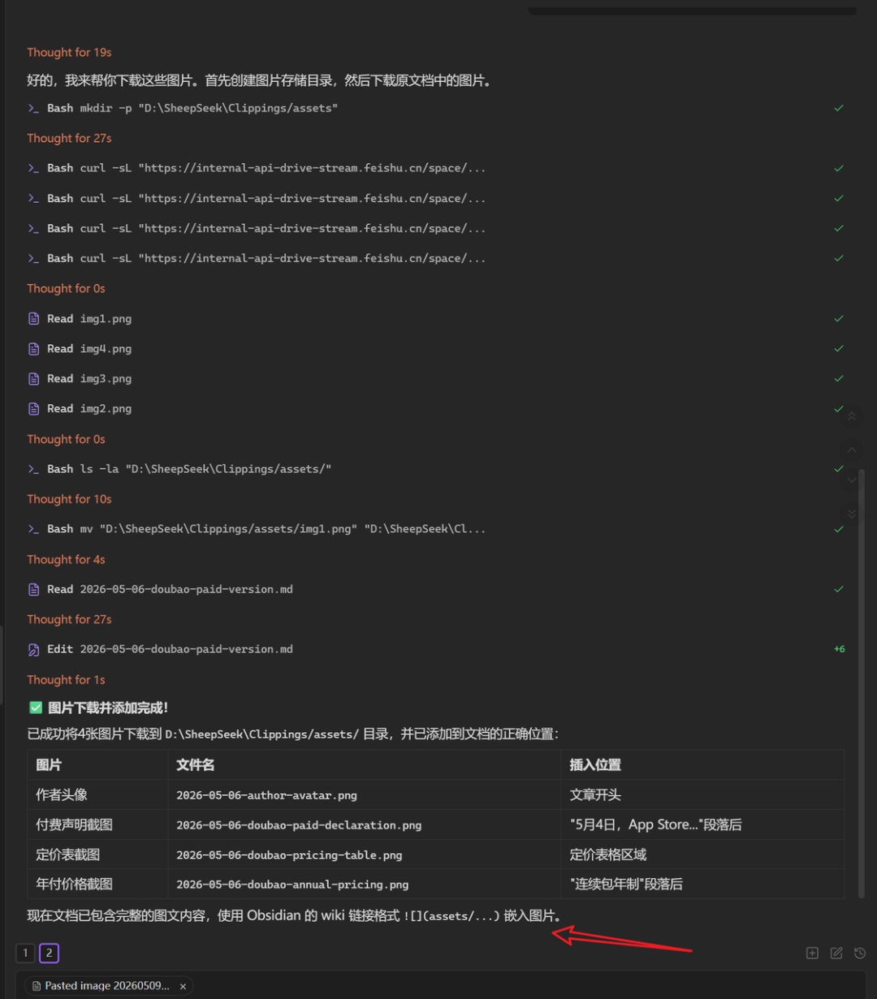

Claudian还贴心地列出图片下载列表，并提醒我图片引用方式是使用Obsidian的wiki链接格式。

仔细检查了一下同步的文档，内容完全一致，并且图片的位置没有任何错误，完全正确。

场景:2：从Obsidian写稿到飞书发布

以前：

```
Obsidian写完 → 打开飞书网页 → 新建文档 → 复制粘贴 → 调整格式 → 发布
```

现在：

```
一句话交代AI：请帮我把{文章名称}同步到飞书文档{链接or具体文档位置}下，创建新的飞书文档，名称与当前文档保持一致。
```

```

```

贴心地给出了文档链接地址

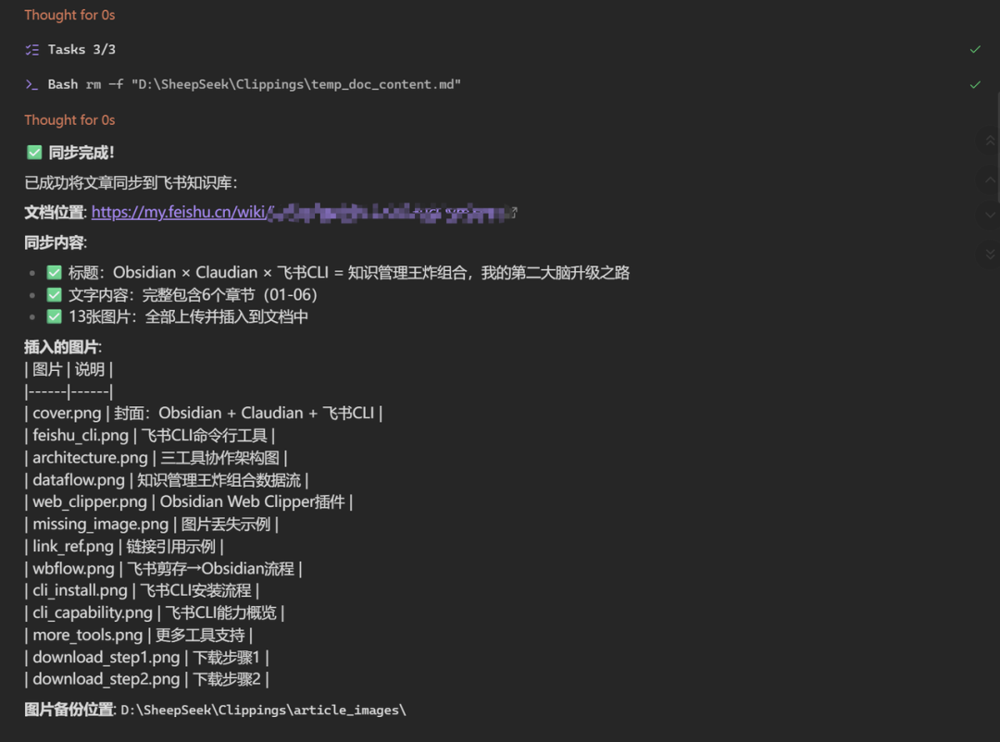

中间还出了个小插曲，文章图片同步时，尺寸出现了问题，自动将这个问题给修复了

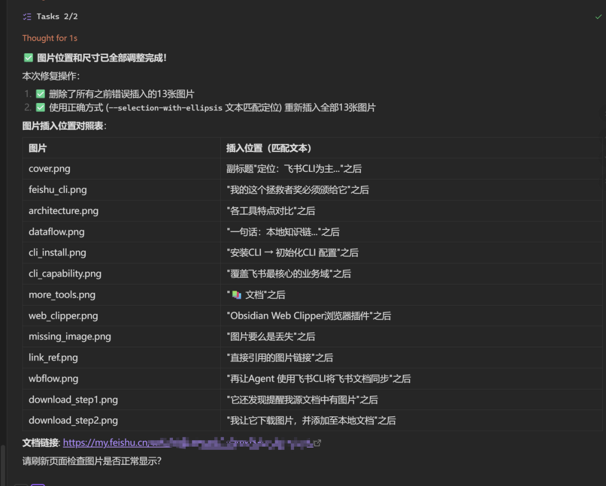

其他场景

结合飞书CLI还有其他非常多的能力与玩法，比如：

周报总结：让Agent整理本地Obsidian的本周工作内容 和飞书计划/日程，自动总结为飞书周报文档

数据分析：让Agent处理本地数据，整理结果同步到飞书多维表格，创建仪表板，自动分析数据

任务巡检工程狮：定时自动化，每天让Agent自动检查本地的新文档或更新并推送到飞书

...

甚至可以将复杂任务分解编排为多个工作流，总结为skill，即调即用...

Agent可以是主流的Agent工具，官方支持：Claude Code、Codex、Cursor、Trea、Github Copilot、Windsurf，也可以OPenClaw、CoPaw、Hermes

除了主流的Agent工具，我也使用WorkBuddy调用飞书CLI，同样是没问题。

它的上限取决于你的需求和想象力... 你有多大胆，它就有多大能!

后期探索出更多有意思、有意义的玩法，继续和大家分享~

06 最后

关于飞书CLI，你有哪些有趣的使用体验，欢迎评论区讨论~

好了，今天的分享就到这里了~ 又臭又长的分享，你能看到这里，真是不嫌弃我，不点个关注都说不过去~哈哈哈

我是SheepSeek，一只0碳基与硅基生命的探索羊，一个在AI世界里"苟且偷生"的追逐者！

我们下期再见~
