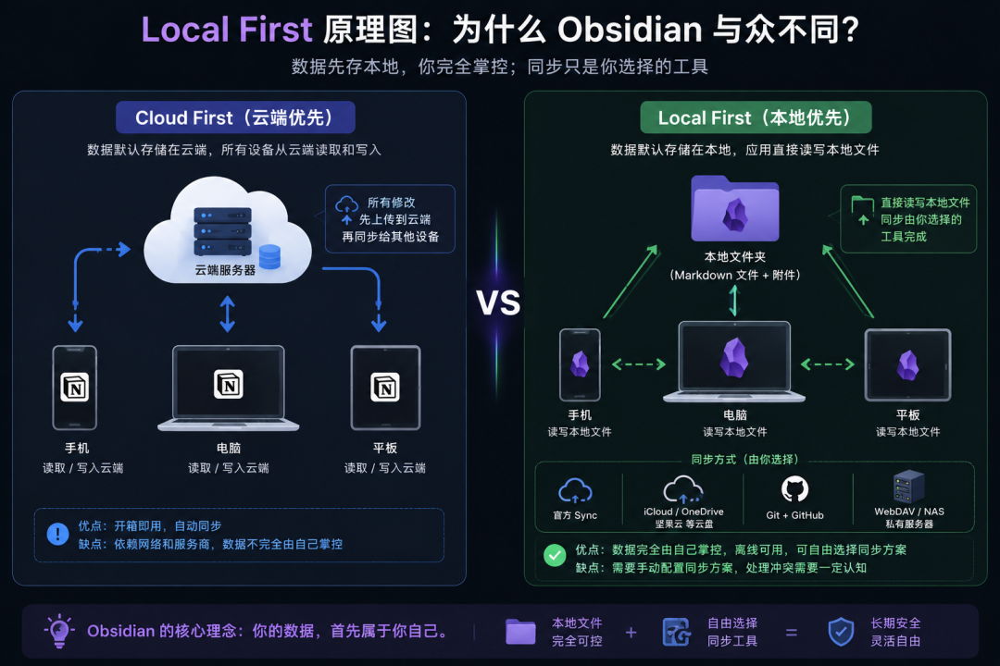
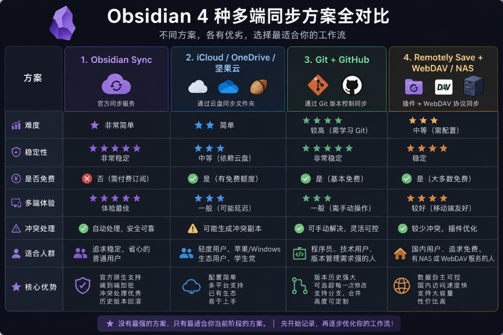
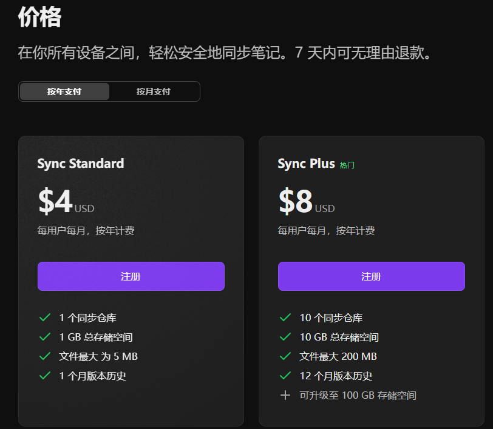
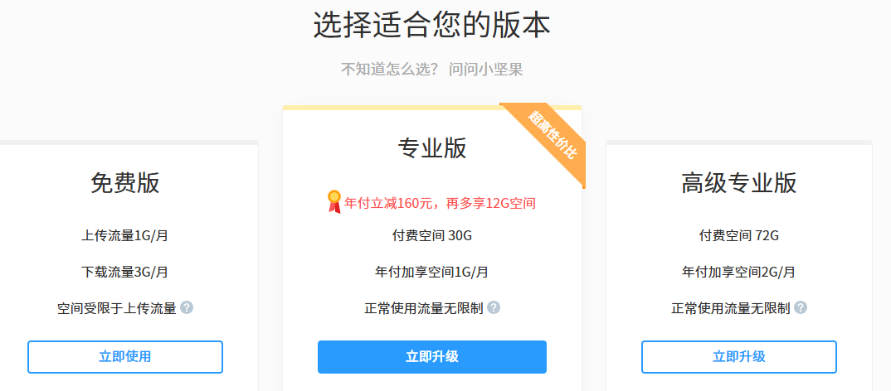
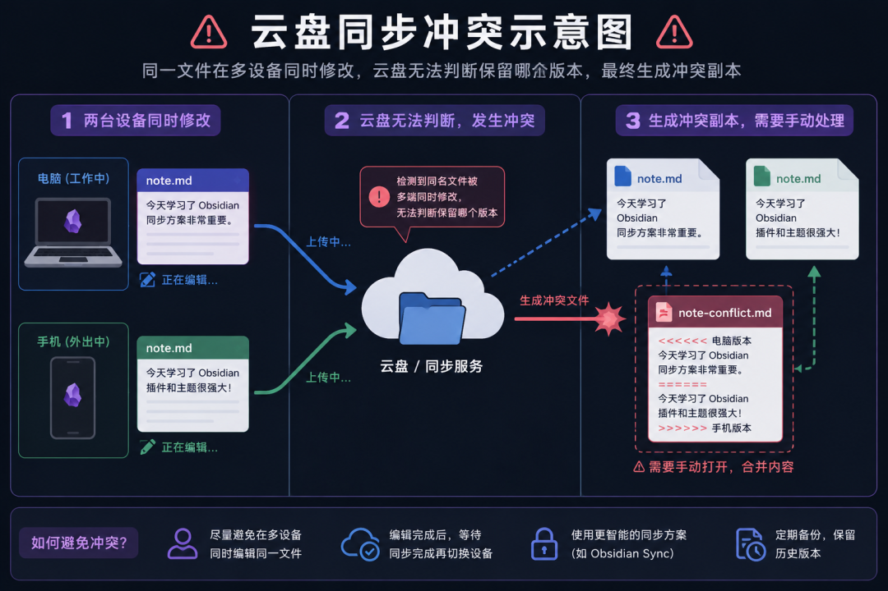
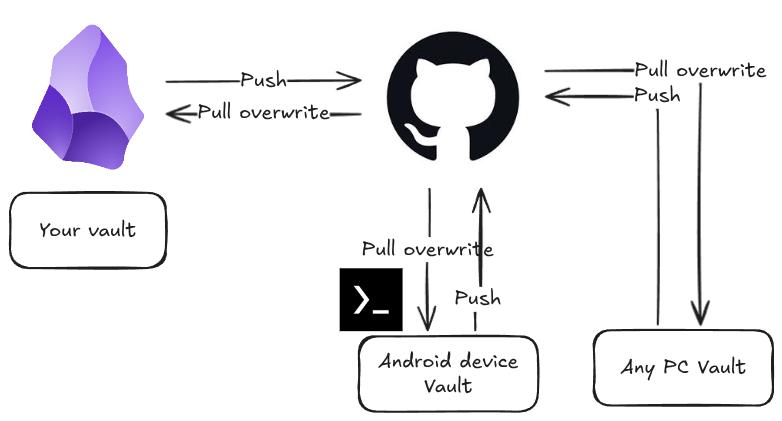
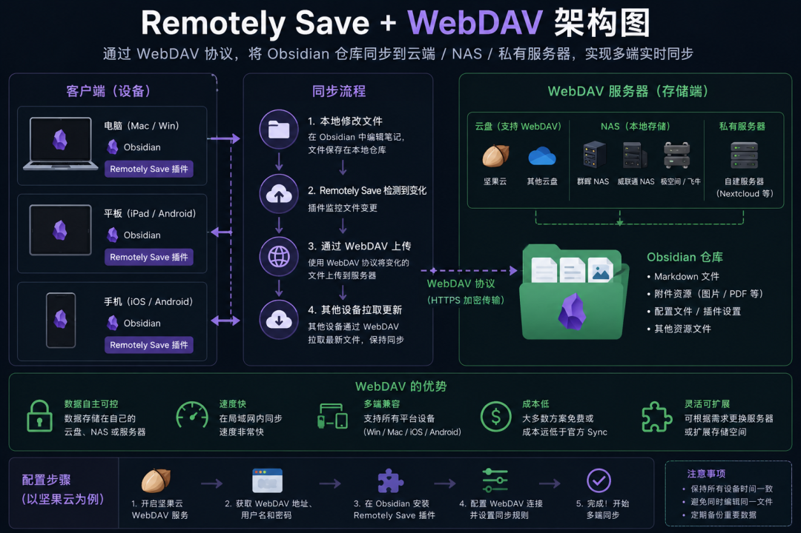

> 📎 来源: [胡巍&amp;互为螺旋](https://mp.weixin.qq.com/s?__biz=MzU2NzgzMzYwNQ==&mid=2247499484&idx=1&sn=48121a398e5dada260568481ec82582a&chksm=fd0b263d421812dc0b80f5677a46e8ebef73e63bac5fb4d3d1da2afbaa25a477b0bc6a3598d0&mpshare=1&scene=1&srcid=0524CIXGu2HGyV7irW2iJyzL&sharer_shareinfo=b61e6b20b7982288ff981c58caa0d033&sharer_shareinfo_first=b61e6b20b7982288ff981c58caa0d033) | 时间: 2026-05-24 11:54

---

# Obsidian 怎么同步？4 套方案深度对比，终于不用折腾了（2026 最新版）

很多人在第一次接触 Obsidian 时，都会被它强大的本地化能力所吸引：Markdown 文件、本地存储、双向链接、插件生态、知识图谱……这些东西组合在一起，很容易会让人产生一种"终于找到了属于自己的第二大脑"的感觉。

但是你也会遇到这样的问题：

公司电脑上写了一半的内容，回家打开 Obsidian 却发现没有同步；手机上修改了一篇笔记，电脑里却还是旧版本；甚至两台设备同时编辑了同一个文件，最后仓库里突然多出一个"冲突副本"。

有些人因为同步过程实在是太折腾而放弃了 Obsidian。

这也是 Obsidian 和 Notion、印象笔记这类云端笔记软件最大的区别。Notion 的数据天然存放在服务器上，同步是默认存在的；而 Obsidian 采用的是 Local First（本地优先）设计，所有笔记本质上都只是你硬盘里的 Markdown 文件。你的数据真正属于你自己，但与此同时，同步这件事也需要你自己解决。

这种设计的好处非常明显：不依赖平台、不怕服务关闭、文件可以随时迁移、数据长期可控。但代价就是，你必须在不同的同步方案之间做选择。

今天这篇文章，我会把目前主流的 4 种 Obsidian 多端同步方案一次讲透，包括：

- 官方 Obsidian Sync
- iCloud / OneDrive / 坚果云
- Git + GitHub
- Remotely Save + WebDAV / NAS

同时也会告诉你：不同类型的人，到底应该选哪一种。

---

# 为什么 Obsidian 的同步问题会这么复杂？



理解这个问题，首先要理解 Obsidian 的设计理念。

传统笔记软件的核心思路是"云端优先"。你在手机上写的内容，本质上是直接保存在服务器里的，电脑端只是把同一份数据重新读取出来。因此对于这类软件来说，"同步"并不是一个独立功能，而是它们天然的工作方式。

但 Obsidian 完全不同。

Obsidian 的核心理念是：

> 你的数据应该首先属于你自己。

因此它并不会强制把笔记上传到官方服务器，而是默认把所有内容直接存储在本地文件夹中。换句话说，你的 Obsidian 仓库，其实就是一个普通文件夹，里面装着 Markdown 文件、图片附件以及配置文件。

这也是为什么 Obsidian 的迁移成本极低。哪怕未来你不用 Obsidian 了，这些 Markdown 文件依然可以被 Typora、VS Code、Logseq、甚至纯文本编辑器直接打开。

但问题也随之而来。

既然数据首先存在本地，那么不同设备之间的数据同步，就必须依赖额外方案来完成。而不同方案之间，又会涉及：是否收费、是否稳定、是否支持移动端、是否容易产生冲突、是否需要技术基础、是否支持大附件、是否能保留历史版本……所以同步这件事，才会成为 Obsidian 新手最容易踩坑的问题之一。

---

# 如果不想研究，直接抄结论



如果你只是想快速得到答案，下面这张表可以帮你快速判断：

| 方案 | 价格 | 移动端 | 冲突处理 | 技术门槛 | 推荐人群 |
| --- | --- | --- | --- | --- | --- |
| Obsidian Sync | 付费（约 $48/年） | ✅ | 强 | 低 | 不想折腾、追求稳定 |
| iCloud / OneDrive / 坚果云 | 免费/低 | ✅ | 弱 | 低 | 轻量用户、苹果生态 |
| Git + GitHub | 免费 | ⚠️ 需配置 | 强 | 高 | 程序员、技术用户 |
| Remotely Save + WebDAV | 插件免费，后端看选型 | ✅ | 中 | 中 | 国内用户首选 |

接下来我会逐一讲解每种方案的优缺点。但如果你只是想快速得到答案，也可以直接参考上面的选择建议。

对于完全不想折腾、只希望稳定同步的人来说，官方的 Obsidian Sync 依然是体验最好的方案。它最大的优势并不是"功能更多"，而是几乎不需要你思考同步这件事，配置完成之后，它会像一个真正成熟的商业产品一样稳定运行。

如果你是苹果全家桶用户，同时使用 Mac、iPhone 和 iPad，那么 iCloud 会是一个非常自然的选择。它虽然并不完美，但在 Apple 生态内部的兼容性已经足够不错。

如果你主要在国内使用，并且希望尽量免费，那么目前最推荐的组合是：

> Remotely Save + 坚果云 WebDAV。

这个方案的平衡性非常好：速度快、移动端体验不错、配置难度也不算高。

而对于已经拥有 NAS 的用户来说，WebDAV 同步会带来非常舒服的体验，因为你的所有数据都完全掌握在自己手里，局域网同步速度也会非常快。

至于 Git + GitHub，则更适合程序员或者已经熟悉 Git 工作流的人。它的版本控制能力极强，但学习门槛也确实是最高的。

另外值得一提的是，很多重度用户实际上会**组合使用多个方案**，比如日常笔记用 Sync，历史归档用 Git。不一定只能选一种，找到适合自己工作流的搭配就好。

如果你只是想解决"手机和电脑能同步"这个问题，那么其实没必要一开始就研究最复杂的方案。很多人最大的误区，就是在同步方案上折腾了一周，结果真正的笔记一篇都没开始写。

---

# 方案一：Obsidian Sync（官方同步）

如果只考虑"稳定、省心、少折腾"，那么官方的 Obsidian Sync 基本没有对手。

它本质上是 Obsidian 官方提供的同步服务，你可以把它理解成"专门为 Obsidian 定制的云同步系统"。和普通网盘不同，它不是单纯同步文件，而是专门针对 Obsidian 的仓库结构、插件配置、附件以及冲突处理做了优化。

配置过程也非常简单。你只需要订阅 Obsidian Sync，然后在桌面端和移动端登录同一个账号，创建远程仓库之后，就可以直接开始同步。

对于绝大多数普通用户来说，这种体验其实已经接近"无感同步"了。

官方 Sync 最大的优势，并不仅仅是"方便"，而是它对冲突问题的处理明显优于普通云盘。很多云盘方案的逻辑其实非常简单：谁最后上传，就覆盖谁。一旦两台设备同时修改同一个文件，系统通常并不知道应该保留哪一个版本，于是就会生成冲突副本。但 Obsidian Sync 对这种情况做了更深度的适配，因此丢数据的概率会低很多。

除此之外，它还支持：历史版本回滚、端到端加密、选择性同步、插件配置同步、附件同步。这些能力叠加起来，会让整个使用体验非常完整。

当然，它最大的缺点也很明显：

> 需要付费。

目前标准版的价格大约 $48/年（折合约每月 4 美元），对于很多人来说并不算贵，但也确实会让一部分用户更倾向于寻找免费方案。



另外，由于服务器位于海外，国内偶尔也会出现同步速度比较慢的情况。不过从长期稳定性来看，它依然是目前最成熟的同步方案。

如果你属于以下类型：不想折腾技术细节、重度使用移动端、希望同步尽可能稳定、愿意花钱节省时间——那么官方 Sync 基本就是最佳答案。

---

# 方案二：iCloud / OneDrive / 坚果云

这一类方案，本质上都是：

> 用云盘来同步 Obsidian 文件夹。

因为 Obsidian 的仓库本来就是普通文件，所以理论上任何支持文件同步的云盘，都可以拿来同步 Obsidian。这是很多用户最早接触的方案，因为它足够直观：你只需要创建一个云盘同步文件夹，把 Obsidian 仓库放进去，所有设备同步这个文件夹，整个流程就完成了。

但真正开始长期使用之后，你会发现："能同步"和"同步体验很好"是两回事。

## iCloud：苹果用户体验最好的一档

对于 Apple 全家桶用户来说，iCloud 是最自然的选择。Mac、iPhone、iPad 本身就深度整合了 iCloud Drive，因此很多时候甚至不需要额外配置。你只需要把仓库放进 iCloud Drive，Obsidian 基本就能自动识别。

它最大的优势在于：原生系统集成、不需要第三方插件、多设备切换顺滑、对苹果生态兼容性好。

但 iCloud 最大的问题，在于它的"优化存储"机制。很多时候，系统会自动把不常用文件转移到云端，以节省本地空间。结果就是：你打开 Obsidian 时，文件可能还没来得及下载完成，于是就会出现空白笔记、图片丢失、同步延迟等问题。因此，如果你准备用 iCloud 同步 Obsidian，建议优先关闭"优化存储"，确保仓库文件始终保存在本地。

## 坚果云：国内用户最常见的免费方案

对于国内用户来说，坚果云一直是非常热门的选择。原因很简单：国内速度快、免费可用、配置简单、对 Markdown 仓库友好。

但它的核心限制并不是空间，而是流量。免费版通常为上传流量约 1GB/月、下载流量约 3GB/月。对于纯文本笔记来说基本够用，但如果开始加入图片、PDF 或 AI 素材，就可能很快触顶，尤其是首次全量同步时。



## OneDrive：Windows 用户的天然选择

对于 Windows 用户来说，OneDrive 的优势在于"系统自带"。尤其是 Office 用户，通常已经默认登录微软账号，因此同步配置会非常方便。

但 OneDrive 有一个长期存在的问题：文件锁定。有时候它会误判某些文件正在使用中，从而导致同步失败或者文件冲突。因此如果你使用 OneDrive，同样建议关闭"Files On-Demand（文件随选）"，确保文件真正下载到本地。

## 云盘方案的共性注意事项



不管你选择 iCloud、OneDrive 还是坚果云，作为云盘方案，它们有一个共同的弱点：**冲突处理能力一般**。

当你在手机和电脑上同时修改同一个文件，云盘通常会直接生成一个冲突副本，需要你手动合并内容。所以使用云盘方案时，请记住一条铁律：

> 不要同时在两台设备编辑同一个文件。

此外还有几个常见坑需要注意：

- 第一次同步前先备份仓库，避免同步异常导致数据丢失
- 仓库里尽量不要放大量视频文件，会严重拖慢同步速度
- 移动端注意云盘 App 的后台存活状态，被系统杀掉后同步会中断
- 频繁切换设备时，给云盘留一点同步时间再开始编辑

---

# 方案三：Git + GitHub



Git 方案是典型的"程序员浪漫"。

它的核心思路，是把你的 Obsidian 仓库当成一个代码仓库来管理。每次修改之后：自动 Commit → 自动 Push → 自动 Pull。从某种意义上来说，它甚至不是"同步工具"，而是一套完整的版本管理系统。

Obsidian 社区有一款叫 **Obsidian Git** 的插件，可以在 Obsidian 内直接完成自动 Commit、Push、Pull，不需要你手动操作命令行。即便你不是程序员，配合这个插件也能用起来——只是遇到冲突时还是需要了解一些 Git 基础知识。

Git 最大的优势，在于历史记录极其强大。你不仅能知道哪天改了什么、删除了什么、增加了什么，甚至还能精确对比不同版本之间的差异。对于长期写作用户来说，这种能力其实非常有价值。

而且 Markdown 与 Git 的适配度天然极高，因为 Git 本身就非常擅长管理纯文本文件。

但问题也很明显：Git 的学习门槛非常高。你需要理解 Commit、Push、Pull、Merge、Branch、Conflict 等概念，否则一旦出现冲突，很容易直接懵掉。另外，Git 对图片、PDF 这类二进制文件并不友好。如果你的仓库里有大量附件，仓库体积会迅速膨胀。

因此，Git 更适合：程序员、技术用户、长期写作用户、已经熟悉 Git 工作流的人。而不太适合作为新手的第一套同步方案。

---

# 方案四：Remotely Save + WebDAV（最推荐的免费方案）



这可能是目前综合体验最平衡的一套方案，尤其是对于国内用户。

它的核心结构是：

```
Obsidian↓Remotely Save 插件↓WebDAV↓坚果云 / NAS / 私有服务器
```

其中，Remotely Save 是 Obsidian 社区非常成熟的同步插件，而 WebDAV 则是一种远程文件同步协议。简单理解的话，你可以把 WebDAV 当成"远程文件夹"。很多 NAS、云盘甚至服务器，都支持 WebDAV。

这个方案最大的优势，在于它同时兼顾了：免费、多端同步、国内速度、移动端支持、数据自主。而且相比 Git，它不需要太多技术基础。

目前最推荐的新手组合是：**Remotely Save + 坚果云 WebDAV**。配置完成之后，整体体验已经非常接近官方 Sync。

如果你本身有 NAS，比如极空间、群晖、飞牛、威联通，那么体验还会进一步提升。因为你的所有数据都完全存储在自己的设备中，同时局域网同步速度也会非常快。对于很多长期用户来说，NAS + WebDAV 基本已经是终极方案之一。

> **注意事项：** Remotely Save 是社区维护的第三方插件，存在开发者停止维护的可能。建议关注插件更新动态，同时保留一份备用同步方案。

---

# 最后说一句

我后来发现，很多人卡在 Obsidian，并不是因为不会记笔记。

而是：

> 花太多时间折腾工具，花太少时间真正思考。

同步方案其实没有真正意义上的"最强"，只有最适合你现在阶段的方案。

如果你是新手，就先选最简单、最稳定的方案，让自己真正开始记录。等你长期使用之后，再慢慢升级自己的工作流。与其花一周研究同步方案，不如现在就花 10 分钟配好一个能用的，然后关掉这篇文章，去写你的第一篇笔记。

因为同步从来都只是手段。真正重要的，始终是：你是否在持续思考、持续记录。

---

# 常见问题 FAQ

**Q：我换了手机 / 电脑，Obsidian 仓库怎么迁移？**
A：不管用哪种同步方案，核心都是同步你的仓库文件夹。在新设备上安装 Obsidian，配置好同步，等文件同步完成即可。如果你用的是 Obsidian Sync，登录同一个账号就能恢复。

**Q：Obsidian Sync 的数据存在哪里？安全吗？**
A：数据存储在 Obsidian 的官方服务器上（位于海外）。它支持端到端加密，加密密钥由你自己保管，连 Obsidian 官方也无法查看你的内容。如果你非常在意数据安全，可以考虑 NAS + WebDAV 的方案，数据完全在自己手里。

**Q：我可以同时用两种同步方案吗？**
A：可以，但需要注意避免两套方案同时同步同一个文件夹，否则可能造成冲突。一个常见的做法是：用一套方案做主力同步，另一套方案同步特定子文件夹或做备份。

**Q：坚果云免费版不够用了怎么办？**
A：可以考虑升级坚果云付费版、切换到 Remotely Save + NAS 方案、或者搭配使用 Obsidian Sync（坚果云适合日常轻量同步，Sync 处理重要笔记）。

 

 

> Tip

> 我整理了一份Obsidian安装包和常用插件(持续更新)。
> 需要的可以：
> 👉 点个赞 + 在看
> 👉 后台回复：Obsidian
> 我把整套直接发你。
