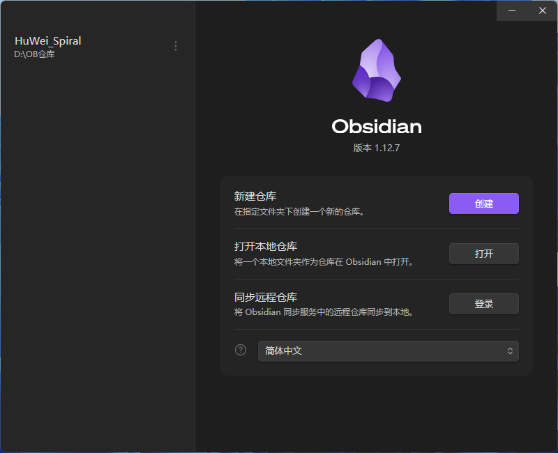
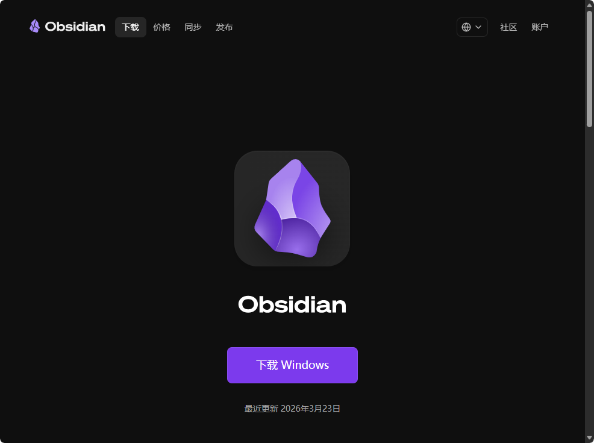
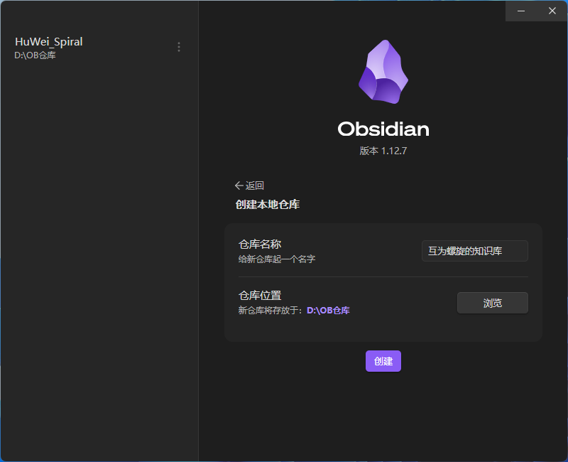
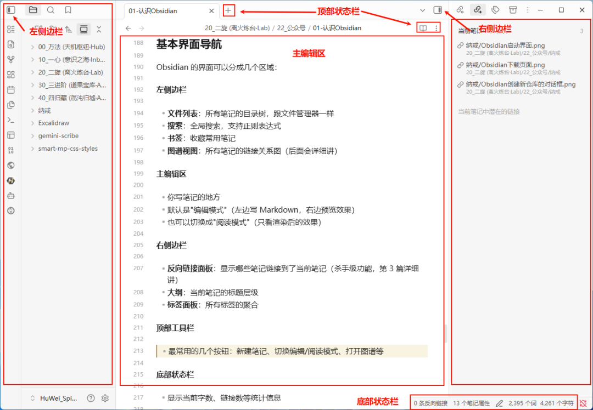

> 📎 来源: [胡巍&amp;互为螺旋](https://mp.weixin.qq.com/s?__biz=MzU2NzgzMzYwNQ==&mid=2247498733&idx=1&sn=557db050b51aedaab587ce48d41288df&chksm=fd5dce04e63968bb2e89e0e20df69a207a5c46d77ae550e991a96e44d53b6bc7ca7ec33b22cf&mpshare=1&scene=1&srcid=052467O0Y2ZY69TwF8Llv5GK&sharer_shareinfo=61d1db1e86ed25361aca6ce75c29de9a&sharer_shareinfo_first=61d1db1e86ed25361aca6ce75c29de9a) | 时间: 2026-05-24 11:55

---

如果你厌倦了笔记散落在各个 App 里，厌倦了 Notion 每次打开都要等加载，厌倦了"我的数据我做不了主"——Obsidian 就是你一直在找的东西。

它不是一个笔记工具。它是一个**知识管理系统**，装在你自己电脑上，数据永远是你的。

· · ·

## Obsidian 是什么？

一句话：**一个基于 Markdown 文件的本地图形化笔记应用**。

拆开来说：

- **本地优先**：所有笔记就是文件夹里的 .md 文件，没有云、没有数据库、没有厂商
- **双向链接**：笔记之间可以用 [[页面名]] 互相关联，形成知识网络
- **插件生态**：核心功能精简，但通过社区插件可以扩展成几乎任何形态
- **离线可用**：断网？照样写。飞机上？照样用

它长得像代码编辑器，但用起来比你想的简单得多。

Obsidian启动界面

· · ·

## Obsidian vs Notion vs Logseq vs 飞书

我知道你想问：跟我现在用的工具比呢？

**Obsidian vs Notion**

- Notion 是"在线文档协作工具"，Obsidian 是"个人知识管理工具"
- Notion 的数据存在 Notion 服务器上，Obsidian 的数据在你硬盘上
- Notion 依赖网络，Obsidian 完全离线
- Notion 用 Block 编辑器，Obsidian 用 Markdown 纯文本
- Notion 适合团队协作，Obsidian 适合个人深度使用
- Notion 可以导出，但格式转换痛苦；Obsidian 的文件本身就是通用格式

**Obsidian vs 飞书**

- 飞书是"企业协作平台"，文档只是其中一个模块（还有即时通讯、日历、多维表格等）
- 飞书文档同样存在云端，需要登录才能访问，数据归属企业而非个人
- 飞书文档适合团队共创、会议纪要、项目管理，强项在于"协作"而非"个人知识沉淀"
- 飞书不支持双向链接和知识图谱，笔记之间的关联靠手动建链接
- 飞书的搜索是全文检索，但无法像 Obsidian 那样通过链接网络发现知识间的隐藏联系
- 飞书文档导出为 Markdown 后可以导入 Obsidian，但表格、嵌套块等复杂格式会丢失

**Obsidian vs Logseq**

- 都是本地优先，都用 Markdown，都有双向链接
- Logseq 是**大纲式**（类似 Workflowy），Obsidian 是**文档式**（类似传统笔记）
- Logseq 更适合日志型记录，Obsidian 更适合长文+网络化知识管理
- Obsidian 插件生态更大（1500+ vs 几百个）
- Logseq 的学习曲线更陡峭，Obsidian 上手更直观

**一句话总结各自定位：**

- 飞书：**企业协作平台**，团队开会、写方案、管项目，强在协同效率
- Notion：**在线文档+数据库**，团队知识库、项目管理、轻量协作
- Logseq：**大纲式本地笔记**，日志流记录、线性思考者
- **Obsidian：个人知识操作系统**，长期主义的知识管理，数据完全自主

· · ·

## "本地优先"意味着什么？

这是 Obsidian 最重要的设计哲学，值得单独说。

**数据安全**

你的笔记就是一堆 .md 文件，放在你指定的文件夹里。没有隐藏的数据库，没有加密的容器。你可以用任何文本编辑器打开它们——VS Code、记事本、甚至终端的 cat 命令。

这意味着什么？意味着即使 Obsidian 公司明天关门，你的笔记依然完好无损。

**离线可用**

不需要网络。不需要同步。不需要登录。打开就写。

飞机上、地铁里、山里的咖啡馆——你的笔记永远不会因为"网络连接超时"而打不开。

**无厂商锁定**

- 文件格式是标准 Markdown，任何工具都能读
- 可以随时用 iCloud、Dropbox、Git、Syncthing 等任何方式同步
- 可以随时迁移到其他 Markdown 工具（Typora、VS Code、Logseq……）
- 想走就走，没有任何阻力

这不是"功能"，这是**自由**。

· · ·

# Obsidian 真正迷人的，不是记笔记

使用Obsidian记录，它会慢慢长成你的「第二大脑」。

很多工具的逻辑是：

> “把内容存进去。”

但 Obsidian 的逻辑是：

> “让知识彼此产生连接。”

当你写了 100 篇、300 篇、1000 篇笔记之后：

- 某个灵感会突然连到三年前的一条记录
- 一本书里的观点会和你的项目经验碰撞
- 一个 AI 工作流会和某篇认知文章形成组合

这时候你会发现：

你已经不是在“管理笔记”。

你是在训练自己的思维网络。

· · ·

## 安装 Obsidian

### 下载地址

官网：⇲https://obsidian.md/download

支持全平台：

- Windows（.exe 安装包 / 便携版）
- macOS（.dmg）
- Linux（.AppImage / .deb / .flatpak）
- iOS / Android（移动端，后面文章会讲）

### 安装步骤（以 Windows 为例）

1. 下载 .exe 安装包
2. 双击运行，选择安装路径
3. 安装完成后启动

Mac 用户：下载 .dmg，拖到 Applications 即可。Linux 用户：下载 .AppImage，chmod +x 后直接运行。

整个安装过程不到 1 分钟。
（不含下载时间，下载时间由网络环境决定）

Obsidian下载页面

· · ·

## 首次启动：创建你的第一个仓库

启动 Obsidian 后，你会看到一个欢迎界面，问你"创建新仓库"还是"打开已有仓库"。

**仓库（Vault）** 是 Obsidian 的核心概念。一个仓库 = 一个文件夹 + Obsidian 的配置数据。

操作步骤：

1. 点击"创建新仓库"
2. 给仓库起个名字，比如"互为螺旋的知识库"
3. 选择存储位置（建议选一个方便备份的路径）
4. 点击"创建"

完成。你的仓库建好了。

打开文件管理器看一下——你选择的文件夹里多了一个 .obsidian 隐藏文件夹（存配置），以及一个欢迎页面。

就这么简单。一个文件夹，就是你的整个知识库。

Obsidian创建新仓库的对话框

· · ·

## 基本界面导航

Obsidian 的界面可以分成几个区域：

**左侧边栏**

- **文件列表**：所有笔记的目录树，跟文件管理器一样
- **搜索**：全局搜索，支持正则表达式
- **书签**：收藏常用笔记
- **图谱视图**：所有笔记的链接关系图（后面会详细讲）

**主编辑区**

- 你写笔记的地方
- 默认是"编辑模式"（左边写 Markdown，右边预览效果）
- 也可以切换成"阅读模式"（只看渲染后的效果）

**右侧边栏**

- **反向链接面板**：显示哪些笔记链接到了当前笔记（杀手级功能，第 3 篇详细讲）
- **大纲**：当前笔记的标题层级
- **标签面板**：所有标签的聚合

**顶部工具栏**

- 最常用的几个按钮：新建笔记、切换编辑/阅读模式、打开图谱等

**底部状态栏**

- 显示当前字数、链接数等统计信息

**关键快捷键**（先记住这几个就够）：

- Ctrl/Cmd + N：新建笔记
- Ctrl/Cmd + E：切换编辑/阅读模式
- Ctrl/Cmd + O：快速打开笔记（模糊搜索）
- Ctrl/Cmd + P：命令面板（什么操作都能从这里找）

Obsidian 完整界面，标注各区域名称

· · ·

## 核心概念速览

在开始写笔记之前，搞清楚四个核心概念：

**仓库（Vault）**

一个仓库就是一个独立的知识库。你可以有多个仓库（比如"工作"和"个人"），但大多数情况下一个就够了。

仓库本质上就是一个文件夹。里面的每个 .md 文件就是一篇笔记。

**笔记（Note）**

一篇笔记 = 一个 Markdown 文件。就这么简单。

你可以用文件夹组织笔记，也可以不组织——Obsidian 的链接系统让你不需要严格的文件夹分类。

**链接（Link）**

这是 Obsidian 最强大的地方。在任意笔记里输入 [[另一个笔记的名字]]，就创建了一个链接。点击这个链接就能跳转。

更厉害的是：被链接的笔记会自动知道"谁链接了我"——这就是双向链接。

举个例子：

你在笔记 A 里写了 [[费曼学习法]]，即使笔记"费曼学习法"还不存在，这个链接也会出现在反向链接面板里。等你有空了，点一下这个链接，自动创建那篇笔记。

你的知识不是散落的纸片，而是一张**网**。

**插件（Plugin）**

Obsidian 的核心功能很精简，但它有一个庞大的社区插件生态——目前有 2700+ 个插件，几乎可以把 Obsidian 改造成任何形态的工具。

插件分两类：

- **核心插件**：Obsidian 自带的，开关即可启用（比如日记、模板、音频录制）
- **社区插件**：由第三方开发者制作，在 Obsidian 设置里直接搜索安装（比如 Dataview 查询、Excalidraw 绘图、Templater 高级模板）

一些高频必装插件：

- **Templater**：笔记模板，支持变量和脚本
- **Dataview**：用类 SQL 语法查询你的笔记库，自动生成列表和表格
- **Calendar**：日历视图，配合日记插件使用
- **Kanban**：在笔记里创建看板

但还是那句话——插件是锦上添花。先把笔记写起来，需要什么功能再去找对应的插件。

· · ·

## 一个重要提醒

**不要被"配置"吓到。**

Obsidian 开箱即用就能写笔记。插件、主题、高级配置——这些是锦上添花，不是入门门槛。

现在你要做的就一件事：**打开 Obsidian，新建一篇笔记，随便写点什么。**

感受一下那种"数据在我手里"的踏实感。

· · ·

我整理了一份Obsidian安装包和常用插件。

需要的可以：

👉 点个赞 + 在看
👉 后台回复：Obsidian

我把整套直接发你。

· · ·

## 💬 互动话题

**你之前用过什么笔记工具？为什么放弃了？** 评论区聊聊，你肯定不是一个人。

📌 正在用 Obsidian 的，评论区扣个"在用"，让我看看有多少同道中人。

· · ·

## 下期预告

第 2 篇我们来学 Markdown——但别紧张，不是为了学语法而学语法，只学 Obsidian 里**真正用得到的**那部分。10 分钟够用，30 分钟精通。
