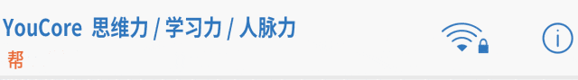
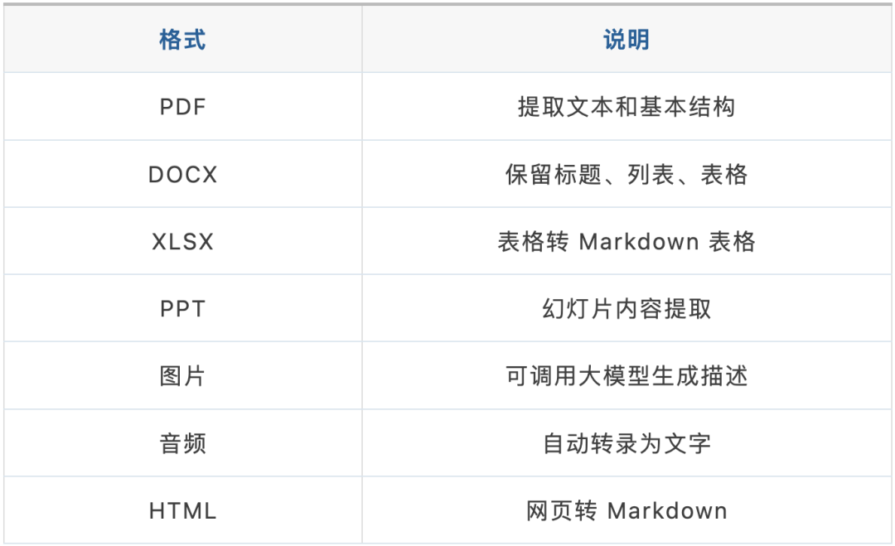
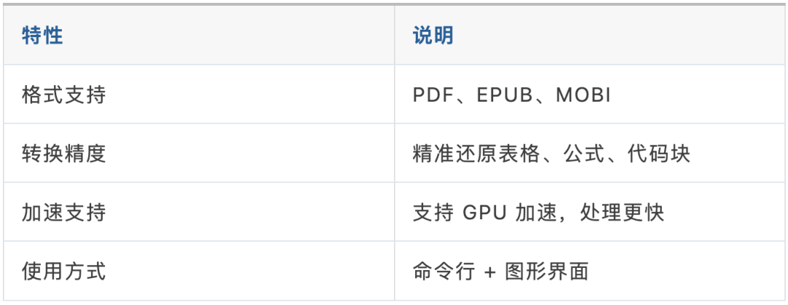
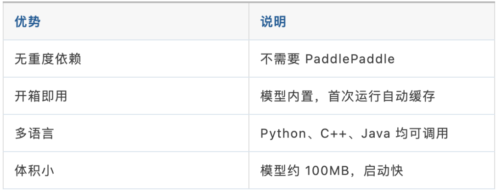
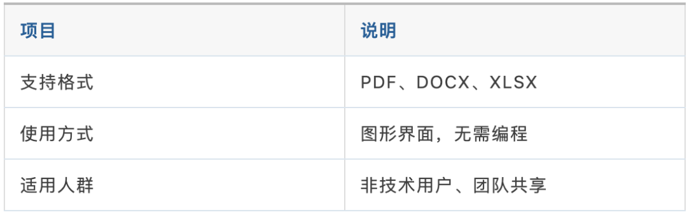
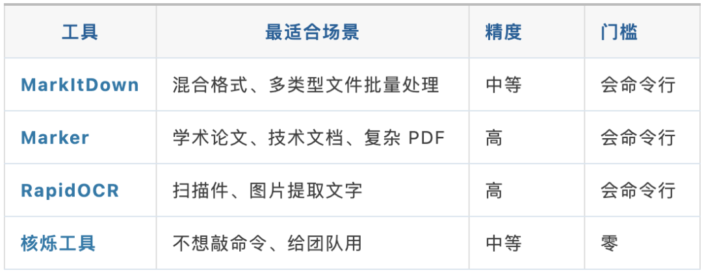
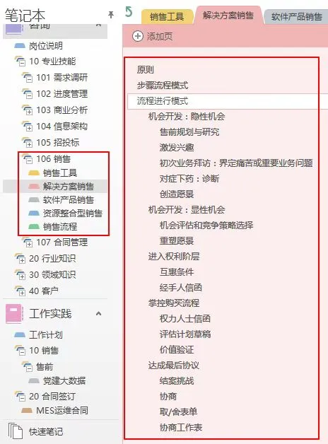

> 📎 来源: [YC思维与学习](https://mp.weixin.qq.com/s?__biz=MzY5MjI4NjA4Mg==&mid=2247483712&idx=1&sn=9e08e19137fd7eb180e1e6945d07335e&chksm=f5296f9b35b0d4948856993ca3038afc7bb976528e3de78722b242b4fc8b74af196ee8cff1f6&mpshare=1&scene=1&srcid=0510PIWJD8iD1fN8rhb6yyIS&sharer_shareinfo=143e604fd8ea33acd26a4dcf0a9e6184&sharer_shareinfo_first=143e604fd8ea33acd26a4dcf0a9e6184) | 时间: 2026-05-10 18:44

---



文 / 王世民

深圳尔雅总裁 | YouCore创始人

著有《思维力》《学习力》《减法》

#

不知道你有没有过这样的经历：

同事发来一份 PDF 报告，你想把它存进 Obsidian 做知识管理。手动复制粘贴，格式全乱；表格变成一堆散落的数字，图片直接消失。

或者老板丢来 50 份 Word 文档，让你整理成笔记。你看着文件夹，心想：这得搞到什么时候？

更别说 Excel 表格——想在 Obsidian 里保留表格结构，几乎是不可能的任务。

**有没有办法，一个命令下去，文件夹里所有 PDF、DOCX、XLSX 全部自动变成干净的 Markdown？**

答案是：有。而且不止一个工具。

今天给你介绍四款文档转 Markdown 工具，覆盖不同场景，从命令行一键批量到零代码图形界面，总有一款适合你。

01

MarkItDown：微软开源的全能转换器

MarkItDown 是微软开源的文档转换工具，一个命令就能把几乎所有常见格式转成 Markdown。

**格式支持范围令人吃惊：**



**安装只需一行命令：**

```
pip install 'markitdown[all]'
```

装好后，一个命令开始转换：

```
# 转换单个文件 markitdown 报告.pdf -o 报告.md  # 批量处理整个文件夹（Python 脚本）
```

**它的优势很明显：格式覆盖面极广，什么文件丢进去都能出来 Markdown。而且微软维护，持续更新。**

但也有短板：对复杂 PDF（含公式、图表）的转换精度一般，表格还原度不如专用工具。如果你要处理学术论文或技术文档，继续往下看。

02

Marker：学术 PDF 转换专家

如果你处理的是学术论文、技术手册这类排版复杂、公式密集的 PDF，Marker 是更好的选择。

> 它原本就是为学术场景设计的——精准处理复杂布局、数学公式、代码块，效果远优于通用工具。

**核心能力一览：**



**安装（需要 Python 3.10+）：**

```
pip install "marker-pdf[full]"
```

**一句话定位：** 如果 MarkItDown 是瑞士军刀，Marker 就是手术刀——支持的格式少，但在 PDF 这一个点上做得极深。

它的不足也明确：不支持 DOCX 和 XLSX，中文 PDF 的处理效果可能不如英文。选它之前，先确认你的文件类型和语言。

03

RapidOCR：轻量级图片文字提取

扫描件、截图里的文字怎么办？前面的工具处理不了纯图片中的文字——这时候你需要 OCR。

RapidOCR 是目前最优的轻量级选择。

> 传统的 PaddleOCR 需要安装 PaddlePaddle，依赖庞大、部署复杂。RapidOCR 彻底去掉了这个依赖，改用 ONNX Runtime 做推理——轻量、快速、开箱即用。

**它的核心优势：**



**安装：**

```
pip install rapidocr_onnxruntime
```

**适用场景：** 你有扫描版 PDF 或手机拍的文件照片，需要先 OCR 提取文字，再转 Markdown。它专注于图片文字识别这一件事，做得干净利落。

注意：RapidOCR 只做 OCR，不直接处理 PDF。你需要先把 PDF 拆成图片，再用它识别。

04

核烁工具：零代码批量处理

前面三个都是命令行工具。如果你不写代码，或者需要让同事也能用——

核烁文档批量处理工具是国产生图形界面方案，PDF、DOCX、XLSX 批量转 Markdown，点几下鼠标就完成。



官网下载安装即可使用，操作逻辑和普通软件一样，这里不展开。

05

四款工具怎么选？

四款工具不是竞争关系，而是**各管一块**。我把它们放到一张表里，你的选择会很清楚：



**一句话总结：**

◆ 文件格式杂、什么都有 → **MarkItDown** ，一个工具全搞定

◆ 学术论文、技术 PDF → **Marker** ，精准还原公式和表格

◆ 扫描件、截图里的文字 → **RapidOCR** ，先把文字提出来

◆ 不想碰命令行 → **核烁工具** ，图形界面直接操作

**而且，MarkItDown + RapidOCR 可以组合使用——先用 OCR 把扫描件识别出文字，再用 MarkItDown 统一转 Markdown。** 这样就连扫描版文档也能进入你的 Obsidian 知识库。

06

行动指南：现在就开始

面对四款工具，你可能想：先装哪个？

我的建议是——**按你的主力场景，先装一个，5 分钟内跑通第一个文件：**

**主力场景是混合格式（PDF/Word/Excel 都有）：**

```
pip install 'markitdown[all]'
```

**主力场景是学术 PDF 或技术文档：**

```
pip install "marker-pdf[full]"
```

**有扫描件或图片需要提取文字：**

```
pip install rapidocr_onnxruntime
```

**不想写代码：**

直接下载核烁工具，图形界面操作。

---

过去，把一份 PDF 转成可用的 Markdown 笔记，可能比读它本身还要费时间。结果就是——文件躺在下载文件夹里，再也不打开。

但从今天起，你不用再手动复制粘贴了。装好对应工具，一个命令，文件夹里所有的 PDF、DOCX、XLSX 全部变成你的 Obsidian 笔记。

**这才是知识管理该有的效率。**

如何构建专属于你的知识体系，我也已经梳理成SOP模板了，你直接照抄即可。



关注公众号，回复“模板”

获取《知识体系》搭建模板👇
