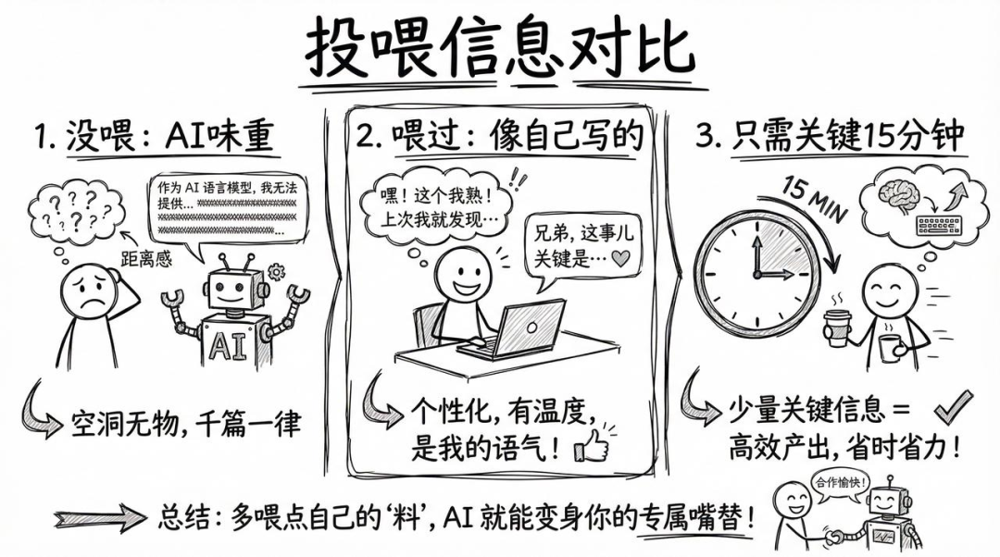
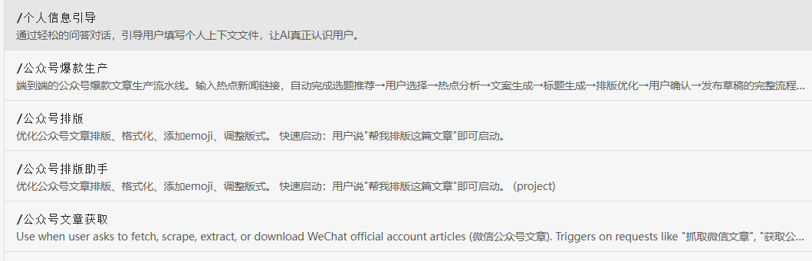
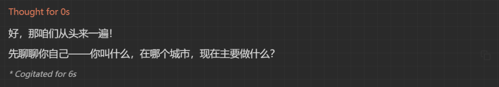
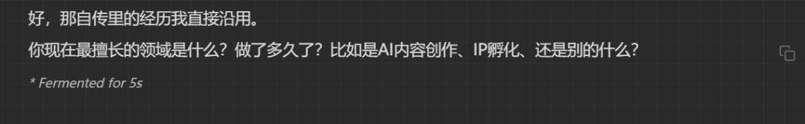
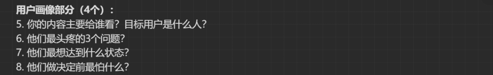
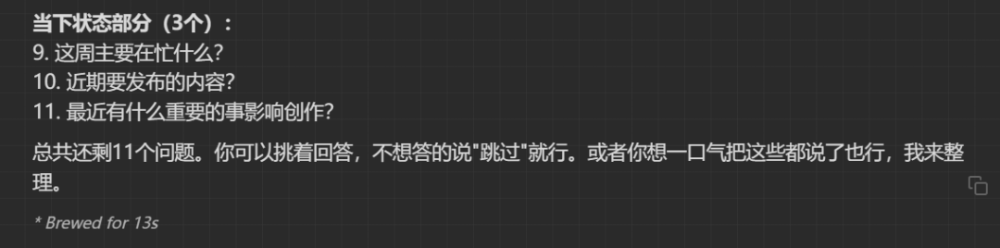

> 📎 来源: [小七的AI破局](https://mp.weixin.qq.com/s?__biz=MzcwMjI3OTQyOQ==&mid=2247483768&idx=1&sn=facc59e7fcdaf991d937e8536b46d6f1&chksm=f5cbbdadfd7dba0799f4d9e145cbca4617bab7f3bf9301db25ae67bc118111d27041da59574b&mpshare=1&scene=1&srcid=0506IYk5oshvMZOBOVOm0ypG&sharer_shareinfo=fe6b55b7a8f5f2617c88f5ad38ef9ae2&sharer_shareinfo_first=fe6b55b7a8f5f2617c88f5ad38ef9ae2) | 时间: 2026-05-06 03:57

---

用AI写文章，最大的问题不是AI不够强，是AI不认识你。

没有上下文的AI写出来的文章千篇一律，"AI味"很重。

同样一个选题：

**没喂过个人信息**：AI写的像模板，谁用都一样，读者一看就知道是AI写的。

**喂过个人信息**：AI知道你的行业、风格、受众，写出来像你自己写的。

区别就在这一步：**让AI认识你**。

## 为什么要做这一步

你直接对AI说"帮我写一篇关于程序员副业的文章"，AI什么都不知道，它只能给你一个通用模板。

但如果你告诉AI：你是谁、你经历过什么、你的读者是谁、你喜欢什么风格，写出来的东西完全不一样。

**这不是可选项，是必选项。**



## 系统里专门有一个技能帮你做这件事

在我的Obsidian系统里，我做了一个Skill叫「个人信息引导」。

打开Claudian对话窗口（点左侧对话气泡图标）,然后使用这个技能就可以进行对话了,这个技能它不是一个冰冷的问卷，他会像朋友一样,一步步问你各种问题，你只需要回答就行。




**全程聊天式，建议至少聊15分钟。**

分三个阶段：

### 第一阶段：个人自传（最重要）

AI会像朋友聊天一样逐步问你：

- 你叫什么，在哪个城市，做什么工作
- 你的职业经历和转折点
- 你最擅长的领域，做了多久
- 你在卖什么产品或服务（课程、咨询、社群等）
- 值得一提的数据（粉丝量、收入、阅读量等）
- 你喜欢什么写作风格，讨厌哪些AI写法

填完后自动保存到 

```
04.我的上下文/我的个人上下文/个人自传（持续更新）.md
```







### 第二阶段：用户画像

AI会继续问：

- 你的内容主要给谁看（目标用户画像）
- 他们最头疼的3个问题
- 他们最想达到的状态
- 他们最大的顾虑

填完后自动保存到 

```
01.用户画像/我的用户画像.md
```




### 第三阶段：当下状态

AI会问：

- 你这周在忙什么
- 近期要发布什么内容

填完后自动保存到 

```
04.我的上下文/我的个人上下文/当下每时每刻（持续更新）.md
```




## 效果对比：有上下文 vs 没上下文

给你看一个真实对比。

同样是让AI写一篇「程序员如何用AI做能赚钱的产品」：

**没喂过个人信息：**

AI会给你一篇标准模板：先讲AI趋势，再列3个方向，最后鼓励你行动。谁写都一样，谁看都记不住。

**喂过个人信息后：**

AI知道你是个10年全栈工程师，在合肥工作，经历过裁员，靠AI副业半年做到月入2万。它会用你的故事开头，用你的行业语言写，针对你的读者群体。写出来的文章，**就像你自己坐在电脑前敲出来的**。

这就是区别。

## 兜底操作

如果聊天完成后AI没有自动保存，还可以把这段指令发送给它：

> 把刚才的内容分别保存到：

> 1. ```
>    04.我的上下文/我的个人上下文/个人自传（持续更新）.md
>    ```
> 2. ```
>    01.用户画像/我的用户画像.md
>    ```
> 3. ```
>    04.我的上下文/我的个人上下文/当下每时每刻（持续更新）.md
>    ```

发完就存好了。

## 这套系统的价值

让AI认识你，只是"30分钟内容工厂"的第一步。

但它解决了AI写作最核心的问题：**AI味**。

以前，我让AI写文章，写出来的东西通顺但没灵魂。读者一看就知道是AI写的，不会转发，不会收藏，更不会信任。

现在，我花15分钟填完个人上下文，AI写出来的文章像我自己写的。用我的经历开头，用我的语言表达，针对我的读者群体。

节省的不只是时间，还有信任成本。

你不用再担心AI写出来的东西没人看，不用再一遍遍改稿去掉AI味，不用再纠结要不要用AI。

AI认识你之后，它就是你的分身。

更重要的是，这套方法是可复制的。

不管你做什么赛道，公众号、小红书、知乎、视频号，只要你需要AI帮你写内容，这一步都是必须的。

核心逻辑是通用的：**上下文 → 风格 → 输出**。

这就是让AI认识你的价值。

## 下一步：IP线索深度挖掘

个人上下文填完了，AI认识你了。

但这只是第一步。

你可能会发现，填完个人自传后，AI写出来的文章还是有点平。

为什么？

因为你只告诉了AI你是谁、做什么、擅长什么，但没有告诉AI你的**故事**。

那些让人记住的内容创作者，都有自己的故事：

- 裁员后如何逆袭
- 从月薪3000到年薪百万的转折点
- 做副业踩过的坑和血泪教训

这些故事，才是你的IP价值。

所以下一步，我要讲**IP线索深度挖掘**。

怎么通过11条线索，把你的人生经历挖出来？

怎么让AI帮你整理出一份完整的人生自传和IP价值清单？

怎么把这些故事变成你的内容素材库？

这些，我们下一篇聊。
