> 📎 来源: [微糖小二](https://mp.weixin.qq.com/s?__biz=MzE5ODA5OTY1MQ==&mid=2247483865&idx=1&sn=51ba0cf6a4f34bfcea00250599a4623b&chksm=97697f4e5cd3fc99285e296deafdba9ac699c1e53b53227c187ac21791f5f7c73f2c4254ed88&mpshare=1&scene=1&srcid=0509v4oYAn8xq8loakPxF6O4&sharer_shareinfo=983d4c142a3af62fe982d7ab92cc37e1&sharer_shareinfo_first=983d4c142a3af62fe982d7ab92cc37e1) | 时间: 2026-05-09 23:13

---

小二准则【不为学习而学习，严格遵循**二八法则**】。

本地知识库的痛点

Obsidian本地知识库搭建有一段时间了，刚开始，觉得AI的回答比较精准，能够理解用户意图，检索出来的文档和回复也比较满意。

但当文档多了之后，会有这样的感觉，还是不够智能，同样的问题，每次都需要重新引导AI来进行回复，AI没有积累，没有成长。

如想知道《金字塔原理》这本书和表达力训练的关联关系.

第一次，让AI结合《金字塔原理》这本书找到表达力训练相关的语料，再给一段个人表达的亲身经历文档，让它梳理出优化点和建议。

过一段时间，再给一份经历文档，回答已经偏离了金字塔原理方法论，整个感觉，就是每次回答都需要重新校正，没有沉淀。

最近，AI大神Karpathy提出了一套构建本地llm.wiki知识库的方法论。

如何让大模型从“临时回答工具”变成“长期知识维护者”，并且使个人知识管理实现复利增长。

简单的说，让本地知识库拥有不断沉淀和进化的能力，越用越智能。

在正式开始搭建这套知识库架构之前，先了解基本架构。

Karpathy知识库的基础架构

整个架构分为三层。

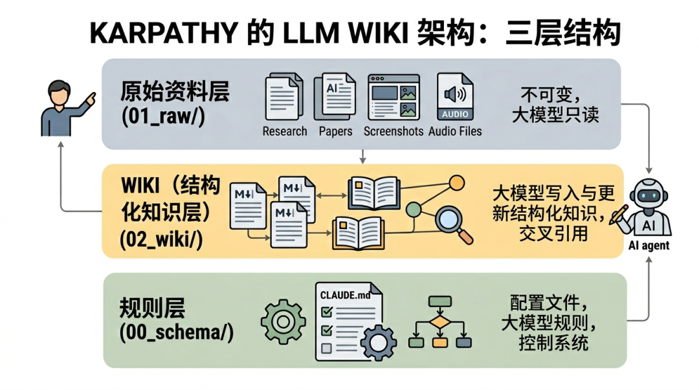

第一层，Raw sources（原始资料层）。

用来存放原始文档，如文章、图片、数据文件等，这一层严格要求不修改，只读取，不写入，使用者只管收集原始物料，存放在指定目录下就行。

第二层，Wiki（结构化知识层）。

存放 LLM 生成的摘要、对比分析、总览综述等Markdown 文件。

这个目录由大模型独立负责wiki文档的创建、更新、维护交叉引用等操作，人工不进行任何更新操作，只做阅读使用。

第三层，Schema（规则层）。

本质上就是一个配置文件，如CLAUDE.md /AGENTS.md，放在vault根目录，用于限定大模型在使用知识库时的规则，配置中会描述关于知识库结构，使用惯例，以及在摄入资料，回答问题和维护 wiki 时应该遵循的流程。

三层架构中，核心是wiki，它是原始资料和llm的中间产物，是每一次llm的结果和原始物料的关联关系，具有结构化，相互连接的特点，且不断迭代和更新，是整个知识库的关键脉络。

除此之外，还有两个关键产出文件，index.md和log.md。

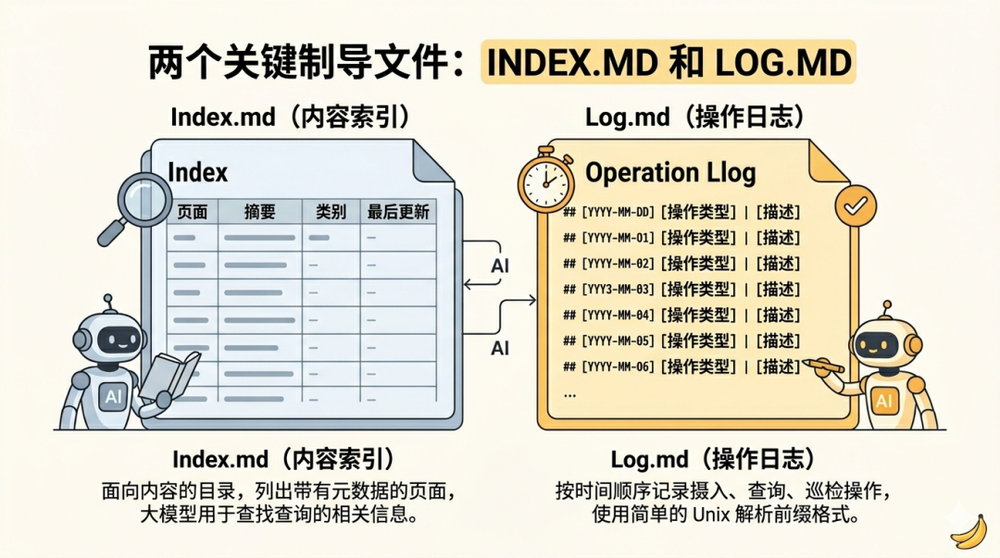

index.md 是对每一次大模型对llm涉及的文档进行整理分析的记录，包括文档的页面地址，文档类型，以及文档摘要。

AI大模型进行回答时，会通过idex.md快速索引到问题找到相关页面，然后再深入查看分析。

这种方法在中等规模（约 100 个来源，约数百个页面）下效果出奇地好，并且避免了使用基于嵌入的 RAG 架构。

log.md 是日志文件，按时间顺序记录所有操作，包括新增文档、文档查询、巡检文档等等，目的是帮助llm了解最近的工作内容。

以上是Karpathy大神这套方法论的核心文件，接下来开始搭建。

搭建llm-wiki知识库

打开Obsidian，在聊天框中打开claude code，把llm-wiki搭建提示词喂给AI，让其根据提示词创建目录。

提示词是AI大神Karpathy的方法论文章。

链接如下，复制扔给AI，让它按照文章要求执行。

https://gist.github.com/karpathy/442a6bf555914893e9891c11519de94f

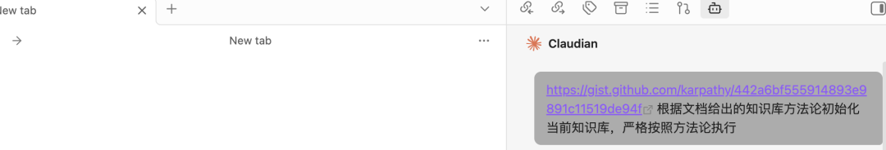

等待创建完成后，效果如下。

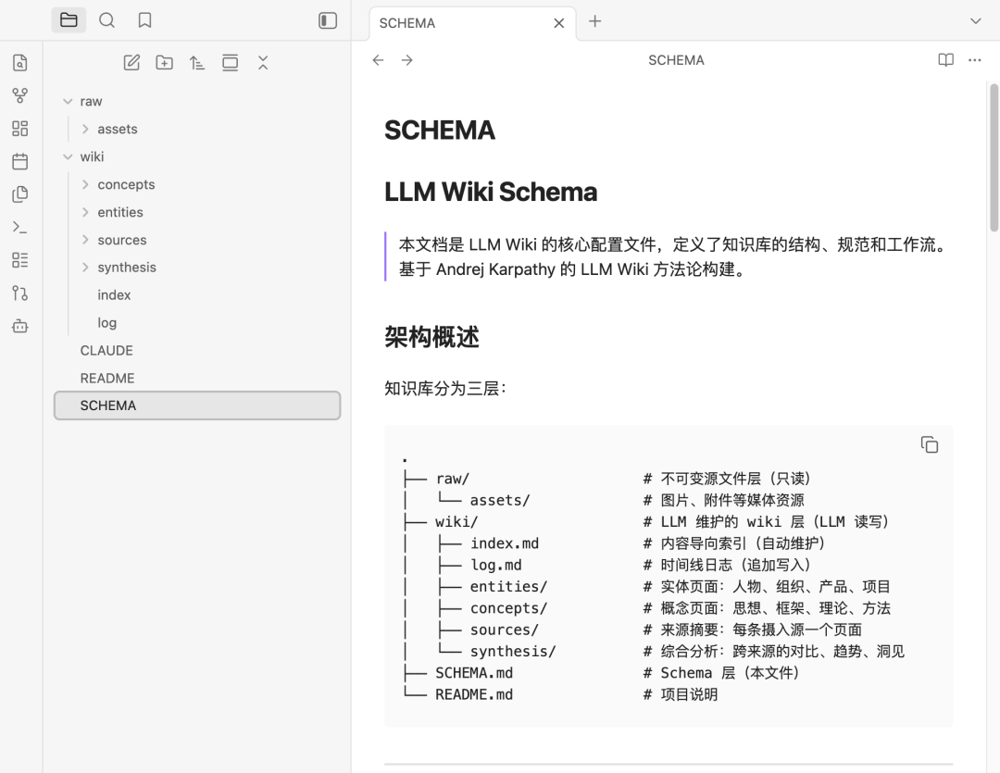

Karpathy知识库方法论中涉及的相关文件目录和文档都已经创建。

开始测试

比如，最近想学习Harness思想，先找一些相关文档，复制到raw目录下。

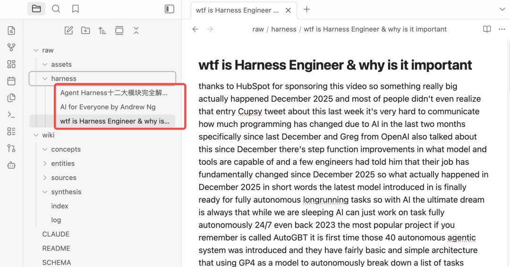

然后开始对AI进行提问。

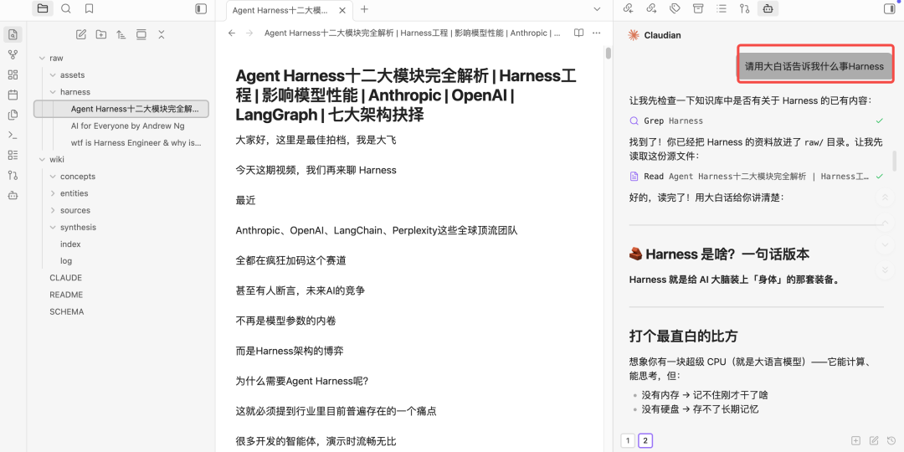

等待执行完成，查看log.md文件。

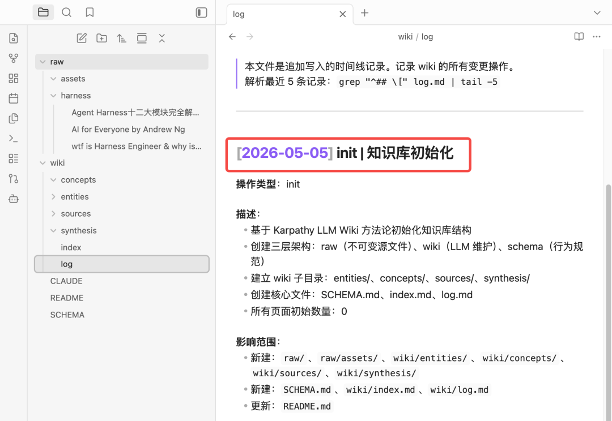

发现只有一条log，还是当时初始化文档的时候创建的。

说明，这次问答，AI并没有遵循llm-wiki原则，是因为在claude.md只在claude code cli中生效，claudian作为obsidian的插件，只是将claude.md当作一个普通文件来处理。

接下来需要处理加载claude.md的问题。

小二采用的解决方案如下，

在vault\_path(这里注意是自己的目录)/.claude/commands中新增一个文件wiki.md，文件名称可以自行命名。

将CLAUDE.md的内容复制到wiki.md当中，重启obsidian，然后在claudian对话框中执行/wiki命令，如下

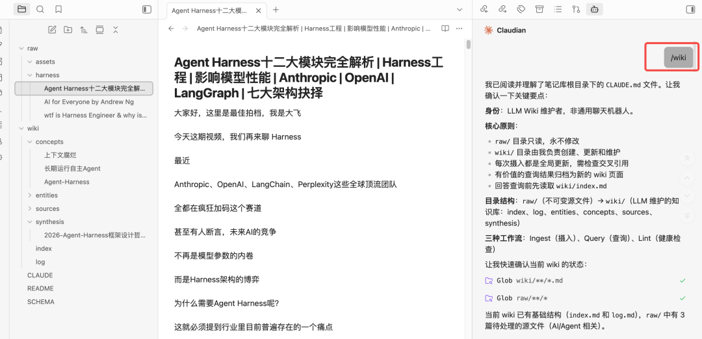

claudian会提示要执行的内容

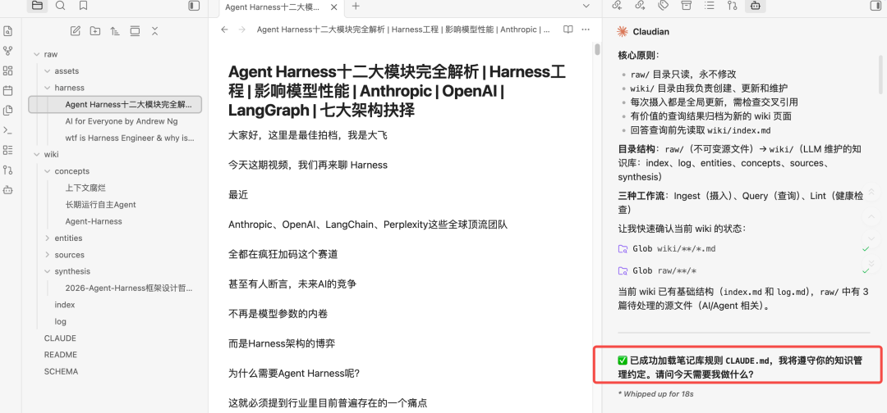

开始让claudian 正式干活

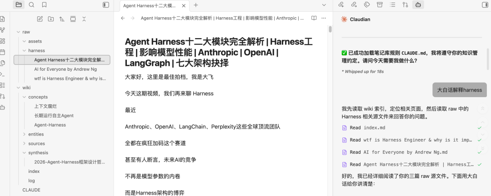

指定完成后，claudian会问是否需要更新wiki

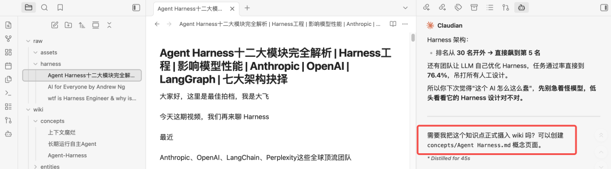

如果选择更新，最终效果如下。

其中index.md和log.md都已经更新。

到此，已经完成karpathy这套知识库方法论的搭建，方法论没有固定的模版，可以按照需要进行更改。

当然，小二认为，目前这里还有一个不太友好的地方，就是claudian不会自动加载CLAUDE.md，需要通过命令主动加载。

我是小二，一线互联网大厂架构师，在AI热潮下，专注AIGC摸索。

如果文章有帮助，帮忙点个赞，**关注**不迷路。

往期推荐

[Obsidian还在手搓笔记文档吗？掌握这个插件，给Obsidian安装智能引擎，效率翻倍](https://mp.weixin.qq.com/s?__biz=MzE5ODA5OTY1MQ==&mid=2247483838&idx=1&sn=9b59af2d2166018fa2855bf6fe7d1c14&scene=21#wechat_redirect)

[AI时代怎么打造个人专属的知识库？Obsidian完美契合，5分钟教程完成本地搭建](https://mp.weixin.qq.com/s?__biz=MzE5ODA5OTY1MQ==&mid=2247483818&idx=1&sn=bf355dfd6074c0b7e031b5f64ba988fd&scene=21#wechat_redirect)

[阿里云部署OpenClaw使用百炼套餐太贵?15分钟接入智谱Coding Plan](https://mp.weixin.qq.com/s?__biz=MzE5ODA5OTY1MQ==&mid=2247483792&idx=1&sn=a8f8b26e7392ed192bc543be5bd4dd35&scene=21#wechat_redirect)
