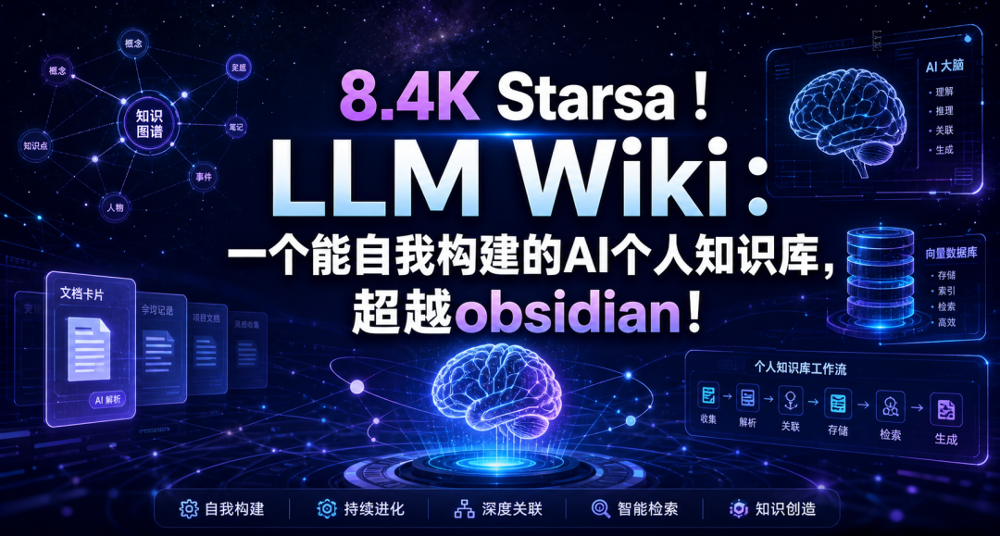
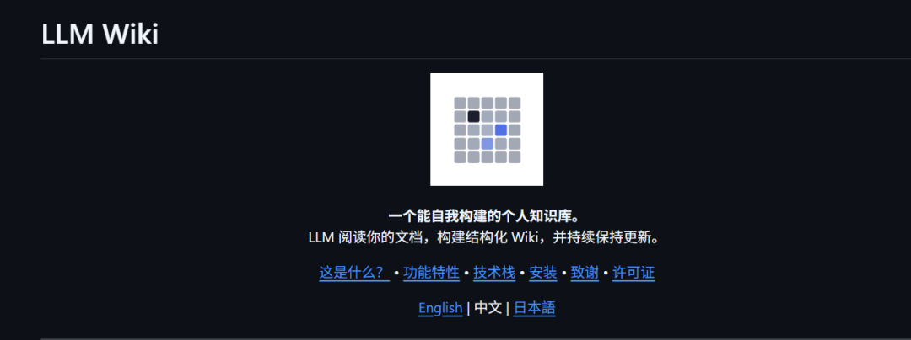
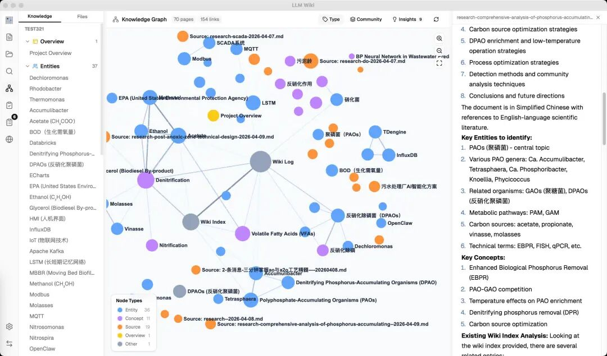

> 📎 来源: [思之行研习社](https://mp.weixin.qq.com/s?__biz=MzYzNTc1OTc0MQ==&mid=2247484206&idx=1&sn=562557efbe1e2164c2048e240fedc405&chksm=f1c4bb7215f8dd21a8ba94027c00b98f9979ec429cdefb34eb27f24f3ab1deb07a510fd45b8c&mpshare=1&scene=1&srcid=0521QH3krte2wvC7PILiMON1&sharer_shareinfo=0400f6c90ed65199d3a4989771e4c67c&sharer_shareinfo_first=0400f6c90ed65199d3a4989771e4c67c) | 时间: 2026-05-21 15:12

---




> **文章概览**

> - **文章字数**：约 4000 字
> - **预计阅读时间**：约 8 分钟
> - **内容摘要**：本文介绍 nashsu/llm\_wiki —— 一款基于 Karpathy LLM Wiki 理念的开源桌面应用，能自动将文档编译为结构化的个人知识库。文章从非技术用户视角出发，用场景化方式展示其核心能解决的知识散乱、链接维护负担、Vault 失控等痛点，与 Notion、Obsidian、腾讯 IMA 做横向对比，并给出不同工具搭配使用的协同方案，帮助读者判断该工具是否适合自身需求。（文章末尾点击“阅读原文”可直接下载）

---

你有没有过这样的经历——

读了一篇很好的文章，觉得有用，存进笔记软件。过了一周又读了一篇，内容有关联，但你完全没想起来之前那篇说过什么。过了两周你想回顾某个观点，翻遍了文件夹、搜了好几个关键词，还是找不到。

如果你是 Obsidian 用户，可能还有更熟悉的情节：

- 刚开始用的时候，Graph View 看起来好酷，觉得知识马上要连成网了。三个月后打开一看，满屏乱线，根本看不出个名堂
- `[[wikilinks]]` 是好功能，但哪次有空去手动打链接？90% 的笔记都是"写进去就躺在那"
- 为了 AI 功能装了 Copilot 插件、Smart Connections、Text Generator……结果花了一整天调配置，笔记一篇没写
- Obsidian Sync 每个月要几十块，自己搭 Git 又嫌麻烦，手机和电脑之间经常不同步

**信息越来越多，知识反而越来越散——而且整理它们的时间比获取它们还多。**

这不是你的问题。市面上的笔记软件——Notion、Obsidian、飞书笔记——本质都是"存储器"：你写什么它就存什么，不写、不整理、不关联，它就躺着不动。

但今天要聊的这个思路有点不一样。它叫 **LLM Wiki**，一个让你请 AI 当"知识管家"的方案。



*LLM Wiki 目前在 GitHub 上已有 8.4K Stars，完全开源免费*

---

## 01 一句话说清楚 LLM Wiki 是什么

LLM Wiki 是这么个东西：

> 你往里面扔资料（文章、PDF、笔记、网页剪裁），AI 替你读一遍，然后自动生成一本 \*\*活的"个人百科"\*\*——有目录、有章节、有交叉引用、而且每次加新东西，这本书会自动更新。




拿装修做比喻：

- **传统笔记软件**像是你往仓库里扔东西，堆了一堆，要用的时候翻箱倒柜
- **RAG**（大部分 AI 问答工具的做法）像是请了个图书管理员，你问一次，他帮你翻一遍仓库，翻完他把东西放回去，下次再问再翻一遍
- **LLM Wiki** 像是请了个整理师，你每扔进一件东西，他就立刻分类、编号、放进对应的柜子，同时在柜子上贴好标签并关联到相关柜子。你想查东西时，直接去柜子里拿就行了

关键区别就一条：**知识不是"每次查的时候去找"，而是"存的时候就整理好"。**

---

## 02 它能帮你解决什么具体问题？

聊功能不如聊场景。看看这些情况你是不是遇到过：

### 场景 1：你是个自媒体创作者

公众号更新到第 50 篇，你写了各种 AI 工具使用教程、办公提效技巧、文史研究方法。突然想写一篇"AI 辅助文献检索"的合集，你需要——

找到之前写过的相关文章，提炼共同观点，补充新发现。

**没有 LLM Wiki 的做法**：翻公众号后台、翻文件夹、脑子回忆 → 花 1-2 小时来回翻读

**有了 LLM Wiki**：把之前的文章扔进去 → AI 自动提取各篇的核心观点 → 生成一本"AI 文献检索"的专题页 → 你直接用它作为写新文章的素材库

### 场景 2：你是个职场人

你负责公司信息化建设，长期读一些 ERP 实施案例、网络安全方案、AI 办公提效的行业报告。资料存了一大堆，每次要跟领导汇报或者写方案时——

最痛苦的不是"没资料"，而是"资料太多不知道怎么组织"。

**有了 LLM Wiki**：每次注入新的行业报告，AI 会自动对比跟之前存过的资料有什么关联。当你需要写"企业数字化转型方案"时，直接问 LLM Wiki 一句"我们行业过去三年的数字化转型趋势和主要实施方案"——它会从你积累的所有资料里综合出一份结构化的回答，自带引用链接去原文。

### 场景 3：你是个 Obsidian 深度用户，但 Vault 已经"失控"

你的 Obsidian Vault 可能已经有几百上千篇笔记了。当初爱上它的理由——本地存储、Markdown 自由、双向链接——现在反而成了负担。

**最痛苦的三件事**：

1. **链接维护**：你知道 `[[wikilinks]]` 是 Obsidian 的灵魂，但工作一忙，谁还记得给每篇笔记打链接？慢慢就变成"写进去就算完"
2. **图谱没法看**：Graph View 从"酷炫网络图"变成了"一坨毛线"，密集恐惧症都要犯了
3. **标签泛滥**：标签越建越多，最后自己都搞不清 "#AI" 和 "#人工智能" 有什么区别

**有了 LLM Wiki**：你把 Obsidian 里写过的笔记丢进去。AI 自动帮你读完、提取关键概念、建立交叉链接。然后输出一个整理好的 Wiki——这个 Wiki 目录本身就是 Obsidian Vault，可以直接用 Obsidian 打开浏览。**你写的笔记还在，多了一个"AI 帮你整理过的版本"。**

### 场景 4：你是个爱读书、爱分享的人

读了很多书，做了很多笔记，但笔记都在不同的 App 里——有的在微信读书划线，有的在 Obsidian 写读书笔记，有的在备忘录随手记。

很多 Obsidian 用户都有这个习惯：每读一本书建一篇笔记，用 `[[wikilinks]]` 串起关键概念。但书越来越多之后，你发现：

- 写链接太费时间了，大部分笔记就是"单篇躺平"
- 同一个概念在不同书里提到，你得手动去各篇笔记里打 `[[概念名]]`
- 书读完，笔记写完，就再也没打开过

**有了 LLM Wiki**：把这些统一丢进去，AI 自动识别书中的核心概念、人物、观点，自动建立概念之间的 `[[链接]]`。比如你读了《思考，快与慢》和《噪声》两本书，AI 会在"认知偏差"这个主题下自动关联两本书的相关观点——完全不用你手动记"XX 书第 3 章提到过这个"。

### 场景 5：一人公司创业者

你在运营自己的业务，每天要看大量行业资讯、竞品分析、客户案例。这些分散在不同地方，决策时很难快速调用。

**有了 LLM Wiki**：行业报告注入 → 自动提取关键结论 → 跟已有的竞品分析对比 → 生成"行业竞争格局"的总结页。你每次做决策前，只需要问一次，答案基于你积累的所有认知。

---

## 03 它跟 "热门笔记软件" 到底有什么不同？

你可能会问：Notion 不也能做知识库吗？Obsidian 不也有双向链接吗？腾讯 IMA 不也能 AI 问答吗？

看这张表格就清楚了——我给你打几个比喻：

> - **Notion** ≈ 办公室文件柜 —— 东西整整齐齐，但要你自己放、自己分类、自己整理
> - **Obsidian** ≈ 带标签的手账本 —— 笔记之间有链接，但链接得你亲手去连
> - **腾讯 IMA** ≈ 智能检索器 —— 问什么它去库房里翻，翻完答案给你，但库房里的东西不会因为多查一次就变得更有序
> - **LLM Wiki** ≈ 自带整理师的书房 —— 你只管往里面放书，整理师帮你分类、编号、做索引、贴交叉引用标签

| **对比项** | **Notion** | Obsidian | 腾讯 IMA | LLM Wiki |
| --- | --- | --- | --- | --- |
| **你需要做什么** | 写笔记、建数据库、维护目录 | 写笔记、建链接、配插件、整理 Vault | 上传文档、提问 | **只管扔资料和提问** |
| **链接靠谁维护** | 你手动 | 你手动打 [[wikilinks]]（大多数人懒得打） | 不需要 | **AI 自动建链接和交叉引用** |
| **AI 帮你做什么** | 写摘要、生成内容 | 需装插件（Copilot 等），配置门槛高 | RAG 问答（翻碎片给你） | **全权维护：读资料、写摘要、关联、更新索引** |
| **知识积累方式** | 你写多少，它就存多少 | 你写多少 + 你连多少 | 每次查询重新检索 | **"复利"——每加一份资料，整个知识网变厚一层** |
| **Vault 会乱吗** | 目录不维护就会乱 | **Graph View 一年后变毛线球是常态** | 不存在这个问题 | **AI 定期 Lint 健检，发现孤立页和断链** |
| **数据在哪** | 云端 | 本地 | 腾讯云端 | **本地** |
| **能否离线** | ❌ | ✅ | ❌ | ✅ |
| **团队协作** | ✅ 强 | ❌ 弱（Sync 收费，Git 有门槛） | ✅ 中等 | ❌ 弱（个人工具） |
| **适合谁** | 团队协作、项目管理 | **爱折腾的本地笔记玩家** | 轻度知识库入门 | 知识深度积累的重度用户 |
| **费用** | $20/月（AI 完整版） | 免费 + AI API（需自己搭插件） | 免费 | 免费 + 你付 LLM API 钱 |

---

## 04 它最吸引人的"独门优点"

### 优点 1：知识越用越值钱（复利）

这可能是 LLM Wiki 最核心的价值。

普通笔记软件的知识是线性的——存 100 篇资料就是 100 个文件的信息量。LLM Wiki 不是。

每注入一份新资料，AI 不只是把它存起来，而是跟已有的知识网络做关联、更新交叉引用、调整综合页面。**100 篇资料的价值 > 100 个摘要简单相加。** 你的知识库会随着使用越来越"厚"。

### 优点 2：不用手动维护链接

Obsidian 的双向链接很好，但问题是**你得手动去连**。工作忙起来，谁会记得给每篇笔记打 `[[ ]]` 链接？

LLM Wiki 在注入阶段就自动做了这件事。**一次注入，10～15 个相关页面自动更新交叉引用。** 你完全不用管。

### 优点 3：聊天的好答案会被"写回"知识库

这招特别有意思。你在 LLM Wiki 里问问题，得到好答案，可以一键把答案存档到知识库。下次再问相关问题，AI 不仅能从原始资料找答案，还能参考你之前认可的好回答。

**你的探索也在产生知识复利。**

### 优点 4：本地数据 + 开源

所有数据都在你电脑上，纯 Markdown 文件。项目开源，没有厂商绑定。

就算哪天项目不维护了，你的数据不会丢——任何一个文本编辑器都能打开这些 .md 文件。Obsidian 也能直接打开这个目录当 Vault 用。

### 优点 5：越用越"懂"你

LLM Wiki 里有个叫 `purpose.md` 的文件，你可以在里面写：我收集这些资料的目的是什么、我关心的核心问题是什么、研究方向是什么。AI 在每次注入和查询时都会读到这些——它知道"你为什么要做这个知识库"。

---

## 05 怎么跟你现有的软件搭配？

你不需要"迁移"掉现有的工具。LLM Wiki 可以跟你手上的软件各司其职。

### 搭配方案 1：你是 Obsidian 用户（最推荐）

```
你用 Obsidian 做日常笔记、写思考        ↓ 定期把笔记扔进去LLM Wiki 帮你编译、关联、建索引        ↓ Wiki 目录本身就是 Obsidian Vault你在 Obsidian 里直接浏览成型的知识网
```

两边数据互通，无需切换软件。

### 搭配方案 2：你是 Notion 用户

```
团队在 Notion 里协作写文档    ↓ 定期把导出的 Markdown 喂给 LLM WikiLLM Wiki 做知识沉淀和深度查询
```

Notion 做前端协作，LLM Wiki 做后端知识积累。

### 搭配方案 3：你是腾讯 IMA 用户

```
IMA：快速问答 + 微信内容抓取（日常快速用）LLM Wiki：深度研究和长期积累（重要知识放这里）
```

IMa 适合临时查资料，重要研究用 LLM Wiki 做体系化编译。

### 搭配方案 4：你想让 AI 助手也能用你的知识库

LLM Wiki 内置了一个本地 API 接口，可以接 Claude Code、Codex 等 AI Agent。

做完研究后，Agent 也能直接查你积累的知识："关于 XX，我的知识库之前是怎么说的？"

---

## 06 怎么开始？三步上手

不啰嗦，最小化路径：

### 第一步：下载

从 nashsu/llm\_wiki 的 GitHub Releases 下载对应系统版本（Windows/macOS/Linux），解压即用。

**学长已经下载好，点击文章末尾“阅读原文”就能获取软件**

### 第二步：配置 LLM

启动后在设置里填入你的 LLM API Key（推荐 Anthropic Claude 、 OpenAI GPT 或者 deepseek）。**这是唯一需要掏钱的地方。** 如果你有合适的 API，每个月几十到几百元不等，取决于你的使用量。

### 第三步：扔第一份资料

不用多，找 3～5 篇你最近读的文章或笔记。拖进 LLM Wiki，等 AI 读完、写完。观察生成效果——有没有摘要？有没有交叉引用？图谱里有没有连线？

觉得对了，开始日常使用。

---

## 07 几点提醒（冷静一下）

### ⚠️ 有学习成本

不是开箱即用的产品。你需要花 30 分钟到 1 小时理解它的概念和配置。如果"不愿折腾"，腾讯 IMA 是更好的入门选择。

### ⚠️ 每次"注入"要花钱

LLM 处理资料需要调用 API，如果用得频繁，每月可能会有几百元的 API 费用。

**省钱的窍门**：

- 用 deepseek （便宜）替代 Claude （贵），质量接近
- 同批资料只注入一次，增量缓存会自动跳过未变动的文件
- 先小规模试用，觉得值再加大投入

### ⚠️ 不是团队协作工具

目前是个人知识管理工具。如果是团队共用的知识库，Notion 或 Guru 更合适。

### ⚠️ 不适合实时信息

微信聊天、即时资讯、每天变化的动态数据——不适合扔进去。LLM Wiki 适合的是**需要长期积累、反复交叉引用**的静态知识（研究资料、读书笔记、项目文档）。

---

## 总结

LLM Wiki 不是又一个笔记软件，它是给"知识重度使用者"准备的**知识编译器**。

如果你属于这几类人——

- ✅ 经常读大量资料、写分析内容
- ✅ 觉得自己积累了不少"知识沉淀"，但用起来还是零散的
- ✅ 愿意为"知识越用越值钱"这件事花一点钱（API 费用）
- ✅ 介意数据存别人服务器上

那 LLM Wiki 可能是你 2026 年最值得尝试的知识管理方案。

**最后说一句最关键的话：**

Karpathy（这个概念的提出者）精准地描述了为什么这个方案做对了——**知识管理的苦活不是阅读和思考，而是分类、编号、更新交叉引用、建索引这些"簿记"工作。过去 Wiki 普遍失败，是因为这些工作的维护成本会随着规模增长失控。**

现在 AI 替你扛下了这部分。

你只负责两件事：**决定读什么、提出问题。**

---

### 参考资料

1. nashsu/llm\_wiki GitHub — https://github.com/nashsu/llm\_wiki
2. Andrej Karpathy 的 LLM Wiki 原始设计 — https://gist.github.com/karpathy/442a6bf555914893e9891c11519de94f
3. 腾讯 IMA 官网 — https://ima.qq.com/
4. 动手 LLM Wiki 前建议你先想明白这些 — 人人都是产品经理 — https://www.woshipm.com/ai/6393286.html
5. Karpathy 的 LLM Wiki 范式，到底值不值得践行？ — 王树义 — https://wangshuyi.substack.com/p/karpathy-llm-wiki
