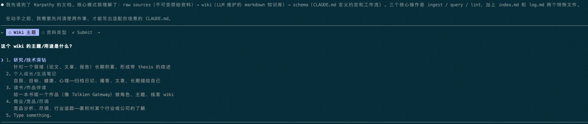
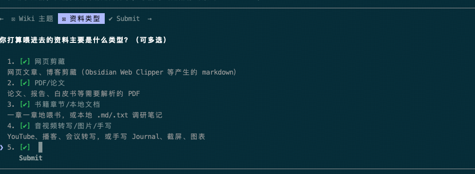

> 📎 来源: [日积月码](https://mp.weixin.qq.com/s?__biz=MzI3NjA4NzYzMQ==&mid=2651478867&idx=1&sn=56c2fc42dd0f8ca4c7a47d42865d6d3f&chksm=f1d063649b115d1710b3dfb01002216ba5a04c9d50a26b9f363066484695f88fa66ac8af52fa&mpshare=1&scene=1&srcid=05101MxNCsgYQGb23amImV5f&sharer_shareinfo=b91bc19e803518838f77cb0f58081f9c&sharer_shareinfo_first=b91bc19e803518838f77cb0f58081f9c) | 时间: 2026-05-10 15:55

---

---

前段时间一直看到关于AI大神Andrej Karpathy用Obsidian+LLM搭建个人知识库的文章，今天终于有空来实践一下，整个搭建过程也比较简单。

## 准备工具

- 一个 AI Agent（Claude Code 最顺手，Codex 也行）
- Obsidian（免费，obsidian.md）

## 具体搭建流程

### 第一步：新建一个wiki目录

```
mkdir my-wiki && cd my-wiki
```

---

### 第二步：运行 Claude Code

```
claude
```

---

### 第三步：创建CLAUDE.md（关键）

让claude code读取Andrej Karpathy的关于LLM Wiki的想法，然后创建CLAUDE.md文件。

参考：https://gist.github.com/karpathy/442a6bf555914893e9891c11519de94f

想偷懒的小伙伴可以直接复制下面内容：

```
我想让你读一下 Andrej Karpathy 的关于LLM Wiki的想法内容，然后帮我在这个目录下搭建一个 LLM Wiki。在开始动手之前，先问清楚：这个 wiki 的主题是什么，以及我打算往里面喂哪些资料。等我回答完之后，再根据我的答案写一个 CLAUDE.md 的 schema 文件。Andrej Karpathy关于LLM Wiki的想法如下：# LLM WikiA pattern for building personal knowledge bases using LLMs.This is an idea file, it is designed to be copy pasted to your own LLM Agent (e.g. OpenAI Codex, Claude Code, OpenCode / Pi, or etc.). Its goal is to communicate the high level idea, but your agent will build out the specifics in collaboration with you.## The core ideaMost people's experience with LLMs and documents looks like RAG: you upload a collection of files, the LLM retrieves relevant chunks at query time, and generates an answer. This works, but the LLM is rediscovering knowledge from scratch on every question. There's no accumulation. Ask a subtle question that requires synthesizing five documents, and the LLM has to find and piece together the relevant fragments every time. Nothing is built up. NotebookLM, ChatGPT file uploads, and most RAG systems work this way.The idea here is different. Instead of just retrieving from raw documents at query time, the LLM **incrementally builds and maintains a persistent wiki** — a structured, interlinked collection of markdown files that sits between you and the raw sources. When you add a new source, the LLM doesn't just index it for later retrieval. It reads it, extracts the key information, and integrates it into the existing wiki — updating entity pages, revising topic summaries, noting where new data contradicts old claims, strengthening or challenging the evolving synthesis. The knowledge is compiled once and then *kept current*, not re-derived on every query.This is the key difference: **the wiki is a persistent, compounding artifact.** The cross-references are already there. The contradictions have already been flagged. The synthesis already reflects everything you've read. The wiki keeps getting richer with every source you add and every question you ask.You never (or rarely) write the wiki yourself — the LLM writes and maintains all of it. You're in charge of sourcing, exploration, and asking the right questions. The LLM does all the grunt work — the summarizing, cross-referencing, filing, and bookkeeping that makes a knowledge base actually useful over time. In practice, I have the LLM agent open on one side and Obsidian open on the other. The LLM makes edits based on our conversation, and I browse the results in real time — following links, checking the graph view, reading the updated pages. Obsidian is the IDE; the LLM is the programmer; the wiki is the codebase.This can apply to a lot of different contexts. A few examples:- **Personal**: tracking your own goals, health, psychology, self-improvement — filing journal entries, articles, podcast notes, and building up a structured picture of yourself over time.- **Research**: going deep on a topic over weeks or months — reading papers, articles, reports, and incrementally building a comprehensive wiki with an evolving thesis.- **Reading a book**: filing each chapter as you go, building out pages for characters, themes, plot threads, and how they connect. By the end you have a rich companion wiki. Think of fan wikis like [Tolkien Gateway](https://tolkiengateway.net/wiki/Main_Page) — thousands of interlinked pages covering characters, places, events, languages, built by a community of volunteers over years. You could build something like that personally as you read, with the LLM doing all the cross-referencing and maintenance.- **Business/team**: an internal wiki maintained by LLMs, fed by Slack threads, meeting transcripts, project documents, customer calls. Possibly with humans in the loop reviewing updates. The wiki stays current because the LLM does the maintenance that no one on the team wants to do.- **Competitive analysis, due diligence, trip planning, course notes, hobby deep-dives** — anything where you're accumulating knowledge over time and want it organized rather than scattered.## ArchitectureThere are three layers:**Raw sources** — your curated collection of source documents. Articles, papers, images, data files. These are immutable — the LLM reads from them but never modifies them. This is your source of truth.**The wiki** — a directory of LLM-generated markdown files. Summaries, entity pages, concept pages, comparisons, an overview, a synthesis. The LLM owns this layer entirely. It creates pages, updates them when new sources arrive, maintains cross-references, and keeps everything consistent. You read it; the LLM writes it.**The schema** — a document (e.g. CLAUDE.md for Claude Code or AGENTS.md for Codex) that tells the LLM how the wiki is structured, what the conventions are, and what workflows to follow when ingesting sources, answering questions, or maintaining the wiki. This is the key configuration file — it's what makes the LLM a disciplined wiki maintainer rather than a generic chatbot. You and the LLM co-evolve this over time as you figure out what works for your domain.## Operations**Ingest.** You drop a new source into the raw collection and tell the LLM to process it. An example flow: the LLM reads the source, discusses key takeaways with you, writes a summary page in the wiki, updates the index, updates relevant entity and concept pages across the wiki, and appends an entry to the log. A single source might touch 10-15 wiki pages. Personally I prefer to ingest sources one at a time and stay involved — I read the summaries, check the updates, and guide the LLM on what to emphasize. But you could also batch-ingest many sources at once with less supervision. It's up to you to develop the workflow that fits your style and document it in the schema for future sessions.**Query.** You ask questions against the wiki. The LLM searches for relevant pages, reads them, and synthesizes an answer with citations. Answers can take different forms depending on the question — a markdown page, a comparison table, a slide deck (Marp), a chart (matplotlib), a canvas. The important insight: **good answers can be filed back into the wiki as new pages.** A comparison you asked for, an analysis, a connection you discovered — these are valuable and shouldn't disappear into chat history. This way your explorations compound in the knowledge base just like ingested sources do.**Lint.** Periodically, ask the LLM to health-check the wiki. Look for: contradictions between pages, stale claims that newer sources have superseded, orphan pages with no inbound links, important concepts mentioned but lacking their own page, missing cross-references, data gaps that could be filled with a web search. The LLM is good at suggesting new questions to investigate and new sources to look for. This keeps the wiki healthy as it grows.## Indexing and loggingTwo special files help the LLM (and you) navigate the wiki as it grows. They serve different purposes:**index.md** is content-oriented. It's a catalog of everything in the wiki — each page listed with a link, a one-line summary, and optionally metadata like date or source count. Organized by category (entities, concepts, sources, etc.). The LLM updates it on every ingest. When answering a query, the LLM reads the index first to find relevant pages, then drills into them. This works surprisingly well at moderate scale (~100 sources, ~hundreds of pages) and avoids the need for embedding-based RAG infrastructure.**log.md** is chronological. It's an append-only record of what happened and when — ingests, queries, lint passes. A useful tip: if each entry starts with a consistent prefix (e.g. `## [2026-04-02] ingest | Article Title`), the log becomes parseable with simple unix tools — `grep "^## \[" log.md | tail -5` gives you the last 5 entries. The log gives you a timeline of the wiki's evolution and helps the LLM understand what's been done recently.## Optional: CLI toolsAt some point you may want to build small tools that help the LLM operate on the wiki more efficiently. A search engine over the wiki pages is the most obvious one — at small scale the index file is enough, but as the wiki grows you want proper search. [qmd](https://github.com/tobi/qmd) is a good option: it's a local search engine for markdown files with hybrid BM25/vector search and LLM re-ranking, all on-device. It has both a CLI (so the LLM can shell out to it) and an MCP server (so the LLM can use it as a native tool). You could also build something simpler yourself — the LLM can help you vibe-code a naive search script as the need arises.## Tips and tricks- **Obsidian Web Clipper** is a browser extension that converts web articles to markdown. Very useful for quickly getting sources into your raw collection.- **Download images locally.** In Obsidian Settings → Files and links, set "Attachment folder path" to a fixed directory (e.g. `raw/assets/`). Then in Settings → Hotkeys, search for "Download" to find "Download attachments for current file" and bind it to a hotkey (e.g. Ctrl+Shift+D). After clipping an article, hit the hotkey and all images get downloaded to local disk. This is optional but useful — it lets the LLM view and reference images directly instead of relying on URLs that may break. Note that LLMs can't natively read markdown with inline images in one pass — the workaround is to have the LLM read the text first, then view some or all of the referenced images separately to gain additional context. It's a bit clunky but works well enough.- **Obsidian's graph view** is the best way to see the shape of your wiki — what's connected to what, which pages are hubs, which are orphans.- **Marp** is a markdown-based slide deck format. Obsidian has a plugin for it. Useful for generating presentations directly from wiki content.- **Dataview** is an Obsidian plugin that runs queries over page frontmatter. If your LLM adds YAML frontmatter to wiki pages (tags, dates, source counts), Dataview can generate dynamic tables and lists.- The wiki is just a git repo of markdown files. You get version history, branching, and collaboration for free.## Why this worksThe tedious part of maintaining a knowledge base is not the reading or the thinking — it's the bookkeeping. Updating cross-references, keeping summaries current, noting when new data contradicts old claims, maintaining consistency across dozens of pages. Humans abandon wikis because the maintenance burden grows faster than the value. LLMs don't get bored, don't forget to update a cross-reference, and can touch 15 files in one pass. The wiki stays maintained because the cost of maintenance is near zero.The human's job is to curate sources, direct the analysis, ask good questions, and think about what it all means. The LLM's job is everything else.The idea is related in spirit to Vannevar Bush's Memex (1945) — a personal, curated knowledge store with associative trails between documents. Bush's vision was closer to this than to what the web became: private, actively curated, with the connections between documents as valuable as the documents themselves. The part he couldn't solve was who does the maintenance. The LLM handles that.## NoteThis document is intentionally abstract. It describes the idea, not a specific implementation. The exact directory structure, the schema conventions, the page formats, the tooling — all of that will depend on your domain, your preferences, and your LLM of choice. Everything mentioned above is optional and modular — pick what's useful, ignore what isn't. For example: your sources might be text-only, so you don't need image handling at all. Your wiki might be small enough that the index file is all you need, no search engine required. You might not care about slide decks and just want markdown pages. You might want a completely different set of output formats. The right way to use this is to share it with your LLM agent and work together to instantiate a version that fits your needs. The document's only job is to communicate the pattern. Your LLM can figure out the rest.
```

---

### 第四步：回答几个问题，然后等Claude Code干活





大概花了几分钟，CLAUDE.md文件就生成好了，感觉还挺专业的。

```
# Personal Growth Wiki — Claude 维护指南这是一个关于**个人成长与生活笔记**的 LLM Wiki。素材来源混杂：网页剪藏、PDF/论文、书籍章节、音视频转写、我自己的日记/截图/手写照片。Claude 是这个 wiki 的唯一维护者。我负责投喂资料和提问，你负责所有读、写、归档、交叉引用、冲突标注的工作。---## 核心原则1. **我不写 wiki，你写。** 我只往 `raw/` 丢素材和向你提问。`wiki/` 下的每个文件都由你维护。2. **`raw/` 是只读的。** 永远不要修改 `raw/` 下的任何文件，它是 source of truth。3. **宁可多改几页，不要让 wiki 碎片化。** 一条素材应当辐射更新所有相关页面（people、concepts、themes、goals……）。4. **每条断言都要可追溯到来源。** wiki 里的每个观点后面都应当能点回 `sources/` 或 `raw/` 的某个文件。5. **冲突不要掩盖。** 新资料与旧页面矛盾时，显式标注 `⚠️ conflict with [[...]]` 并跟我讨论。6. **不编造。** 没有出处的断言，要么问我，要么标 `(?)` 或 `TODO: verify`。---## 目录结构my-wiki/├── CLAUDE.md              # 本文件 — 约定与工作流├── raw/                   # 不可变原始资料（你只读）│   ├── clippings/         # 网页剪藏（.md）│   ├── pdfs/              # 论文、报告、电子书│   ├── books/             # 书籍章节、长文节选│   ├── transcripts/       # 播客/视频/会议转写│   ├── journal/           # 我的手写日记、札记（文本或照片）│   └── assets/            # 图片、截图、手写板└── wiki/                  # 你维护的知识库    ├── index.md           # 内容目录（按类别）    ├── log.md             # 时间线（append-only）    ├── overview.md        # 顶层综述（lint 时更新）    ├── sources/           # 每个 raw 文件对应一个摘要页    ├── people/            # 生活中出现的人    ├── concepts/          # 框架、理论、方法论    ├── themes/            # 反复出现的生活主题（健康、关系、职业……）    ├── goals/             # 正在追踪的目标（完成后移到 goals/archive/）    ├── entries/           # 日期性条目（观察、情绪、事件）    └── archive/           # 废弃但不删的页面Ingest 第一条素材前目录都是空的。你会按需创建子目录和文件。---## 文件命名约定- 文件名用 **kebab-case 英文或拼音**：`james-clear.md`、`atomic-habits-ch3.md`、`wang-xiao-bo.md`。方便 shell/grep。- 页面 H1 标题可以是中文：`# 王小波`。- 日期性条目格式：`YYYY-MM-DD-slug.md`，如 `entries/2026-04-23-morning-run.md`。- `sources/` 下摘要页的文件名 = `raw/` 下源文件名（扩展名换成 `.md`）。一一对应，方便追溯。---## 页面 Frontmatter每个 wiki 页面顶部都要有 YAML frontmatter（便于 Dataview 查询和以后的自动化）：---type: source | person | concept | theme | goal | entrycreated: 2026-04-23updated: 2026-04-23sources: [sources/atomic-habits-ch1, sources/jbp-2026-03]  # 相关 source 页tags: [habit, productivity]---额外字段：- `entry` 类型加 `date: YYYY-MM-DD`、`mood: up | flat | down`。- `goal` 类型加 `status: active | paused | done | dropped`、`started: YYYY-MM-DD`、`target: YYYY-MM-DD`。- `source` 类型加 `author`、`url`、`date`（原文发布日期）。---## 各类页面的 canonical 结构### `sources/` — 一条素材的摘要- 原文元信息（标题、作者、链接、发布日期）- 3–7 条核心主张（bullet）- 金句摘录（附定位，如章节/时间戳）- **对我的启示**（与我个人处境的连接 — 这一栏最重要）- 触及的其他 wiki 页（wikilink 列表）### `people/` — 生活中出现的人- 关系简述（朋友 / 作者 / 博主 / 家人……）- 关键互动或观点（倒序时间线）- 推荐过的东西、共同话题- 关联的 sources 与 entries### `concepts/` — 框架、方法、理论- 一句话定义- 出处（哪本书、哪个人）- 我的理解（用我的话复述）- 应用场景 / 我实践过的尝试- 相关概念（wikilink）### `themes/` — 反复出现的生活主题主题页是 wiki 的脊柱。举例：`themes/sleep.md`、`themes/relationships.md`、`themes/career.md`、`themes/anxiety.md`。- **现状快照**（最近一次更新的时点认知）- **时间线**（按月/季度，新信息如何修正了旧认知）- 相关 concepts / people / goals- 开放问题（我还没想清楚的）### `goals/` — 追踪中的目标- 目标陈述 + 成功标准- frontmatter 的 status / started / target- 进展日志（最新在上）- 当前阻碍与下一步- 完成后移到 `goals/archive/`，不删### `entries/` — 日期化条目- 一段原文观察或日记摘要- 触发了什么 reflection- 链到相关 themes / people / concepts---## 工作流### Ingest（我加新素材时）当我说 "ingest 这个" / "处理一下 raw/xxx" / 直接丢个文件进 `raw/` 让你看：1. **读取**：打开 `raw/` 下的文件。   - 图片：用 Read 看图。   - PDF：用 Read 带 `pages` 参数，大文件分段读。   - 转写：当文本处理。2. **先讨论再动手**：给我 3–5 条 takeaway，问我有没有想强调的角度或要澄清的疑问。**这一步不要跳过** — 防止误读了就写进 wiki。3. **写 source 页**：在 `wiki/sources/` 建摘要页，遵循 canonical 结构。4. **辐射更新**：基于内容，更新或新建：   - 提到的人 → `people/`   - 引入的概念 → `concepts/`   - 相关主题 → `themes/`（**显式写出这条素材如何强化、修正、挑战了此主题的理解**）   - 对目标有影响 → 在 `goals/.md` 的进展日志里记一笔5. **更新 `index.md`**：把新页加进对应类别。6. **追加 `log.md`**：见下文日志格式。一次 ingest 通常会改 5–15 个页面。宁可多不要少。### Query（我提问时）1. 先读 `wiki/index.md` 定位可能相关页。2. 读这些页面，综合回答。3. 引用用 wikilink：`根据 [[sources/james-clear-article]]……`。4. **好答案值得归档。** 如果这次探索产出了有价值的比较、综述、新发现，主动问我要不要把答案存成 wiki 页（通常去 `concepts/` 或 `themes/`）。5. 追加 `log.md`。### Lint（我说 "lint" / "体检"）1. **找矛盾**：不同页面的冲突主张。2. **找孤儿**：没有任何页链入的页面。3. **找坑**：多次被提但没有独立页的概念/人。4. **找过时**：新资料已覆盖但老页没更新。5. **找数据缺口**：明显该有但还没有素材的地方 — 建议我去找什么。6. **更新 `overview.md`**：我最近在关心什么、主要发现、开放问题。7. 追加 `log.md`。Lint 发现的问题**一条条列出来让我选处理哪些**，不要默默批量改。---## `index.md` 格式按类别分区，每项一行：# Wiki Index_最后更新：2026-04-23_## Sources (N)- [[sources/atomic-habits-ch1]] — 《原子习惯》第 1 章：微小改变的复利- [[sources/matthew-walker-sleep]] — 《我们为什么要睡觉》综述## People (N)- [[people/james-clear]] — 《原子习惯》作者- ...## Concepts (N)- ...## Themes (N)- [[themes/sleep]] — 睡眠与情绪/认知的联动- ...## Goals (active: N, archived: M)- [[goals/daily-reading]] — active，2026-03-01 起- ...---## `log.md` 格式**Append-only，最新在顶部。** 每条用一致前缀，方便 `grep "^## \[" wiki/log.md | head -20` 查最近动作。## [2026-04-23] ingest | atomic-habits-ch3.md新增 concepts/habit-stacking、concepts/two-minute-rule；更新 themes/productivity、goals/daily-reading## [2026-04-22] query | 睡眠和情绪的关系综合 sources/matthew-walker-sleep 与 entries/2026-04-*，答案归档到 concepts/sleep-mood-link.md## [2026-04-22] lintpeople/A 与 sources/B 的矛盾已在两页交叉注解；themes/anxiety 缺近 2 周更新---## 多媒体素材处理- **图片**：放 `raw/assets/` 或 `raw/journal/`（手写日记）。先看图再落字，图里关键信息用文本转述到 source 页。- **PDF**：放 `raw/pdfs/`，Read 时用 `pages` 参数分段（超过 10 页必须分段）。- **音视频转写**：放 `raw/transcripts/`。文件名包含节目/日期，如 `lex-fridman-2026-03-15-jordan-peterson.md`。- **一条素材图文都有**（如剪藏的带图文章）：先通读文本，写完 source 页后，如果图里还有关键信息再回看。---## 语言- Wiki 页面正文默认 **中文**（用我思考的语言写）。- 英文术语/人名/概念可原样混排，首次出现给中文译名。- 文件名用英文或拼音（见"命名约定"）。---## 交互风格- **动手改文件前先跟我对一遍 takeaway**，让我有机会纠偏。尤其是第一次 ingest 新主题时。- **探索型回答若有价值，主动问我要不要存页**，别让有用的综合消失在聊天记录里。- **不写安慰性、套话式内容**。简洁、具体、带出处。- **中文行文不要过度正式**。可以口语化一点，但要有信息密度。---## 不做的事- 不修改 `raw/` 下任何文件。- 不删 wiki 页。废弃的页移到 `wiki/archive/`，并在 `log.md` 记录原因。- 不在未经讨论时批量 ingest 多条素材。默认一次一条。- 不引入外部信息填补空白（除非我明确让你搜）。wiki 只基于我喂进来的素材 + 你从中推导出的综合。- 不搞情绪按摩。我想要的是清醒的镜子，不是鼓励师。---## 这份 schema 自身的演化这份 CLAUDE.md 是活的。用到不顺手、或出现没约定到的场景时，**主动提议修改它**，但动手前先跟我确认。每次修改后在 `log.md` 记一条 `schema` 类型的条目。
```

## 真正用起来是什么感觉

搭完之后，我用 Obsidian 打开这个文件夹，第一感觉是——干净。不是那种 demo 项目的干净，是那种"这就是我想要的"的干净。

每个条目都是一个 markdown 文件，里面有 LLM 生成的解释，关键概念用 

```
[[双链]]
```

 标出来。点进一个新链接，如果文件不存在，我可以让 Claude
  生成；如果存在，就直接跳转。慢慢地，整个知识图谱就长出来了。

最让我惊喜的是 Obsidian 的图谱视图。当条目超过二三十个之后，你能直观地看到哪些概念是中心节点、哪些是孤岛。这种俯视感是单纯聊天聊不出来的。

## 参考资料

- Karpathy 的原始 gist：https://gist.github.com/karpathy/442a6bf555914893e9891c11519de94f
- Karpathy 的推文：https://x.com/karpathy/status/2039805659525644595
