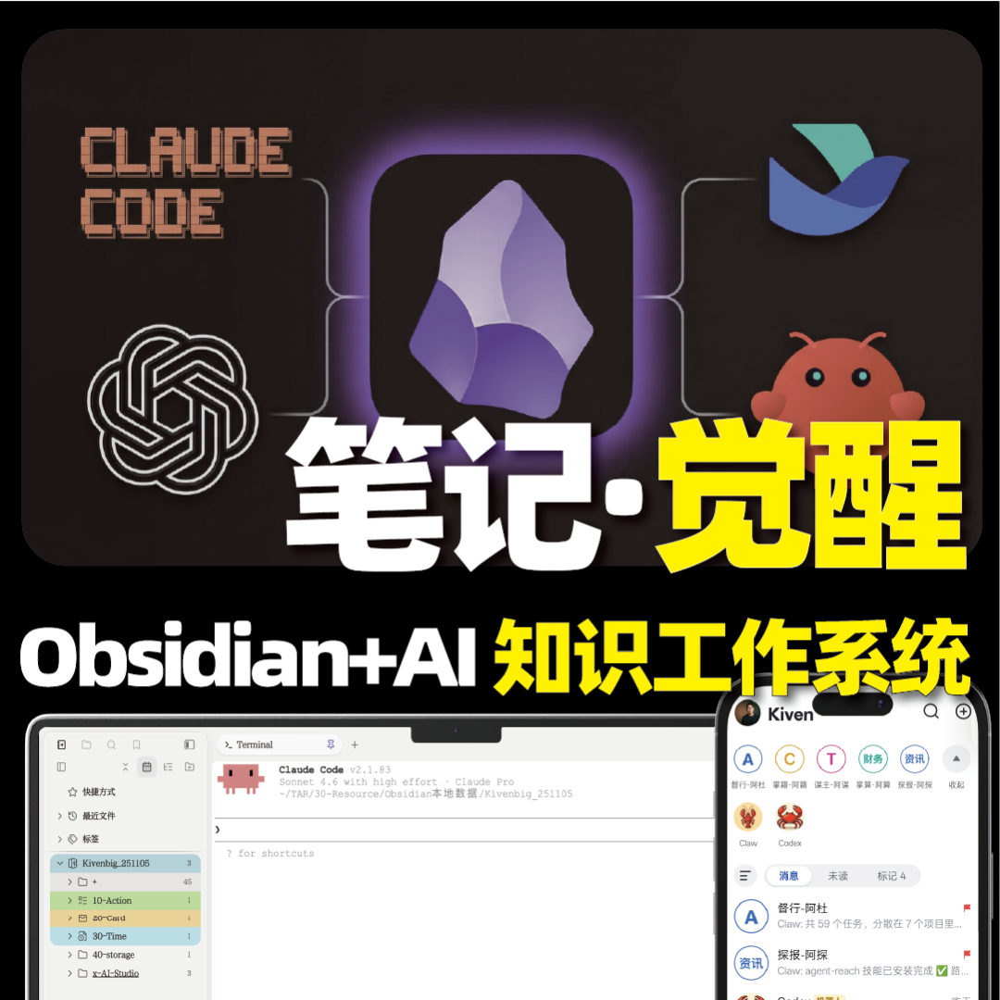
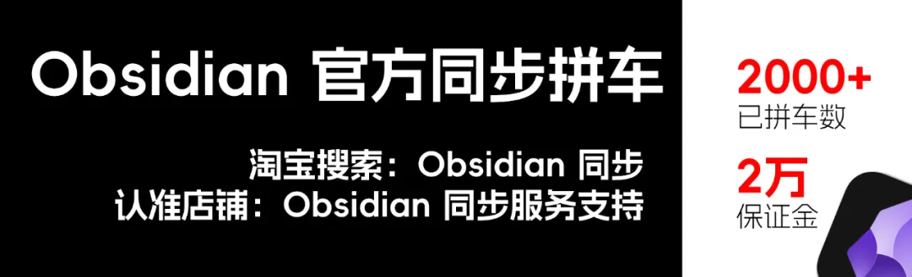

> 📎 来源: [Kiven大汉堡](https://mp.weixin.qq.com/s?__biz=MzI4NjA5MTI3NA==&mid=2649999539&idx=1&sn=b35ce4ce76a7bec796fa5b96ade1a94b&chksm=f29681a07a4d82388c0efaa9a7297501daa558b71413e27bbb657711acd6d78f5a9edcc11a73&mpshare=1&scene=1&srcid=0510t1QRmqxUtTZkCN9Q7KGx&sharer_shareinfo=5cbd8efc2e357a1f3514773279afb9f8&sharer_shareinfo_first=5cbd8efc2e357a1f3514773279afb9f8) | 时间: 2026-05-10 15:16

---

**为什么我卸载了 IMA、Get 笔记、notebooklm这类知识库工具，以及稍后阅读App，只留了一个 Obsidian？**

同时将公众文章、小红书、b 站视频、播客、会议录音，所有内容都以 Markdown 格式保存在这里。

它们既是我日常阅读的素材，也是我跟 AI 深度对话的上下文，可以用来做研究、选题各种事情。

看完这期内容，你会知道【阅读-学习】的流程如何在 Obsidian 跑起来。

Hi，我是 Kiven，做 Obsidian 和 AI 工作流相关的内容，服务过 4000 多个用户，我的 obsidian+AI 的课程已经上架，可以查看评论区。

---

## 常见问题

**你有没有发现，如果你用现有的 AI 知识库工具，无法实现不同平台资料的统一保存。**

IMA 能抓微信公众号，但你想收藏一个 YouTube 视频的内容，它搞不定，就连链接都无法保存。
NotebookLM 对海外内容支持得很好，但你无法直接转发公众号文章进去，它处理不了。

每个工具都只能覆盖一部分来源。 结果就是——你为了"统一管理知识"，反而在五六个平台之间跳来跳去。

这还不是最难受的。

**最难受的是：这些平台用的 AI 模型你选不了。**

IMA 绑的是腾讯系的模型和deepseek、 GLM，NotebookLM 只能用 Gemini。 你想用 Claude、想用任何你觉得更好的模型来处理你的资料，是不行的！

有些平台你想用更好的，还得付费。因为他们大部分是靠卖 token 赚钱，怎么可能给你开放入口？

**还有一个问题：你收藏的内容和你正在做的项目笔记，根本不在一个地方。**

我在写一篇文章，想调用之前收藏的三篇参考资料——但它们在 IMA 里，我的稿子在 Obsidian 里。 我没法把它们放到一起，没法在同一个界面里完成"参考 + 写作"这个动作。

我之前就是这样，NotebookLM 存一点，IMA 丢一点，Get笔记再来一点，内容散落在四五个平台。

后来我做了一个决定：全部丢掉，所有资料只存本地。

## 我的选择

我现在的方案很简单：**用 Obsidian 做唯一的聚合点。**

公众号文章、播客笔记、会议逐字稿、红薯的图文、YouTube 视频、网页剪藏，不管内容来自哪个平台，全部汇入一个本地文件夹。格式统一是 Markdown 纯文本。

这样做之后，三个问题一次性解决了：

1. 所有来源都在一个地方，不用在平台之间跳
2. 本地数据，想用什么 AI 模型处理就用什么模型，Claude、DeepSeek、随便选
3. 收藏的资料和我的项目笔记在同一个库里，随时能关联、随时能引用

这就是 obsidian 的优势！

---

## 演示：完整链路

好，接下来我直接演示。整个流程你看一遍就知道是怎么回事。

### 第一步：输入

我现在看到一篇文章想收藏，直接把链接发到 小龙虾、或者 对话框。

点击发送，就可以了。

如果用的是在小龙虾的对话框，还可以基于文章，跟我讨论对话，保存对话记录。

实现这个功能，目前用的都是 **笔记同步助手** 这个插件，因为测试下来，他能解析的平台更全，也能在线处理视频，同时价格很划算，省了很多麻烦。

当然，你也可以在小龙虾使用免费开源的工具。

### 第二步：导入本地

回到 Obsidian，刷新一下，这边就出现了——一条新的待处理内容。

文章的正文、图片，全部已经变成了 Markdown 格式存在我的本地。

不止文章，其他平台的帖子、网页文章、B站 视频，都已经通过 笔记同步助手 这个插件处理好了。

### 第三步：数据清洗

如果不进行数据清理，你会看到这样的转存内容：

插件工具自带的 ID，文章正文中的标签，多余的属性，格式不同的标题。

这些都会干扰我后续的阅读和管理。

**那应该怎么办？**

我点一下这里的"数据清理"。

你会看到 obsidian 自动打开了终端工具，把命令也自动填入，确认回车，他就会自动处理。

【画面：终端弹出，自动执行，笔记属性变干净】

处理完成之后。你看现在——只剩下创建时间、作者、AI 备注这几个对我有用的字段。

这个清理逻辑是我自己用 Claude Code 写的 skills，花了大概十分钟就搞定了。

同时，我还可以让 小龙虾定时执行这个 skills，每天自动进行内容的清理。

这个数据清理的skills、以及本期视频用到的内容解析工具，领取方式我已经放在了评论区，你可以查看。

### 第四步：看板查看

清理完的内容自动归到"未阅读"。

这是我自己做的一个侧边栏插件——左边是还没看的，中间是最近在看的，右边是待清理。

一目了然。我每天打开 Obsidian 就知道今天该看什么，这也是我用 claudecode 写的，没有用一行代码。

具体的制作方式，可以看上一期视频，有进行介绍。

### 第五步：批注

阅读的时候，看到有用的句子，两个等号一加——就高亮了。

点击这个符号，旁边再写一句我自己的想法。

我刚才做的高亮和批注已经出现在侧边栏里面了。

而且这些批注、高亮、笔记，全部是本地的 Markdown 文件。 它们永远在我的硬盘上，永远属于我，可以用任何 AI 工具去做进一步处理。

我还可以将这写内容，关联进我正在做的项目，从输入，快速到输出！ 同时可以接入 LLM Wiki，进行下一步的个人 wiki 的创建。

一个入口，所有平台的内容，想用什么模型就用什么模型，收藏的资料和你正在做的事情，在一起——这三件事，用一个 Obsidian 就够了。

如果你想要深入学习，我是如何基于 obsidian 搭建个人的 AI 知识工作系统的，可以加入我的课程，课程里有更加完整拆解，可以看评论区。

---

# 【早鸟】笔记觉醒：Obsidian × AI 知识工作系统

目前，我把这套系统完整整理成了一门课：**「笔记觉醒：Obsidian × AI 知识工作系统」**。 课程会带你从零搭建 ACT 仓库结构，跑通从输入到产出的完整工作流，再把 Claude Code 真正接进你的知识库。

不是工具操作合集，是我自己真正在用、真正产生结果的这套系统。 如果你感兴趣，可以扫码了解详情

我持续更新AI使用、知识管理、笔记软件文章/视频！

觉得有价值，欢迎点个在看，是我持续写作的动力
