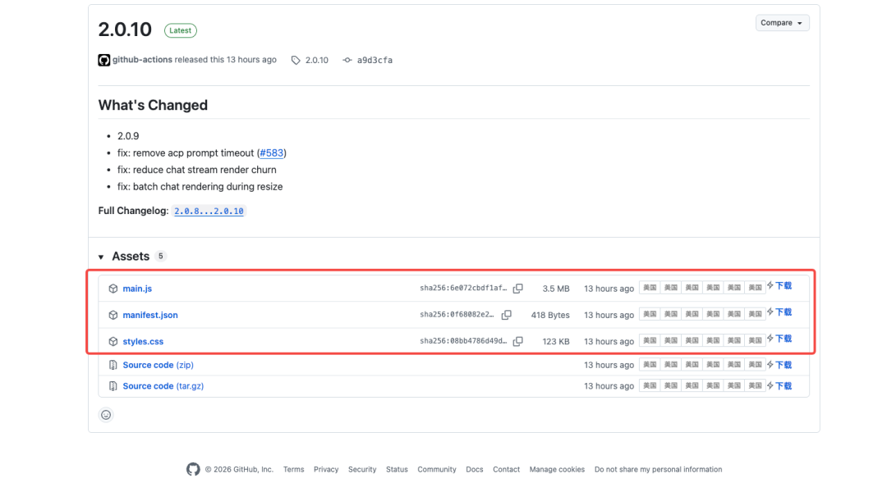
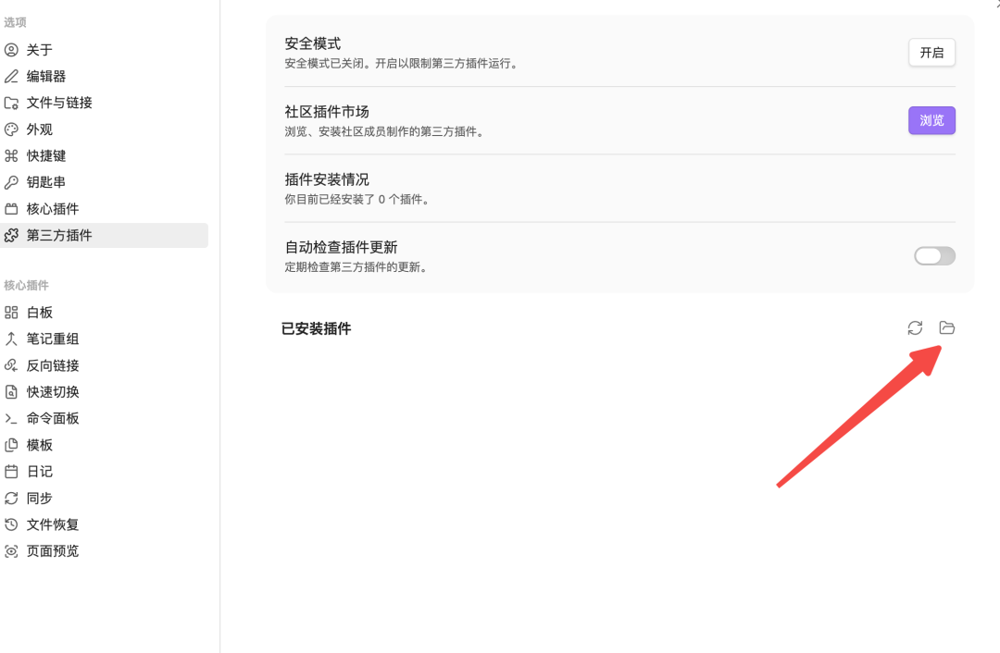
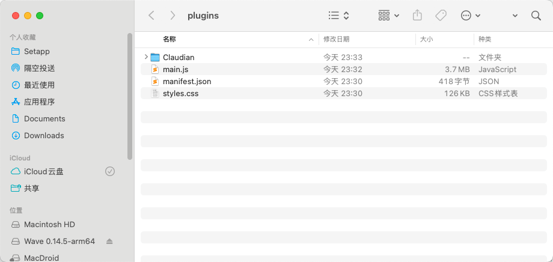
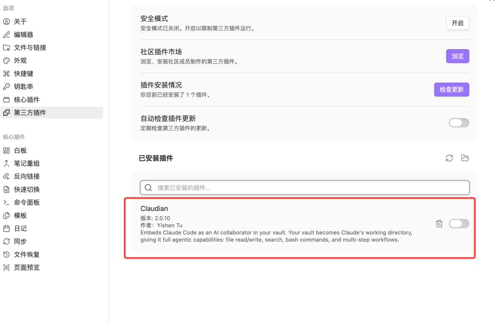
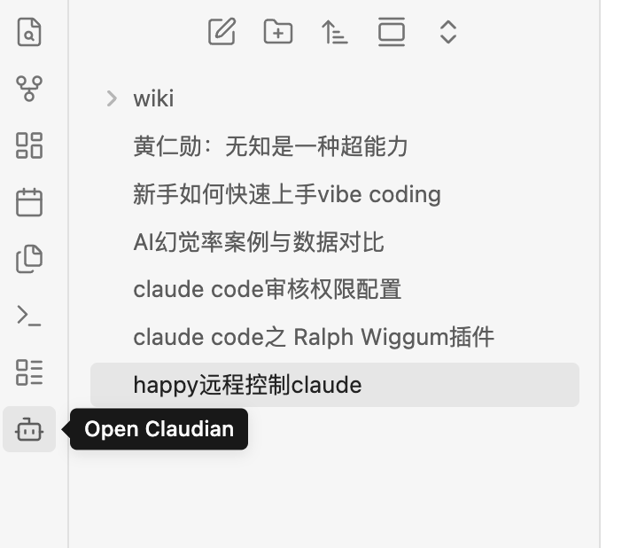
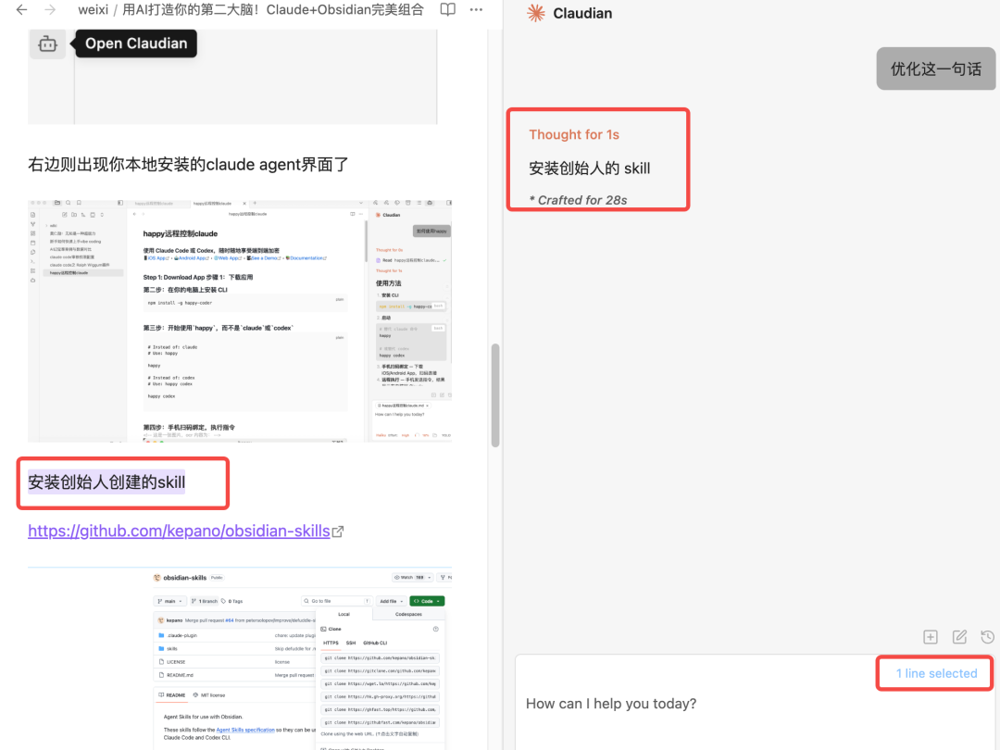
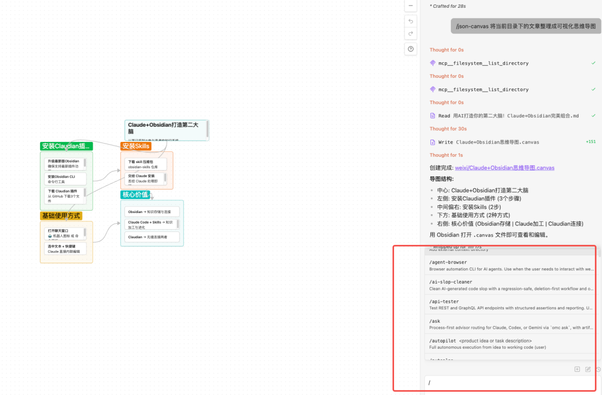

> 📎 来源: [HarryAiBot](https://mp.weixin.qq.com/s?__biz=MjM5NjM3NjExOA==&mid=2247484240&idx=1&sn=15060c13904db28d276a0185663cdb49&chksm=a70d043fd1c772678e0273a4341921e2a5789aaf01fc2f6cf04cf0f7bc2e7c9a855809aa9ec0&mpshare=1&scene=1&srcid=0511fyFO44bqwaeUSvS8mUuo&sharer_shareinfo=271ee0e417bfbea2423fcc510b48441e&sharer_shareinfo_first=271ee0e417bfbea2423fcc510b48441e) | 时间: 2026-05-11 00:06

---

别再手动整理笔记了！Claude+Obsidian打造永不遗忘的AI知识系统

> **导读：**

> 如果你正在苦恼：❌ 笔记越积越多却从不复习 ❌ 知识碎片化无法形成体系 ❌ 手动整理费时费力，这篇文章帮你解决。Claude+Obsidian 让你的笔记从"存储"升级为"思考"，把 AI 打造成真正的第二大脑。

## 一、为什么你的笔记总是白记？

很多人记笔记的流程是这样的：

记笔记 → 存起来 → 再也不看

时间久了，笔记堆积如山，真正派上用场的时候却寥寥无几。

问题出在哪里？

笔记只是**"存"了，没有被"加工"**。没有定期回顾，没有关联提取，记忆曲线告诉我们——知识不复习就会遗忘。

那怎么解决？**让 AI 参与你的知识加工过程。**

## 二、Claudian 是什么？

Claudian 是一个 Obsidian 插件，它把 Claude Code 直接搬进了你的笔记库。

安装很简单：

1. 升级最新版 Obsidian
2. 下载 Claudian 插件（从 GitHub 下载3个文件放入插件目录）https://github.com/YishenTu/claudian

   
3. 打开社区插件目录，把3个文件放入 Claudian 目录

 





5. 重启后启用插件



5. 点击左下角的机器人图标，Claude 界面就会出现在文章右侧



Claudian 最大的亮点，是**完整支持 Claude Code 的 Skills**。

在输入框输入 

```
/
```

，你会看到：

- 可用命令
- 已注册的 Skills

## 三、Skills 是什么？能干什么？

Skills 是 Claude Code 的核心能力包。

你可以理解为——把特定领域的工作流，封装成可复用的"自动化脚本"。

官方有一个 obsidian-skills 库：

| 技能 | 描述 |
| --- | --- |
| Obsidian-Markdown | 创建和编辑Obsidian有味的Markdown（），包含维基链接、嵌入、调出、属性及其他Obsidian专属语法`.md` |
| Obsidianbase | 创建和编辑带有视图、筛选、公式和摘要的Obsidianbase（）`.base` |
| json-canvas | 创建和编辑包含节点、边、组和连接的 JSON Canvas 文件 （）`.canvas` |
| Obsidian-CLI | 通过Obsidian CLI与Obsidian Vaults交互，包括插件和主题开发 |
| defuddle | 使用 Defuddle 从网页提取干净的 markdown，去除杂乱以保存代币 |

下载 skill 压缩包后，直接丢给 Claudian 安装即可：

装好之后，你可以直接让 Claude：

- **重构一篇技术文章**
- **拆解复杂概念**
- **生成大纲 / TODO / 知识卡片**
- **统一文档风格**
- **把零散笔记整理成系统知识**

这已经不只是 AI 辅助写作，而是**AI 协作编辑**。

## 四、如何把知识变成"活的"？

传统的知识管理，核心是「存储+连接」。

Obsidian 的双向链接解决的就是这个问题——笔记之间可以互相引用，形成知识网络。

但还不够。

知识不只是"存"，还需要"加工"——理解、重组、提取、应用。

Claude + Skills 解决的就是这个「加工」问题：

- Obsidian 解决的是：**知识如何存储与连接**
- Claude + Skills 解决的是：**知识如何被持续加工与进化**

Claudian 插件，把这两件事无缝连接在一起。

## 五、基础使用方式

### 打开聊天窗口

两种方式：

1. 点击 Obsidian 左侧功能区的机器人图标
2. 使用命令面板打开

### 内联编辑

在笔记中**选中一段文本**，使用快捷键，Claude 可以**直接进行内联编辑选中的文本**：



不需要复制粘贴，不需要切换窗口，直接在原文中让 AI 帮你改。

### Skills 命令

在输入框中输入 

```
/
```

，弹出命令和 Skills 列表，可以直接使用obsidian-skills的技能：



## 六、实战场景举例

### 场景1：整理碎片笔记

你有 20 条零散的读书笔记，想形成一篇结构化总结。

告诉 Claude：「把这 20 条笔记整理成一篇结构清晰的总结，包含核心观点、案例、行动建议」

Claude 自动生成，无需手动复制粘贴。

### 场景2：生成知识卡片

读完一篇技术文章，让 Claude 生成知识点卡片：

- 概念卡：是什么
- 原理卡：为什么
- 应用卡：怎么用

以后复习时，知识卡片一目了然。

### 场景3：统一文档风格

团队文档风格不统一？让 Claude 帮你批量调整格式、语气、用词。

## 七、为什么这个组合值得试试？

几个原因：

**1. 成本低**

不需要额外付费，Claudian 是免费插件，Claude Code 本身是你的 AI 能力

**2. 本地化**

笔记存在本地 Obsidian 库，不上云，隐私有保障

**3. 可扩展**

Skills 生态在成长，可以自己写新的 skill 来适配你的工作流

**4. 真正用起来**

很多知识管理工具的问题是"记了不用"。Claudian 让 AI 参与加工，知识真的会被持续激活

## 八、总结

| 工具 | 解决什么问题 |
| --- | --- |
| Obsidian | 知识存储与连接 |
| Claude | 知识加工与进化 |
| Claudian | 连接两者 |

三合一，你就有了一个**可以被 AI 参与思考、不断演化的个人知识系统**。

从此你的 Obsidian 不只是笔记库，而是不断进化的第二大脑。
