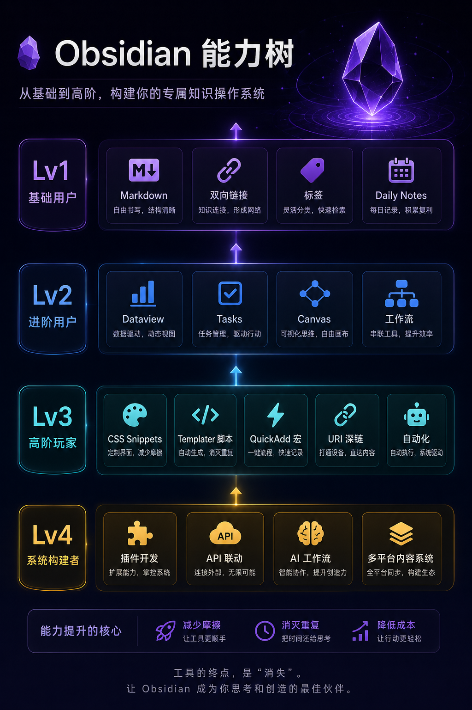
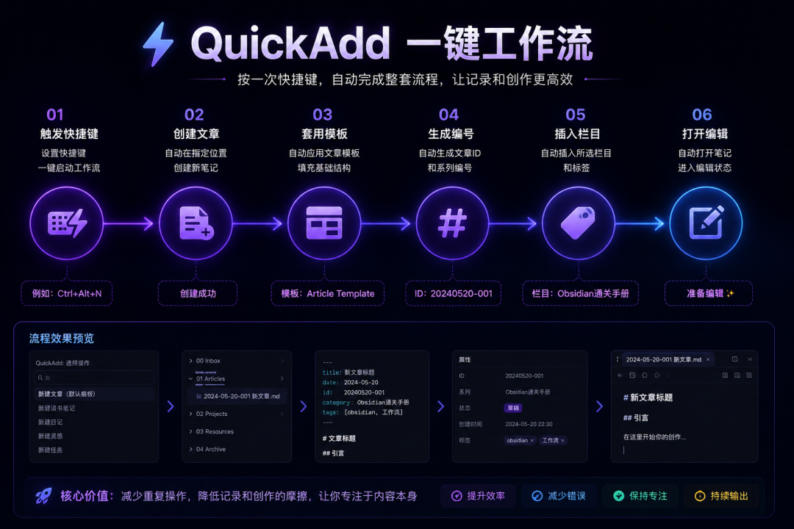
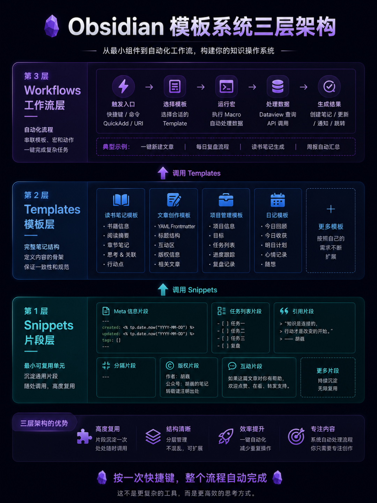

> 📎 来源: [胡巍&amp;互为螺旋](https://mp.weixin.qq.com/s?__biz=MzU2NzgzMzYwNQ==&mid=2247499513&idx=1&sn=c4d0b0303ffbffa4e4e36992e009f0de&chksm=fd5c5a2e3694ea4d85beb01216085ec8861cb8413d1ef140e5786533dbbe8ce5c4935add18a1&mpshare=1&scene=1&srcid=0522Yk3QFna1jnAF9BnIvrFw&sharer_shareinfo=5ed3dd9d9d11171eb468189c15bc63f7&sharer_shareinfo_first=5ed3dd9d9d11171eb468189c15bc63f7) | 时间: 2026-05-22 22:22

---

# 别再把 Obsidian 只当笔记软件了：高阶玩家都在这样用

### 从界面定制到自动化工作流，把 Obsidian 变成你的知识操作系统

很多人用 Obsidian，只是把它当成一个高级 Markdown 文件夹。

能写笔记，能做双链，能同步，本地安全。

但真正的高阶玩家，早就不满足于“记下来”。

他们开始用 CSS 改界面，用 Templater 自动生成内容，用 QuickAdd 串起工作流，用 URI 打通电脑和手机，甚至自己写插件。

到这一步，Obsidian 就不再只是笔记软件。

它开始变成一个真正属于你的知识操作系统。

前面的内容，我们解决的是：

- 怎么记
- 怎么找
- 怎么同步
- 怎么管理

而这一篇开始，我们正式进入：

# Obsidian 的“高阶玩家区”

---

# Obsidian 高阶能力树



| 等级 | 身份 | 核心能力 |
| --- | --- | --- |
| **Lv1** | 基础用户 | Markdown、双向链接、标签、Daily Notes |
| **Lv2** | 进阶用户 | Dataview、Tasks、Canvas、工作流 |
| **Lv3** | 高阶玩家 | CSS Snippets、Templater 脚本、QuickAdd 宏、URI 深链、自动化 |
| **Lv4** | 系统构建者 | 插件开发、API 联动、AI 工作流、多平台内容系统 |

高阶玩法的核心，不是把 Obsidian 折腾得越来越复杂。

而是让它帮你减少摩擦、消灭重复动作、降低行动成本。

---

# 一、CSS Snippets：减少视觉摩擦

很多人折腾 CSS，不只是为了好看。

而是为了：

> 让自己愿意每天打开它。

Obsidian 本质上是一个基于 Electron 的网页应用，所以你几乎可以用 CSS 修改很多界面元素。

真正长期使用 Obsidian 的人，最后都会慢慢形成：

- 自己的界面风格
- 自己的阅读习惯
- 自己的视觉系统

这其实是在降低长期使用时的心理摩擦。

但 CSS 的目标，不是把 Obsidian 改成另一个 App。

而是让阅读、写作、检索这些动作变得更顺手。

---

## 怎么启用 CSS Snippets

1. 1. 设置 → 外观
2. 2. 找到“CSS 代码片段”
3. 3. 打开 snippets 文件夹
4. 4. 创建 

   ```
   .css
   ```

    文件
5. 5. 回到 Obsidian 刷新并启用

---

## 我长期保留的 3 个 CSS

### 1）更舒服的阅读行高

```
body {  font-family: -apple-system, "Noto Sans SC", sans-serif;}.cm-line {  line-height: 1.8;}.markdown-preview-view p {  line-height: 1.8;}
```

别小看这个改动。

如果你每天在 Obsidian 里待 4 小时以上，阅读舒适度会明显影响长期使用体验。

---

### 2）彩色 Tag 胶囊

```
.tag {  background-color: var(--interactive-accent);  color: white !important;  border-radius: 12px;  padding: 2px 8px;  font-size: 0.85em;}
```

这个会让标签的视觉辨识度高很多。

尤其在大仓库里，信息扫描速度会明显提升。

---

### 3）高亮未完成任务

```
.markdown-preview-view input[type="checkbox"]:not(:checked) {  accent-color: #e74c3c;}
```

很多人任务系统坚持不下去，不是因为不会用。

而是视觉反馈太弱。

未完成任务更醒目之后，你会更容易产生“清空列表”的欲望。

---

## 推荐主题

如果不想自己写 CSS，可以直接装成熟主题。

我长期觉得不错的有：

| 主题 | 特点 |
| --- | --- |
| **Minimal** | 极简、高度可定制 |
| **Blue Topaz** | 中文用户非常多 |
| **AnuPpuccin** | 配色舒服、颜值很高 |
| **ITS Theme** | 阅读体验优秀 |

安装路径：设置 → 外观 → 主题 → 管理

---

# 二、Templater：减少重复输入

很多人以为 Templater 只是：

> 自动插入日期。

其实它真正厉害的地方是：

# 把重复动作彻底消灭。

---

## 我现在怎么用 Templater 写公众号

现在我写公众号时，基本已经不手动创建文章框架了。

按一个快捷键：

- 自动生成 YAML
- 自动插入标题结构
- 自动写入创建时间
- 自动生成文章 ID
- 自动插入版权区
- 自动插入互动区

一篇文章骨架，3 秒完成。

这才是 Templater 真正的价值：

> 把固定重复动作全部自动化。

---

## 常用变量

```
<% tp.date.now("YYYY-MM-DD") %><% tp.date.now("YYYY-MM-DD HH:mm") %><% tp.file.title %><% tp.file.folder() %><% tp.system.clipboard() %
```

| 变量 | 用途 |
| --- | --- |
| ``` tp.date.now("YYYY-MM-DD") ``` | 当前日期 |
| ``` tp.date.now("YYYY-MM-DD HH:mm") ``` | 当前日期+时间 |
| ``` tp.file.title ``` | 当前文件名 |
| ``` tp.file.folder() ``` | 当前文件夹路径 |
| ``` tp.system.clipboard() ``` | 剪贴板内容 |

这些变量组合起来之后，可以快速构建日记系统、阅读系统、内容系统、项目系统。

---

## 弹窗交互

你甚至可以让模板“问你问题”。

```
---title: "<% tp.system.prompt("文章标题") %>"author: "胡巍"created: <% tp.date.now("YYYY-MM-DD") %>---
```

创建笔记时会自动弹窗。

模板开始具备交互能力之后，它就不再只是“预设文本”，而是一个小型输入流程。

---

## 用户脚本

Templater 还能直接执行 JavaScript。

比如：

```
function generateId() {  return Math.random().toString(36).substring(2, 10);}module.exports = generateId;
```

然后模板里：

```
id: <% tp.user.generateId() %
```

你甚至可以：

- 自动生成系列文章编号
- 自动调用天气 API
- 自动生成内容摘要
- 自动读取数据库信息

这时候的 Obsidian，已经开始有点“个人系统”的味道了。

---

# 三、QuickAdd：减少重复流程

很多人低估了 QuickAdd。

它绝对不只是一个“快速创建笔记插件”。

它更像：

# 一个轻量级自动化引擎。

---

## 我最常用的工作流



比如我现在写“Obsidian 通关手册”。

按下快捷键后：

1. 1. 自动创建文章
2. 2. 自动套用模板
3. 3. 自动生成系列编号
4. 4. 自动插入固定栏目
5. 5. 自动放入对应文件夹
6. 6. 自动打开编辑界面

整个过程不到 5 秒。

这会让你越来越不想回到“手动创建”的时代。

---

## 选题入库工作流

再比如，看到一个公众号选题灵感时，我只需要触发 QuickAdd：

- 输入标题
- 选择栏目
- 自动写入选题池
- 自动加上创建时间
- 自动生成状态：待写
- 自动跳转到对应笔记

整个过程几秒钟完成。

重点不是“快”。

而是它降低了记录灵感的阻力。

---

## 宏 Macro

QuickAdd 最强的功能之一，就是 Macro。

你可以把多个动作串成：

> 一键工作流。

比如每日复盘宏。

执行一次后：

- 自动打开今日日记
- 自动插入复盘模板
- 自动弹出 Prompt
- 自动写入“今日收获”
- 自动写入“明日计划”

这不是让你更会折腾工具。

而是让系统推着你行动。

---

## 工作流链

更进一步，QuickAdd 还能串联多个宏。

比如周复盘工作流：

1. 1. Dataview 自动统计本周笔记
2. 2. 自动生成周总结
3. 3. 自动弹出复盘问题
4. 4. 自动生成下周计划

做到这里时，Obsidian 就已经不只是一个笔记软件了。

它更像是 Notion + 自动化平台 + 本地知识库的结合体。

---

# 四、Obsidian URI：减少跳转成本

这是很多人完全不知道的功能。

Obsidian 支持 URI 协议。

也就是说，你可以从：

- 浏览器
- Raycast
- Alfred
- iPhone 快捷指令
- 其它 App

直接跳转进某条笔记。

---

## 基础格式

```
obsidian://open?vault=仓库名&file=文件路径
```

---

## 我现在怎么用

### 1）浏览器直达工作台

我会把高频笔记直接做成浏览器书签。

比如：

- 内容选题池
- 工作流面板
- AI Prompt 库

一点就进。

---

### 2）快捷启动

在 Raycast 里输入关键词，可以直接打开：

- 今日任务
- 项目面板
- 周复盘
- 公众号草稿

这个体验非常像一个个人操作系统。

---

### 3）iPhone 快捷指令

你甚至可以做到：

- Siri 打开今日日记
- 一句话记录灵感
- 自动写入 Inbox

体验过 URI 之后，你会发现：

Obsidian 不只是一个信息存放工具。

它可以成为整个工作流的入口。

---

# 五、模板系统：真正厉害的人都在模块化

很多人的模板系统，最后会越来越乱。

原因是：

> 模板没有架构。

真正好用的模板系统，一定是分层的。

---

# 我更推荐“三层结构”



| 层级 | 名称 | 说明 | 示例 |
| --- | --- | --- | --- |
| **第一层** | Snippets 片段 | 最小可复用单元 | ``` created: <% tp.date.now("YYYY-MM-DD") %> ``` |
| **第二层** | Templates 模板 | 完整笔记结构 | 读书模板、文章模板、项目模板 |
| **第三层** | Workflows 工作流 | 用 QuickAdd 串联模板、宏、Prompt、自动化动作 | 按一次快捷键，整个流程自动完成 |

这才是模板系统的高级形态。

不是文件越来越多，而是结构越来越清楚。

---

# 六、插件开发：理解 Obsidian 的真正上限

别紧张。

这一部分不是让你现在立刻学 TypeScript。

普通用户不一定要学会开发插件。

但理解插件能做什么，会让你更清楚 Obsidian 的边界在哪里。

---

## 一个插件最简单的结构

```
main.tsmanifest.jsonstyles.css
```

核心逻辑其实并不复杂。

比如：

```
this.addCommand({  id: 'insert-timestamp',  name: 'Insert current timestamp'});
```

本质上就是：

```
onload() → 注册功能addCommand() → 添加命令addRibbonIcon() → 添加按钮
```

---

## 为什么建议你看看插件源码

因为你会发现，很多“看起来很神”的插件，本质上只是：

- 自动读取数据
- 自动生成内容
- 自动执行动作

真正理解这一层后，你会开始重新思考：

> 什么东西值得手动做，什么应该交给系统。

---

## 官方资源

- ```
  [Obsidian API 文档](https://docs.obsidian.md/)
  ```
- ```
  [Obsidian 官方插件示例](https://github.com/obsidianmd/obsidian-sample-plugin)
  ```
- ```
  [Obsidian Releases](https://github.com/obsidianmd/obsidian-releases)
  ```

---

# 七、真正的高阶，不是“折腾”

写到这里，我想提醒一句：

很多人会在高阶阶段掉进另一个坑：

> 过度折腾。

装 50 个插件。

天天改主题。

一直优化工作流。

结果：

- 不写内容
- 不输出
- 不行动

这是非常危险的。

真正成熟的 Obsidian 用户，最后都会慢慢明白：

# 工具的终点，是“消失”。


真正的高阶，不是把 Obsidian 改得越来越复杂。

而是让它越来越少打扰你。

当界面顺眼了，模板自动了，流程跑起来了，入口打通了，你就不需要天天研究工具。

你只需要打开它，然后开始写、开始想、开始行动。

系统存在的意义，是让你更稳定地输出。

---

# 💬 互动话题

能一路看到第 14 篇的人，基本已经脱离“Obsidian 新手村”了。

评论区打个「进阶」，我看看还有多少人在继续深挖。

也欢迎告诉我：

你现在最想折腾的是：

- CSS 美化
- Dataview
- QuickAdd
- 自动化工作流
- 插件开发

我会根据评论区热度，决定后面要不要单独开“高阶实战系列”。

---

# 下一篇预告

第 15 篇，我们聊聊：

# Obsidian 用户最容易踩的坑

包括：

- 把 Obsidian 当收藏夹
- 一上来装 50 个插件
- 过度分类
- 只收集不输出
- 工作流复杂到自己都不用

很多人不是不会用 Obsidian。

而是：

> 把系统做得太复杂了。

> Tip

> 我整理了一份Obsidian安装包和常用插件(持续更新)。
> 需要的可以：
> 👉 点个赞 + 在看
> 👉 后台回复：Obsidian
> 我把整套直接发你。
