> 📎 来源: [蜂子讲知识Ashbur](https://mp.weixin.qq.com/s?__biz=Mzg3Nzc2MzQwMA==&mid=2247484674&idx=1&sn=b2c9bcecd00c3428769de397095f8bea&chksm=cea96dc33470e4e0589a4f967fe296f92aed5da876825b23b7e17265d78ed2239bc854fd0258&mpshare=1&scene=1&srcid=05100APpXpwrtwoBNT3bKexp&sharer_shareinfo=163f3cd256aa7d9a131d6a66df2d6230&sharer_shareinfo_first=163f3cd256aa7d9a131d6a66df2d6230) | 时间: 2026-05-10 13:44

---

# [OpenClaw怎么选？13家大厂版本对比，避坑指南+成本测算全搞定](https://mp.weixin.qq.com/s?__biz=Mzg3Nzc2MzQwMA==&mid=2247484592&idx=1&sn=25070e1fa865f2e7bd12b7486b71888e&scene=21#wechat_redirect)

做自媒体久了，是不是总被AI“失忆”坑惨？跟OpenClaw聊完的干货转头就忘，下次对接还要重新梳理，纯纯做无用功；各类灵感、爆款素材、会议笔记散得到处都是，想找一条关键信息，翻遍群聊、文档、笔记软件都找不到；分析爆款文章全靠手动扒，耗时耗力就算了，分析结果还没法系统留存，下次想用还得重来？

如果你也被这些问题困扰，那这篇实操干货一定要码住！手把手教你用OpenClaw+Obsidian搭建专属自媒体第二大脑，彻底解决AI工具“失忆”难题，把零散知识结构化存储、高效复用，直接让自媒体创作、运营效率翻番！全程亲测好用，步骤简单易懂，看完就能上手实操～

## ●第一步：先搭好Obsidian知识仓库，筑牢信息沉淀基础

想要做好知识沉淀，Obsidian绝对是自媒体人的宝藏工具，免费开源、灵活性拉满，搭建专属知识库毫无难度，跟着步骤走就能轻松搞定：

1. 打开Obsidian官网https://obsidian.md/，根据自家电脑的系统版本下载对应安装包，全程傻瓜式安装，无需复杂配置，几步就能装好；

   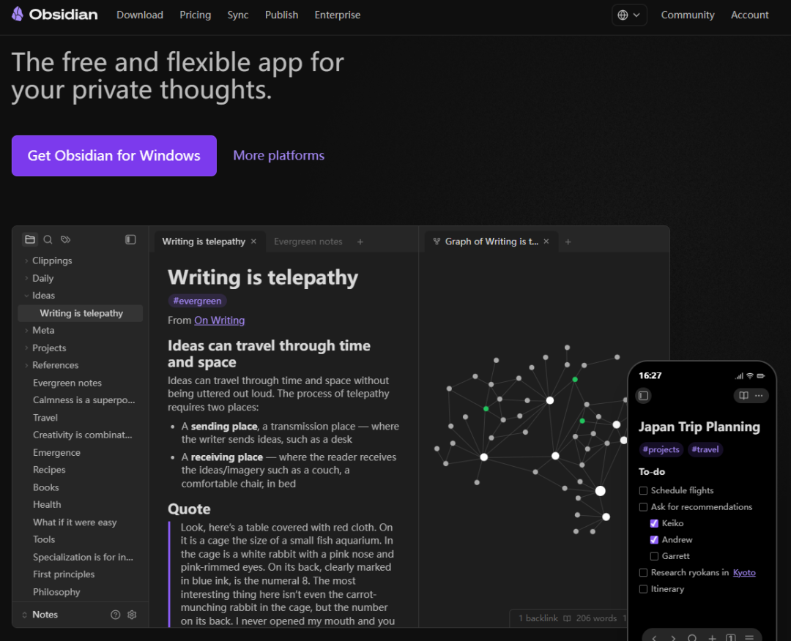
2. 打开软件后，点击「创建一个仓库」，给知识库起个好记的名字（比如“自媒体AI知识库”），选好本地存储位置，点击创建即可完工。这里给大家补个小知识点：Obsidian里的仓库就是vault，相当于独立的专属笔记空间，做自媒体可以细分搭建爆款库、标题库、平台规则库，分类规整后续找素材更高效；

   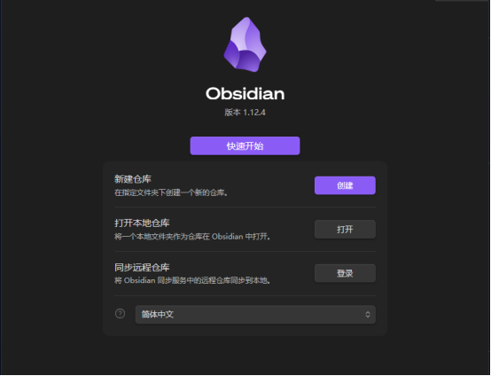

   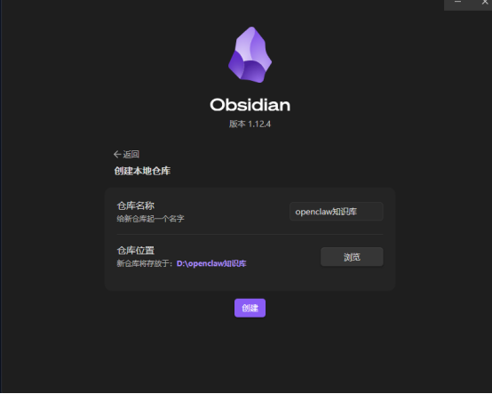

1. 进入新建的仓库后，点开设置面板，开启「允许命令行界面」选项，按提示完成注册流程；

   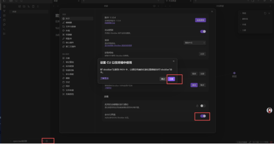
2. 打开电脑命令行，输入指令「obsidian --version」，如果能正常显示版本信息，就说明Obsidian的CLI功能成功打通，这一步是为了后续实现终端控制、自动化联动外部工具做铺垫。

   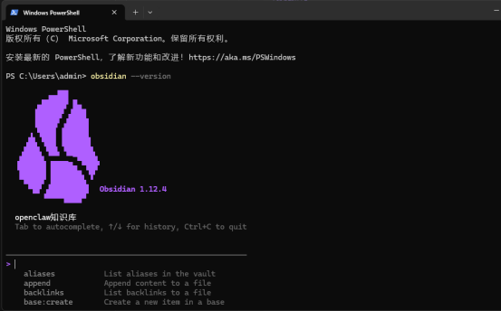

## ●第二步：打通OpenClaw与Obsidian，实现工具双向联动

Obsidian知识库搭建完成后，核心就是让两款工具实现无缝交互，不用复杂操作，在OpenClaw（小龙虾）里输入对应指令就能快速搞定：

1. 在OpenClaw对话框中输入「帮我安装 obsidian」，看到安装成功的提示，就代表Obsidian技能已加载完成，存储路径默认为skills/obsidian；

   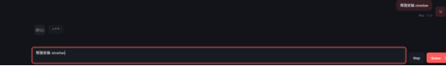

   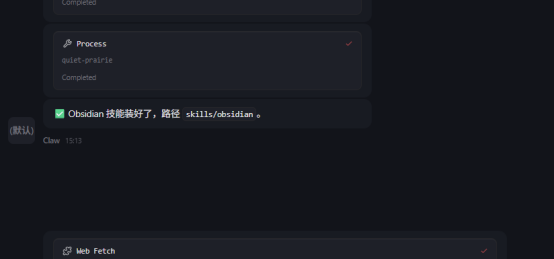

1. 想要实现多平台内容爬取、爆款分析，还能加装专属实用技能，直接输入指令「安装https://github.com/runesleo/x-reader」即可。这个开源项目实用性拉满，支持微信公众号、小红书、B站、YouTube等主流平台内容抓取，自媒体人闭眼冲！

   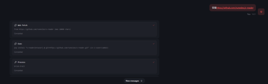

   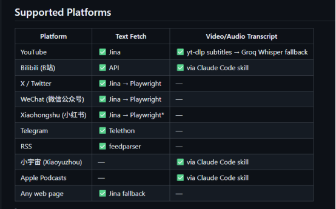

技能安装完毕后，OpenClaw就解锁了多平台文章解析能力。举个例子，想分析一篇公众号爆款文，直接输入指令「帮我+文章链接+分析这篇文章的内容，拆解爆款逻辑」，OpenClaw会自动调用技能抓取内容、深度分析，还能把完整分析结果同步至Obsidian，省去手动复制粘贴的麻烦，省心又省力。

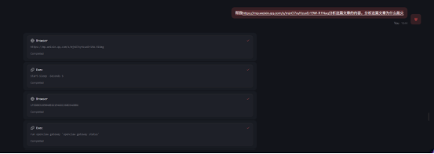

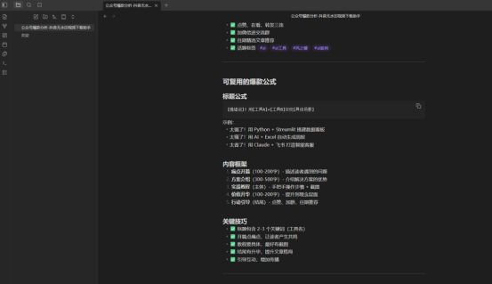

## ●第三步：定制专属爆款分析技能，自媒体创作一键提速

基础联动打通后，咱们可以给OpenClaw定制专属技能，实现微信文章自动化分析，不用每次重复输入复杂指令，这才是高效搞自媒体的核心玩法！

在OpenClaw中输入专属提示词：「创建一个技能，当接收到微信文章链接时，自动解析链接内容，提炼核心干货，输出爆款选题建议，分析文章数据与优劣点，最终将所有分析数据同步至obsidian」。

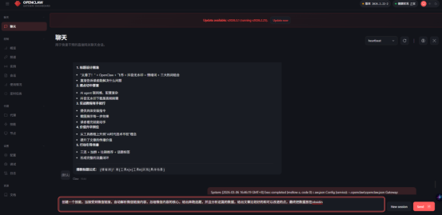

短短几秒就能完成技能创建，系统会自动将技能命名为wechat-article-analyzer，功能覆盖超全面：一键解析微信文章、提炼核心观点与摘要、推送2-3个适配爆款选题、拆解文章优缺点、自动归档分析结果，全流程无需人工干预。

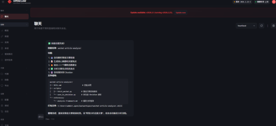

日常使用更是简单到极致，直接把微信文章链接发给OpenClaw，附带一句「帮我分析这篇文章」，就能自动触发全套分析流程，生成的完整分析报告直接同步至Obsidian知识库，随用随取，效率直接拉满。

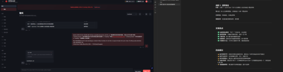

我自己实测过这个技能，分析一篇选品系统搭建的公众号文章时，OpenClaw不仅给出了标题评分，还精准提炼出文章亮点：流程图清晰直观、步骤带图实操性强、提前预判实操问题；同时也给出了可落地的改进建议：缺少价值升华、无读者互动引导、标题可加时效词降低点击门槛，所有结果都自动存入Obsidian，后续复盘、复用超方便。

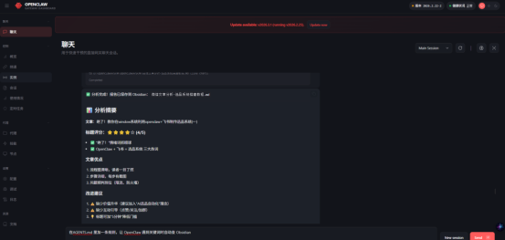

## ●第四步：设置OpenClaw记忆触发机制，彻底告别“失忆”难题

把信息存入Obsidian只是第一步，真正的核心是让OpenClaw能按需调取知识库内容，彻底摆脱“对话即失忆”的窘境，实现知识高效复用。

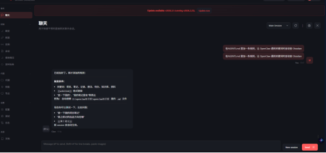

这一步操作超简单，只需在OpenClaw的AGENTS.md文件中添加一条规则，设定好触发条件与对应执行行为，OpenClaw就能按规则自动检索知识库：

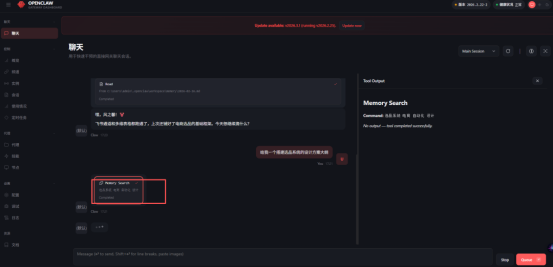

### 触发条件

对话中出现关键词：项目、笔记、记录、想法、待办、知识库、资料；

识别到[[wikilink]]格式的内部链接；

收到“查一下我的”“我的笔记里有”等相关指令。

### 对应行为

自动检索Obsidian知识库内的.md格式文件，精准调取相关内容并反馈。

规则添加完成后，重启会话即可生效。比如日常询问“查一下我的项目笔记”“帮我整理一份选品系统搭建大纲”，OpenClaw会自动调取Obsidian中沉淀的历史内容，基于原有干货继续对接，不用反复阐述背景，工作效率直接翻倍。

**工具的核心价值，从来都是让复杂的工作变简单，让碎片化的知识成体系。OpenClaw+Obsidian的组合，就是自媒体人的效率神器，把信息获取、分析、沉淀、复用的全流程自动化，真正解放双手。**

完成以上四步，你的OpenClaw就拥有了专属记忆大脑，能自动完成信息抓取、分析、整理、归档全流程，再也不用被知识零散、工具失忆的问题困扰。而且这套玩法还能延伸拓展，后续可打通Claude Code+OpenClaw+Obsidian，实现多类AI工具联动，解锁更多自媒体高效运营玩法。

觉得这篇干货实用的话，别忘了点赞、在看+转发，把这份高效秘籍分享给身边的自媒体同行，也记得星标关注，后续更多AI工具实操教程、自媒体爆款干货，第一时间推送给你！
