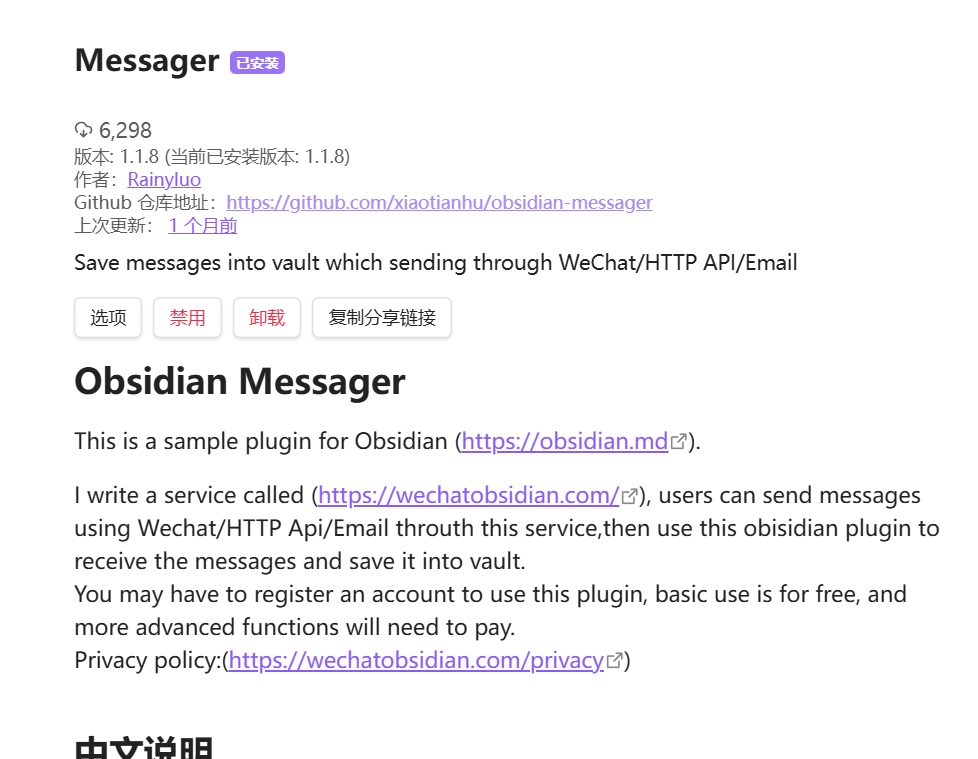
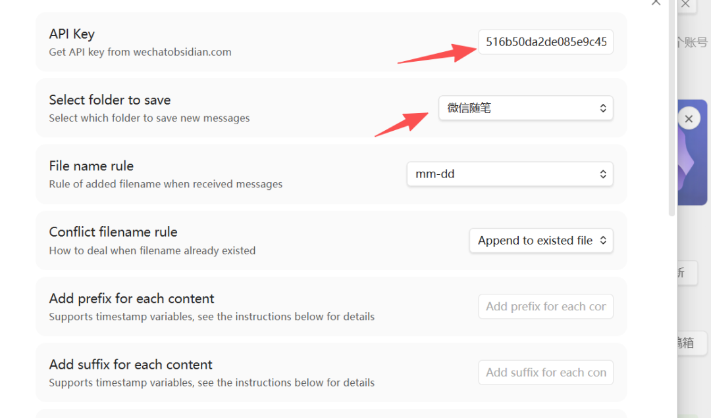
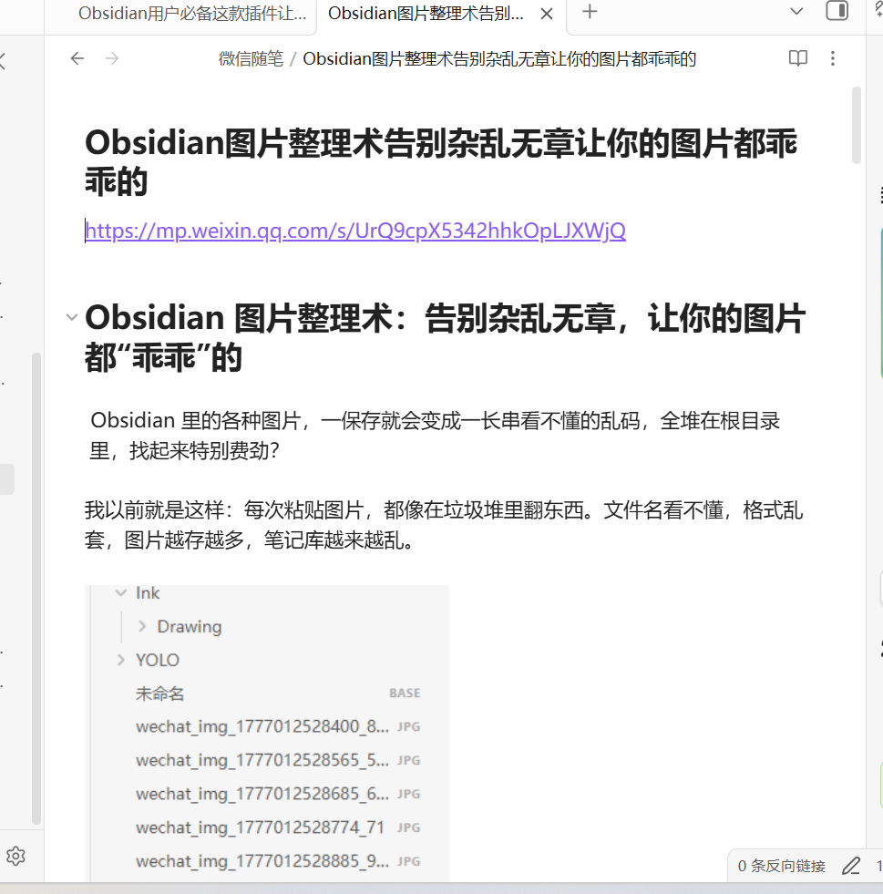
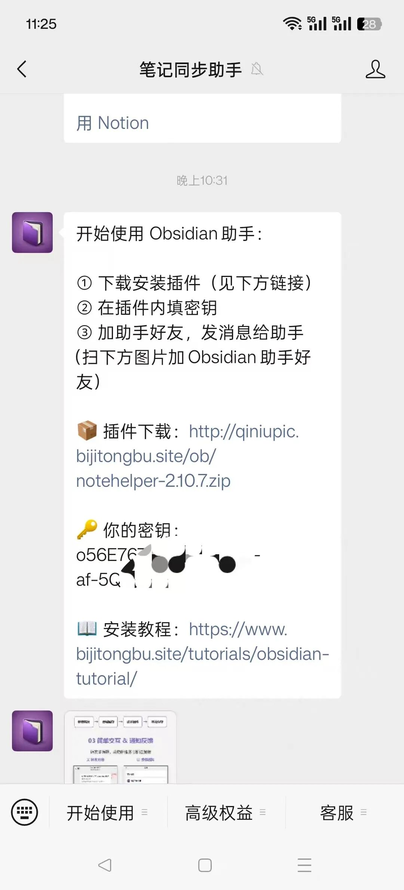
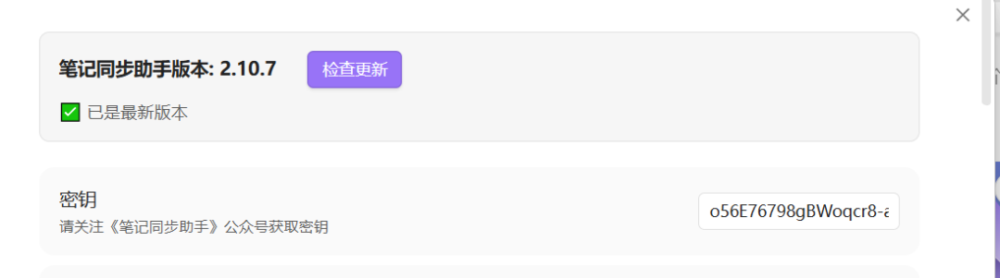
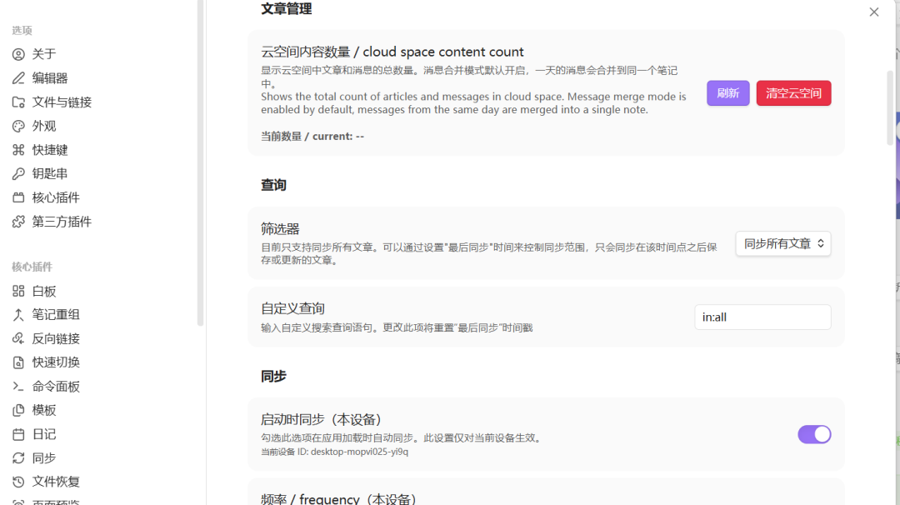
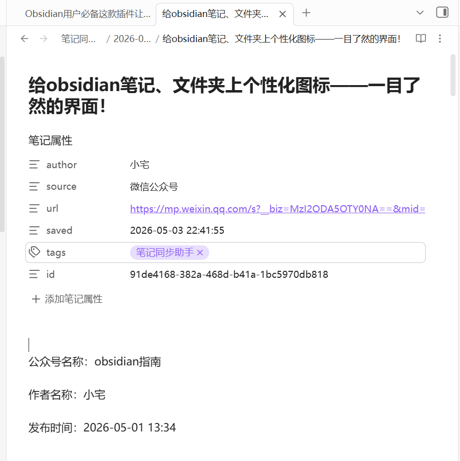
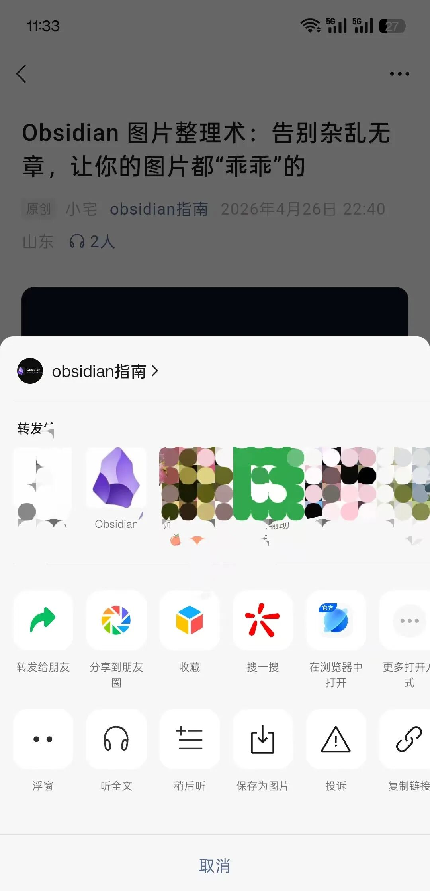

> 📎 来源: [obsidian指南](https://mp.weixin.qq.com/s?__biz=MzI2ODA5OTY0NA==&mid=2247486960&idx=1&sn=31ccebd6854104be23ab61603bab4cad&chksm=eb3e0cd9357588e99c686d4e6f5865848e9265ca58838b20dd5032e04238dee6873eda115869&mpshare=1&scene=1&srcid=0507oDQeN5Iu9a4rl2dNObgW&sharer_shareinfo=76bdade5def00c4119ebbf2733e31d26&sharer_shareinfo_first=76bdade5def00c4119ebbf2733e31d26) | 时间: 2026-05-07 04:47

---

平时在微信看到好的内容，最多就是点了"收藏"

以为收藏就等于记住。结果呢？收藏夹里的文章堆成了小山，真正回看的没几篇。时间一长甚至都不知为何收藏！

而obsidian的意义就在于收集整理！所以打通我们最频繁使用的微信与obsidian格外重要。

## 笔记同步助手

今天要介绍的这个小技巧，能让你**把微信文章一键同步到Obsidian**。我自己用了一段时间，遇到好的文章像发送给一位朋友一样简单，但却同步到了我的obsidian里，**学习效率翻了不止一倍**。

核心就是一个好用的插件——**微信文章同步插件**。它能自动提取文章内容，转换成Markdown格式，保存在你的Obsidian中。

下面我分享两种亲测有效的方法，任你挑选。

## 实际操作指南

### 🔵 方法一：Messager插件（低频使用快捷方案）

#### 安装四步走：

**第一步：安装插件**

1. 打开Obsidian设置 → 第三方插件 → 浏览
2. 搜索"Messager" → 安装并启用

   

**第二步：获取秘钥**

1. 访问 https://wechatobsidian.com
2. 注册登录 → 复制你的专属API Key

**第三步：配置插件**

1. 回到Obsidian的Messager插件设置
2. 粘贴API Key
3. 选择保存目录（比如"微信随笔"）
4. 设置文件名规则

   

**第四步：手机操作**

1. 注册后绑定公众号即可添加好友发送同步内容
2. 可以发送公众号链接，obsidian内直接生成文章

   

**💡 使用贴士：**

- 免费版每天10条，不频繁使用完全够
- 文章在服务器保留1天，记得及时打开obsidian同步
- 刷新同步有提醒，更新迅速

### 🟢 方法二：笔记同步助手（不限制次数）

如果10次用的不爽，这个插件就可以搞定：

#### 安装三部曲：

**第一步：获取插件**

1. 搜索公众号“笔记同步助手”
2. 关注公众号，回复"obsidian"
3. 里面会有你的秘钥和插件地址

   

**第二步：手动安装**

1. 下载ZIP压缩包
2. 解压到`.obsidian/plugins`文件夹
3. 重启Obsidian，在插件中启用

**第三步：配置使用**

1. 输入公众号内秘钥

   
2. 左侧功能区出现同步按钮
3. 点击即可手动同步，也可设置自动同步

   

此种方案最基础的免费版也不限制，最快更新速度可以设置15s,稍等一会就可以同步了。

此方案生产的笔记都笔记属性

## 🚀 把好文章同步到Obsidian变成下意识动作，就像发送给你的朋友一样自然。第一种方法是加公众号，而第二种方案是加一个企业微信，很多内容可以直接方便转发！

##

## 💬 结尾寄语

知识管理最大的敌人不是工具复杂，而是行动缺失。

趁着看完文章的热乎劲，赶紧选一个方法试试。你会发现，原来那些淹没在收藏夹里的好内容，可以变成实打实的知识资产，为你所用。

📱 **关注「obsidian指南」**
💡 陪你一起打造真正好用的第二大脑
