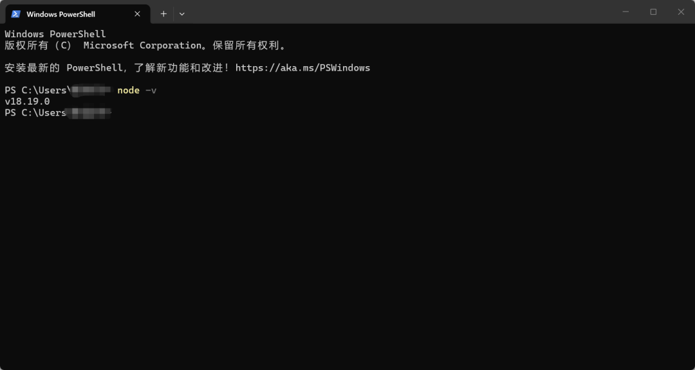
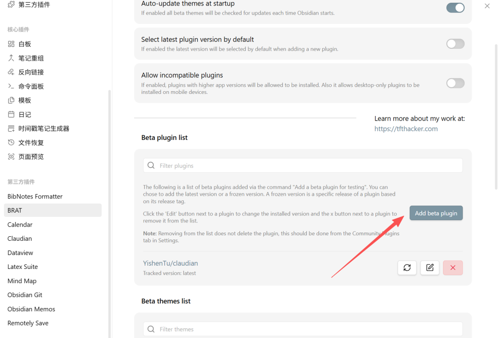
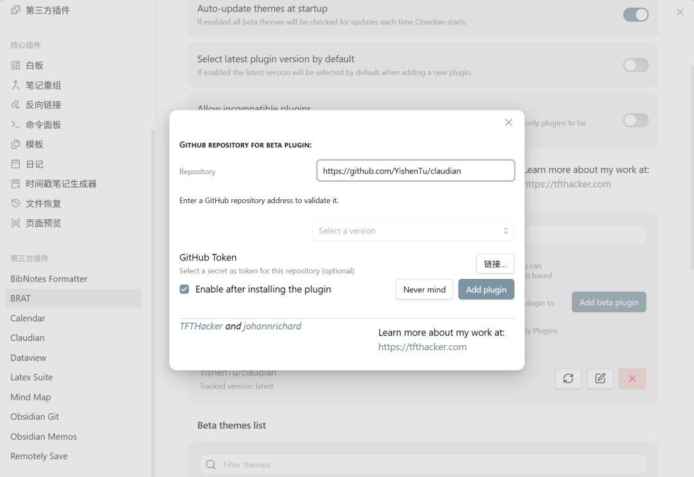
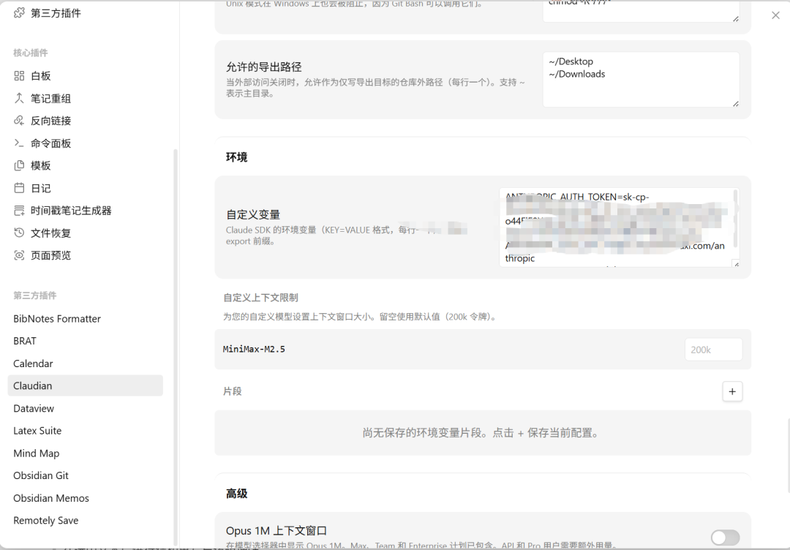
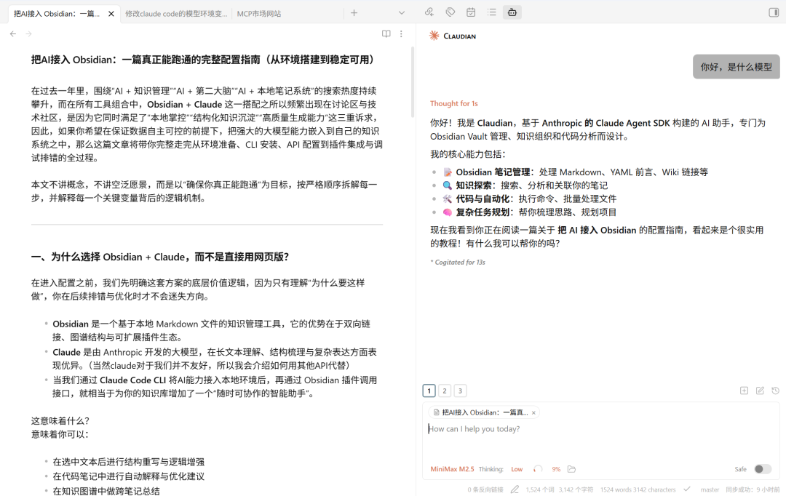

> 📎 来源: [参数之缘](https://mp.weixin.qq.com/s?__biz=Mzk2NDcxNDEyMw==&mid=2247484136&idx=1&sn=d5e0adaa51d77706a16817d63b63f71e&chksm=c57d7e5afd4a3ef6fc2c99a7acf3afce62466ee5717754fc4576f25022a74d9a04bfb012958c&mpshare=1&scene=1&srcid=0430HZ4alRnRLwMsQtGfT9NE&sharer_shareinfo=844b0606e143c5ce6fb17ef122f39228&sharer_shareinfo_first=844b0606e143c5ce6fb17ef122f39228) | 时间: 2026-04-30 19:48

---

在过去一年里，围绕“AI + 知识管理”“AI + 第二大脑”“AI + 本地笔记系统”的搜索热度持续攀升，而在所有工具组合中，**Obsidian + Claude** 这一搭配之所以频繁出现在讨论区与技术社区，是因为它同时满足了“本地掌控”“结构化知识沉淀”“高质量生成能力”这三重诉求，因此，如果你希望在保证数据自主可控的前提下，把强大的大模型能力嵌入到自己的知识系统之中，那么这篇文章将带你完整走完从环境准备、CLI 安装、API 配置到插件集成与调试排错的全过程。

本文不讲概念，不讲空泛愿景，而是以“确保你真正能跑通”为目标，按严格顺序拆解每一步，并解释每一个关键变量背后的逻辑机制。

---

# 一、为什么选择 Obsidian + Claude？

在进入配置之前，我们先明确这套方案的底层价值逻辑，因为只有理解“为什么要这样做”，你在后续排错与优化时才不会迷失方向。

- **Obsidian** 是一个基于本地 Markdown 文件的知识管理工具，它的优势在于双向链接、图谱结构与可扩展插件生态。
- **Claude** 是由 Anthropic 开发的大模型，在长文本理解、结构梳理与复杂表达方面表现优异。（当然claude对于我们并不友好，所以我会介绍如何用其他API【minimax】代替）
- 当我们通过 **Claude Code CLI** 将AI能力接入本地环境后，再通过 Obsidian 插件调用接口，就相当于为你的知识库增加了一个“随时可协作的智能助手”。

这意味着什么？ 意味着你可以：

- 在选中文本后进行结构重写与逻辑增强
- 在代码笔记中进行自动解释与优化建议
- 在知识图谱中做跨笔记总结
- 在论文草稿中做论证强化与语言提升

而这一切，都是在你本地笔记体系中完成的。

---

# 二、这套系统到底是如何工作的？

很多人配置失败，并不是操作问题，而是因为不理解架构。 请先理解这条调用链：

```
Obsidian 插件 → Claude Code CLI → API → 大模型
```

这意味着：

1. 你必须有 Node.js 环境（用于运行 CLI）
2. 你必须安装 Claude Code 命令行工具
3. 你必须正确设置 API 变量
4. 插件只是调用桥梁

只要其中任意一环配置错误，都会导致连接失败。对于终端环境配置不够明白可以AI辅助安装，把你的问题及终端日志发给AI。比如：如何安装node？如何打开终端？怎么查看版本？变量配置好了吗？

---

# 第一步：安装 Node.js

Claude Code 依赖 Node.js 运行，因此必须提前安装。 官方下载地址（选择 LTS 版本即可）：

- Node.js 官网：https://nodejs.org安装完成后，在终端执行：

```
node -v
```

如果能正确显示版本号，说明环境正常。如果没有，可以去搜一篇node安装教程，或者留言给我。



⚠ 注意：安装完成后建议重启终端，否则环境变量可能尚未生效。

---

# 第二步：安装 Claude Code

Claude Code 是官方提供的命令行工具，用于与 Claude API 交互。 执行：

```
npm install -g @anthropic-ai/claude-code
```

安装完成后测试：

```
claude
```

如果出现欢迎界面，说明 CLI 安装成功。

官方文档可参考：

- Anthropic 文档：https://docs.anthropic.com/

---

# 第三步：配置 API 环境变量

> 下面针对如何把API换成minimax，其他类似，我目前用的是minimax，windows版本，mac可以参考这个逻辑问AI。

这是整个配置中最容易出问题的一环，因为涉及环境变量与终端作用域。

在 Windows PowerShell 中执行：

```
[System.Environment]::SetEnvironmentVariable("ANTHROPIC_BASE_URL", "https://api.minimaxi.com/anthropic", [System.EnvironmentVariableTarget]::User)
```

然后关闭终端，重新打开，再执行：

```
echo $env:ANTHROPIC_BASE_URL
```

如果能正确显示内容，说明变量生效。

---

# 第四步：安装 Obsidian 插件

打开：

- Obsidian 进入「设置 → 第三方插件（无法直接搜到claudian）」。 首先安装：BRAT 插件 然后通过 BRAT 添加插件仓库：



- Claudian
  仓库地址：

  ```
  https://github.com/YishenTu/claudian
  ```



- 安装完成后，在插件设置中填入



```
ANTHROPIC_AUTH_TOKEN=你的秘钥
```

---

# 第五步：测试与验证

打开右侧面板，尝试和你的AI对话。



---

# 三、进阶使用场景

当配置完成之后，你可以做的事情远不止问答。介绍一点我喜欢的场景：

- 将文章草稿进行结构重排

- 告诉它我要学什么帮我生成学习计划，我可以对话式更新进度
- 帮我梳理一下我的知识架构
- 将零散笔记汇总成系统文章（还有好用的工具做自动抓取，下一篇再介绍）

## 真正的价值在于： 你不再是“在网页里问问题”，而是在“自己的知识系统里协作”。

# 四、为什么这套方案值得长期使用？

因为它同时具备三点：

1. 本地数据可控
2. AI 能力可扩展
3. 知识结构可沉淀

在信息过载时代，工具本身并不能提升效率，真正提升效率的是“结构 + 智能”的结合，而 Obsidian 负责结构，AI负责智能，当两者打通之后，你得到的不只是一个插件，而是一个可以持续进化的个人知识中枢。

如果你按照本文步骤完整配置，理论上可以 100% 跑通；如果仍然遇到问题，可以逐层排查调用链，而不是盲目重复安装。

这才是高效解决问题的方式。

建议点赞收藏用电脑看，每次都是写完才发现自己的排版电脑看更舒服，手机上不是十分适配。
