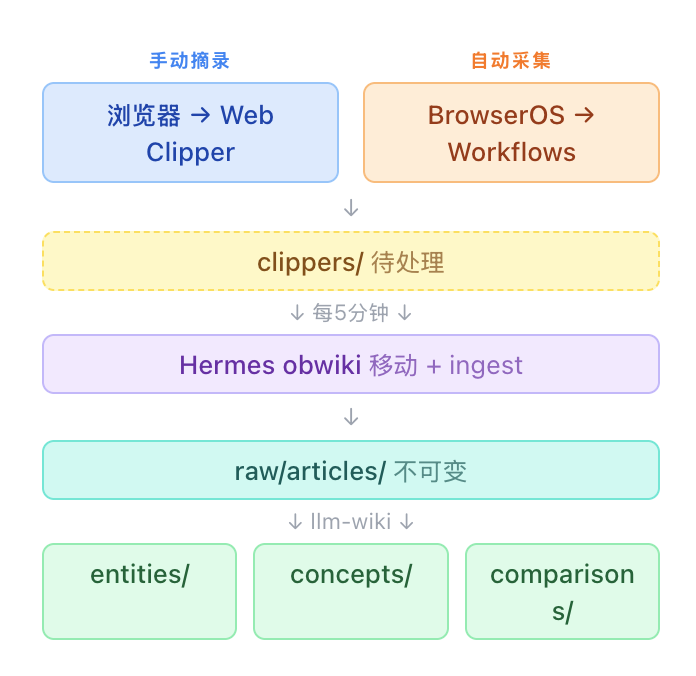

> 📎 来源: [专业造轮子](https://mp.weixin.qq.com/s?__biz=MzI0OTg0NTk0MA==&mid=2247484283&idx=1&sn=7e9ef5d1e5e19381a8156b0bf43bfa68&chksm=e874c1060f1645ab44b009f00191fed74f64d8717e2125c778704ee0076ba928ed8a27a0f19b&mpshare=1&scene=1&srcid=0522XUk0PdPxUZBkzm6kd3Cs&sharer_shareinfo=dd71eb52445505f2f2812fb1cbb987a1&sharer_shareinfo_first=dd71eb52445505f2f2812fb1cbb987a1) | 时间: 2026-05-22 02:10

---

> 知识不是收藏出来的，是消化出来的。

我的浏览器书签栏堆了 200+ 篇以后看的文章。微信收藏夹里还有更多。以后永远不会来。收藏的那一刻你觉得自己拥有了知识，其实你只拥有了一个更长的列表。

后来我想明白了一件事，我缺的不是收藏夹，是一个能替我读、替我整理、替我关联知识的系统。

本文记录我如何用 Hermes + Obsidian + LLM Wiki 搭建了一套自动化个人知识库。知识入库有两条路径，手动摘录你看到的文章，自动采集你关心的资讯。两条路汇到同一个知识库，全流程无人值守。

## 整体架构



人的参与可以只有一步，看到好文章时点一下。甚至这一步也可以省掉——让 BrowserOS 按你的关注点自动采集。

## 用 Profile 切一个独立的 librarian

之前我翻过车——让写代码的 Hermes 同时管知识库，它读着读着就顺手重构了我的代码。详见[专治"Agent分裂症"：用 Hermes Profiles 给 AI 分工](https://mp.weixin.qq.com/s?__biz=MzI0OTg0NTk0MA==&mid=2247484237&idx=1&sn=872f37bd06f7e29141f8a664bf31ee34&scene=21#wechat_redirect)。

这次我给知识库专门切了一个 Profile：

```
hermes profile create librarian
```

在 

```
~/.hermes/profiles/librarian/.env
```

 里设置知识库路径：

```
WIKI_PATH=/Users/one/codes/project-manager/librarian
```

在 

```
SOUL.md
```

 里写死职责边界：

```
你是知识库管理员。你的职责是：
```

模型选 DeepSeek-V4-Flash——阅读理解和文本整理够用，成本几乎可以忽略。知识库管理不需要写代码的顶级模型。

切换就一行命令：

```
librarian chat   # 知识库管理员上线
```

## 看到好文章，一键入库

### Obsidian Web Clipper

Obsidian Web Clipper 是 Obsidian 官方的浏览器扩展，一键把当前网页保存为 Markdown 到你的 Vault。

配置三步：

1. 在 Obsidian 中安装 Web Clipper 插件
2. 在浏览器中安装 Obsidian Web Clipper 扩展（Chrome / Firefox / Safari）
3. 设置保存路径为 

   ```
   clippers/
   ```

Clipper 保存的文件自带 frontmatter，包含 

```
source_url
```

、

```
title
```

、

```
clipped
```

 日期等。这和 llm-wiki 的 raw frontmatter 规范天然兼容——后续 ingest 不需要额外处理。

使用就一步：浏览到好文章 → 点击浏览器工具栏的 Obsidian 图标 → 文章自动保存到 

```
clippers/
```

。不用选目录，不用填标签，不用手动复制粘贴。

这是最轻量的入库方式——你只需要一个判断：这篇文章值不值得读。剩下的交给系统。

## 让 BrowserOS 替你盯资讯

手动摘录解决了看到好文章的问题。但有些资讯你不一定会看到——Hacker News 的热帖、GitHub Trending、某个技术博客的更新、行业研报。你不可能每小时刷一遍这些网站。

BrowserOS 的定时任务可以替你盯着。BrowserOS可以做的事情有很多，比如之前的分享[BrowserOS填补了Hermes浏览器自动化的空白](https://mp.weixin.qq.com/s?__biz=MzI0OTg0NTk0MA==&mid=2247484276&idx=1&sn=b4d1c47daaadfcfbf99a0210b52fed7a&scene=21#wechat_redirect)，让BrowserOS帮我看监控，输出业务质量报告，我只需要审阅即可

### 为什么是 BrowserOS 不是爬虫

简单的爬虫能抓静态页面，但很多资讯站不是静态页面——Hacker News 的评论要点击展开，GitHub Trending 要登录才能看个性化推荐，有些技术博客有 Cloudflare 挑战。爬虫搞不定这些。

BrowserOS 是一个完整的 Chromium 浏览器，内置 Agent 能力。它打开的就是一个真实浏览器——登录态是你的，JavaScript 渲染没问题，验证码也能处理。它的 Workflows 功能可以构建稳定的自动化流程，比写爬虫脚本靠谱得多。

### 配置 BrowserOS 定时采集

在 BrowserOS 中创建 Workflow，比如"每天早上抓 Hacker News 前 5 条"：

1. 打开 BrowserOS，进入 Workflows
2. 新建 Workflow，描述任务："打开 https://news.ycombinator.com，提取前 5 条新闻的标题、链接和评分，保存为 Markdown"
3. 设置定时：每天 8:00
4. 设置输出路径：保存到 librarian 的 

   ```
   clippers/
   ```

    目录

BrowserOS 的 Cowork 功能给 Agent 一个本地文件夹权限，浏览器里抓数据、本地写文件，一趟搞定。保存的 Markdown 自带 frontmatter，和 Clipper 的格式一致——后续 ingest 流程完全一样。

几个我实际在跑的定时任务：

| 任务 | 频率 | 采集内容 |
| --- | --- | --- |
| Hacker News Top 5 | 每天 8:00 | 标题 + 链接 + 评分 + 热门评论摘要 |
| GitHub Trending（Rust/Go/Python） | 每天 9:00 | 项目名 + Star 数 + 一句话描述 |
| 技术博客更新 | 每 12 小时 | 新文章标题 + 摘要 + 链接 |
| 行业研报 | 每周一 | 标题 + 核心观点摘要 |

BrowserOS 在隐藏窗口中执行，不干扰你正常使用浏览器。10 分钟超时自动退出，不会挂在那吃资源。

## 定时ingest到知识库

两条入库路径最终都落在 

```
clippers/
```

 目录。每 5 分钟，Hermes 定时任务自动处理这个目录。

### 设计思路

为什么不直接存到 

```
raw/
```

？两个原因：

1. **边界清晰**：

   ```
   clippers/
   ```

    是待处理队列，

   ```
   raw/
   ```

    是已入库存档。中间有一个缓冲区，方便排查问题——如果 ingest 出错，原文还在 

   ```
   clippers/
   ```

    里没丢。
2. **幂等安全**：移动操作是原子的，ingest 是幂等的（llm-wiki 的 sha256 机制会跳过已处理的文件）。先移后 ingest，不会重复处理。

### 创建定时任务

直接跟 librarian 说就行，不用手写配置文件：

```
librarian chat
```

Hermes 会自动把你的自然语言描述转成 cron 配置，写入 profile 的 config.yaml。以后想改也直接说——"把频率改成每 10 分钟"、"ingest 的时候跳过 comparisons 类型"，它自己改配置自己生效。

### 运行效果

每 5 分钟，librarian 自动检查 

```
clippers/
```

。有新文章就移动 + ingest，没有就安静等着。

一次 ingest 的典型产出：

```
移动：clippers/rust-concurrency-model.md → raw/articles/rust-concurrency-model-2026.md
```

一篇源文章触发 2-5 个 wiki 页面的创建或更新——这就是 LLM Wiki 的复利效应。知识不是孤立的卡片堆，而是互相连接的网络。

## 实际效果

搭了这套系统之后，我的知识工作流变成了这样：

**以前**：看到好文章 → 存书签 → 再也不看 → 需要时搜索 → 找到 10 篇相关文章 → 从头读到尾 → 花两小时整理要点

**现在**：

1. 看到好文章 → 点击 Clipper → 5 分钟后自动入库。
2. 关心的资讯 → BrowserOS 自动采集 → 5 分钟后自动入库。
3. 需要时问 librarian → 得到已关联、已去重、已标注置信度的综合答案

时间从两小时手动整理变成五秒点击 + 五分钟自动处理。省下的不是五分钟，是那两小时里你重新发现的关联、标记的矛盾、建立的索引——这些才是知识库的核心价值。

- END -
