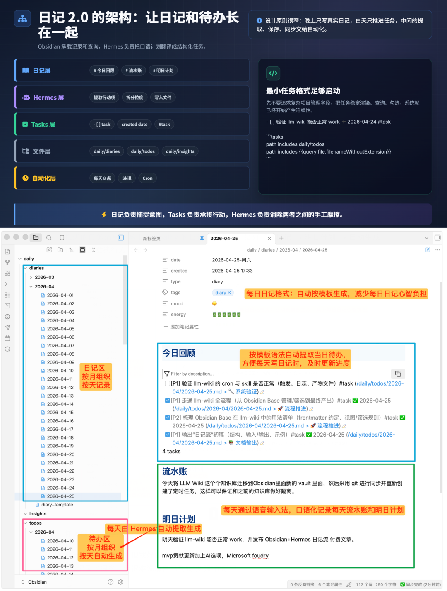
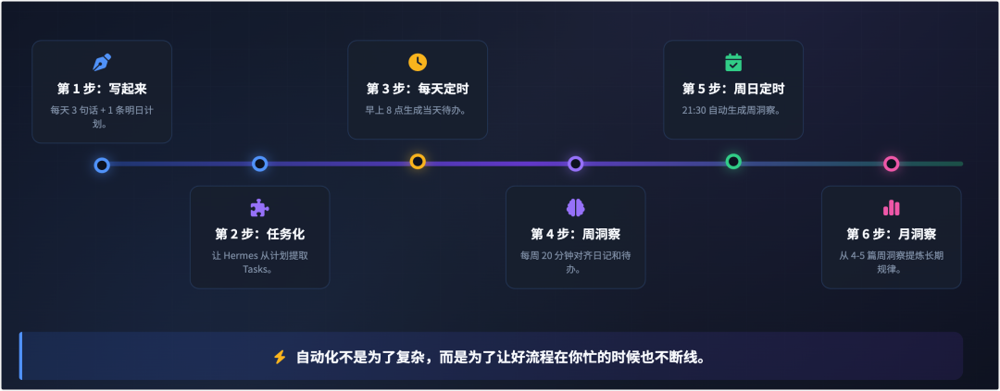
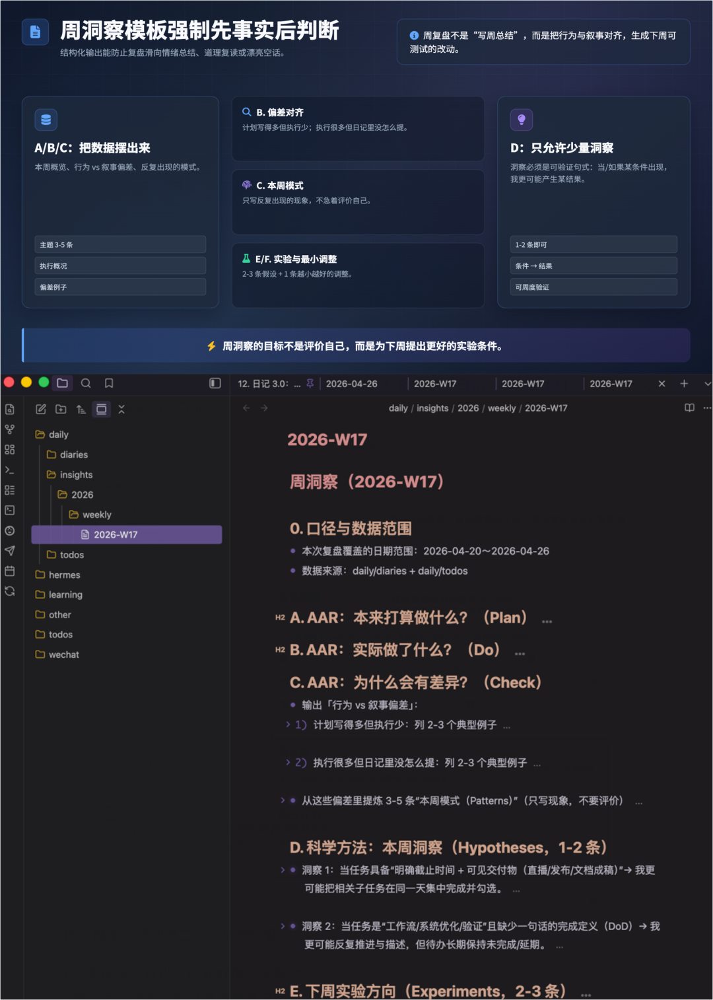
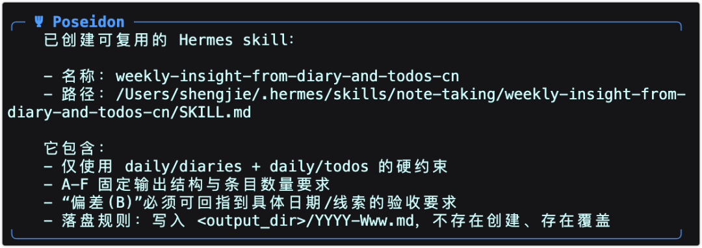
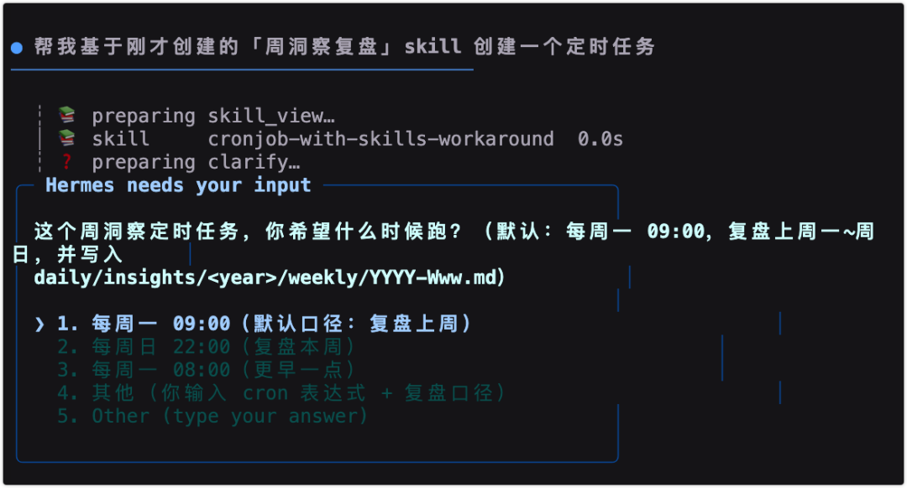
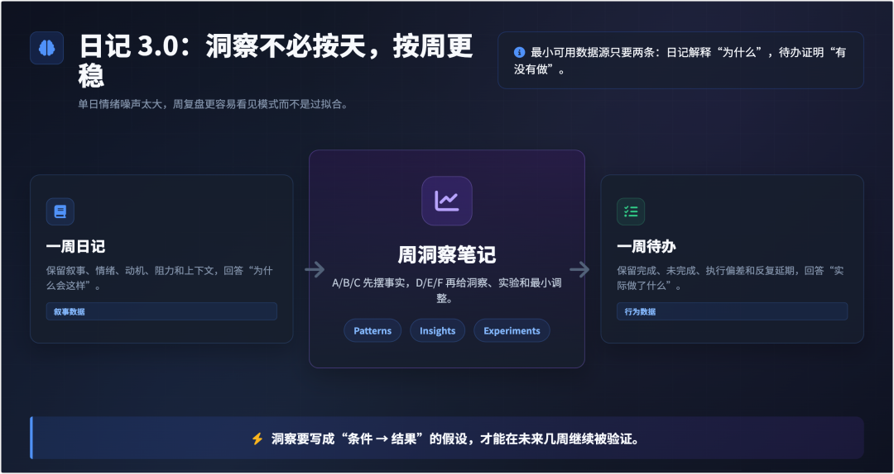

> 📎 来源: [向 AI 而行](https://mp.weixin.qq.com/s?__biz=MzIwMDM3MjcxOQ==&mid=2458777883&idx=1&sn=784b5c98c0818df3ede0aac517e4126a&chksm=806877efc10f7213dd5ebf018a8296fbc21999f7aff3752b49ac7be87dcea89c86e3b5d84a73&mpshare=1&scene=1&srcid=0430pjSEeH4PWIhHYopJMHc7&sharer_shareinfo=a85190e4064d2aa09979d8c7fe40381e&sharer_shareinfo_first=a85190e4064d2aa09979d8c7fe40381e) | 时间: 2026-04-30 19:45

---

# 日记 3.0：我用 Obsidian + Hermes，把流水账变成洞察与成长的飞轮（周洞察版）


这是我《[Hermes Agent 养成指南](https://mp.weixin.qq.com/mp/appmsgalbum?__biz=MzIwMDM3MjcxOQ==&action=getalbum&album_id=4468913148007432201&scene=126#wechat_redirect)》系列的第 12 篇文章。如果你也期望更系统的学习和应用 Hermes，不妨点个关注，一起学习交流。

如果你已经按上一篇文章（[日记 2.0：我用 Hermes + Obsidian，把流水账变成每天都能推进的任务清单，基于 Karpathy 的日记心得实践](https://mp.weixin.qq.com/s?__biz=MzIwMDM3MjcxOQ==&mid=2458777872&idx=1&sn=35d73f52949472bd624d2bacebcc3117&scene=21#wechat_redirect)）搭好了「日记 → 明日计划 → 自动生成待办」那套执行力飞轮：



你大概率会遇到第二个阶段的问题：

•

任务确实在推进，但我好像还是在“忙”

•

我记录了很多，但很难说清自己到底“变强”在哪里

•

我偶尔复盘一下挺有启发，可是启发很容易散掉，过几天又忘了

结论我先讲清楚：
洞察这件事，不必强行“按天”。更稳的做法是：

•

日记按天写（当原始数据）

•

洞察按周做（降低噪声、避免过拟合）

•

数据源只用两样就够启动：日记（为什么）+ 待办完成情况（做了没）

你先把飞轮跑起来，后面再逐步引入“结果数据、外部数据”。这篇文章只讲最小系统：每周自动把一周的日记 + todo 完成情况，借助 Hermes 提炼成 1 份可复用的洞察笔记。



---

# 1. 为什么我不建议一上来就“每天洞察”

我自己踩过坑：按天输出洞察很容易变成两种东西：

•

情绪总结：今天心情差，就写“我不行”

•

道理复读：写“要早睡、要专注”

它们看起来像洞察，但不可验证、不可复用，而且一天的波动噪声太大，容易“过拟合”。

按周洞察的好处是：

•

你能看到“模式”（pattern），而不是被单日情绪带着跑

•

你更容易把洞察写成“条件 → 结果”的解释

•

最重要：它不会让系统变成压力源

---

# 2. 周洞察飞轮长什么样？（日记 + 待办，两条数据线合流）

你可以把它理解成一周一次的循环：

1）收集：这周的日记（叙事） + 这周的 todos 完成情况（行为）
2）汇总：分别提炼“本周发生了什么 / 本周做了什么”
3）洞察：把两者对齐，找出 3～5 个模式 + 1～2 条关键洞察
4）实验：为下周设定 2～3 个“实验方向”（不是任务清单）

 洞察大概是这样：



这里有个很关键的工程思想：

•

日记负责解释“为什么”

•

待办负责证明“有没有做”

你把两条线合起来，洞察才不容易飘。

---

# 3. 目录结构怎么设计？（最小可用，不加新概念）

你沿用上一节课的 daily 结构就行：

•

`daily/diaries`：日记（按天）

•

`daily/todos`：待办（按天）

•

`daily/insights`：洞察（按周/按月）

考虑这套机制可能会跑很多年，我更建议洞察目录按“年份 → 周期类型”组织：

```
daily├── diaries│   └── 2026-04/2026-04-26.md├── todos│   └── 2026-04/2026-04-26.md└── insights    ├── 2026    │   ├── weekly    │   │   ├── 2026-W17.md    │   │   └── 2026-W18.md    │   └── monthly    │       └── 2026-04.md    └── 2027        ├── weekly        └── monthly
```

你会发现我刻意让“洞察”按周独立成文件。原因很简单：
你以后想回看的不是当天流水账，而是每周那几条结论。

---

# 4. 每周怎么做？（20 分钟跑一圈）

我建议你把每周洞察固定在一个很具体的时间点，比如：周日晚上。

流程只有三步：

1）把本周的日记范围定出来（7 篇日记）
2）把本周的待办完成情况拉出来（完成了哪些、没完成哪些）
3）交给 Hermes 生成「周洞察笔记」，写入 `daily/insights`

## 4.1 这套周洞察模板背后的方法论（你会更容易写出“真洞察”）

如果你以前做复盘总觉得“写不出洞察”，多数时候不是你不够聪明，而是你缺一套稳定的提炼框架。

我这份模板主要借鉴了两类很实用的方法论：

1）AAR（After Action Review，行动后复盘）

•

本来打算做什么？（计划/待办的创建）

•

实际做了什么？（待办完成情况 + 日记事实）

•

为什么会有差异？（偏差分析 → 模式）

•

下次怎么做？（下周实验方向 + 最小调整）

2）科学方法（假设-验证）

•

先摆事实，再提炼模式

•

洞察不是结论，而是一条可被未来验证/推翻的“解释”（条件 → 结果）

•

下周不是立 Flag，而是做 2-3 个小实验去验证假设

你会发现：
AAR 负责把“叙事（我怎么感觉）”和“行为（我到底做了没）”对齐；
科学方法负责让洞察可验证，不至于写成鸡汤。

## 4.2 给 Hermes 的周洞察提示词（可直接复制，已按方法论优化）

你可以直接对 Hermes 说（把日期按你本周实际范围改一下）：

```
我需要你帮我做一次「周洞察复盘」。数据源只使用两类（不要引入其它来源）：1) 本周日记（daily/diaries）2) 本周待办完成情况（daily/todos，Obsidian Tasks 格式）时间范围：2026-04-20 到 2026-04-26。复盘方法论要求：- 用 AAR（本来打算做什么 / 实际做了什么 / 为什么有差异 / 下次怎么做）来组织“偏差分析”- 用“科学方法（假设-验证）”来写洞察：洞察必须是可被未来几周用日记+待办验证或推翻的假设输出一份「周洞察笔记」，只输出结果，不要解释：# 周洞察（2026-W17）## 0. 口径与数据范围- 本次复盘覆盖的日期范围：{start}～{end}- 数据来源：daily/diaries + daily/todos## A. AAR：本来打算做什么？（Plan）- 从日记的“计划/明日计划”与本周待办创建中，提炼 3-5 条“本周原计划重点”## B. AAR：实际做了什么？（Do）- 用非常客观的句子总结本周完成的事项（3-5 条）- 再列出本周未完成/反复延期的事项（3-5 条）## C. AAR：为什么会有差异？（Check）- 输出「行为 vs 叙事偏差」：  1) 计划写得多但执行少：列 2-3 个典型例子  2) 执行很多但日记里没怎么提：列 2-3 个典型例子- 从这些偏差里提炼 3-5 条“本周模式（Patterns）”（只写现象，不要评价）## D. 科学方法：本周洞察（Hypotheses，1-2 条）- 每条洞察必须写成：当/如果…（条件）→ 我更可能…（结果）- 每条洞察必须附带“可验证信号”：下周我应该在日记/待办里看到什么变化，才算支持它？## E. 下周实验方向（Experiments，2-3 条）- 每条用“假设”表达（不要写任务清单）- 每条都写清：要改变的变量是什么？预期看到的信号是什么？## F. 下周最小调整（1 条）- 只允许 1 条- 必须小到 15 分钟内能启动（例如：改一个环境设置/改一个固定时间段/删掉一个干扰源）硬性约束：- 不要写鸡汤，不要给我贴标签- 不要发散到“人生建议”，只基于这周的日记与待办推理
```

这个版本的结构目的很明确：

•

A/B/C 用 AAR 把“计划-执行-偏差”对齐

•

D 把洞察约束为“可验证假设”

•

E/F 把下周变成 2-3 个小实验 + 1 个最小调整

## 4.2 保存到洞察目录（可直接复制）

当 Hermes 输出完成，你继续说：

```
请将上面的「周洞察」保存到：daily/insights/2026/weekly 文件夹下。如果文件不存在请创建；如果已存在请直接覆盖。
```

---

# 5. 让流程可复用：把「周洞察复盘」沉淀成 Hermes Skill

到这里你已经能手工跑通一周一次的洞察闭环了，但它还不够“工程化”。

我更希望你把它变成一个可以反复调用的 Skill：以后每到周日晚上，你只需要一句话，Hermes 就能按固定结构产出周洞察，并写入固定路径。

你可以对 Hermes 说（可复制）：

```
请基于我们刚才的「周洞察复盘」流程，创建一个可复用的 Hermes skill。
```



Skill 做好之后，你未来想迭代也很简单，比如：

•

自动统计本周待办完成率、未完成清单

•

增加“反复延期任务 Top 5”

•

每月自动从 4-5 篇周洞察里再提炼一次月洞察

这些都应该是“迭代 skill”，而不是你每周手工加戏。

---

# 6. 自动化闭环：创建每周定时任务，让周洞察自动生成

当 skill 足够稳定，就可以上自动化。

我建议你先用“每周日晚上 21:30”作为默认时间（避开白天的干扰，也给你留足一周的数据）。

你可以对 Hermes 说（可复制）：

```
帮我基于刚才创建的「周洞察复盘」skill 创建一个定时任务
```







我建议你先让它跑 2-3 次，再决定要不要把“月洞察”也加进来。

---

# 7. 你会得到什么？（这套飞轮的真实收益）

只用“日记 + 待办”两条数据线，你每周会稳定得到三种收益：

1）你不再靠感觉评价自己

•

待办完成情况会把“我这周很废”这种情绪，拉回到事实层面

2）你能看见长期模式

•

单天你只会觉得“今天状态差”

•

一周你会看见：到底是什么条件反复触发了它

3）你会开始形成可复用的个人策略

•

下周实验方向不是鸡汤，而是你自己生活里真实可验证的假设

---

# 8. 常见失败场景（提前避坑）

1）周洞察写成“周总结”

•

症状：只是在回顾发生了什么，没有模式/洞察/实验

•

修复：强制输出 C/D/E/F 四段

2）把洞察写成标签

•

症状：我不自律、我效率低

•

修复：改成“条件→结果”的句子，并且能被下周验证

3）把实验写成任务清单

•

症状：下周要做 10 件事

•

修复：只允许 2-3 条假设 + 1 条最小调整

4）只看日记，不看待办

•

症状：洞察很漂亮，但和实际行动对不上

•

修复：增加「行为 vs 叙事偏差」这一段，逼自己对齐

---

# 结尾：先跑起来，再优化

这套「周洞察成长飞轮」我建议你就按最小系统开始：

•

日记：继续写流水账（你已经在做了）

•

待办：继续每天自动生成并勾选（上一节课已经搭好）

•

洞察：每周一次，把两条数据线合流，输出 1 份周洞察笔记

先跑 4 周。
等你真的形成几条稳定规律，再考虑引入“结果数据/外部数据”去加强验证。

如果你愿意，你可以自行将周洞察再推进一步：
让 Hermes 自动汇总本周 todos 的完成情况（完成率、未完成清单、反复延期任务），让周洞察更客观、更省事。

看到这里，想必你已经动手完善了这套体系，期待你发现不一样的自己，成为更好的自己。
