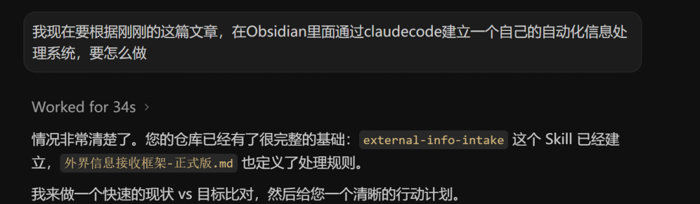
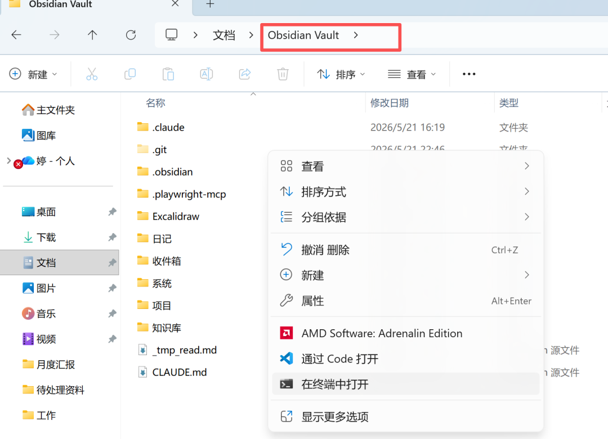

> 📎 来源: [清晨还是傍晚](https://mp.weixin.qq.com/s?__biz=MzA3MTkxNjA4MA==&mid=2649663164&idx=1&sn=df3f8c2927e8621b4d3907be9427b358&chksm=8698d41a486fd7619e378c8005462e4cc24473076b767a77bcb50b385d944503d1f7533dd0d1&mpshare=1&scene=1&srcid=05266x12XJP7dDC1zuMxAAWh&sharer_shareinfo=c9c9df85fca492bcd01a4f34a691648d&sharer_shareinfo_first=c9c9df85fca492bcd01a4f34a691648d) | 时间: 2026-05-26 05:25

---

## 上一篇文章，我梳理了处理信息的 6 个「筛子」，但光有筛子没用，信息焦虑依然没法解决。

因为真正消耗人的，不是提示词本身，而是每次都要自己判断：

- **这篇文章该用哪个筛子？**
- **这段直播逐字稿该怎么处理？**
- **这个案例是做选题、做素材，还是做方法论沉淀？**

这种反人性的繁琐流程，最终只会被放弃，想真正摆脱困境，**必须靠自动化的系统**。

就在今天，我彻底改造了我的 Obsidian 笔记库，结合 Claude Code 搭建了一套本地自动化信息处理系统。

我是怎么建立这套系统的？过程出乎意料地简单，我只是把[场景无限，规则有数：我梳理出的6个信息处理「筛子」](https://mp.weixin.qq.com/s?__biz=MzA3MTkxNjA4MA==&mid=2649663154&idx=1&sn=39e06aab230f81141eda92196bfb15ef&scene=21#wechat_redirect)这篇文章发给了AI，然后对它说：



接下来，我们就像同事开会一样，通过几轮聊天对话，它就帮我把系统一点点搭出来了。

💡 **核心实操经验：**

这里我要讲一下这个过程的关键：**是用 Claude Code 把 Obsidian 的仓库当作一个项目来处理，也就是在 Obsidian 的仓库目录下进行对话。**

所有你需要它记住的全局规则，都可以写到 

```
claude.md
```

 文件中，每一次启动对话它都会先读一遍这个文件，确保系统不跑偏。



要让这套系统运转起来，一共落地了三个机制，正好对应了**被动输入**、**机器清洗**、**资产沉淀**的完整闭环：

## 第一步：搭建极简的统一入口

在沟通中，AI 发现我存东西时总会有分类焦虑，于是它建议我删掉所有诸如“待读文章”、“碎片灵感”的中间文件夹，只在 Obsidian 里保留一个唯一的根目录: 

```
收件箱/
```

。

**最后呈现的结果是：**

无论是一篇微信文章，还是长达两小时的直播逐字稿，看到有用的，什么都不用想，闭着眼睛直接拖进 

```
收件箱/
```

。

- 不用判断
- 不用分类
- 不用想它未来有什么价值

这套系统的第一原则就是：**不要在输入端增加任何大脑负担。**
先收进来，后面交给 AI 处理。


## 第二步：一句口令全自动“洗牌”

Claude Code 读懂了那 6 个筛子的逻辑后，自己生成了一个 

```
skill
```

。它把 6 个提示词全部写进了系统里，设定好了自动判断内容、自动套用筛子的执行规则。

当我有空时，只需对 AI 敲一句：

> **处理收件箱**

AI 就会自动读新文件、匹配筛子、生成卡片，并直接向我汇报，不需要手动去一个个试提示词，**一句指令，全部处理。**


## 第三步：把归档变成强制的“每日检查”

但只做到自动处理还不够。

因为我以前也试过很多知识库工具，最大的问题不是“不会提炼”，而是提炼完之后，文件继续躺在文件夹里，最后变成另一种垃圾堆。
所以我又和 Claude Code 继续调整了一步：**把“归档”写进每天收工流程里。**

现在每天结束工作，我对 AI 说“收工”时，它会先检查待确认区。如果里面还有没处理的卡片，它会直接提醒我：

> 待确认归档项：

> 1. ```
>    2026-05-21-热点判断卡-某某事件.md
>    ```

>     ➡️ 建议入库：

>    ```
>    知识库/素材库/
>    ```
> 2. ```
>    2026-05-21-SOP转译卡-飞书教程.md
>    ```

>     ➡️ 建议移入：

>    ```
>    系统/
>    ```

> 请确认以上文件的最终去向（1入库/ 2暂存/ 3删除）？

**我不做选择，收工流程就不算完成。**

这一步看起来很小，但非常关键，因为知识库真正容易失败的地方，不是没有输入，也不是没有整理，而是**没有每天清空中间状态**。

- 有用的，当天入库
- 暂时没想清楚的，先暂存
- 没价值的，直接删除
- 绝不把垃圾留到第二天


## 真正有用的系统，是让正确动作变轻

我以前尝试过很多次建立知识库，但大多数都坚持不下来，现在这套系统给我最大的感受是：

**真正有用的系统，从来不是把事情变漂亮，而是让“做正确的事”变得毫不费力。**

很多人一提到自动化，就觉得自己不懂代码、不会搭系统，所以干脆不开始。有了 AI 这些都不是问题，你真正需要想清楚的是：

- 你平时是怎么做事的？
- 什么信息值得保留？
- 什么内容应该被转成选题？
- 什么东西应该沉淀成方法论？
- 什么东西应该直接删除？

**只要你的规则足够清楚，AI 就可以顺着你的思路，把流程搭出来。**

最简单的开始方式，就是把上一篇和这一篇文章直接发给 Claude Code，让它学习这套规则，再根据你的 Obsidian 仓库结构，帮你搭出一个自己的信息处理系统。

做出一个这样的系统，远比你想象的简单。
