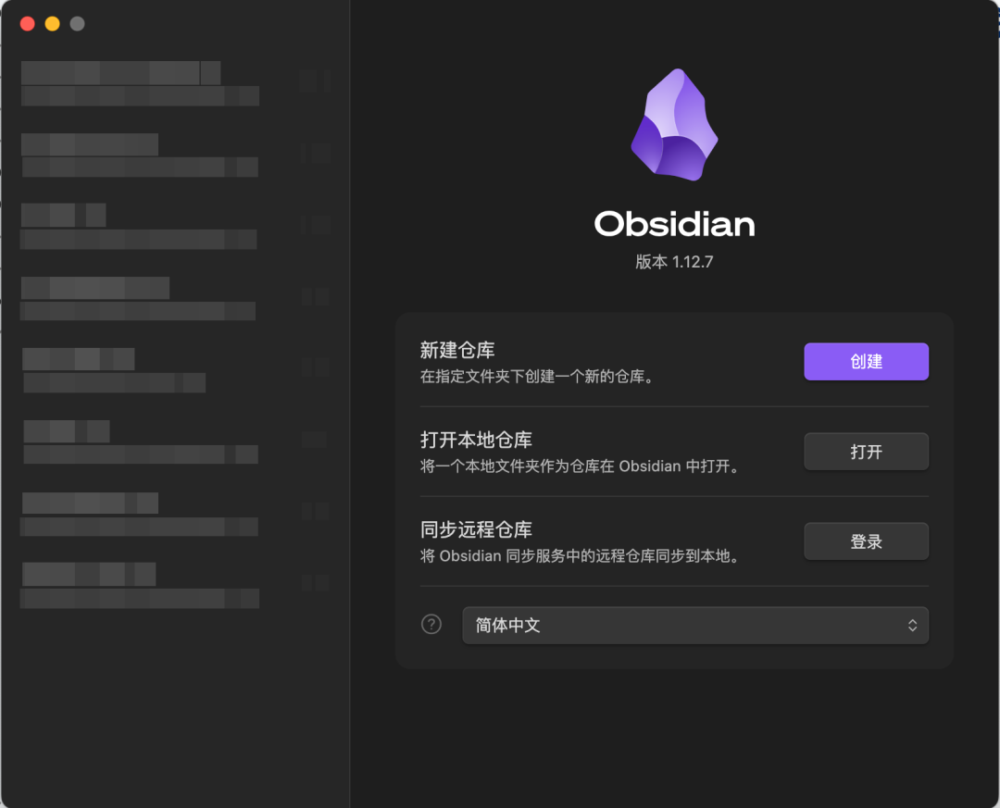
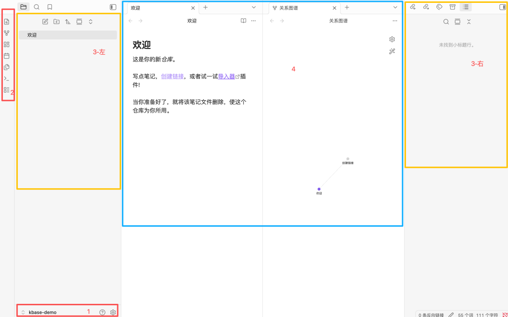
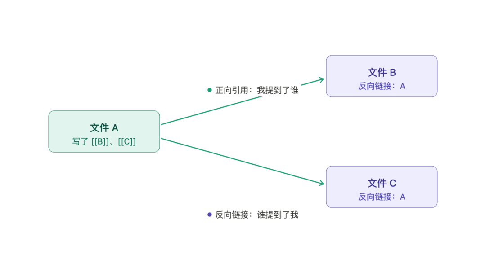
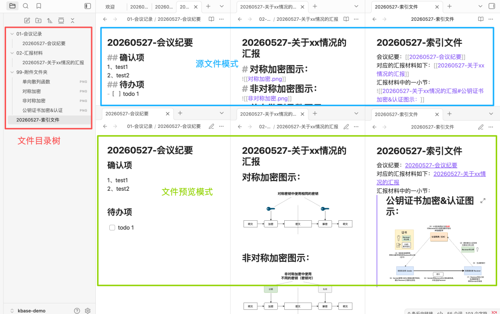

> 📎 来源: [武见说](https://mp.weixin.qq.com/s?__biz=Mzg5NzYxNjk3Mg==&mid=2247484226&idx=1&sn=027f23510607ab4e014f627bea703cac&chksm=c180ea21039ca90870be2f8dfd33a9c1dd03564842bd1d87d31a90563a25d1dbf22500a85e55&mpshare=1&scene=1&srcid=0529si6o3K4pSAc6mfSyA0ay&sharer_shareinfo=5ef4170591afbc377268d2b257a7327e&sharer_shareinfo_first=5ef4170591afbc377268d2b257a7327e) | 时间: 2026-05-29 12:55

---

> 本系列想做的事：用 Obsidian 把团队散落各处的资料收集、组织、利用起来，再让团队里所有人都能浏览、贡献、协作。整个系列从最基础的工具用法讲起，逐步走到整套工作流如何跑起来。这是第一篇，先把 Obsidian 这个工具本身讲明白。至于市面工具这么多、为什么偏偏是它，我把取舍标准放在了文末附录，正文先动手用起来。

## 一、环境

我本地的环境为 MacBook，Obsidian 版本 1.12.7。Windows 和 Linux （统信等信创电脑）用户的安装与使用流程几乎完全一致，可以直接照搬。

从 Obsidian 官网 （https://obsidian.md/）  下载对应平台的安装包，安装完成后打开，初始页面如下：

> 

## 二、仓库：Docs As Code 的一种表达

页面上有三个选项：新建仓库、打开本地仓库、同步远程仓库。动手之前，先把「仓库」是什么说清楚。

仓库（vault），可以理解成 "Docs As Code" 理念的一种表现 —— 把文档像代码一样，集中存放在某个文件夹中，并为这个文件夹提供一些原始的元数据（主题、插件配置、快捷键等）。

换句话说，一个仓库就是磁盘上的一个文件夹，里面所有的 markdown 文件、图片、附件都属于这个仓库。这意味着你的笔记本质上仍然是文件，不依赖任何云服务，迁移和备份都极其方便。

点击「创建」，新建仓库 

```
kbase-demo
```

（knowledge base demo 的缩写），进入欢迎页：

> 

## 三、工作区的四个区域

进入工作区后，界面大体可以分成四块：

1、仓库切换及设置（左下角）—— 切换不同的文档仓库，以及对当前仓库进行个性化设置：主题、字体、插件配置等等。

2、插件边栏（左侧细长条）—— Obsidian 核心插件和第三方插件的快捷入口。

3、侧边栏（左右两侧）—— 左侧负责文件树的增删改查、全仓库搜索；右侧是对当前阅读区的补充，比如目录大纲、反向链接等。

4、阅读区（中间）—— 真正查看和编辑文档的地方，支持分栏阅读，对照写材料时特别有用。

## 四、几个最基本的用法

我无意把本文写成 Obsidian 的产品说明书，下面只挑几个上手就要用到的功能。其余的，感兴趣可以自己摸。

1、新增文件 / 文件夹

在左侧边栏右键新建即可，默认就是 markdown 格式（常见 markdown 语法见文末）。

2、引用文件

在文件 A 里写 

```
[[B]]
```

，就建立了一条从 A 到 B 的关联。别小看这个动作 —— 对一个想成体系的知识库来说，孤岛文件越少越好。一篇谁都链不到、自己也不链别人的文档，写了基本等于没写。

3、反向链接

接着上面的场景：A 引用了 B，那么站在 B 的角度，A 就是它的反向链接，Obsidian 会自动帮你维护，不用手动登记。正向引用回答的是「我提到了谁」，反向链接回答的是「谁提到了我」。两个方向都通，知识之间才算真正「连」上，而不是一堆单向的箭头。

> 

4、标签

用 

```
#标签名
```

 给文件横向归类，比如 

```
#会议
```

、

```
#PRD
```

。标签和文件夹是两套维度：文件夹管「东西放在哪」，标签管「东西属于哪一类」 —— 一个文件只能待在一个文件夹里，却能同时挂好几个标签。

5、附件

仓库里所有非 md 文件（图片、PDF、Word、Excel、PPT、txt 等）都以附件形式存在。直接把图片往编辑器里一拖，Obsidian 会自动收进附件文件夹并生成引用（想让仓库更干净，进阶做法是改用图床，这里先不展开）。

把这五点跑顺，Obsidian 基本就能用起来了。

## 五、高频使用场景

下面是我个人最高频的三个场景：

1、会议记录 —— 新建「01-会议记录」文件夹，在里面以 

```
日期-会议主题
```

 的格式命名文件。开会前建好，会议中实时记，省得临时找地方落笔。

2、写材料 —— 新建文件，写文字 + 拖入附件（图片、PDF、表格）。Obsidian 同时支持源文件模式（看到 markdown 原始语法）和预览模式（看到渲染效果），写作时左右分栏对照很方便。

3、索引材料 —— 新建一个导航文件，只做一件事：用 

```
[[]]
```

 引用其它文件。索引文件本身可以不放任何具体内容，纯粹用作入口和聚合。这种「轻索引、重内容」的模式，在材料越来越多时尤其有用，也是对抗孤岛文件最直接的手段。

> 

## 六、让 Obsidian 更好用的几个增强

如果你已经能接受 Obsidian 的基本形态，下面几件事可以进一步提升体验。这部分本文不展开，感兴趣的读者可以自行搜索相关资料。

1、调整主题 —— Obsidian 默认主题已经够简洁，但视觉上略单调。社区里有不少优秀主题，我个人在用的是 "Blue Topaz"，布局更紧凑，信息密度更高。

2、Dataview 插件 —— 把仓库当数据库用，用类 SQL 语法查询所有文件并自动生成清单。比如「列出所有 

```
#会议
```

 标签下、最近 7 天修改过的文件」，一行查询就能搞定。文件一多，这个能力的价值会成倍放大。

3、Excalidraw 插件 —— 内嵌的画图工具，可以直接在 Obsidian 里画架构图、流程图、白板涂鸦。画完的图保存为文件，既能在文档里渲染，又能被 git 友好地版本管理 —— 这一点对后面「团队协作」的环节很关键。

至于工具背后那一层更深的取舍，可以参考之前的另一篇文章：[囤了很多资料却从未打开过？别让“伪勤奋”毁了知识管理](https://mp.weixin.qq.com/s?__biz=Mzg5NzYxNjk3Mg==&mid=2247483755&idx=1&sn=f117e8fdf49d190e7b3962a9b388a234&scene=21#wechat_redirect)

## 七、下一篇预告

到这里，Obsidian 作为单机笔记工具的基本面已经讲完。但你可能也注意到：目前所有内容都只在你自己的电脑上。要做成「团队知识库」，得解决「多人怎么写、怎么合并、怎么发布」的问题。

下一篇会讲：不写一行命令，也能用 Git 搞团队协作 —— 包括最小协作流程，以及给非开发同事准备的零命令行操作指南。

---

## 附录

### 附一、为什么是 Obsidian

动手之前，先回答一个绕不开的问题：笔记和文档工具这么多，为什么偏偏选 Obsidian？

这里不打算挨个踩别人，只说我自己取舍时的几条标准，以及别的工具卡在了哪一条上。

- 系统自带的文件工具、Sublime Text 这类 —— 能写能存，但本质上只是「编辑器 + 文件夹」。没有文件之间的关联，没有渲染，没有反向链接，写得越多越散，最后还是一堆互不相干的文件，谈不上「知识库」。
- 印象笔记 / Notion / 语雀这类—— 功能强、协作体验好，但你的内容是存在它们的服务器和私有格式里的。想迁移很麻烦，想用 Git 做版本管理几乎不可能，长期还要承担被单一厂商绑定的风险。对一个想长期沉淀、还要接入后续技术流程的知识库来说，这一条是硬伤。
- flomo 这类卡片 / 碎片笔记 —— 它擅长的是快速输入和随手回顾，定位是「想法收集器」，天生不是用来搭一棵「成体系的知识树」的。输入很顺，但组织成系统是它的短板。
- 各种 Zettelkasten 专门工具 —— 卡片盒方法论本身很好，但落到具体软件上，要么过于强调形式、用起来有负担，要么太小众、生态跟不上。

把这些标准反过来正着说，选 Obsidian 的理由其实就清楚了：

1. 数据是你自己的：所有内容都是本地的纯文本 markdown 文件，不绑定任何云服务，迁移、备份随时能做。
2. 能被 Git 管理：正因为是纯文本文件，它天然适合做版本控制——这是后面整个团队协作流程的地基。
3. 关联能力强：双向链接、反向链接、关系图谱，能把一篇篇孤立的笔记真正织成一张网。
4. 本地优先、离线可用、插件可扩展：断网能用，需要什么能力自己加。

关于「笔记工具选什么」背后更深一层的取舍，我在👉🏻 [囤了很多资料却从未打开过？别让“伪勤奋”毁了知识管理](https://mp.weixin.qq.com/s?__biz=Mzg5NzYxNjk3Mg==&mid=2247483755&idx=1&sn=f117e8fdf49d190e7b3962a9b388a234&scene=21#wechat_redirect)  这篇里聊过个人的审美倾向，这里不展开。一句话概括：工具应该服务于「沉淀和复用」，而不是满足「我收藏了很多」的错觉。

---

### 附二、常见 Markdown 语法速查

| 用途 | 写法 |
| --- | --- |
| 标题 | ``` # 一级 ```   /   ``` ## 二级 ```   /   ``` ### 三级 ``` |
| 加粗 | ``` **文本** ``` |
| 斜体 | ``` *文本* ``` |
| 删除线 | ``` ~~文本~~ ``` |
| 无序列表 | ``` - 内容 ``` |
| 有序列表 | ``` 1. 内容 ``` |
| 链接 | ``` [文字](url) ``` |
| 图片 | ```  ``` |
| 引用 | ``` > 文本 ``` |
| 行内代码 | ``` `code` ``` |
| 代码块 | 用三个反引号包裹,首行可加语言名 |
| 表格 | ``` \| 列1 \| 列2 \| ```   + 分隔行 |
| Wiki 链接 | ``` [[文件名]] ``` |
| 标签 | ``` #tag ``` |
