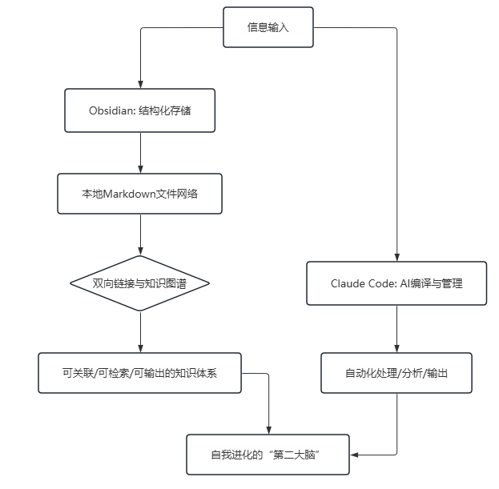
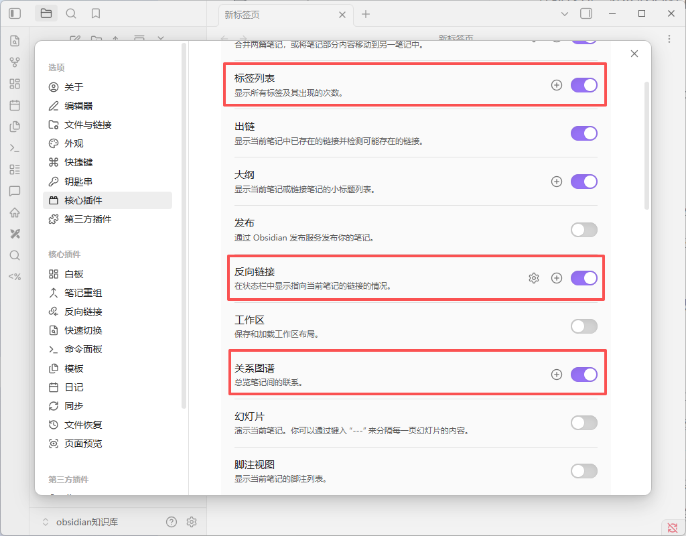
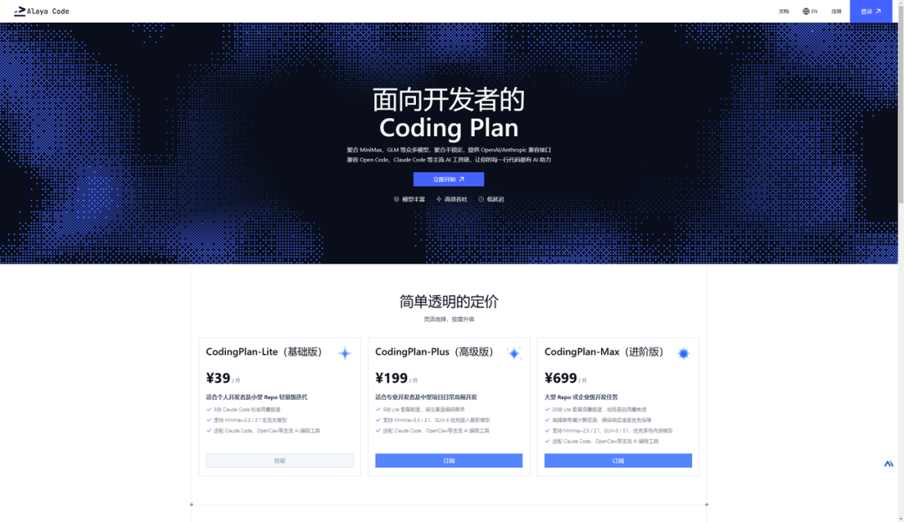
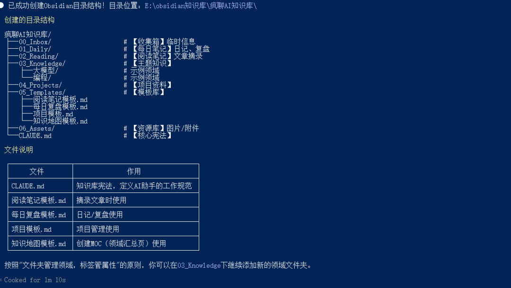
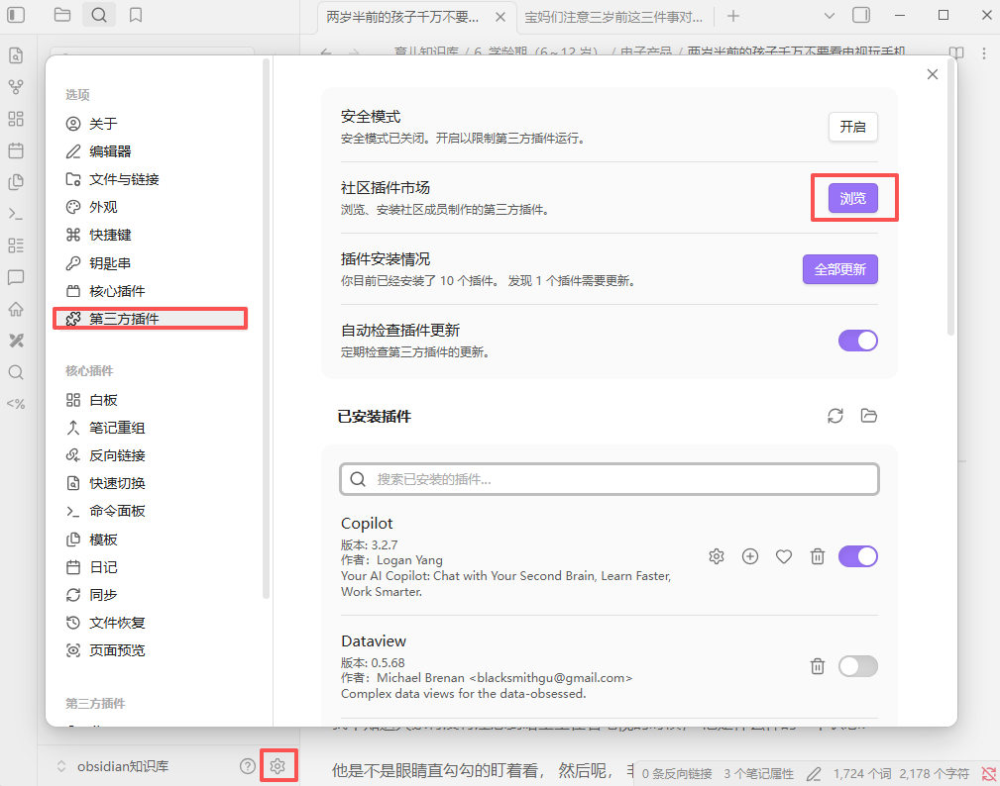
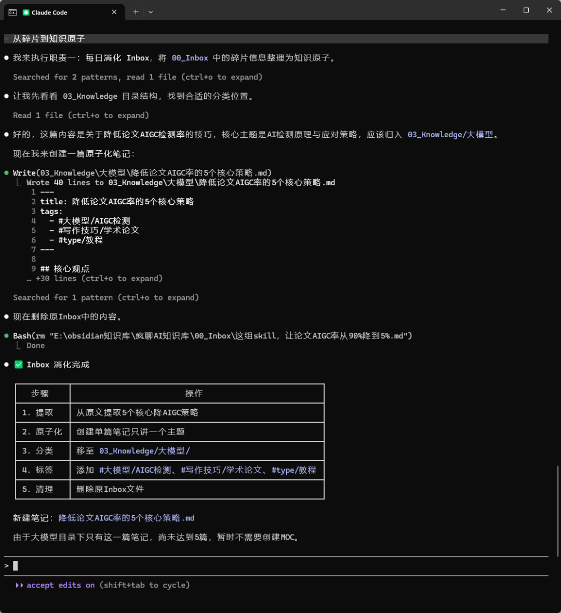
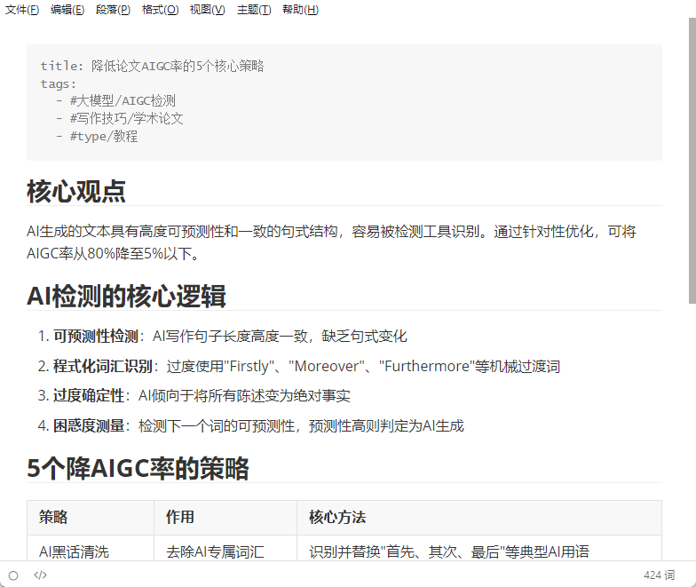
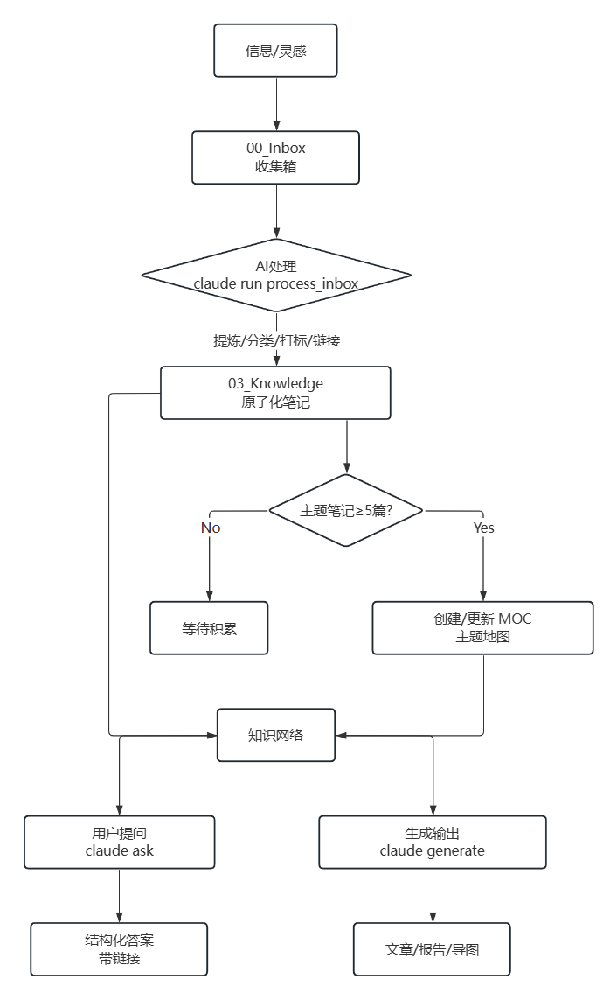
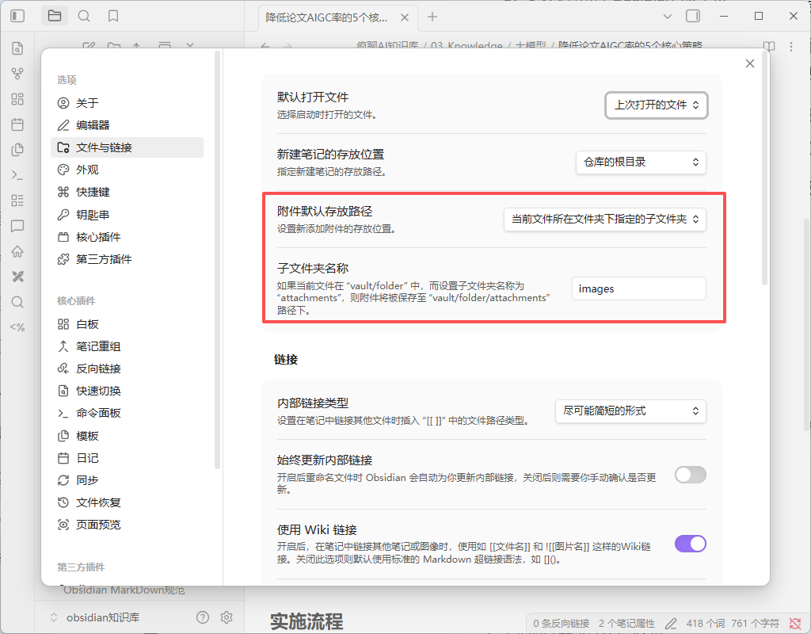

> 📎 来源: [九章智算云](https://mp.weixin.qq.com/s?__biz=Mzk2NDM3NzYzNg==&mid=2247493136&idx=1&sn=9ab86af9581864f0616833e8d02fa70a&chksm=c58cfdc79bdceb56f7b3ff5e427d39dc797ed36d5c3fcd4cac115dd2db0ff78f69deeccef700&mpshare=1&scene=1&srcid=0509M0cvz2xDTtuYaZmrr4mM&sharer_shareinfo=60189937d3d266fe755ba41d0eced981&sharer_shareinfo_first=60189937d3d266fe755ba41d0eced981) | 时间: 2026-05-09 23:16

---


# 一、引言：为什么是 Obsidian + Claude Code？

> 先说件小事。

> 上周跟朋友吃饭，他问我最近在捣鼓啥。我说在搭一套"第二大脑"的系统，他直接来了一句：又是笔记软件啊？Notion不香吗？

> 这个问题太经典了。我当年也是这么过来的——飞书、Notion、印象笔记轮着用，收藏了一堆，后来全找不着。直到遇见 Obsidian 加上 Claude Code，我才算是真正明白了：笔记软件满大街都是，但能帮你"长脑子"的，没几个。

## 1.1 为什么是 Obsidian

市面上笔记软件确实多。飞书、Notion、语雀、有道云、印象笔记……一个个都挺能打的。但我为啥还是坚定地选了 Obsidian？

说白了，三个字：**网状关联**。

我们人脑记东西，靠的不是线性堆叠，而是神经元之间密密麻麻的链接。A知识点连着B，B连着C，C又绕回来找A。Obsidian 恰恰就是模仿这个逻辑工作的——**双链+图谱**，让每一个笔记都变成一个节点，互相勾连，形成一张活的知识网络。

举几个接地气的例子：

你学编程时记录一个 Python 装饰器，它能自动帮你关联到闭包、高阶函数这些相关知识点。学法律时记录民法典条款，它能关联到具体案例和纠纷处理。知识不再是孤岛，而是打通了任督二脉。

而且 Obsidian 是**本地存储**，数据全在你自己的硬盘里。这点对律师、程序员、医生这些涉及敏感信息的从业者来说，简直是刚需中的刚需。你不需要担心哪天服务商跑路或者服务器被hack，零泄露风险。

至于效率，那真是谁用谁知道。备考时用标签分类管理碎片知识点，复习效率翻倍不止。搞内容创作的，用它同时管理十几篇文章的选题、调研、大纲、发布全流程，旧文观点随手复用，一鱼多吃。

小团队就更爽了，用 Obsidian + Git 搭一个共享知识库，工作手册、SOP、会议纪要统一沉淀，新人入职三天就能上手干活，团队能力从"依赖个人"变成"依赖系统"。

## 1.2 AI 时代的黄金搭档

好，Obsidian 的核心说完了。接下来聊聊它和 Claude Code 是怎么勾搭上的。

**Obsidian** 这个软件，看起来是个笔记软件，但本质上是一个基于**本地 Markdown 文件**的知识管理平台。它最迷人的地方在于**双向链接**和**知识图谱**——你不是在"存储信息"，而是在"建立关系"。每一个笔记都是一个节点，链接让整个知识库形成一张可视化的、可生长的语义网络。

**Claude Code** 则是一个强大的 AI 编译器与自动化引擎。它能理解自然语言指令，读写本地文件系统，执行复杂的自动化任务。它的设计和 Obsidian 的本地存储模式天然契合——一个文件夹一个workspace，玩起来不要太顺。



*图示：Obsidian 与 Claude Code 的协同工作流*

二者的结合，本质上就是一个清晰的"人机分工"范式：

- **Obsidian** 负责"结构化存储与可视化网络"
- **Claude Code** 负责"AI 编译与自动化管理"

你可以理解为，Obsidian 是大脑皮层，负责记忆和关联；Claude Code 是前额叶，负责调度和处理。二者合一，才是一个完整的思考系统。

## 1.3 这套系统能给你带来什么

通过本指南搭建的系统，你将实现：

**第一，告别信息碎片化。** 所有零散的信息都会被"编译"成相互关联的原子化知识单元，不再是一堆吃灰的收藏。

**第二，全流程自动化。** 从信息收集、处理、分类、链接到结构化输出，大部分繁琐工作都由 AI 代劳。你只需要负责"输入"和"审核"。

**第三，构建可生长的体系。** 知识库不再是静态的仓库，而是一个能够通过 MOC（主题地图）和持续链接**自我进化**的有机体。越多用，它越聪明。

**第四，成为高效"超级个体"。** 知识高效转化为文章、报告、方案，提升个人输出与决策质量。这年头，能高效产出的人，值千金。

说白了，这不仅是管理笔记，更是打造一个属于你自己的、不断增值的"数字第二大脑"。

# 二、环境搭建：准备好你的工具箱

## 2.1 基础工具安装

### 第一步：安装 Obsidian

1. 访问 Obsidian 官网，下载对应系统版本的安装包
2. 安装后打开，创建一个新的**知识库（Vault）**。建议取一个有意义的名字，存放位置选非系统盘（比如D盘、E盘），以防系统重装数据丢失
3. 进入设置 -> 核心插件，确保开启以下功能：

- **反向链接**：查看有哪些笔记链接了当前笔记
- **关系图谱**：可视化你的知识网络
- **标签列表**：用于跨文件的内容管理



### 第二步：安装 Claude Code

1. 打开终端（Terminal 或 Command Prompt）
2. 执行安装命令：

   ```
   pip install anthropic-cli
   ```
3. 安装完成后，需要配置你的大模型密钥。Anthropic API 国内访问不太方便，这里推荐使用 Alaya Code（**https://codingplan.alayanew.com/?utm\_source=official02**），填入 API 地址和密钥就可以直接用了



## 2.2 构建科学的目录结构

一个清晰、可扩展的目录结构是整个系统的骨架。我们遵循"文件夹管领域，标签管属性"的原则。以下是一个经过验证的建议结构，你可以让 Claude Code 根据描述自动生成：

```
在E:\obsidian知识库\目录下按obsidian规范帮我建构相应目录，按"文件夹管理领域，标签管属性"的原则创建以下目录：疯聊AI知识库├── 00_Inbox/                 # 【收集箱】所有未经处理的临时信息都丢这里├── 01_Daily/                 # 【每日笔记】日记、日复盘、临时待办├── 02_Reading/               # 【阅读笔记】微信读书、网页文章的精华摘录与笔记├── 03_Knowledge/             # 【主题知识】按领域（如大模型、编程）分类的结构化知识│   ├── 大模型/│   │   ├── 高效微调.md│   │   └── 全量微调.md   # 主题地图文件│   └── 编程/├── 04_Projects/              # 【项目资料】正在进行或已完成的项目文档├── 05_Templates/             # 【模板库】各种笔记模板（日报、读书笔记、会议纪要等）├── 06_Assets/                # 【资源库】图片、附件等媒体文件└── CLAUDE.md                 # 【核心宪法】AI 知识管理员的角色定义与规则
```

执行成功后大概长这样：



简单解释一下每个文件夹的用途：

- ```
  00_Inbox
  ```

  ：系统的"缓冲区"。你的目标是把大脑清空，任何想法、待办、摘录都先扔进来，由 AI 定时处理
- ```
  03_Knowledge
  ```

  ：知识的"主场"。所有信息经处理后，都会以原子化笔记的形式归档到这里对应的领域文件夹下
- ```
  CLAUDE.md
  ```

  **：整个系统的**"宪法"，定义了 AI 的职权范围和操作规范，至关重要

## 2.3 关键配置

### 1. 创建 `CLAUDE.md` 文件

在知识库的根目录，新建一个名为 

```
CLAUDE.md
```

 的 Markdown 文件。Claude Code 在运行时会自动读取此文件，以此作为行动指南。这个文件怎么写，我会在第三章详细展开。

### 2. 配置 Claude Code 权限

首次在终端中引导 Claude Code 访问你的 Obsidian 知识库文件夹时，需要根据提示授权其读写权限。请确保授权范围准确，仅限于该文件夹，别一激动给了全盘权限。

### 3. 安装必备的 Obsidian 效率插件

进入 Obsidian 的社区插件市场，关闭安全模式，搜索并安装以下三个插件：

- **Dataview**：一个强大的查询插件，可以用类 SQL 的语法动态生成笔记列表、任务表格等
- **Templater**：比核心模板插件更强大的模板工具，支持 JavaScript 脚本，能实现动态日期、自动列表等高级功能
- **Excalidraw**：在白板中绘制精美的手绘风格图表，并可直接嵌入笔记



# 三、核心：定义你的 AI 知识管理员 (`CLAUDE.md`)

```
CLAUDE.md
```

 是你与 AI 助理之间的"雇佣合同"。一份清晰、明确的合同能避免混乱，让 AI 发挥最大价值。

## 3.1 角色定位

你可以自己简单写下：

```
# Claude 知识库管理员角色定义你是我的 Obsidian 知识库专属管理员。你的核心使命是帮助我将零散信息转化为结构清晰、高度关联、易于检索和输出的知识网络。你是一个高效、严谨、富有洞察力的助手。
```

也可以让 Claude Code 自动生成一个更完整的版本：

```
# 疯聊AI知识库 - 核心宪法> 本文件定义了AI知识管理员的角色、原则和工作规范。本文件将随着知识体系的发展定期更新。---## 核心原则### 1. 文件夹管理领域- 一级文件夹代表**大领域**，如阅读、项目、知识- 不重复交叉，避免分类模糊### 2. 标签管属性- 标签用于描述**属性**，而非领域- 格式：`#一级标签/二级标签`（如 `#大模型/认知偏差`）- 常用属性标签：`#status/待处理`、`#priority/高`、`#type/教程`### 3. 命名规范- 文件名使用`短横线命名法`：高效微调.md- 日期格式：`YYYY-MM-DD`- 会议记录：`YYYY-MM-DD-会议主题.md`- MOC命名：`MOC - 主题名`，如 `MOC - 认知大模型`---## 目录结构说明| 文件夹 | 用途 | 入库规则 ||--------|------|----------|| 00_Inbox | 收集箱 | 所有临时信息、待整理内容 || 01_Daily | 每日笔记 | 日记、日复盘、临时待办 || 02_Reading | 阅读笔记 | 微信读书、网页文章的精华摘录 || 03_Knowledge | 主题知识 | 按领域分类的结构化知识 || 04_Projects | 项目资料 | 进行中/已完成的项目文档 || 05_Templates | 模板库 | 各种笔记模板 || 06_Assets | 资源库 | 图片、附件等媒体文件 |---## 标签使用规范### 状态标签- `#status/待处理` - 需要进一步处理- `#status/进行中` - 正在撰写或完善- `#status/已完成` - 内容完整可发布### 优先级标签- `#priority/高` - 重要紧急- `#priority/中` - 重要不紧急- `#priority/低` - 可延后### 类型标签- `#type/教程` - 学习教程类- `#type/笔记` - 记录整理类- `#type/想法` - 个人思考类- `#type/素材` - 写作素材类- `#type/MOC` - 主题地图---## 五大核心职责### 职责一：每日消化 Inbox**任务**：定时处理 `00_Inbox` 文件夹中的所有新笔记。**动作**：1. 阅读内容，提炼核心观点2. 将其重写为一篇篇"原子化笔记"（即一篇笔记只阐述一个核心概念或事实）3. 根据内容，将其移动到 `03_Knowledge` 下的正确子文件夹（如 `03_Knowledge/大模型`）4. 为笔记添加 2-3 个精准的标签（如 `#大模型/认知偏差`）5. 基于现有知识网络，为笔记添加至少 3 个相关的双向链接（`[[相关笔记标题]]`）---### 职责二：维护知识体系（MOC）**任务**：维护 `03_Knowledge` 目录下的主题地图（MOC）。**触发条件**：当任何一个主题（子文件夹）内的笔记数量达到或超过 5 篇时，自动为该主题创建或更新 MOC 文件。**MOC 格式**：- 文件命名：`MOC - 主题名.md`- 内容应包括：  - 核心理论列表（带简介）  - 应用场景  - 相关主题链接---### 职责三：强制执行格式规范**任务**：确保所有经你处理的笔记格式统一、专业。**动作**：- 严格使用 `05_Templates` 文件夹中对应的模板- 例如：所有读书笔记必须套用 `阅读笔记模板.md`- 内部链接必须使用双括号格式 `[[准确的笔记标题]]`- 标签使用 `#一级标签/二级标签` 的层级格式，保持简洁---### 职责四：每周知识网络分析**任务**：每周对我的知识库进行一次"体检"。**输出报告**需包含：1. **孤立笔记清单**：哪些笔记没有入链或出链，需要用户关注并建立连接2. **核心枢纽节点**：哪些笔记被链接的次数最多，它们是知识体系的核心3. **标签使用统计**：哪些标签过度使用或很少使用，给出优化建议4. **知识缺口分析**：根据现有网络，推测哪些关联领域可能缺少内容，建议补充---### 职责五：支持知识输出**任务**：根据用户的指令，将知识库中的内容整合成特定格式的输出物。**能力**：- 协助起草文章大纲- 生成报告初稿- 制作演讲 PPT 的要点- 生成思维导图的数据结构---## 操作规则与边界（防止AI越界）### 权限边界| 权限 | 目录 ||------|------|| **可读写** | `00_Inbox`、`03_Knowledge` || **只读** | `01_Daily`、`04_Projects`、`05_Templates`、`06_Assets` |> 注意：对于只读目录，你只有读取权限，除非用户明确指令，否则不得修改。### 内容原则- **忠于原文**：在处理 Inbox 时，提炼和转述不能歪曲原意- **注明来源**：如果信息来自外部，在笔记末尾添加来源链接或说明---## 工作流程### 信息入库流程1. **收集** → 放入 `00_Inbox`2. **分类** → 移动到对应领域文件夹3. **标签** → 添加适当的属性标签4. **链接** → 与相关笔记建立双向链接### 每日维护- 晨间：查看 `01_Daily`，规划今日待办- 随时：将灵感丢入 `00_Inbox`- 定期：处理 `00_Inbox`，归档零散笔记### 每周维护- 执行知识网络分析，输出报告---## AI助手指令当用户请求以下操作时，请自动执行：1. **写笔记** → 自动使用 `05_Templates` 中的合适模板2. **记录灵感** → 放入 `00_Inbox`，标记 `#status/待处理`3. **创建项目** → 在 `04_Projects` 建立项目文件夹和MOC4. **阅读笔记** → 放入 `02_Reading`，提取精华到知识库5. **整理Inbox** → 执行职责一，将笔记原子化并分类6. **创建MOC** → 当主题笔记≥5篇时，自动创建MOC7. **知识输出** → 执行职责五，按要求整合输出---*本宪法由AI知识管理员遵循，每逢重大调整需与用户确认。**随着知识体系的发展，应定期回顾并更新此文件。*
```

## 四、自动化工作流：从收集到输出的智能循环

系统搭建完毕后，你将体验到以下流畅的自动化工作流。

### 4.1 信息收集："随手丢"艺术

**场景**：阅读公众号文章时的一段启发、开会时的灵光一现、网页上看到的一个有趣图表。

**动作**：完全无需思考分类。你可以：

- 在电脑上，快速复制粘贴到 

  ```
  00_Inbox
  ```

   中的一个新建笔记里
- 在手机上，通过 Obsidian 移动端直接输入，或使用语音转文字
- 甚至可以将一段微信聊天记录直接截图保存至此

记住一个原则：**只要不是此刻就要用的结构化知识，统统先丢进 Inbox。**

### 4.2 AI 编译：从碎片到知识原子

这是魔法发生的时刻。每天，你只需在终端执行一条命令：

```
claude run process_inbox
```



AI 将开始工作。以一个名为 

```
inbox/降低论文AIGC率的5个核心策略.md
```

 的临时笔记为例，AI 会将其处理为：

1. **重命名与提炼**：文件被移动并重命名为 

   ```
   03_Knowledge/大模型/降低论文AIGC率的5个核心策略.md
   ```

   。内容被重写为一段简洁、客观的定义和解释。
2. **自动分类**：根据内容关键词，放入 

   ```
   大模型
   ```

    文件夹。
3. **智能打标**：在笔记顶部添加 

   ```
   #大模型/AIGC检测
   ```

   、

   ```
   #写作技巧/学术论文
   ```

    等标签。
4. **建立链接**：在笔记正文中，自动添加链接，连接到知识库中已有的相关笔记。



至此，一段零碎的想法，变成了知识网络中一个标准的、可连接的节点。

### 4.3 知识结构化：MOC 的自动生长

当 

```
03_Knowledge/大模型
```

 文件夹下的笔记越来越多，某天，当你新增第五篇相关笔记时，AI 检测到数量阈值已触发。

执行 

```
claude run update_mocs
```

 或等待定时任务，AI 会自动创建/更新 

```
MOC - 大模型.md
```

。

MOC 就像一个城市的中心广场或地图索引，让你一眼看清某个领域的全貌，并快速导航到细节。它是实现知识"从点到面"跃迁的关键。

### 4.4 知识检索与调用："对话式"知识库

当你想运用知识时，不再需要费力回忆文件名或关键词。打开终端，直接向你的知识库提问：

```
claude ask "大模型高效微调算力需求如何估算？"
```

Claude Code 会扫描整个知识网络，并返回类似如下的结构化答案。每个答案都带有内部链接，你可以一键跳转，追溯源头，深化理解。

### 4.5 知识输出：从网络到成果

当需要写一篇文章、准备一份报告或制作一个分享时，你的知识库成为了强大的素材库。你可以指令 AI 进行初步合成：

```
claude generate "基于认知大模型的高效学习方法" --format article --output 04_Projects/学习方法文章草稿.md
```

AI 会遍历所有与"认知大模型"、"学习方法"、"记忆"、"认知负荷"等相关的笔记，提取关键观点和案例，组织成一篇逻辑清晰的文章草稿。你在此基础上进行润色、调整和升华，极大提升了创作效率。



*图示：从信息收集到知识输出的完整自动化闭环*

## 五、五大自动化场景，解放你的时间

除了核心工作流，你还可以配置以下自动化场景，让系统更智能。

### 5.1 每日 Inbox 清理（3分钟/天）

**命令**：

```
claude run process_inbox
```

**效果**：建立习惯，每天开工或睡前运行一次，保持 Inbox 清空，让所有信息归位。从此，整理笔记不再是一项艰巨任务。

### 5.2 每周知识网络分析（30分钟/周）

**命令**：

```
claude run analyze_knowledge_graph
```

**效果**：获取一份系统"健康报告"。报告会告诉你哪些知识是孤岛，哪些是枢纽，你的标签体系是否合理，下一步应该学习或补充哪些内容。这让你对知识体系的维护从被动变为主动。

### 5.3 批量笔记转换（每月一次）

**命令**：

```
claude run batch_convert --input 旧笔记文件夹/ --output 03_Knowledge/
```

**效果**：当你有一批历史文档（如 Word、PDF、旧博客文章）需要导入时，AI 可以批量将其转换为 Markdown 格式，进行初步的原子化拆分，并尝试链接到现有知识库。这是快速初始化知识库的利器。

### 5.4 MOC 自动维护（后台静默）

**命令**：可设置为定时任务（如每天一次）。

**效果**：无需手动检查，系统自动维护所有主题地图，确保索引永远最新。你的知识体系实现了"自动生长"。

### 5.5 知识输出自动化（按需）

**命令**：

- ```
  claude run generate_mindmap --topic "认知大模型" --output assets/认知大模型.svg
  ```
- ```
  claude run generate_ppt --topic "季度学习总结" --output 04_Projects/总结.pptx.md
  ```

**效果**：将知识网络直接转化为思维导图、PPT 大纲等可视化成果，用于分享或汇报。

## 六、长期维护与体系进化

一个好的系统需要持续维护才能焕发生机。

### 6.1 坚守人机分工原则

- **你的角色（不可替代）**：输入高质量信息的源头；定义知识边界和分类的架构师；对 AI 产出进行最终审核与验证的决策者；进行创造性输出和价值判断的主体。
- **AI 的角色（高效执行）**：格式化、标准化的执行者；建立链接、发现关联的助手；数据统计、模式分析的分析师；根据指令进行初稿合成的协作者。

**警惕过度依赖**：AI 可能犯错，也可能产生看似合理实则错误的关联。你永远是知识体系的最终负责人。

### 6.2 优化标签体系

标签是跨领域的横向切片。建议：

- **一级标签**控制在10个以内，代表最大维度，如 

  ```
  #工作
  ```

  、

  ```
  #学习
  ```

  、

  ```
  #生活
  ```

  、

  ```
  #心理
  ```

  、

  ```
  #科技
  ```
- **二级标签**进行细化，如 

  ```
  #心理/认知
  ```

  、

  ```
  #心理/情绪
  ```

  、

  ```
  #科技/AI
  ```

  、

  ```
  #科技/编程
  ```
- **定期优化**：利用 AI 的每周分析报告，合并冗余标签（如 

  ```
  #效率
  ```

   和 

  ```
  #生产力
  ```

  ），清理僵尸标签

### 6.3 保障数据安全与备份

这是本地优先方案的最大优势，也是你的责任。

- **本地存储**：所有笔记都是纯文本 Markdown 文件，没有任何厂商锁定
- **定期备份**：使用云盘同步工具（如 Dropbox、OneDrive、iCloud）或 Git 仓库，定期备份整个知识库文件夹。插件 

  ```
  Remotely Save
  ```

   可以帮助实现 Obsidian 配置的云同步
- **隐私安全**：Claude Code 在本地处理你的数据，无需担心隐私上传

### 6.4 实现知识体系的迭代

每季度或每半年，执行一次深度审查：

```
claude run review_knowledge_system
```

让 AI 从更高维度分析你的知识结构：哪些领域发展迅猛？哪些领域停滞不前？目录结构是否需要调整？是否有新的 MOC 需要建立？根据 AI 的建议和你自身的感受，对知识库进行一次"版本升级"。

## 七、避坑指南与最佳实践

1. **勿忘链接之本**：AI 帮你建立链接，但你必须理解链接背后的逻辑关系。是因果关系、类比关系、还是对立关系？主动思考和建立有意义的链接，是知识体系产生智慧火花的关键。
2. **保持结构扁平**：文件夹嵌套最好不要超过两层。过深的层级会阻碍 AI 的有效检索和你自己的记忆。复杂的分类应通过**标签**和**MOC**来实现，而非深层文件夹。
3. **插件宜精不宜多**：Obsidian 插件生态丰富，但盲目安装过多插件会导致软件臃肿、冲突和性能下降。2026年的推荐是：**Settings Search（设置搜索）、Recent Files（最近文件）、Tag Wrangler（标签管理）、Omnisearch（增强搜索）**等少数几个能极大提升基础体验的插件足矣。
4. **```
   CLAUDE.md
   ```

    是活文档**：它不是一次性写成的。当你发现 AI 总是做错某件事，或你有了新的自动化需求时，第一时间应该是去修改和完善 

   ```
   CLAUDE.md
   ```

## 八、总结：开启你的知识复利之旅

回顾整个旅程，我们构建的不是一个静态的笔记仓库，而是一个符合"知识生长路径"的动态生命体：

**收集（Inbox） → AI 编译（Process） → 结构化存储（Atomic Notes） → MOC 聚合（Thematic Map） → 智能分析（Analyze） → 价值输出（Generate） → 体系迭代（Review）**

在这个循环中，每一次输入、每一次链接、每一次输出，都不是终点，而是让整个知识网络变得更稠密、更智能的养分。Obsidian 提供了坚实的土壤和脉络，Claude Code 则扮演了辛勤的园丁和智慧的催化剂。

在 AI 时代，信息获取的差距正在缩小，而**信息处理、内化和创新的能力**将成为新的核心竞争力。通过 Obsidian 与 Claude Code 搭建的个人知识库，就是你培养这项核心能力的"训练场"和"军火库"。

现在，就从创建第一个 Vault、编写第一行 

```
CLAUDE.md
```

 开始，亲手启动这个与你共同成长的"第二大脑"，踏上知识复利的无限轨道。

---

**附录：延伸阅读与工具**

- **微信读书整合**：使用 

  ```
  Weread
  ```

   插件，自动将微信读书的划线笔记同步到 

  ```
  02_Reading
  ```

   目录
- **任务管理**：使用 

  ```
  Tasks
  ```

   插件，在任意笔记中用 

  ```
  [ ]
  ```

   管理待办，并用 Dataview 统一查看
- **日历与日记**：使用核心 

  ```
  日记
  ```

   插件或 

  ```
  Periodic Notes
  ```

  ，搭配 

  ```
  Templater
  ```

   模板，自动化管理每日、每周复盘
- **图床管理**：使用 

  ```
  Paste Image Rename
  ```

   插件，粘贴图片时自动重命名并保存到 

  ```
  06_Assets
  ```

  ，保持整洁。我一般是将图片保存在 md 文件的同级目录下的 images 目录（有妙用，以后透露）



祝你构建顺利，思考不息。

**精彩内容**

**[阿里云 Coding Plan Lite 下架，各家算力吃紧，上哪买还能支持GLM-5和5.1的coding plan？](https://mp.weixin.qq.com/s?__biz=Mzk2NDM3NzYzNg==&mid=2247493047&idx=1&sn=f27b3e9eba0fc431e4aef6aaf5b5a3f6&scene=21#wechat_redirect)**

**[Anthropic 出了一篇多 Agent 协作模式指南，总结了 5 种架构和适用场景](https://mp.weixin.qq.com/s?__biz=Mzk2NDM3NzYzNg==&mid=2247493113&idx=1&sn=b2e6a73624c0071964ef31b3d156d505&scene=21#wechat_redirect)**

**[0门槛的openclaw小龙虾省钱秘籍，打工人直接抄作业](https://mp.weixin.qq.com/s?__biz=Mzk2NDM3NzYzNg==&mid=2247492900&idx=1&sn=a89f47cc50a79ef6c0d78fe95718221d&scene=21#wechat_redirect)**

**[我们做了一本OpenClaw 像素级实操案例集，看完直接上手](https://mp.weixin.qq.com/s?__biz=Mzk2NDM3NzYzNg==&mid=2247492750&idx=1&sn=afb1ca904a1c34d95f19ac3c642137a6&scene=21#wechat_redirect)**

**[OpenClaw史诗级更新！但别急着更新，我们有更省事的办法](https://mp.weixin.qq.com/s?__biz=Mzk2NDM3NzYzNg==&mid=2247492709&idx=1&sn=f16fd5efd0d7dc973f8556faed297001&scene=21#wechat_redirect)**

**[【完整版PPT】英伟达2026 GTC黄仁勋演讲稿，附下载](https://mp.weixin.qq.com/s?__biz=Mzk2NDM3NzYzNg==&mid=2247492562&idx=2&sn=a07f58e0752941ca47fd88a7d56f23b1&scene=21#wechat_redirect)**

**[一文读懂 2026 GTC：黄仁勋核心演讲精华（附全文）](https://mp.weixin.qq.com/s?__biz=Mzk2NDM3NzYzNg==&mid=2247492545&idx=1&sn=72364f691f0d904cfa601edf8b4a1373&scene=21#wechat_redirect)**

**[为了不让你的“龙虾”裸奔，我们做了一本73页的《OpenClaw 安全操作指南》](https://mp.weixin.qq.com/s?__biz=Mzk2NDM3NzYzNg==&mid=2247492485&idx=1&sn=c2496512d950d4ebd3c3b5aa2570bef6&scene=21#wechat_redirect)**

**[我佩服我同事，竟然整理了一本83页的OpenClaw“红宝书”](https://mp.weixin.qq.com/s?__biz=Mzk2NDM3NzYzNg==&mid=2247492342&idx=1&sn=65a4aa65b02ca2161e6a14c605ffdea3&scene=21#wechat_redirect)**

**👇**戳****“阅读原文”体验九章智算云****
