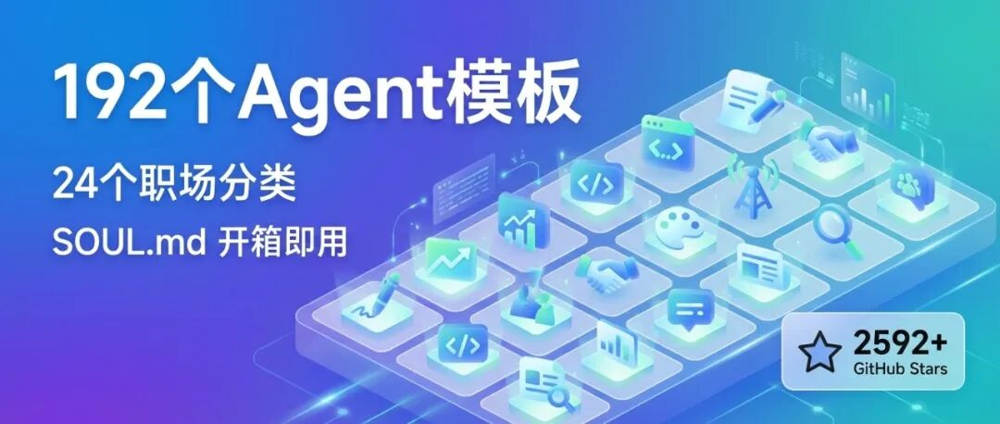
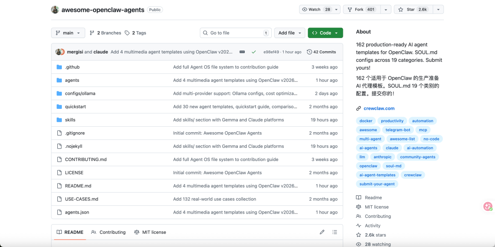
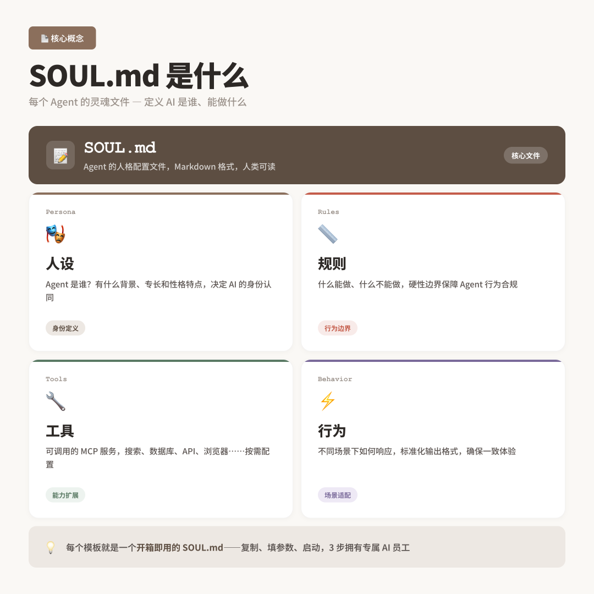
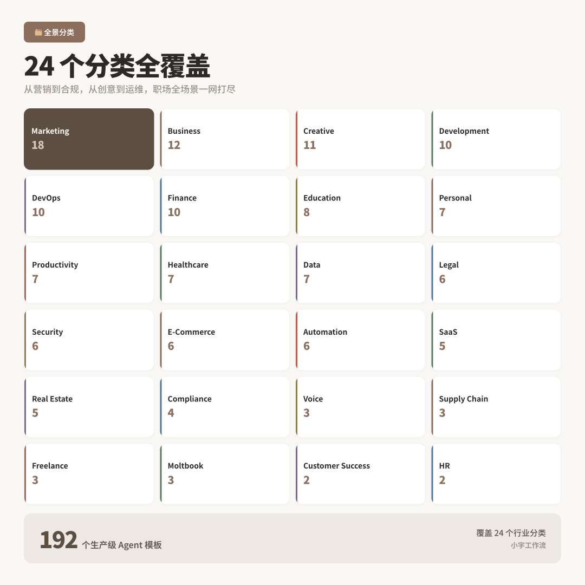
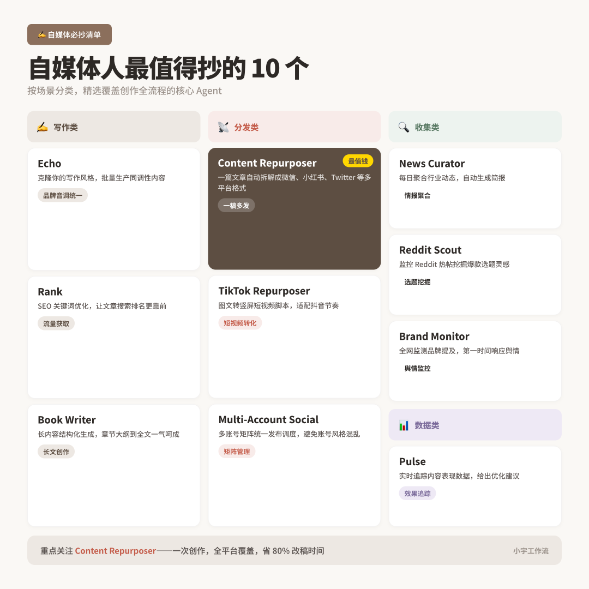
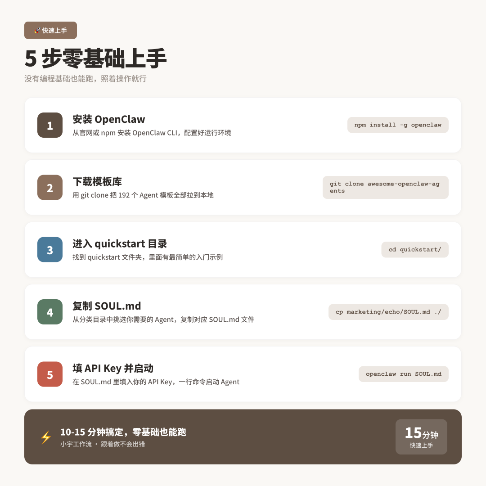

> 📎 来源: [AI提效星球](https://mp.weixin.qq.com/s?__biz=Mzk2OTAxNDM2OA==&mid=2247484966&idx=1&sn=2eb2f6bdec1c5f77e73a0ddc0967f400&chksm=c5c818f7190f8adce9b4cceaa2d9c904756df8854ca9cdb8f486a81f99d8ae21dce898c4f634&mpshare=1&scene=1&srcid=0408eITUqMvseoEEK5gwzNnw&sharer_shareinfo=da44262b95d54f00c45c0938fdd0780f&sharer_shareinfo_first=da44262b95d54f00c45c0938fdd0780f) | 时间: 2026-04-13 16:15

---



GitHub 上有个仓库叫 awesome-openclaw-agents，2592 个 star。



里面装着 **192 个生产级 OpenClaw Agent 模板**——从写文案、做 SEO、监控竞品，到处理工单、管理项目、自动求职，覆盖 24 个职场场景。

每个模板就是一个 SOUL.md 文件——你只需要复制粘贴到 OpenClaw 里，改一下 API Key，就能直接跑。**不用自己写 Agent，不用调试 Prompt，开箱即用。**

对于做内容的人来说，这是目前最大的「现成 Agent 库」。

## 什么是 SOUL.md

先解释一个概念，否则后面看不懂。

OpenClaw 是一个 AI Agent 框架。它的核心配置文件叫 SOUL.md——你可以理解为 Agent 的「灵魂文件」。

一个 SOUL.md 里写着这个 Agent 的：

•**人设**：它是谁，扮演什么角色•**规则**：什么能做、什么不能做•**工具**：可以调用哪些 MCP 服务（比如 Notion、Slack、Postgres、Stripe）•**行为**：遇到不同场景怎么响应

写一个好的 SOUL.md 需要懂 Prompt 工程、了解 MCP 协议、知道 Agent 的常见坑。普通用户根本写不出来。

awesome-openclaw-agents 这个仓库，就是把这件事代劳了——**192 个调试好的 SOUL.md 模板，每个都是别人踩完坑写出来的最佳实践。**



## 24 个分类全覆盖

仓库的 192 个 Agent 分成了 24 个分类：

| 分类 | 数量 | 代表 Agent |
| --- | --- | --- |
| Marketing & Content | 18 | Echo（写作）、Buzz（社媒）、Rank（SEO） |
| Business | 12 | Radar（业务监控）、Pipeline（销售） |
| Creative | 11 | Copywriter、Video Scripter、Thumbnail Designer |
| Development | 10 | Lens（代码审查）、Scribe（文档生成）、Trace（Bug 分析） |
| DevOps | 10 | Incident Responder、Self-Healing Server |
| Finance | 10 | 财务分析、报表自动化 |
| Education | 8 | Research Assistant、学习辅导 |
| Personal | 7 | Atlas（日程规划） |
| Productivity | 7 | Orion（项目管理）、Pulse（数据看板） |
| Healthcare | 7 | 医疗咨询、健康追踪 |
| Data | 7 | Survey Analyzer、数据洞察 |
| Legal | 6 | 合同审查、法律检索 |
| Security | 6 | 安全扫描、威胁检测 |
| E-Commerce | 6 | 商品上架、订单处理 |
| Automation | 6 | Overnight Coder、Job Applicant |
| SaaS | 5 | 客户成功、产品反馈 |
| Real Estate | 5 | 房源分析、客户匹配 |
| Compliance | 4 | 合规审核 |
| Voice | 3 | 语音助手 |
| Supply Chain | 3 | 供应链监控 |
| Freelance | 3 | 自由职业管理 |
| Moltbook | 3 | Agent 之间的社交网络 |
| HR | - | 招聘、员工管理 |
| Customer Success | 2 | 用户成功 |

**总计 192 个 Agent。** 每个都有完整的 SOUL.md + 部署说明 + 使用示例。



## 自媒体人最值得抄的 10 个

我在所有 192 个 Agent 里，挑出了最适合做内容的 10 个。

### 写作类

**Echo**（marketing/echo）：通用内容创作 Agent。一个需求，自动生成博客、社媒文案、邮件三种格式。这是仓库官方的 Quickstart 样板。

**Rank**（marketing/seo-writer）：SEO 写作 Agent。可以接 Google Search Console，根据真实关键词数据写文章，精准度比凭感觉写高得多。

**Book Writer**（marketing/book-writer）：长文写作流水线。6 个阶段从提纲到成书，适合写长篇深度文章。

### 内容分发类（最有价值）

**Content Repurposer**（marketing/content-repurposer）：一篇博客自动改成 Twitter、LinkedIn、短视频脚本。这是单人创作者最值钱的 Agent——一个内容多平台分发。

**TikTok Repurposer**（marketing/tiktok-repurposer）：博客文章自动转成短视频脚本。

**Multi-Account Social**（marketing/multi-account-social）：管理 10+ 个社交账号的发布排期。

### 信息收集类

**News Curator**（marketing/news-curator）：扫描 50+ 信源，AI 自动整理成日报。做日更新闻类公众号的神器。

**Reddit Scout**（marketing/reddit-scout）：自动找 Reddit 上和你领域相关的热帖，回复或采集素材。

**Brand Monitor**（marketing/brand-monitor）：全网监控你的品牌提及，情感分析，异常预警。

### 数据分析类

**Pulse**（productivity/metrics）：接 GA4、Mixpanel、Stripe，自动生成日报周报。看公众号数据用得上。



## 怎么用：手把手 5 步走

下面的步骤假设你完全是零基础。

### 第 1 步：准备好 OpenClaw

如果你还没装 OpenClaw，先装一下。打开终端（Mac 按 Command+空格搜「终端」，Windows 搜「PowerShell」），输入：

curl -fsSL https://openclawlaunch.com/install.sh | bash

按回车，等它装完。

### 第 2 步：下载 Agent 模板库

继续在终端里输入：

git clone https://github.com/mergisi/awesome-openclaw-agents.git

这会把整个模板库下载到你的电脑上。

### 第 3 步：进入 quickstart 目录

cd awesome-openclaw-agents/quickstart

这是仓库准备好的「快速启动」文件夹。

### 第 4 步：选一个 Agent 模板

比如你想用 Echo 写作 Agent，输入：

cp ../agents/marketing/echo/SOUL.md ./SOUL.md

这行命令的意思是：把 Echo 的 SOUL.md 文件复制到当前目录。换成其他 Agent 就替换路径里的 

```
marketing/echo
```

。

### 第 5 步：填好 API Key 并启动

cp .env.example .env

然后用文本编辑器打开 

```
.env
```

 文件（任何编辑器都行，Mac 用 TextEdit，Windows 用记事本），填入你的 API Key（OpenAI、Anthropic 或其他）。

最后启动：

npm install && node bot.js

启动成功后，你的 Agent 就开始工作了。和它对话，它会按 SOUL.md 里定义的角色和规则回应你。

**整个过程 10-15 分钟，零基础也能搞定。**



## 我的实战建议

192 个 Agent 看起来很多，其实没必要全装。

我的建议是：**先从 Content Repurposer 开始。**

为什么？因为这是单人创作者价值最高的一个。你只需要写一篇好内容，它帮你自动改成 Twitter 帖子、LinkedIn 长文、短视频脚本、Email Newsletter——一份内容，全平台分发。

跑通 Content Repurposer 之后，再加：

1.**News Curator** —— 每天早上自动给你 50+ 信源的热点摘要，选题不用愁2.**Echo** —— 写作底稿3.**Pulse** —— 数据看板，看你公众号的阅读和增长

这 4 个组合起来，覆盖了内容创作的「选题 → 写作 → 分发 → 复盘」全流程。

剩下的 188 个 Agent，等你有具体需求了再装。比如哪天你要做竞品分析，再装 Brand Monitor 和 Reddit Scout；要做 SEO，再装 Rank。**不要一次性把全部模板都塞进 OpenClaw，会拖慢启动速度。**

## 最后

OpenClaw 的强大不在于框架本身，在于围绕它的 Agent 生态。

awesome-openclaw-agents 这个仓库证明了：**Agent 不一定要自己写。** 别人踩过的坑、调过的 Prompt、定过的规则，可以直接拿来用。

192 个生产级模板，覆盖几乎所有职场场景。MIT 协议开源，免费商用。

去 GitHub 翻翻，找一个最契合你工作流的，今天就用上。

---

> 仓库地址：github.com/mergisi/awesome-openclaw-agents

> Star 数：2592+

> 协议：MIT 开源

> 模板数：192 个，分 24 类

觉得有用的话，点个「赞」能被系统推荐更多此类文章。
