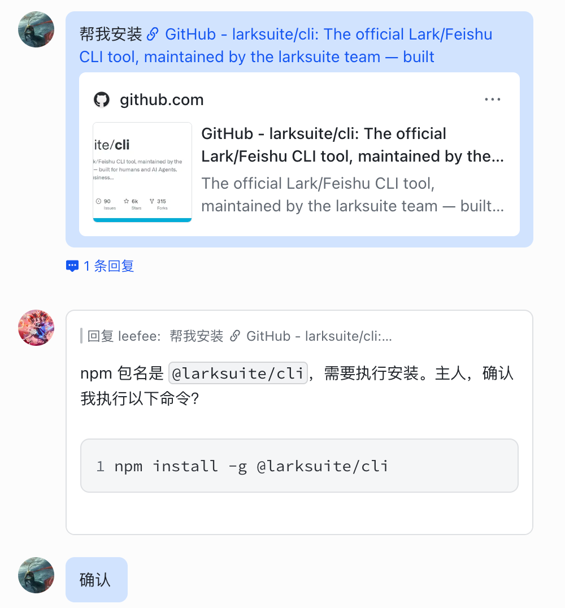
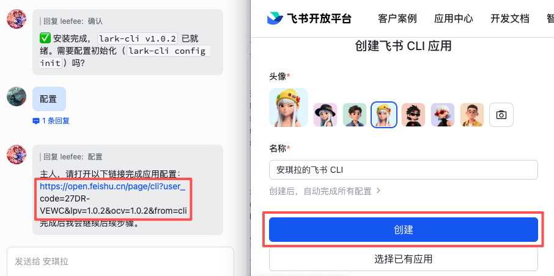
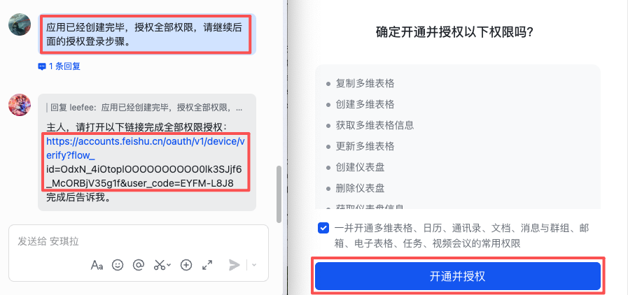
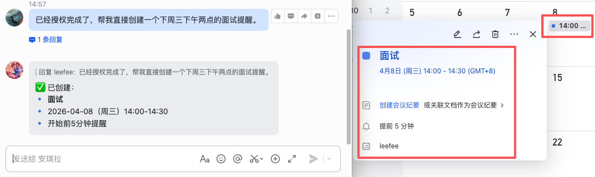

> 📎 来源: [超有 AI](https://mp.weixin.qq.com/s/kMTzgp25lBuB0Xp7WK5-Hg) | 时间: 2026-04-13 16:15

---

你每天要在飞书里切换多少次窗口？

- 找一个文档 **要3步** ：点击搜索框->输入关键词->寻找对应文档->点击打开
- 发送一次消息 **要4步** ：打开会话列表->找到具体的人->点开对话框->输入内容->回车发送
- 定一个日程 **要6步** ：点开日历->点击日期->输入主题->选择时间->选择场地人员等->保存日程

一天下来，几十次切换，大量时间都浪费在“工具之间的切换和繁琐的操作”。

2026 年 3 月 28 日，字节推出了官方「 飞书 CLI 」，一款专为 AI 打造的命令行工具，开源免费、三步上手。

> **通过「 飞书 CLI 」，AI 能帮你直接搞定飞书里的操作，彻底告别打开对话框、切换功能、编辑云文档、发送文件等等繁琐操作，解锁「 一句话办公 」新体验！**

## 一、尴尬的 OpenClaw

作为 AI Agent 代表的 OpenClaw 已经很强大了，它运行在本地电脑或者云端服务器，能直接读写文件、操作浏览器、做分析、写方案……

但一个尴尬的现实是：**AI 做完了，你还得自己动手把结果搬进日常工作流程。**

- 查个日程，打开飞书日历。
- 发封邮件，打开飞书邮箱。
- 编辑文档，打开飞书云文档……

> **OpenClaw 和你的实际工作之间，始终隔着一道「 手动操作 」的墙。**

## 二、安装飞书 CLI 能实现什么？

飞书 CLI 就是推倒这堵墙的工具，它让 OpenClaw 拥有了操作飞书的能力。

- 不用打开日程、邮箱、文档，OpenClaw 都能帮你直接查。
- 不仅查，还能直接动手做：发消息、写文档、约会议、批量处理，全程一句话搞定。

### OpenClaw 接管飞书的 11 大业务领域

飞书 CLI 把飞书核心能力拆成独立的技能，200+ 命令覆盖所有办公场景，核心功能包括：

- lark-im（消息群聊）：发消息、管群成员、搜历史消息、上传下载文件，覆盖即时通讯全场景；
- lark-doc（云文档）：创建文档、修改内容、Markdown 互转，还能读评论自动改文档，省去复制粘贴；
- lark-calendar（日历会议）：查日程、约会议、查忙闲状态，跨时区自动推荐合适开会时间；
- lark-mail（邮箱）：发/收/转发邮件、管理草稿、批量发个性化邮件，邮箱能力全链路补齐；
- lark-base（多维表格）：创建表格、分析数据、生成仪表盘，还能提取会议信息自动打标签入表；
- 还有云空间、电子表格、任务、知识库、通讯录、会议纪要、全局搜索等能力，真正实现 AI 一站式操控飞书。

### 举几个例子感受一下

- 查日程、约会议：「 看看我明天有什么安排 」、「 下周三下午帮我约个和产品组的会，推荐一个大家都空闲的时间 」
- 文档自动创建和更新：「 按会议纪要框架新建一篇飞书文档 」、「 把这份报告的最新内容同步到对应的飞书文档 」
- 消息和邮件：「 在项目群里发个通知 」、「 帮我起草一封给全组的周报邮件 」、「 搜一下上周和张总聊了什么 」
- 多维表格和电子表格：「 建一张需求跟踪表 」、「 把这次会议的待办自动录入多维表格 」

从消息、文档到日历、邮箱、知识库，OpenClaw 既能查也能改，既能读也能写，零门槛，授权即用，不需要任何开发。

## 三、安装飞书 CLI 保姆级教程

### 前置条件

- 拥有飞书账号（个人/企业均可）
- 已经安装 AI 工具：OpenClaw / TRAE / Claude Code / Cursor 等

*注：下面安装飞书 CLI 教程以 OpenClaw 为例*

### 第一步 安装

把下面的内容发给 OpenClaw，它会询问是否确认执行安装命令。

> 帮我安装：<https://github.com/larksuite/cli

### 第二步 配置初始化

OpenClaw 会询问是否需要配置初始化，确认后打开配置链接（*链接会折行，要复制完整链接*），点击"创建"。

### 第三步 授权登录

把下面的内容发给 OpenClaw，打开返回的授权链接（*链接会折行，要复制完整链接*），勾选后点击“开通授权”。

> 应用已经创建完毕，授权全部权限，请继续后面的授权登录步骤。

### 验证功能

完成上面的三步，飞书 CLI 就能使用了，把下面的内容发给 OpenClaw，先感受一下吧。

> 已经完成授权了，帮我直接创建一个下周三下午两点的面试提醒。

*如果无法创建日程，从第一步再执行一遍就可以了，OpenClaw 会引导你完成安装。*

## 四、结语：Agent 才是软件的新主人

飞书 CLI 看起来只是一个命令行工具，其实它是 AI 的「 手脚 」，也预示了未来办公的演进方向：**人与 AI 的协作从「 对话式 」走向「 嵌入式 」。** AI 不再是一个独立的对话框，而是嵌入在你的工作流中，成为工作环境的一部分。

两个月前，有位 AI 领域创业先锋写过一篇文章叫「 [互联网已死，Agent 永生](https://mp.weixin.qq.com/s?__biz=MzkwMzY5NzU2Nw==&mid=2247488954&idx=1&sn=751172c4fa327e68d5e5c04b4844277d&scene=21#wechat_redirect) 」，里面有几句话引人深思：

> DAU 过时了。

> SaaS 过时了。

> 注意力经济已经死了。

> **Agent 才是软件的新主人。**

## 五、往期阅读

[红包失效，微信被迫接入 OpenClaw](https://mp.weixin.qq.com/s?__biz=Mzg3NjYxNDk4OQ==&mid=2247584386&idx=1&sn=ccb4b4eb8a2ce47cd6fdf88769cd4602&token=1800834889&lang=zh_CN&scene=21#wechat_redirect)

[两个工具给 OpenClaw 做「体检」](https://mp.weixin.qq.com/s?__biz=Mzg3NjYxNDk4OQ==&mid=2247584411&idx=1&sn=9e4573d59194c7500ff458f6f19cdf81&token=1800834889&lang=zh_CN&scene=21#wechat_redirect)

[云端部署 OpenClaw 保姆级教程](https://mp.weixin.qq.com/s?__biz=Mzg3NjYxNDk4OQ==&mid=2247584167&idx=1&sn=49a7e71f17d3eeba299622e2e70270a0&scene=21&token=2133152486&lang=zh_CN#wechat_redirect)

[运营新媒体必备的 3 个 Claude Code Skill](https://mp.weixin.qq.com/s?__biz=Mzg3NjYxNDk4OQ==&mid=2247584101&idx=1&sn=d6d0a9a76b3a14ac98da501b0ec80df6&scene=21#wechat_redirect)

[保姆级 Claude Code Skill 使用教程](https://mp.weixin.qq.com/s?__biz=Mzg3NjYxNDk4OQ==&mid=2247584076&idx=1&sn=2c0d3ea033610a3e10c5bb6cde02ce72&scene=21#wechat_redirect)

[AI 生图这 5 个就够了，第 3 个你想不到](https://mp.weixin.qq.com/s?__biz=Mzg3NjYxNDk4OQ==&mid=2247583895&idx=1&sn=51eb495657612dc9beed22c67323afc6&token=271381254&lang=zh_CN&scene=21#wechat_redirect)

[AI 搞定年终总结 PPT，第 2 个效果惊艳](https://mp.weixin.qq.com/s?__biz=Mzg3NjYxNDk4OQ==&mid=2247584041&idx=1&sn=3cc3661ec991b9e1371a82f77368a3be&scene=21#wechat_redirect)

[AI 写这篇公众号文章，没改一个字（附教程）](https://mp.weixin.qq.com/s?__biz=Mzg3NjYxNDk4OQ==&mid=2247583991&idx=1&sn=dd44fe86a1b5f0bdca7ca479d9458665&token=271381254&lang=zh_CN&scene=21#wechat_redirect)

