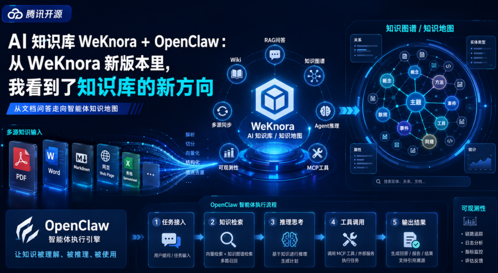

> 📎 来源: [畅说AI科技](https://mp.weixin.qq.com/s?__biz=MzA5MjI2Mzg5Nw==&mid=2247485137&idx=1&sn=7f59f3d87e09a2a2aa4a996342cb5174&chksm=9193b6fefbd92c0ec7c797e3adf00e1b00242f598516892252daa4e5645c919009cd4f44acab&mpshare=1&scene=1&srcid=0510Myfm7IjAOQsFgMFlKPG2&sharer_shareinfo=5eee5e4eee6e0cda31e0589ae1c8c801&sharer_shareinfo_first=5eee5e4eee6e0cda31e0589ae1c8c801) | 时间: 2026-05-10 15:53

---

大家好，我是锐哥，一个在IT界摸爬滚打的老兵，从云计算—>互联网—>金融，从编码—>咨询—>产品，横跳多个领域，经历起起伏伏。AI时代希望和大家一起：深入AI、实战AI、分享AI、共创AI。

最近看到 WeKnora 更新新版本，我一开始其实没太当回事。

说实话，现在 AI 工具更新太频繁了，今天一个“重磅升级”，明天一个“全新发布”，看多了以后，人会有点麻。

我原本以为，这次大概率也是支持更多模型、优化一下界面、增加几个文档格式。

但扫完更新内容后，我发现有点不对。

这次 WeKnora 不是简单堆功能，而是同时出现了几个很关键的方向：

**RAG 快速问答、ReAct Agent、MCP 工具、Wiki 模式、知识图谱、多源同步、Langfuse 可观测性、私有化部署。**

这些词单独看都不稀奇，但放在一个开源知识库里一起出现，我就觉得这事有点意思了。

于是我自己下载试了一下。

试完之后，我最大的感觉是：

**WeKnora 已经不是我印象里那个“上传文档，然后问答”的知识库了。**

它开始往另一个方向走。

不是只帮你“问资料”，而是尝试把资料整理成一套可以被 Agent 调用、推理、追踪和持续更新的知识体系。

说得更直白一点：

WeKnora 这次更新真正值得看的，不是功能变多了，而是知识库的方向变了。

01

———

过去的RAG，解决的是“能不能问”

## 以前我们说知识库，很多时候说的就是RAG。

把文档传进去，系统切分、索引、向量化。用户提问时，知识库召回相关片段，再让大模型整理成答案。

这个模式很实用。

比如你上传一份产品文档，可以问功能怎么用；上传几篇文章，可以让它帮你总结；上传一批运维手册，可以查某个故障怎么处理。

这就是 RAG 的价值。

它解决的是：

> AI 能不能基于我的资料回答问题。

但这里有个问题。

RAG 更擅长“问答”，不一定擅长“干活”。

问答只需要找到相关资料，再组织成一段答案。

但 Agent 不一样。

像 OpenClaw 这种智能体，不只是回答问题，它要拆任务、查资料、调用工具、推进流程，甚至判断下一步怎么做。

这时候，只给它几段相关资料就不够了。

它还需要知道：

这段资料是什么类型？
适合在哪一步用？
有没有过期？
和其他资料是什么关系？
这个动作有没有风险？

这些东西，普通 RAG 很难完全解决。

所以知识库继续往前走，就很自然了。

02

———

Wiki 和知识图谱，是这次最重要的变化

这次 WeKnora 新版本里，我最在意的是 Wiki 模式和知识图谱。

因为这两个能力，代表知识库不再只是“切碎资料方便搜索”，而是开始尝试“把资料重新组织成体系”。

普通 RAG 更像切片。

把一份文档切成很多段，后面根据问题召回相似内容。

Wiki 和知识图谱更像关系整理。

它要把原始文档整理成页面，把页面之间的引用和关系连起来，让知识不再是一堆孤立片段，而是一张有结构的网。

这个变化很关键。

因为很多时候，我们缺的不是资料。

资料太多了，真正缺的是关系。

比如 OpenClaw、MCP、RAG、知识图谱、WeKnora，这些概念如果只是分开解释，看不出其中的关联性。

但如果把它们连起来，就很清楚：

OpenClaw 负责执行任务。
WeKnora 负责提供知识底座。
RAG 负责召回资料。
Wiki 负责组织知识页面。
知识图谱负责连接关系。
MCP 负责让 Agent 调用外部工具。

这时候，它就不再是一堆名词，而是一张图。

而 Agent 最需要的，恰恰就是这张图。

03

———

ReAct Agent + MCP，让知识库进入任务链路

过去的知识库，大多数是被动的。

人问一句，它查一下，然后回答。

但 WeKnora 这次把 ReAct Agent、MCP 工具、网络搜索这些能力放进来以后，知识库的角色就变了。

它不只是等人来问，而是开始参与任务过程。

过去是：

> 人问问题 → 知识库检索 → AI 回答。

现在开始变成：

> Agent 接到任务 → 判断需要哪些知识 → 调用知识库 → 调用工具 → 推理下一步 → 输出结果。

这个变化很重要。

因为它和 OpenClaw 这类智能体刚好能接上。

OpenClaw 是执行侧。

它负责接任务、拆任务、调工具、推进流程。

WeKnora 是知识侧。

它负责提供知识搜索、RAG 问答、Agent 推理、Wiki 页面和知识图谱关系。

一个负责动手。

一个负责给地图。

没有地图，手越快，越容易乱跑。

所以我觉得，WeKnora 这次更新的意义，不只是知识库更强了，而是它开始更适合成为 Agent 背后的知识后端。

04

———

Langfuse 可观测性，企业场景绕不开

这次更新里还有一个点，很容易被忽略，但我觉得很重要。

就是 Langfuse 可观测性。

个人用知识库，可能更关心回答准不准、速度快不快、界面顺不顺。

但企业用 Agent，光这些不够。

企业真正关心的是：

  它为什么这么回答？
  它查了哪些资料？
  调用了哪些工具？
  哪一步失败了？
  Token 消耗多少？
  这次推理过程能不能追踪？

尤其是 OpenClaw 这种执行型智能体，一旦开始调用工具、推进任务，问题就不只是“答错一句话”。

它可能真的会做动作。

所以过程必须可追踪。

企业不是怕 AI 不会说话，企业怕的是 AI 说得头头是道，但你不知道它依据了什么。

Langfuse 这类可观测能力，就是让 Agent 的运行过程尽量可看、可查、可复盘。

这不炫，但很关键。

因为智能体越往执行侧走，越不能黑箱。

05

———

对 OpenClaw 来说，影响在哪里？

这次 WeKnora 的方向，对 OpenClaw 这种智能体影响很直接。

一句话：

> 它让 OpenClaw 从“会执行”，变成更接近“有依据地执行”。

OpenClaw 本身有执行能力。

但执行能力不等于可靠性。

一个人跑得快，不代表他知道往哪跑。

OpenClaw 也是一样。

如果它背后接的是普通资料库，它拿到的可能只是几段相关文本，然后基于这些文本往下写、往下判断。

这样很容易出现几个问题：

内容散；
复杂问题答偏；
资料调用不准；
遇到高风险操作时缺少边界感。

但如果背后接的是 WeKnora 这种正在往 Wiki、知识图谱、Agent 推理方向发展的知识库，情况就不一样了。

OpenClaw 拿到的不只是资料，而是关系。

不只是答案，而是路径。

不只是“这里有一篇手册”，而是“这篇手册属于哪个流程，和哪些案例相关，哪些步骤需要确认”。

这就是资料柜和任务地图的区别。

资料柜告诉你东西在哪。

任务地图告诉你下一步往哪走。

06

———

放到企业运维场景里，差别会更明显

这个变化放到企业运维场景里，差别会特别明显。

比如一个“磁盘空间不足”的告警。

普通知识库可能只会给 OpenClaw 找到一篇《运维故障手册：磁盘空间不足处理操作》。

这当然有用，但还不够。

真正处理时，还要知道：

这是生产环境还是测试环境？
哪个目录满了？
哪些目录可以清理？
哪些目录不能动？
要不要先备份？
历史上有没有类似故障？
清理无效后是不是要扩容？
哪些步骤需要人工确认？

这些东西不是一篇手册能完整解决的。

它需要一张图。

这张图里要有故障现象、相关指标、服务依赖、配置项、历史案例、风险动作、恢复流程。

OpenClaw 如果能基于这样的知识图谱来排查，就不会一上来乱给命令。

它会更像一个懂流程的运维助理：

先判断环境；
再查指标；
再看依赖；
再找历史案例；
再列低风险检查动作；
最后把高风险操作标出来，让人确认。

这就是图谱化知识库的价值。

不是让 AI 更会背手册，而是让 AI 更懂流程和边界。

07

———

别把 WeKnora 只看成一个知识库工具

所以我现在再看 WeKnora，不太想只把它看成“开源知识库工具”。

这个说法没错，但有点窄。

从这次更新看，它更像是在往 Agent 基础设施方向走。

> RAG 快速问答，解决日常知识查询。

> ReAct Agent，解决复杂任务推理。

> MCP 工具，解决外部工具调用。

> Wiki 和知识图谱，解决知识组织和关系表达。

> 多源同步，解决知识持续更新。

> Langfuse，解决过程可追踪。

> 私有化部署，解决企业数据可控。

这些功能如果分开看，只是功能点。

但放在一起看，就是趋势。

知识库正在从“文档问答工具”，变成“Agent 的知识后端”。

这才是 WeKnora 新版本真正值得看的地方。

08

———

最后：OpenClaw 需要手，WeKnora 给它地图

这段时间我越折腾知识库和智能体，越有一个明显感受：

AI 真正进入干活阶段以后，问题已经不只是模型聪不聪明了。

模型当然重要。

但更关键的是，智能体干活之前，能不能拿到正确资料，能不能理解资料关系，能不能知道流程边界，能不能留下调用痕迹。

OpenClaw 解决的是：

> AI 能不能动手。

WeKnora 这类知识底座解决的是：

> AI 动手之前，知不知道该怎么干。

这就是两者最有意思的关系。

如果没有知识地图，OpenClaw 可能只是一个手脚很快的通用助手。

如果有了图谱化知识库，它才更像一个懂上下文、懂流程、知道边界的执行助理。

以前我们搭知识库，是为了让 AI 更会回答。

现在我们搭知识地图，是为了让 AI 真正开始干活。

OpenClaw 决定 AI 能不能动手。

WeKnora 这类知识底座决定它动手之前，知不知道该怎么干。

这可能才是知识库接下来真正的变化。

---

**欢迎关注：****畅说AI科技 公众号**

如果你喜欢锐哥的分享，不妨动动手指，点赞、关注和分享哦！

欢迎扫描下方二维码，加我的微信，一起畅谈AI吧！

