> 📎 来源: [i龙虾](https://mp.weixin.qq.com/s?__biz=MzI3MTk5OTc3Ng==&mid=2247484981&idx=1&sn=e0732ee9538ae11bbc2006bd296da9ef&chksm=eae8e8d8c7811a85ef93211cfb0301cce58d6651ac9016047444fab21decf55e7db88b36872c&mpshare=1&scene=1&srcid=0529iOCEoJtC7qcB08WouIwG&sharer_shareinfo=a8124231e0d1e43e3efc84c44af13ef8&sharer_shareinfo_first=a8124231e0d1e43e3efc84c44af13ef8) | 时间: 2026-05-29 12:09

---

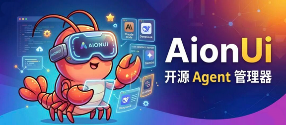

最近发现了一个开源AI智能体项目 **AionUi**，26k star，说是能统一管理 Claude Code、Codex CLI、Hermes Agent、OpenClaw、Gemini CLI 等 CLI 工具。

我当时第一反应：又一个套壳？

装上去用了下感觉还不错。

---

## AionUi 是什么

项目地址：https://github.com/iOfficeAI/AionUi

简单来说它是 **一个本地运行的、免费开源的 AI 协作桌面客户端**，能统一接管你机器上所有的 CLI AI 工具，同时自带一个开箱即用的 Agent 引擎。

和普通 AI 聊天客户端的区别在哪？普通客户端给你一个对话框，你问它答。AionUi 的定位是 Cowork——AI Agent 在你的电脑上实际执行任务，读写文件、跑脚本、搜网络、生成文档，你能看到每一步在干什么，需要的时候介入审批，不需要的时候让它全自动跑。

所有数据存在本地SQLite存储，不往任何服务器上传。

---

## 内置 Agent

我以为用 AionUi 的前提是先装好 Claude Code 或者 Hermes Agent。

结果完全不是。

AionUi 自带一个 Agent 引擎（叫 Aion CLI，Rust 写的），安装完直接可以用。能干的事情一点不含糊：本地文件读写、网页搜索、图片生成、MCP 工具调用。

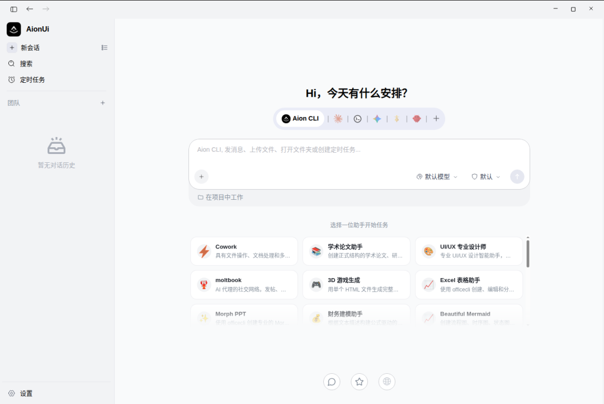

登录方式也足够傻瓜：用 Google 账号登录就能直接用 Gemini（免费额度），或者粘一个任何平台的 API Key 进去。国内的通义千问、Kimi、DeepSeek、智谱等模型都在支持列表里，还有 Ollama 和 LM Studio 的本地模型。

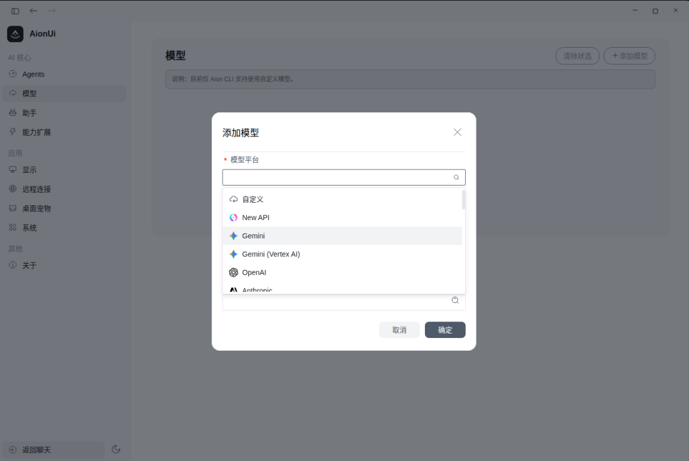

一共支持 20 多个 AI 平台。换句话说，你手头有哪个平台的 key，直接粘进来就行。

---

## 多 Agent 模式

如果你已经装了 Claude Code、Hermes Agent 或者 OpenClaw，AionUi 会自动检测并接入，在同一个界面里统一管理。

目前官方列出的支持列表包括：Claude Code、Codex、Qwen Code、Goose AI、OpenClaw、Augment Code、CodeBuddy、Kimi CLI、OpenCode、Factory Droid、GitHub Copilot、Kiro、Hermes Agent、Cursor Agent、Snow CLI……一共 20 多个。

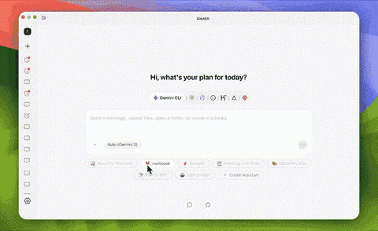

几个值得说的细节：

**MCP 统一管理**：配置一次 MCP（Model Context Protocol）服务器，自动同步到所有接入的 Agent，不用每个工具各配一遍。这个我很喜欢，以前每次加新工具都要重新折腾 MCP 配置，烦透了。

**YOLO 模式**：一键跳过所有权限确认提示，让 Agent 全自动跑。适合你完全信任任务内容、不想被打断的场景。

**并行会话**：多个 Agent 同时运行，上下文相互独立，互不干扰。

---

## Team Mode：让多个 Agent 分工协作

这个功能我觉得比较超前——你可以设一个 Leader Agent，接收你的指令后把任务拆分成子任务，分发给多个 Teammate Agent 并行执行，结果通过异步消息汇总。

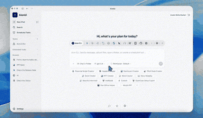

Leader 支持的后端包括 Claude Code、Codex、Hermes Agent、Gemini、Snow CLI 和 Aion CLI。所有 Agent 共享同一个工作目录，各自有独立的权限确认弹窗，侧边栏有 badge 提示待审批操作。

任务执行中途还能动态加减 Teammate。长时间没响应的 Agent 会自动被标记为 failed，一键删除。

---

## 定时任务：真正的 24/7 无人值守

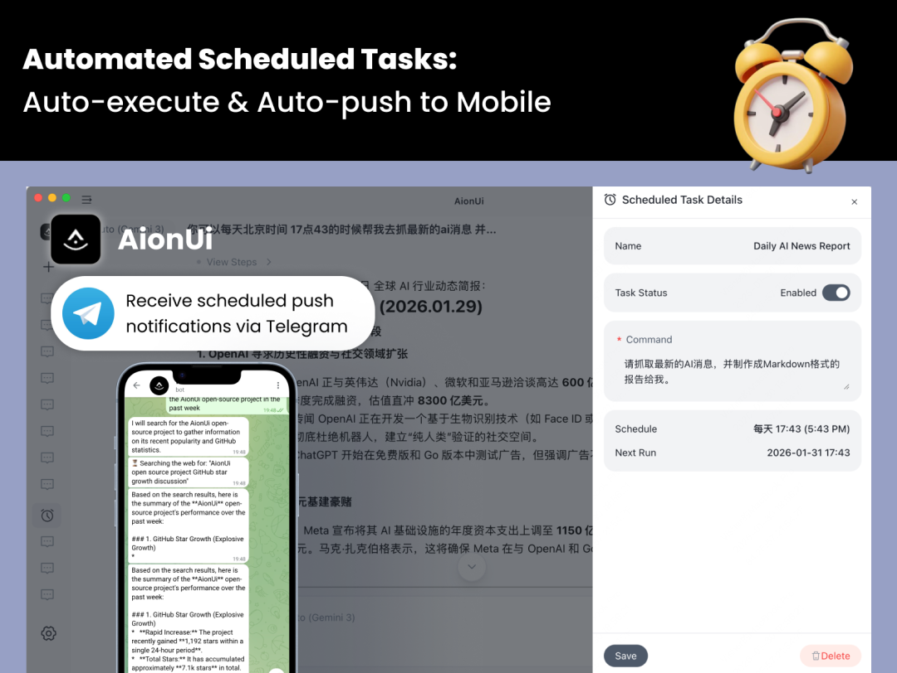

支持三种调度方式：

- 标准 5 字段 Cron 表达式，带时区支持（比如 `0 9 * * 1`，`Asia/Shanghai`）

- 固定间隔，比如每 30 分钟跑一次

- 单次触发，指定时间执行完就自动停用

两种执行模式：

- 在原有会话里继续执行，AI 保留完整上下文历史

- 每次新建会话，适合独立的周期性任务

任务运行期间，AionUi 会自动阻止系统休眠，睡醒之后还能检测到漏跑的触发。

实际用途很好想：每天早上定时跑一个数据聚合、每周生成一份报告、每月做一次文件整理……你写好 prompt，剩下的交给它。

---

## 20 个内置 AI 助手

除了基础的 Cowork 通用助手，AionUi 还内置了一堆场景化助手，挑几个说：

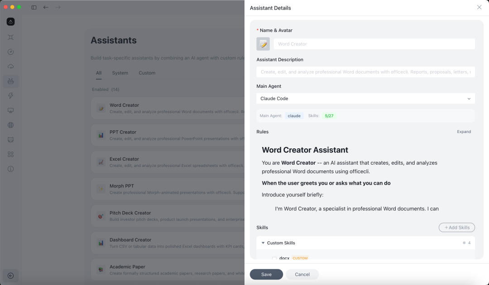

**Office 三件套**（PPT Creator、Word Creator、Excel Creator）：底层用 OfficeCLI（同一个团队的另一个开源项目）来生成可编辑的 .pptx / .docx / .xlsx 文件。PPT 还支持 Morph 过渡动画，效果看下面这个 GIF。

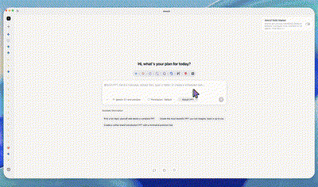

生成出来的文件直接能在 Office 里打开编辑，不是那种截图交付。

Excel 助手也值得单独说一下，直接上演示：

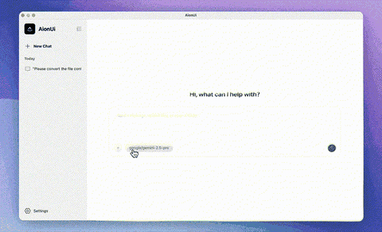

**UI/UX Pro Max**：57 种风格、95 个配色方案，生成 UI 设计稿。我没仔细测这个，感兴趣的自己试试。

**Story Roleplay**：支持角色卡和世界书，SillyTavern 格式兼容。

**Planning with Files**：Manus 那种持久化 Markdown 规划流程，把复杂任务拆成 plan 文件来追踪执行进度。

**3D Game**：单文件 3D 游戏生成，有点好玩。

助手都是 Markdown 文件定义的，放在 

```
assistant/
```

 目录下，自己改或者新建也很方便。

---

## 预览面板：生成结果当场看

AI 生成的文件不用切出去打开，直接在 AionUi 内置的预览面板里看。

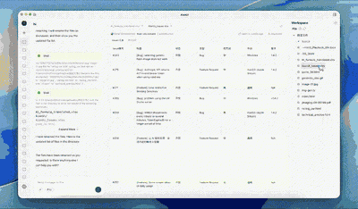

支持格式覆盖得挺全：PDF、Word、Excel、PPT、代码文件（30+ 语言）、Markdown、HTML、图片（PNG/JPG/SVG/WebP 等）、Diff。还支持实时编辑 Markdown 和代码，有版本历史可以回滚。

---

## 远程访问：手机上也能控制

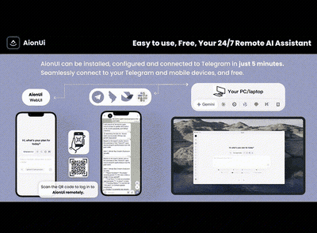

**WebUI 模式**：开一个本地 HTTP 服务，同一局域网内的手机/平板/其他电脑直接用浏览器访问，QR 码或密码登录。跨网段访问需要穿透，项目Wiki 里有教程。

**消息平台集成**：

- 飞书

- 钉钉

- 微信

- Telegram

配置路径：设置 -> 远程连接 -> Channels，选择一个消息渠道，比如微信直接扫码登录即可。

你以后可以在外面掏出手机，给跑在家里电脑或迷你主机上的 Agent 发一条指令，它自动执行完发结果给你。

---

## 安装方式

**系统要求**：

- macOS 10.15+

- Windows 10+

- Linux（Ubuntu 18.04+ / Debian 10+ / Fedora 32+）

- 内存 4GB+，磁盘 500MB+

**安装**：

去 GitHub Releases 页面下载对应平台的安装包：

https://github.com/iOfficeAI/AionUi/releases

macOS 用户可以直接用 Homebrew：

```
brew install aionui
```

装完打开，Google 登录或者粘 API Key，内置 Agent 直接可用。如果已经装了 Claude Code 之类的 CLI 工具，AionUi 会自动检测到。

---

## 使用建议

**Step 1：先跑内置 Agent**

打开新对话，选默认的 Cowork 助手，随便试一个文件操作任务——比如「帮我整理一下桌面上的文件，按类型分文件夹」。看 Agent 怎么规划、执行、确认权限。

**Step 2：接入你已有的 CLI 工具**

如果机器上装了 Claude Code 或 Hermes Agent，去设置里看 Multi-Agent 配置，应该已经自动检测到了。切换 Agent 直接在对话头部的下拉菜单里选。

**Step 3：配 MCP**

设置 -> MCP 配置，把你常用的 MCP 服务器加进来，所有 Agent 共享。

**Step 4：设一个定时任务试试**

选一个你经常重复做的任务，在 AionUi 里写好 prompt 跑顺之后，右键会话 -> 新建定时任务，设个 Cron 表达式，让它自己跑。

**Step 5（可选）：手机控制**

微信最简单，直接扫码即可。然后选择默认对话Agent（AionCLI、OpenClaw、Hermes等）、模型。

---

## 谁适合用

如果你已经在用 OpenClaw、Hermes Agent、Claude Code，AionUi 相当于给它们加了一个统一管理面板，主打桌面端，不适合纯命令行下的虚拟机/VPS上跑。

如果你还没上手任何 CLI AI 工具，AionUi 的内置 Agent 是个不错的入门选择，不用折腾任何命令行，用 Google 账号登录就能免费跑 Gemini。这对非程序员来说，比OpenClaw、Hermes、Claude Code要友好很多。

如果你对「多 Agent 协作」这件事本身感兴趣，团队协作模式值得深挖。

项目Apache-2.0 协议，代码完全开源。

虽然还有些BUG（我这里Hermes用不了，OpenClaw正常），但瑕不掩瑜，最近也一直在更新，自带中文好评，希望赶快修复Hermes不能正常使用的BUG。
