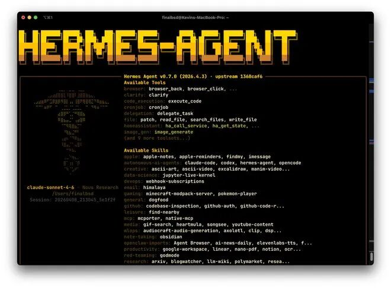
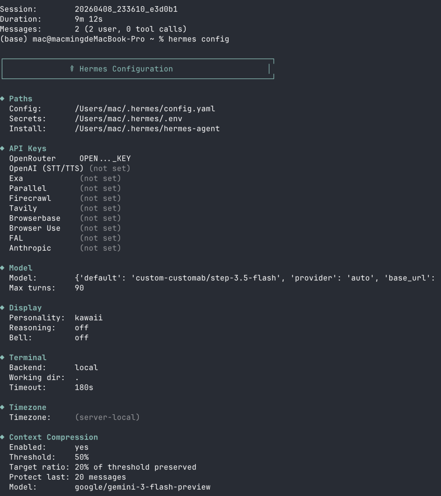

> 📎 来源: [去玩AI](https://mp.weixin.qq.com/s?__biz=Mzg5MzkwMTI1MQ==&mid=2247488927&idx=1&sn=aca3d59009c730207e80fb13720de44d&chksm=c1fe59465782d81e4e6ee44e4be36fecfa932a480babf06348e1c6a4f9e0bca2dc8a1422e919&mpshare=1&scene=1&srcid=0410VdTFokasgDsrBiTvbby9&sharer_shareinfo=8edb0568d43ddf44603b75b0f98421a0&sharer_shareinfo_first=8edb0568d43ddf44603b75b0f98421a0) | 时间: 2026-04-13 16:15

---

# 突然间，又多了一个Hermes智能体。

# 不是那个品牌Hermes。

# 是下面这个：

# 

现在都在吹这个Hermes - Agent。

说它是可以自我进化的智能体。

如果你已经在用 **OpenClaw**（或早期的 Clawdbot / Moldbot 一路跟过来），最近很难不刷到 **Hermes Agent**——同一类「自托管 + 消息网关」赛道里，Nous Research 用 MIT 协议又铺了一套，并且 **官方写了从 OpenClaw 一键迁移**。

这篇只做三件事：**OpenClaw 与 Hermes 各是什么**、**同维度对比**、**Hermes 的亮点与迁移命令**（均以 官方文档 为准，不替官方吹牛）。

---

## OpenClaw 与 Hermes：一句定位

**OpenClaw**：社区里非常活跃的开源个人/团队 Agent 路线，多通道、技能生态（如 Clawhub）、很多人已经把它跑在 Telegram / Discord 等场景里。

**Hermes Agent**：Nous Research 出品的另一套 **自托管** 开源 Agent，同样能接 **CLI + 多种 IM**。文档里把重心放在 **持久记忆 → 任务后沉淀技能 → 跨会话再捞回来** 这一整条「闭环」上（下一节拆开讲），并提供 

```
**hermes claw migrate
```

\*\* 从 OpenClaw 目录导入配置与数据。

二者 **不是升级包关系**，是 **两条产品/项目线**；你可以并行了解，再决定迁不迁。

---

## 「闭环」到底是什么？（按官方文档拆开说）

下面三条不是广告词，而是 **Hermes 文档里分别对应 Memory、Skills、Session Search 三块机制**。想抠细节请直接看：Memory System、Skills System。

### 1. 持久记忆：不是「聊天记录变长」，而是「写进盘里的摘要人设」

- 核心是两个落盘文件：

  ```
  **MEMORY.md
  ```

  **（Agent 自己的工作笔记：环境、项目惯例、踩坑结论）和 

  ```
  **USER.md
  ```**（你的偏好、沟通风格、角色期待），默认在 

  ```
  ~/.hermes/memories/
  ```

  。
- **每次新会话开头**，这两份内容会作为 **固定块写进系统提示**（文档称为 *frozen snapshot*）：Agent **一上来就带着上轮整理过的要点**，而不是从零猜你是谁。
- Agent 通过 

  ```
  **memory
  ```

   工具\*\*维护它们：

  ```
  add
  ```

   / 

  ```
  replace
  ```

   / 

  ```
  remove
  ```

  。文档给 **字符上限**（例如 MEMORY 约 2200 字符量级），满了要先合并或删掉旧条目——意思是：**记忆是刻意裁剪过的「高频有用事实」，不是整本日志**。
- 另有 **安全扫描**：写入前会拦明显的注入、偷密钥等模式（文档有说明）。

**人话**：持久记忆解决的是 **「下次开聊，关键约定还在」**；和「把每一句聊天都塞进上下文」不是一回事。

### 2. 任务后沉淀技能：把「这次费劲搞定的流程」变成「下次一条命令能调用的说明书」

- 技能本质是 

  ```
  **~/.hermes/skills/
  ```

   下的 SKILL.md\*\*（及附属文件），格式兼容 **agentskills.io** 那套开放标准，可分享、可从 Hub 安装。
- 文档写明：Agent 通过 

  ```
  **skill_manage
  ```

  \*\* 自己 **创建 / 打补丁 / 改写** 技能——典型触发包括：**复杂任务（例如 5+ 次工具调用）跑通**、**走过弯路才试出正解**、**你纠正了它的做法**、**发现非平凡工作流**。
- 平时用 

  ```
  **/技能名
  ```

  \*\* 或自然语言加载；设计上还有 **渐进加载**（先列表再按需展开），省 token。

**人话**：记忆像「便签 + 用户画像」，技能像 **「可复用的操作手册」**——这次你盯着它调好的 pipeline，有机会被写成 **下回少费口舌的 SOP**。

### 3. 跨会话检索：「上周我们在 Telegram 上说过啥？」可以搜，而不全靠 MEMORY 塞满

- 文档里 

  ```
  **session_search
  ```

  \*\* 这一路：CLI / 各 IM 的会话进 **SQLite**，用 **FTS5 全文检索**；搜到的片段再经 **摘要**（文档提到用 Gemini Flash 做 summarization）还给 Agent。
- 与 **MEMORY.md / USER.md** 的分工，官方对比大意是：**记忆块小、常驻提示里，适合「总要带着的事实」**；**会话检索容量上不封顶、按需搜，适合「某次具体讨论过的细节」**。

**人话**：闭环补上了第三环——**不是只记得结论，还能翻旧账找论据**（在隐私与存储都在你机器上的前提下）。

### 4. 文档里说的「closed learning loop」还包含什么（一句话带过）

文档首页 Key Features 把闭环写成一整句：**Agent 参与整理记忆、定期 nudge、自动建技能、使用中改技能、FTS5 跨会话召回 + LLM 总结、以及 Honcho 等用户建模**——外加可选 **外部 Memory Provider**（Honcho、Mem0 等）做更深一层长期记忆。你不需要一次全装全懂：**先理解「记忆文件 + 技能落盘 + 会话搜索」三板斧**，再决定要不要上插件。

---

## 同维度对比（帮你快速决策）

| 维度 | OpenClaw（概括） | Hermes Agent（文档侧表述） |
| --- | --- | --- |
| **出品与协议** | 社区驱动的 OpenClaw 生态 | Nous Research，**MIT** |
| **数据落盘** | 典型在 `~/.openclaw/` 等（以你实际版本为准） | 典型在 `~/.hermes/` |
| **消息入口** | 多通道网关是核心用法之一 | 文档称 **14+** 平台，**单 gateway** 统一接入 |
| **记忆与技能** | 依赖你的配置与社区技能习惯 | 文档强调 **跨会话记忆**、**复杂任务后自动生成/改进 skill**、与开放技能标准（如 agentskills.io）的兼容叙事 |
| **模型** | 可接多家 API（视你的配置） | **不绑一家** ：Nous Portal、OpenRouter、OpenAI、Anthropic、自定义端点等；`hermes model` 切换 |
| **和对方的官方关系** | — | **官方提供迁移指南与命令** ，从 OpenClaw 目录导入 |

公平说一句：**OpenClaw 用户基数大、教程多、生态熟**；**Hermes 的差异化主要在「记忆 + 技能闭环 + Nous 官方迁移工具」**。哪边更顺手，取决于你要的是「稳定现状」还是「试一条官方愿意接 OpenClaw 盘子的新主线」。

---

##



##

## Hermes 的亮点（可核对，不写「宇宙唯一」）

下面这些都能在 文档总览 或 GitHub README 里找到依据：

1. **闭环叙事**见上文 **「闭环到底是什么」** 一节；文档用词是 *closed learning loop / self-improving*。落地理解：**越用越省重复解释**，不是玄学「意识进化」。
2. **一条命令从 OpenClaw 搬家**官方专题：Migrate from OpenClaw。默认读 

   ```
   ~/.openclaw/
   ```

   ，也会自动认 

   ```
   ~/.clawdbot/
   ```

   、

   ```
   ~/.moldbot/
   ```

    等遗留路径。
3. **迁移内容很细**文档说明会处理人设（如 **SOUL.md**）、记忆文件、技能、模型与渠道配置、MCP、TTS、消息平台等 **30+ 类**映射；冲突项会归档到 

   ```
   ~/.hermes/migration/openclaw/.../archive/
   ```

    供你人工过目。
4. **迁移时要注意的一点（诚实版）**GitHub 上有讨论：

   ```
   hermes claw migrate
   ```

   **不自动导入 OpenClaw 的聊天会话历史**（见 Issue #4112 等）。**你在意「聊天记录也要跟过去」**，迁之前先看该 issue / 后续版本是否已支持，别默认「全盘克隆」。
5. **运行面**Linux、macOS、**WSL2**；文档写明 **原生 Windows 不支持**，和 OpenClaw 用户里常见环境类似，但要以 Hermes 安装页为准。

---

## 迁移怎么跑（复制前先看官方）

官方推荐先预览再执行（摘自 迁移文档）：

```
ounter(lineounter(lineounter(lineounter(lineounter(lineounter(lineounter(line
```

首次安装时 

```
**hermes setup**
```

 也可能 **检测到 

```
~/.openclaw
```

 并询问是否迁移**——以你本机向导为准。迁完建议：

```
hermes status
```

、

```
hermes doctor
```

，并按文档检查 API Key 与归档目录。

尚未装 Hermes 时，一键安装仍以官方为准：

```
ounter(line
```

详见 Installation。

---

## 名字别搞混

**Nous 的 Hermes Agent**（本文所写）与域名 **hermesagent-ai.com** 上的商业产品 **不是同一项目**——装仓库请认准 NousResearch/hermes-agent。

---

## 我的态度

**值得看**：官方愿意做 **OpenClaw → Hermes 的迁移文档与命令**，说明两边用户重叠度高，切换成本在被打薄。
**别冲动**：会话历史、插件与团队规范未必 100% 无损平移；**生产环境先 dry-run + 备份**。

---

## 结尾

**还在 OpenClaw**：你没有任何「必须换」的义务；Hermes 的增量主要是 **Nous 这条记忆/技能叙事 + 官方迁移**。
**想试 Hermes**：从 

```
--dry-run
```

 开始，把 **会话是否要迁** 这条想清楚再动手。

你当前是 **A** 纯 OpenClaw **B** 已迁 Hermes **C** 两套并行？留言字母，下篇我可以只写「迁完验收清单」（仍只列文档里有的步骤）。

---

## 参考资料

1. Hermes 文档首页：https://hermes-agent.nousresearch.com/docs/
2. **Memory System（持久记忆 / 会话搜索）**：https://hermes-agent.nousresearch.com/docs/user-guide/features/memory
3. **Skills System（任务后沉淀技能）**：https://hermes-agent.nousresearch.com/docs/user-guide/features/skills
4. **从 OpenClaw 迁移（核心）**：https://hermes-agent.nousresearch.com/docs/guides/migrate-from-openclaw/
5. CLI 命令参考（含 

   ```
   hermes claw migrate
   ```

   ）：https://hermes-agent.nousresearch.com/docs/reference/cli-commands/
6. GitHub 仓库：https://github.com/NousResearch/hermes-agent
7. 安装：https://hermes-agent.nousresearch.com/docs/getting-started/installation/
8. 会话历史迁移讨论：https://github.com/NousResearch/hermes-agent/issues/4112
9. 第三方评测（观点文）：https://dev.to/george\_larson\_3cc4a57b08b/hermes-agent-honest-review-1557

---

##

好了，以上就是全部信息了。

如果你要是还觉得有不明白的地方，你就给我这个文章点赞，点关注，转发一次，在评论区留言 hhh ， 我可以手把手的告诉你怎么弄。

##
