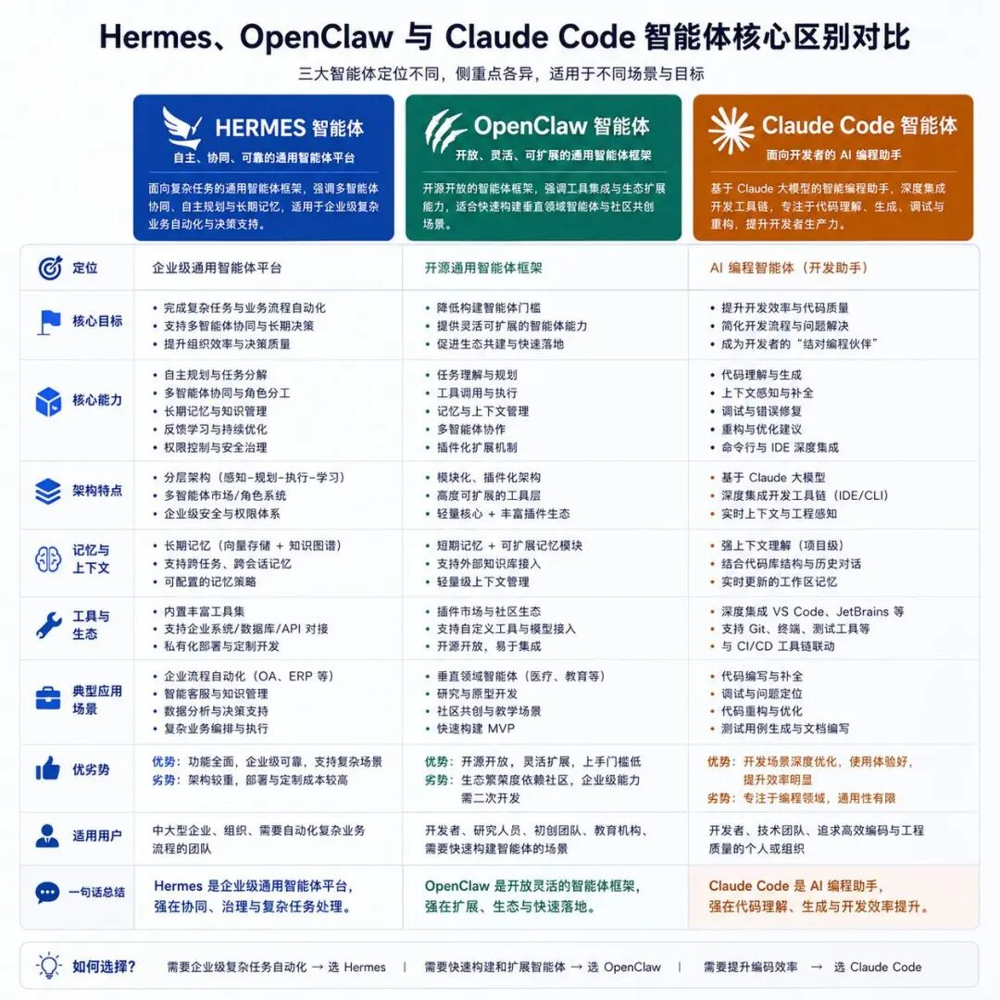
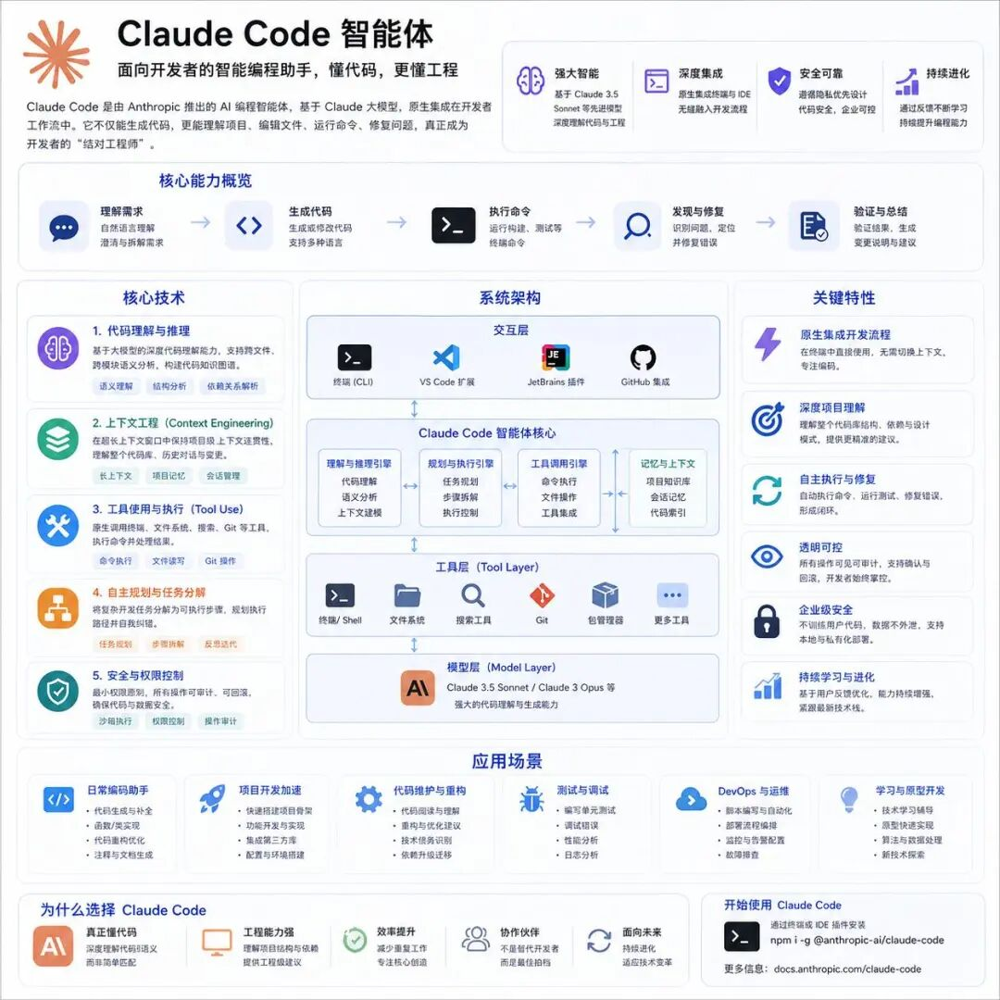
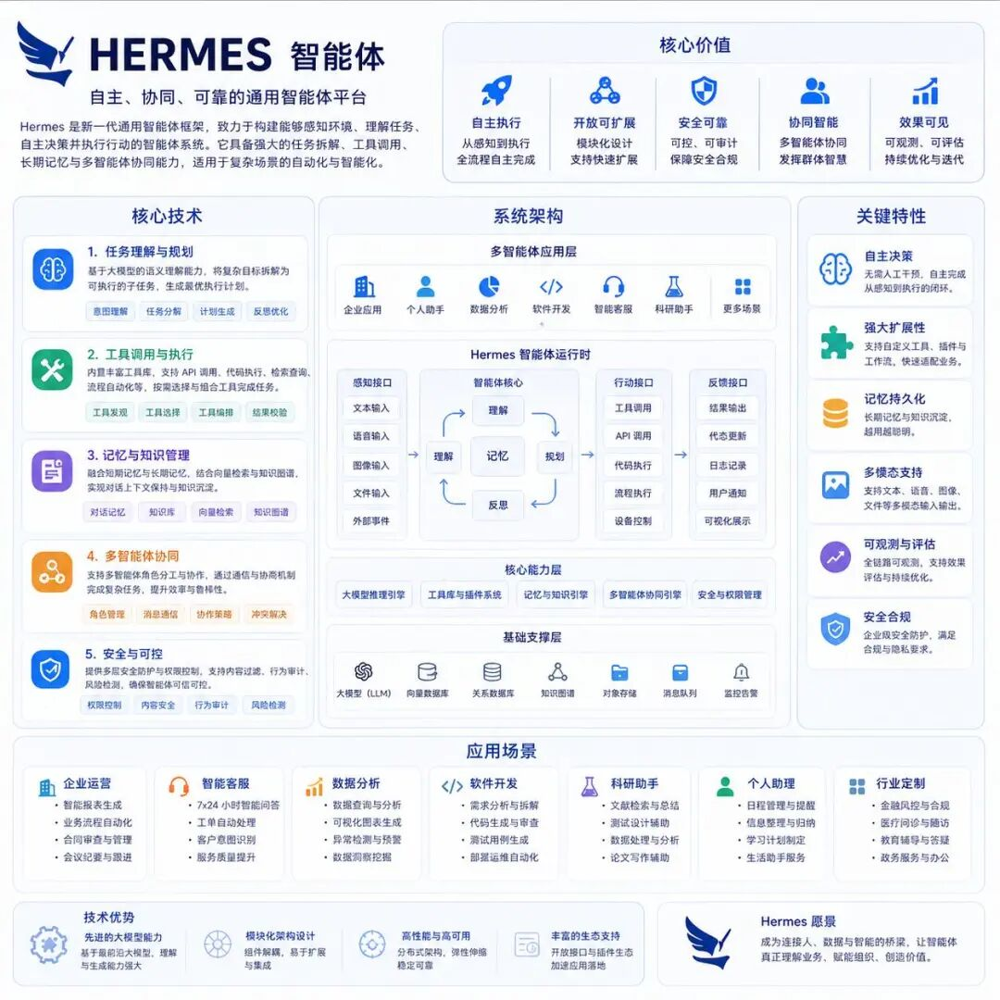
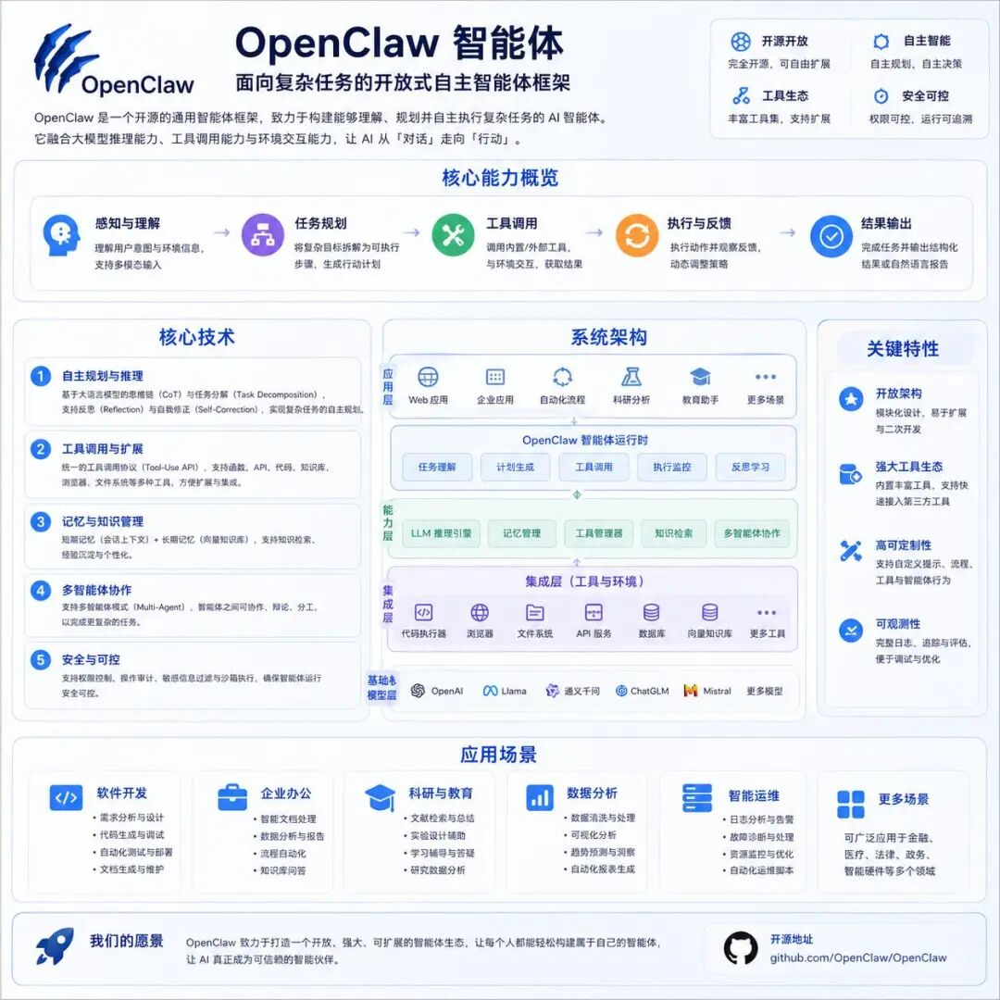

> 📎 来源: [小薛谈编程](https://mp.weixin.qq.com/s?__biz=Mzk0NjUxMDcxNA==&mid=2247491711&idx=1&sn=28b0832767b4d586e4aaf79b77aecfae&chksm=c20cb0c4b8eacd1b164bd80d8b62c2fbca288edd0a76446d80d2b2841840313471c1548acae4&mpshare=1&scene=1&srcid=0509uLcC6lNaKKH8qqp6tZie&sharer_shareinfo=f46e462410d6529604d00f452c6c75a8&sharer_shareinfo_first=f46e462410d6529604d00f452c6c75a8) | 时间: 2026-05-09 21:06

---

Hermes、Openclaw以及Claude Code到底是什么🔥 本质区别（一句话版本）

Hermes → 企业级AI操作系统（大脑 + 调度中心）

OpenClaw → 开源Agent框架（骨架 + 扩展能力）

Claude Code → 编程智能体（手 + 工具执行）

👉 这三个不是竞品，是不同层级

🧠 更底层一层拆解（你做产品必须理解）

1️⃣ 控制层（谁在做决策）

Hermes：强中心化调度（像“医院院长”）

OpenClaw：弱中心 + 可扩展（像“平台市场”）

Claude Code：单Agent执行（像“工程师”）

2️⃣ 能力边界（能干多复杂的事）

Hermes：复杂业务闭环（流程 + 决策 + 多人协同）

OpenClaw：中等复杂（拼装能力强，但要你自己搭）

Claude Code：单点深度（写代码极强，但不管系统）

