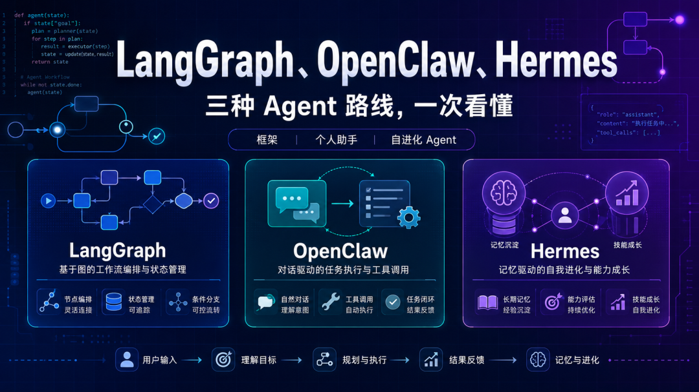
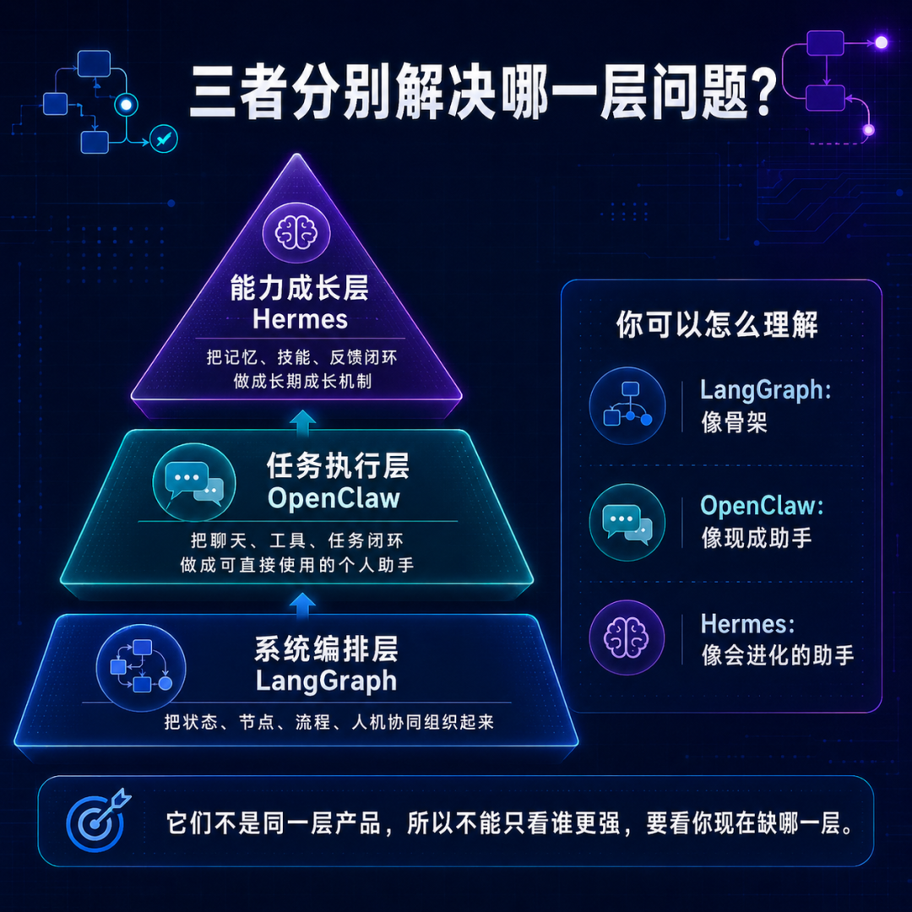
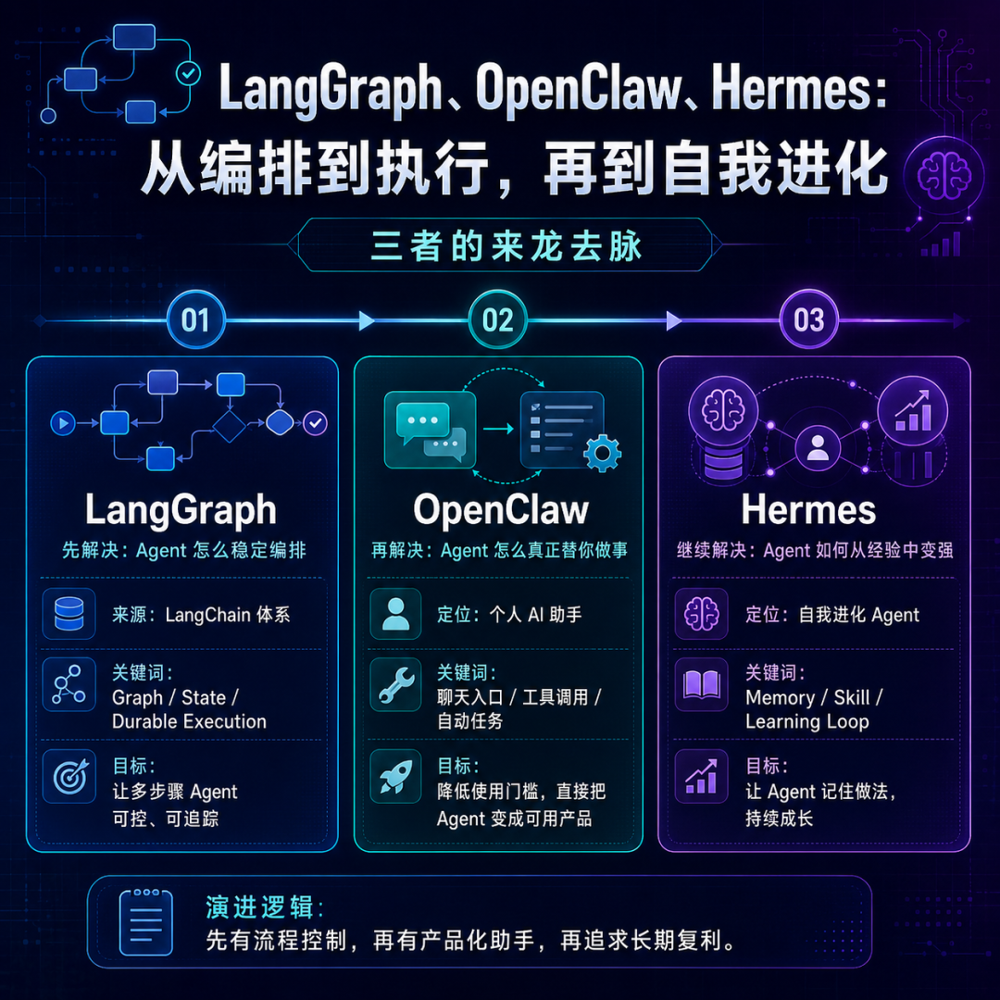
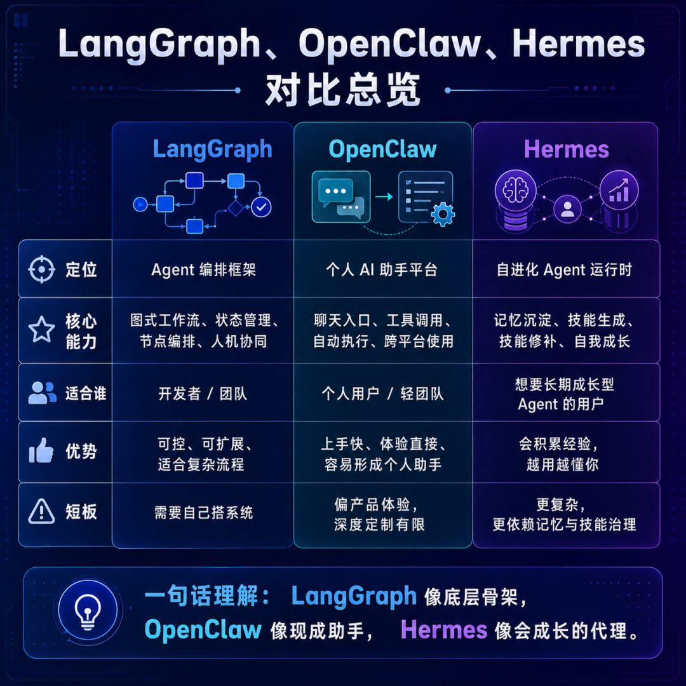
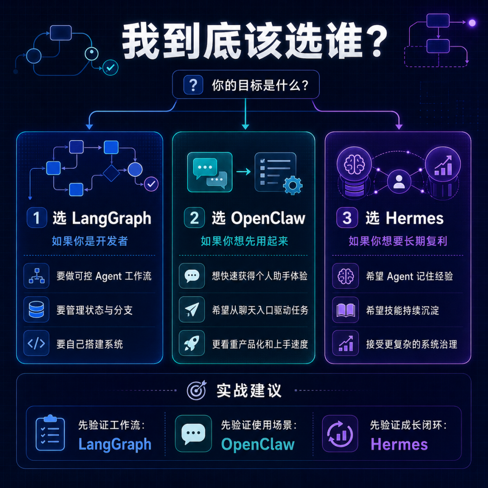

> 📎 来源: [厚国兄](https://mp.weixin.qq.com/s?__biz=Mzk1NzM1MTI1Ng==&mid=2247490083&idx=1&sn=d5e80e6d3d69e65e4b1fd26821a8d1dc&chksm=c2ac4079f1d18f560ba44774b5127eda637da650e7968f15688fcea6e6feb48cab866c6013ec&mpshare=1&scene=1&srcid=05107vat3SgccocbcWDGPTst&sharer_shareinfo=577c6bdef5123586fb5e37218ba85ed2&sharer_shareinfo_first=577c6bdef5123586fb5e37218ba85ed2) | 时间: 2026-05-10 15:06

---

LangGraph、OpenClaw、Hermes

三种 Agent 路线，一次看懂

框架｜个人助手｜自进化 Agent

|  |  |  |
| --- | --- | --- |
| LangGraph 底层编排骨架 让 Agent 有结构 | OpenClaw 个人助手入口 让 Agent 能使用 | Hermes 自进化运行时 让 Agent 会成长 |

——

# 开头

这两年，只要聊到 Agent，绕不开三个名字：LangGraph、OpenClaw、Hermes。

它们都很火。

但也很容易被混在一起。

有人把 LangGraph 当成一个“Agent 产品”。

有人把 OpenClaw 当成一个“Agent 框架”。

也有人把 Hermes 理解成“另一个 OpenClaw”。

这就会带来一个问题：

如果概念层级没分清，后面所有判断都会跑偏。

👉 先说结论：

LangGraph、OpenClaw、Hermes 不是三个同层产品，而是三条不同的 Agent 路线。

- LangGraph 解决的是：Agent 如何被稳定编排。

- OpenClaw 解决的是：Agent 如何被普通人直接使用。

- Hermes 解决的是：Agent 如何从经验中持续成长。

也就是说，它们不是简单的“三选一”。

更像是 Agent 从底层框架、到产品入口、再到长期智能体的三个阶段。

——

# 本质是什么

先说结论：这三者的本质差异，不在功能列表，而在它们处于 Agent 系统的不同层级。

LangGraph 更像“底层骨架”。

它关注的是节点、状态、流程、分支、持久化、人机协同。

OpenClaw 更像“现成助手”。

它关注的是聊天入口、工具调用、任务执行、跨平台使用、个人场景闭环。

Hermes 更像“会成长的代理”。

它关注的是长期记忆、Skill 沉淀、经验复用、技能修补、自我进化。

一句话定义：

LangGraph 让 Agent 有结构，OpenClaw 让 Agent 可使用，Hermes 让 Agent 会成长。

[插图：三者分别解决哪一层问题]

三者分别解决哪一层问题

说白了：

它们不是在抢同一个位置。

它们是在回答 Agent 产品成熟过程中的三个不同问题。

——

# 它解决什么问题

先说结论：三者都在解决 Agent 落地问题，但落点完全不同。

## ① LangGraph 解决“复杂 Agent 怎么稳定跑”

Agent 一旦从简单问答进入真实任务，就会遇到状态和流程问题。

比如：

- 哪一步已经执行？

- 哪一步失败了？

- 失败后能不能恢复？

- 人是否需要中途审批？

- 多个工具调用之间状态如何传递？

LangGraph 就是为这种复杂流程服务的。

它不是为了让你“马上拥有一个 AI 助手”。

它更像一个让开发者搭建复杂 Agent 的运行底座。

## ② OpenClaw 解决“Agent 怎么真正用起来”

很多 Agent 项目技术上能跑，但用户用不起来。

原因很简单：入口太重、配置太多、使用链路太长。

OpenClaw 的思路更接近产品化：

把 Agent 放到用户已经熟悉的聊天入口里，让它能够接收任务、调用工具、完成执行。

它要解决的是：

不要让我先理解 Agent，先让我用起来。

## ③ Hermes 解决“Agent 怎么越用越强”

当 Agent 真正开始替你工作后，一个更长期的问题出现了：

它做过的事情，会不会变成经验？

它踩过的坑，会不会下次避开？

它能不能把一次成功任务变成下次可复用的 Skill？

Hermes 的核心，就是把记忆、技能、反馈闭环做成长期成长机制。

这一段你可以记住：

- LangGraph 管“流程”。

- OpenClaw 管“使用”。

- Hermes 管“成长”。

——

# 核心内容拆解

## 一、LangGraph：从 LangChain 体系里长出来的 Agent 编排层

先说结论：LangGraph 的关键词是：图、状态、持久化、可控流转。

LangGraph 的来龙去脉，要从早期 LLM 应用开发说起。

最开始，很多人用 Chain 把几个 Prompt 串起来。

后来加入 Tool，让模型可以调用外部工具。

再后来大家开始做 Agent，让模型自己判断下一步该做什么。

但问题也随之出现：

Agent 越自主，系统越难控。

一次简单工具调用还好。

如果是一个长任务，里面有计划、搜索、调用工具、写文件、人工确认、失败重试，就必须有一套更严谨的编排机制。

LangGraph 的核心价值，就是把 Agent 过程变成“图”。

每个节点代表一个步骤。

边代表流转关系。

State 记录当前任务状态。

Checkpoint 让任务可以恢复。

Human-in-the-loop 让人可以在关键节点介入。

这就是它和普通 Agent Demo 最大的区别：LangGraph 关心的不是这次回答多漂亮，而是整个执行过程能不能被管理。

适合场景：

- 企业级 Agent 工作流

- 研发自动化 Agent

- 多步骤数据处理

- 需要人工审批的流程

- 需要可靠恢复的长任务

它的短板也明显：

LangGraph 不是开箱即用的个人助手。

你需要自己定义节点、状态、工具、逻辑和产品入口。

所以它更适合开发者和工程团队。

——

## 二、OpenClaw：把 Agent 做成“个人可用”的产品入口

先说结论：OpenClaw 的关键词是：自托管、聊天入口、工具执行、个人助手。

OpenClaw 的出现，代表 Agent 发展里的另一个方向：

不是先让你搭框架。

而是先让你拥有一个能接任务的助手。

它强调的是：

- 运行在自己的设备或服务器上

- 从熟悉的聊天软件里使用

- 能连接工具和任务

- 能形成持续在线的个人助手体验

这和 LangGraph 的思路不一样。

LangGraph 更像“开发工具箱”。

OpenClaw 更像“个人 Agent 产品”。

比如，你可能不关心它内部怎么编排流程。

你只关心：

我在 Telegram、WhatsApp、Slack 或其他聊天入口里说一句话，它能不能替我执行任务。

OpenClaw 真正吸引人的点，是把 Agent 从 IDE、控制台、Demo 页面里释放出来，放回用户每天都在用的聊天入口。

这很关键。

因为 AI 助手如果不能进入用户现有工作流，就很难形成高频使用。

适合场景：

- 个人 AI 助手

- 消息和日程处理

- 轻量自动化任务

- 自托管 AI 助手

- 多聊天入口统一 Agent

它的短板也要看清：

OpenClaw 更偏产品体验，不一定适合做高度定制的底层 Agent 编排系统。

如果你要做复杂企业工作流，可能还是要回到底层框架和工程治理。

——

## 三、Hermes：让 Agent 从“能执行”走向“能成长”

先说结论：Hermes 的关键词是：Memory、Skill、Learning Loop、自我进化。

Hermes 的方向更激进。

它关注的问题不是 Agent 能不能执行一次任务。

而是：

Agent 执行完任务之后，能不能变得更强。

这背后其实是 Agent 长期价值的关键。

一个真正有用的助手，不应该每天都像第一次见你。

它应该知道你做什么项目。

知道你常用什么工具。

知道你喜欢什么输出格式。

知道某类任务之前怎么成功完成。

也知道哪些坑以后不要再踩。

Hermes 通过记忆和 Skill 机制，把这种经验沉淀下来。

一次任务完成后，它可以从过程中总结经验，形成可复用 Skill。

下一次遇到类似任务时，它不必完全从零开始。

这就是 Hermes 和普通 Agent 最大的区别：它不是只做任务，而是试图把任务变成能力增长。

适合场景：

- 长期个人 AI 助手

- 研发和运维自动化

- 研究型工作流

- 内容生产工作流

- 需要经验复用的任务体系

它的短板同样明显：

越强调自我进化，越需要治理。

记忆是否准确？

Skill 是否安全？

错误经验会不会被固化？

用户隐私如何控制？

这些都是 Hermes 这类系统必须面对的问题。

——

# 三者的来龙去脉

先说结论：Agent 的演进，不是从一个工具跳到另一个工具，而是从“编排”走向“执行”，再走向“成长”。

[插图：LangGraph、OpenClaw、Hermes 的演进路线]

LangGraph、OpenClaw、Hermes 的演进路线

## 第一阶段：先解决“可控”

早期 Agent 最大的问题，是看起来聪明，但不可控。

所以需要 LangGraph 这类框架，把执行过程拆成节点和状态，让系统能被工程化管理。

没有编排，Agent 很容易变成一个黑盒。

## 第二阶段：再解决“可用”

有了底层编排后，用户仍然不一定会用。

所以 OpenClaw 这类产品化路线出现，把 Agent 放到聊天入口里，让它更像一个随叫随到的个人助手。

没有入口，Agent 很难进入真实生活和工作流。

## 第三阶段：继续解决“复利”

当 Agent 被频繁使用后，新的价值来自积累。

Hermes 这类系统试图让 Agent 把经历过的任务沉淀成记忆和 Skill。

没有成长，Agent 就只是一个永远重来的工具。

说白了：

Agent 的路线正在从“会回答”，走向“会做事”，再走向“会积累做事方法”。

——

# 和传统方案区别

先说结论：传统软件是人写死流程，Agent 系统是让模型参与流程；而这三者分别解决流程里的不同环节。

## 旧逻辑：程序员把流程写死

传统自动化系统通常是这样的：

- 需求先定义清楚

- 工程师写逻辑

- 用户按按钮

- 系统按固定路径运行

- 出现边界情况就报错或走人工处理

这种方式稳定，但不够灵活。

## 新逻辑：Agent 参与任务决策

Agent 系统更像这样：

- 用户给目标

- Agent 理解上下文

- 系统提供工具

- Agent 规划步骤

- 过程中根据结果调整路径

- 必要时请求人类确认

这时就需要三类能力：

① 编排能力：谁来管理状态和流程？

这就是 LangGraph 的位置。

② 使用入口：用户从哪里把任务交给 Agent？

这就是 OpenClaw 的位置。

③ 经验沉淀：这次任务的经验如何留到下次？

这就是 Hermes 的位置。

这一段你可以记住：

传统软件更像固定流水线。

Agent 系统更像一个会看情况调整的执行团队。

——

# 三者区别总览

先说结论：把三者放在一张表里看，差异会非常清楚。

[插图：LangGraph、OpenClaw、Hermes 对比总览]

LangGraph、OpenClaw、Hermes 对比总览

|  |  |  |  |
| --- | --- | --- | --- |
| 维度 | LangGraph | OpenClaw | Hermes |
| 核心定位 | Agent 编排框架 | 个人 AI 助手平台 | 自进化 Agent 运行时 |
| 主要用户 | 开发者、工程团队 | 个人用户、轻团队 | 追求长期复利的用户 |
| 关键能力 | 图式流程、状态、持久化、人机协同 | 聊天入口、工具调用、任务执行 | 记忆、Skill、经验沉淀、学习闭环 |
| 典型价值 | 让 Agent 可控、可追踪、可恢复 | 让 Agent 更容易被使用 | 让 Agent 越用越懂你 |
| 适合场景 | 企业流程、研发自动化、复杂系统 | 个人助手、消息处理、任务代办 | 长期项目、知识工作、经验复用 |
| 主要短板 | 需要自己搭产品层 | 深度定制和治理有限 | 系统复杂，需要记忆和安全治理 |

一句话理解：

LangGraph 像骨架，OpenClaw 像现成助手，Hermes 像会进化的助手。

——

# 值不值得做

先给判断：都值得看，但不应该盲目跟风。

## LangGraph 值得做吗？

值得。

前提是你要做的是工程系统，而不是只想体验一个 AI 助手。

如果你正在做企业内部 Agent、研发自动化、复杂工具编排、多步骤审批流，LangGraph 很有价值。

但如果你只是想快速搭一个能聊天、能查资料、能跑简单任务的助手，它可能有点重。

## OpenClaw 值得做吗？

值得。

前提是你要验证“个人 AI 助手”这个使用场景。

它更适合快速把 Agent 放进真实入口，看看用户到底会不会高频使用。

但如果你要做一个严肃的企业级 Agent 平台，它可能还需要更多治理能力补齐。

## Hermes 值得做吗？

值得研究。

前提是你相信 Agent 的长期价值来自经验复用。

它最吸引人的地方不是“今天能不能完成任务”，而是“六个月之后，它是不是比今天更懂你的工作方式”。

但它也最需要谨慎。

因为记忆和 Skill 一旦进入执行链路，就会涉及安全、隐私、错误经验固化等问题。

说白了：

- 做底层系统，看 LangGraph。

- 做使用入口，看 OpenClaw。

- 做长期成长，看 Hermes。

——

# 如果是我来做

先说结论：我不会把它们看成三选一，而会把它们看成 Agent 产品的三块拼图。

[插图：我到底该选谁]

我到底该选谁

## ① 先用 LangGraph 建立工程底座

如果我要做一个真正可控的 Agent 产品，我会先解决流程和状态。

任务怎么拆？

失败怎么恢复？

用户什么时候介入？

工具调用结果怎么追踪？

这些问题不解决，Agent 越强，风险越大。

## ② 再参考 OpenClaw 做产品入口

有了底层能力，不代表用户会用。

所以要把 Agent 放进用户自然会使用的入口。

聊天入口、移动端入口、桌面入口、浏览器入口，都可以成为产品化载体。

Agent 的入口越轻，用户越容易形成习惯。

## ③ 最后借鉴 Hermes 做长期复利

真正有壁垒的 Agent，不应该只靠模型能力。

模型会被替换。

工具会被复制。

真正难复制的是用户长期使用过程中沉淀下来的记忆、经验、Skill 和工作方式。

这才是 Hermes 路线值得关注的地方。

## ④ 个人创业更适合从“场景 + Skill”切入

如果是个人创业，我不建议一上来就做一个“大而全 Agent 平台”。

更现实的方式是：

先选一个具体人群。

再选一个高频任务。

然后把任务流程、工具调用、经验沉淀做深。

比如：

- 自媒体内容 Agent

- 嵌入式工程师文档 Agent

- 小团队运营助理 Agent

- 私域销售跟进 Agent

- 项目复盘与知识沉淀 Agent

小而深，比大而全更有机会。

——

# 总结

LangGraph、OpenClaw、Hermes 看起来都在 Agent 赛道里。

但它们真正代表的是三种不同路线：

LangGraph 代表工程编排。

OpenClaw 代表产品入口。

Hermes 代表长期成长。

所以判断它们，不能只问“谁更强”。

要问：

你现在缺的是一个框架？

一个助手？

还是一个会长期积累经验的 Agent？

Agent 的下一阶段竞争，不只是模型能力竞争，而是结构、入口、记忆和经验复利的竞争。

谁能把任务组织起来，谁就能做复杂事。

谁能把入口做轻，谁就能进入真实使用场景。

谁能把经验沉淀下来，谁才可能形成长期壁垒。

——

# 金句

LangGraph 解决的是编排，OpenClaw 解决的是使用，Hermes 解决的是成长。

它们不是同一层产品，所以不能只看谁更强。

LangGraph 像骨架，OpenClaw 像现成助手，Hermes 像会进化的助手。

能跑起来只是第一步，能被使用、能被积累，才是 Agent 真正的分水岭。

未来 Agent 的壁垒，不只是工具多少，而是谁能沉淀更好的工作方法。
