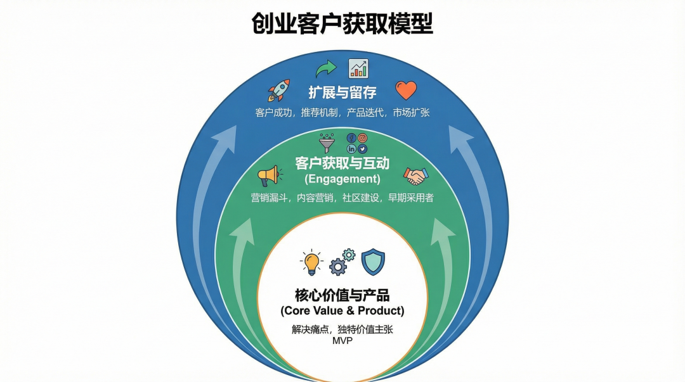
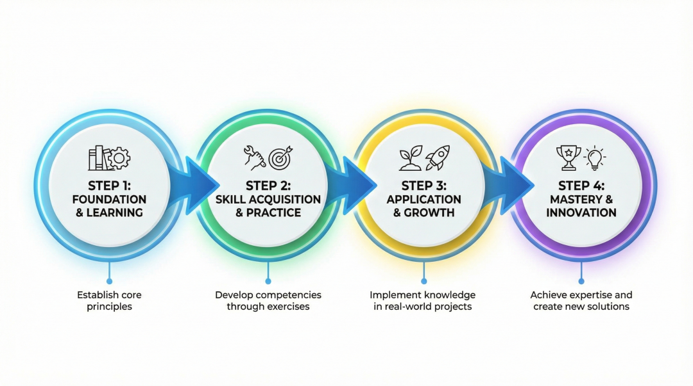
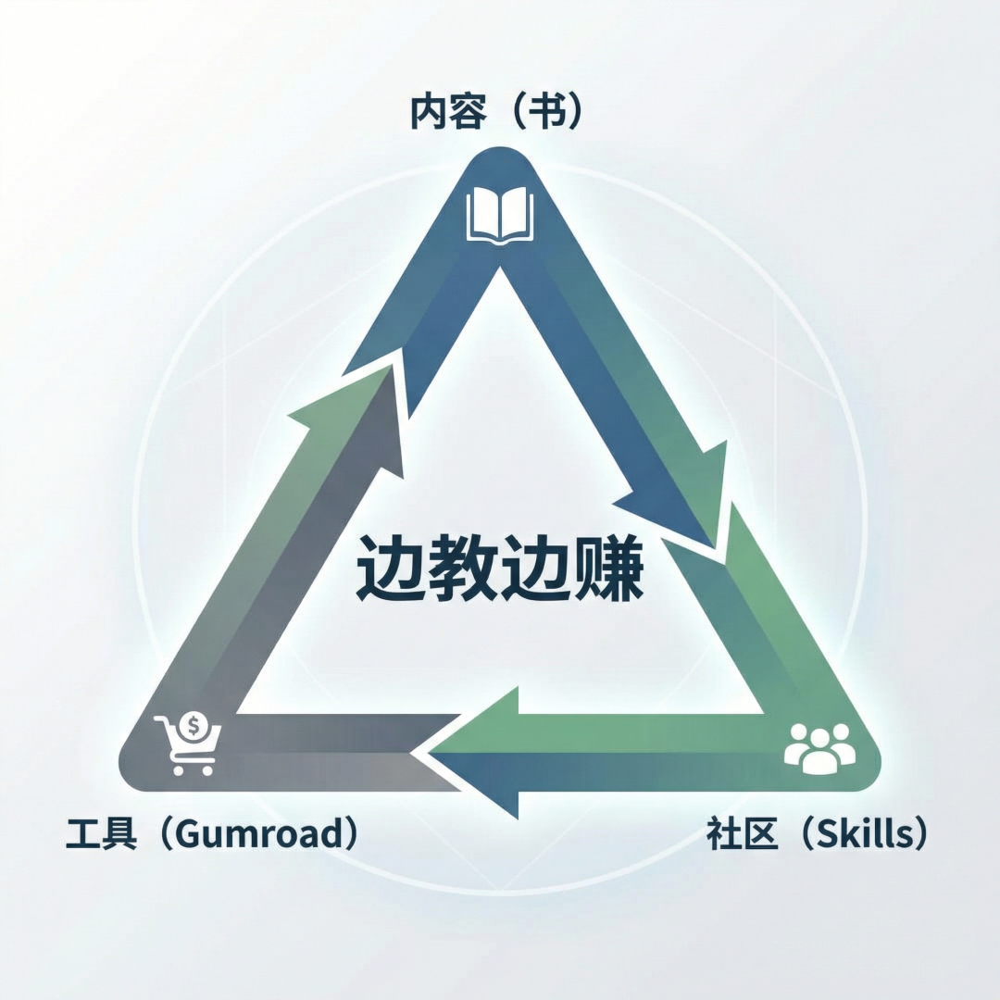

> 📎 来源: [学麟AI](https://mp.weixin.qq.com/s?__biz=MzY5NzIxMjI4OQ==&mid=2247484116&idx=1&sn=739673830d79beb90274748d6615a821&chksm=f5acf5ce6b63be6545e1f2ea7468e58cb711cddff1d700c9f14b508923f3d544d1aff6775b69&mpshare=1&scene=1&srcid=0420QYGGdyoiLlWZjfbUA7wY&sharer_shareinfo=7844f89b188438fa9389adf960ecbe0e&sharer_shareinfo_first=7844f89b188438fa9389adf960ecbe0e) | 时间: 2026-04-20 21:29

---

> GitHub：slavingia/skills | 7天6300 star | 作者：Sahil Lavingia（Gumroad创始人)

## 一、这个项目牛在哪

先说清楚一件事：这个项目不是"又一个AI提示词合集"。Sahil Lavingia把《The Minimalist Entrepreneur》里那套方法论，变成了10个可以直接在Claude Code里调用的Skills。每个 Skill对应创业过程中的一个关键决策节点——从"找社区"到"极简复盘"，首尾相连。

这不是碎片化建议，是一条**完整的商业闭环**。而验证一个模式是否有效，最好的证据就是它自己靠这个模式跑通了。Gumroad，2011年创业，YC孵化，中间裁到只剩创始人一人，2021年实现盈利并反向分红。

## 二、10个Skills如何构成商业闭环

```
社区发现 → 验证想法 → 手工MVP → 流程化 → 获取首批客户 → 定价 → 内容营销 → 可持续增长 → 企业价值观 → 极简复盘
```

### Skill 1 & 2：找社区 + 验证想法

**死亡节点：点子死在脑子里**

大多数人的创业第一步是"我想做一个XXX"。Sahil说这是错的。第一步是找到你已经在里面的社区，发现他们反复抱怨的同一个问题。然后用Validate Idea验证：能不能先手工帮人解决这个问题？如果3个陌生人愿意付钱，验证通过；如果没人愿意掏钱，这个点子要么不存在，要么你的表述有严重问题。

**闭环逻辑：**不是先有产品再找用户，而是先被用户的需求推着走。

### Skill 3 & 4：MVP + 流程化

**死亡节点：花三个月做了一个没人要的东西**

> "Most apps on the internet are just forms and lists."

最小可行产品，本质上就是一个表单加一个数据库。先靠人手工交付价值，搞清楚哪部分是重复的，再决定哪部分值得写代码。Gumroad最早的版本，是Sahil收集创作者的Paypal邮箱，手动转账。这个"产品"就是他和一张电子表格。

**闭环逻辑：**代码是最贵的，人工是最便宜的。先用最便宜的方式跑通闭环，再决定花哪笔钱。

### Skill 5 & 6 & 7：首批客户 + 定价 + 营销

**死亡节点：产品做完了，不知道卖给谁，也不知道收多少钱**



First Customers的框架很清晰：三层同心圆——亲友 → 社区成员 → 陌生人。不要幻想"发布即增长"。前100个客户是一个一个卖出来的，不是投放广告投出来的。

Pricing的核心原则只有一条：**从第一天就收钱**。和1之间，隔着一个"零价格效应"——人们对免费趋之若鹜，对付费立即开始评估价值。Marketing Plan的前提是：先有100个客户，再谈营销。

**闭环逻辑：**定价校准商业模式，销售验证市场需求，营销放大已经被验证的模式。没验证之前的一切营销都是烧钱赌博。

### Skill 8：可持续增长

**死亡节点：赚了点钱，然后招了人、换了办公室、买了工具，烧光**



核心三问：你赚钱了吗？你的钱够撑多久？你还扛得住吗？

两句话经典语录：**"Hire software, not humans."** —— 能用软件解决的，别招人。**"Default alive or default dead."** —— 你是默认活着，还是默认死了？

增长路径：Manual（人工）→ Process（SOP）→ Tool（工具）→ Person（人）。只有前三步都扛不住了，才到第四步。

**闭环逻辑：**不追求指数增长，追求线性但可持续的利润积累。盈利能力才是真正的护城河。

### Skill 9 & 10：价值观 + 极简复盘

**死亡节点：做大了，但做的不是自己当初想做的事**

Company Values不是给员工看的海报，是给自己看的锚点。当面对一个"可以多赚但感觉不对"的决策时，价值观就是判断标准。Minimalist Review则是一个总开关：每当你头脑发热想做一件新事情，用它过一遍清单。80%的冲动会被拦下来。

**闭环逻辑：**价值观防止方向漂移，复盘防止精力分散。这两条是整个闭环的自我纠偏机制。

## 三、Sahil靠什么赚钱



Gumroad是支付+建站工具，抽佣。Sahil卖的不是软件，是**一套被验证过的创业操作系统**。书是入口，Gumroad是载体，这套Skills是让操作系统可以被反复调用的接口。

这本书、这些工具、这个GitHub项目，三者共同构成了一个**「内容→工具→社区」的完整商业闭环**：内容（书）建立信任，工具（Gumroad）实际落地，项目（Skills）吸引开发者关注。这不是"教人创业"，这是"用自己验证过的模式，边教边赚"。

## 四、对个人创业者的启发

**1. 闭环比点子重要：**一个普通但跑通了闭环的项目，胜过一个听起来很酷但还没验证的。大部分人不缺点子，缺的是把任何一个点子跑通全流程的耐心。

**2. 手工阶段不能跳过：**AI时代最大的误解是：跳过手工阶段，直接让AI帮你做产品。问题是AI只能为已经跑通的流程赋能，不能把还没跑通的流程变通。

**3. 100个付费客户是最好的护城河：**没有这100个客户的打磨，后面的增长都是建在沙上的。

**4. "极简"不是懒惰，是约束：**极简主义的本质是约束。每增加一个功能、一个员工、一个合作，都是对灵活性的一次消耗。在资源有限的时候，约束是优势，不是劣势。

## 五、怎么用

Sahil把这套Skills做成了开源项目（github.com/slavingia/skills），可以直接安装到Claude Code里跑。但更重要的是理解背后的逻辑：**不是找工具，是找约束**。

每一个Skill，都是在问你同一个问题：能不能更简单一点？能，就是往前走；不能，就先停在这里。这不是创业的捷径，这是创业的减法。

---

**原文GitHub：https://github.com/slavingia/skills[1]**

**参考书籍：《The Minimalist Entrepreneur》**

### 引用链接

[1]*https://github.com/slavingia/skills*
