> 📎 来源: [规则变量](https://mp.weixin.qq.com/s?__biz=MzYzMjM1ODUyOA==&mid=2247484141&idx=1&sn=4c4409e40e78c0198649a96f4fc6809a&chksm=f1c6de889594b22b4d4f359ea7022760477ce8733e419849cb42da06adea999ecbbf0c9eb0ec&mpshare=1&scene=1&srcid=0421a6Bnv2xEgskoKfXLcsY9&sharer_shareinfo=dd00cc8396ae983362cfa3393c7c30b7&sharer_shareinfo_first=dd00cc8396ae983362cfa3393c7c30b7) | 时间: 2026-04-21 09:34

---

最近被Hermes刷屏了，很多文章和视频都在拿Hermes和OpenClaw做对比，为了吸引眼球多数文章都是踩OpenClaw，捧Hermes。这种AI注水文章的同质化很高，只讲“概念”，不展示实际使用场景。咱作为OpenClaw深度用户，从今天开始我将并行使用这个项目，后续将以「OpenClaw & Hermes 深度使用」作为系列文章，分享我对Hermes的使用过程和“踩坑”记录，同时将深入对比Hermes和OpenClaw两者架构、性能、适用场景。

本着“有图有真相”的原则，先贴出我正在使用的Hermes环境，这绝对不是一篇AI生成的水文，希望对你有所帮助。

CLI工作模式


飞书工作模式

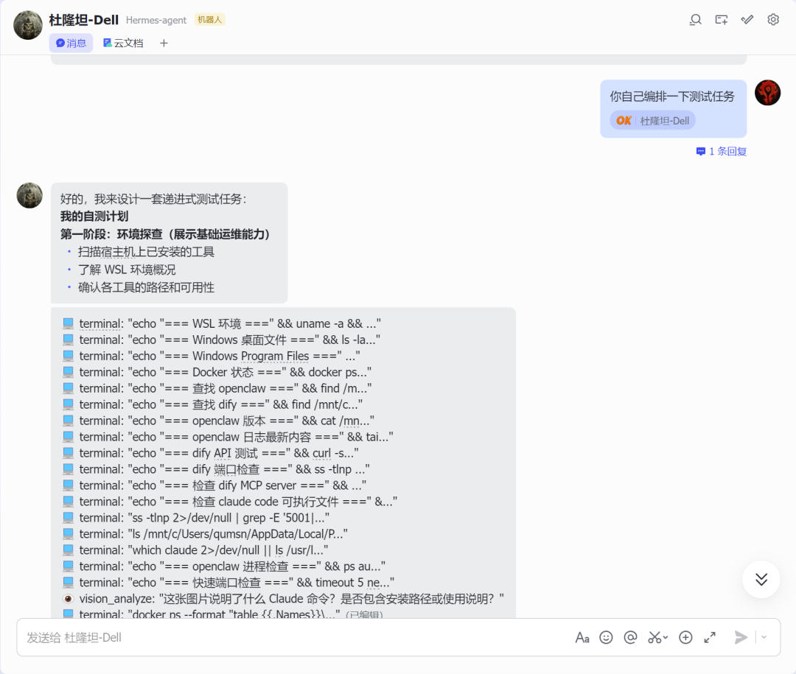

---

## 为什么在已有 OpenClaw 的情况下还要折腾 Hermes？

在阅这两个项目的官方文档后，我越来越怀疑网上有那些"卸载 OpenClaw，拥抱 Hermes"的水贴。作为同时使用两者的实践者，我保持怀疑态度。本文的目标不是"二选一"，而是"并行使用、深度对比"——用真实数据回答：Hermes 能否替代 OpenClaw？在哪些场景下可以？在哪些场景下不行？

---

## 一、部署环境---以Windows 11为例

根据Hermes官方文档（github），他天然支持macOS和Linux，不能直接运行在Windows系统中。

## 1.1 给 Windows 装个"Linux 心脏"（WSL2）

为了让更多读者读懂这篇文章，这就得先科普一下WSL2：

> "OpenClaw 可以在 Windows 上运行，Hermes 为什么非要 WSL2？"

好问题。让我从架构层面解释：

Hermes 的技术栈：

- 语言：Python 3.11+
- 依赖：大量 Linux 原生库（某些在 Windows 上编译困难）
- 设计目标：跨平台（Linux/macOS 优先，Windows 通过 WSL2 支持）

为什么不支持原生 Windows？

1. 1. 依赖兼容性 — Hermes 依赖的某些 Python 包（如语音处理、向量数据库）在 Linux 上维护最好
2. 2. 部署一致性 — 服务器环境通常是 Linux，开发环境用 WSL2 可以减少"在我机器上能跑"的问题
3. 3. 开发效率 — Nous Research 团队主要用 Linux/macOS，优先优化这些平台

WSL2 的本质：

```
┌─────────────────────────────────────┐│           Windows 11                ││  ┌───────────────────────────────┐  ││  │         WSL2 Platform         │  ││  │  ┌─────────────────────────┐  │  ││  │  │    Ubuntu 22.04 (VM)    │  │  ││  │  │  ┌───────────────────┐  │  │  ││  │  │  │   Hermes Agent    │  │  │  ││  │  │  └───────────────────┘  │  │  ││  │  └─────────────────────────┘  │  ││  └───────────────────────────────┘  │└─────────────────────────────────────┘
```

简单说：WSL2 是一个"轻量级虚拟机"，专门优化了 Windows 和 Linux 的互操作性。

### 1.2 一键安装 WSL2

步骤 1：以管理员身份打开 PowerShell

- 按 Win + X
- 选择 "Windows PowerShell（管理员）" 或 "终端（管理员）"
- 如果弹出 UAC 提示，点 "是"

步骤 2：输入安装命令

```
wsl --install
```

这行命令在干什么？

预期输出：

```
正在启用功能：Windows 子系统适用于 Linux正在启用功能：虚拟机平台正在下载：Ubuntu 24.04安装成功。请重启计算机。
```

步骤 3：重启电脑

```
shutdown /r /t 0
```

或直接手动重启。

### 1.3 第一次启动 Ubuntu（设置 Linux 环境）

重启后，会自动弹出 Ubuntu 窗口。

> ⚠️ 如果没自动弹出： 按 Win 键，搜索"Ubuntu"，点击打开。

设置用户名和密码：

```
Enter new UNIX username: quNew password: 123456Retype new password: 123456
```

> 建议： 用户名用小写英文（不能用中文、空格、特殊字符）。密码用简单的就行，这是本地环境，不是服务器。

验证安装：

```
# 检查 WSL 版本wsl --version# 检查 Linux 内核wsl uname -a# 检查 Python 版本（Hermes 需要 3.11+）python3 --version
```

预期输出：

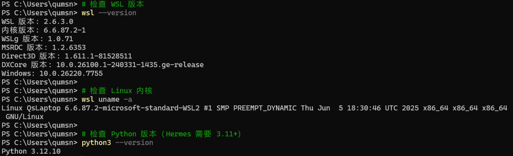

> ⚠️ 注意： 如果 Python 版本低于 3.11，后面安装 Hermes 时会自动安装新版，不用手动升级。

### 1.4 更新软件源（在wsl环境下给系统"升级"）

```
# 更新软件包列表sudo apt update# 升级已安装的软件sudo apt upgrade -y# 安装基础工具sudo apt install -y curl git python3 python3-p
```

---

## 二、安装 Hermes Agent

### 2.1 在wsl环境中运行官方安装脚本

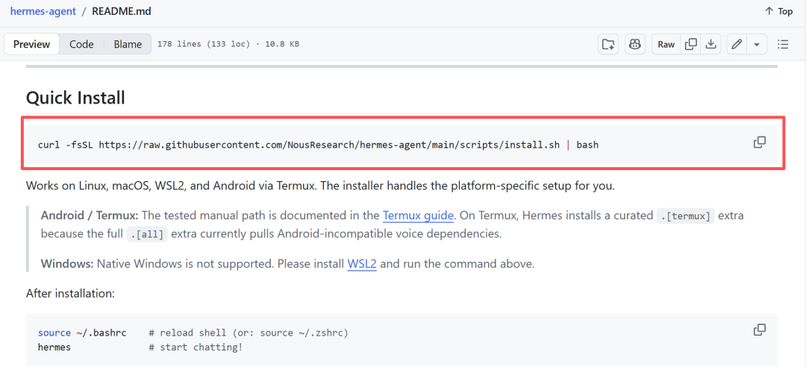

```
curl -fsSL https://raw.githubusercontent.com/NousResearch/hermes-agent/main/scripts/install.sh | bash
```

安装过程：

```
🔍 Detecting system environment...✅ System check passed📦 Installing Python dependencies...[进度条，约 3-10 分钟]✅ Installation complete🔧 Setting up configuration...✅ Configuration complete🎉 Hermes Agent installed successfully!
```

### 2.2 重新加载环境变量

安装完毕后需要在wsl中执行以下命令才能生效，或者开心新的终端。

```
source ~/.bashrc
```

> 🤔 技术解释： 安装脚本修改了 ~/.bashrc 文件，添加了 Hermes 到 PATH 环境变量。 source 命令让当前 shell 会话立即加载这些修改，不用关闭窗口重开。

### 2.3 验证安装

```
hermes --version
```

预期输出：

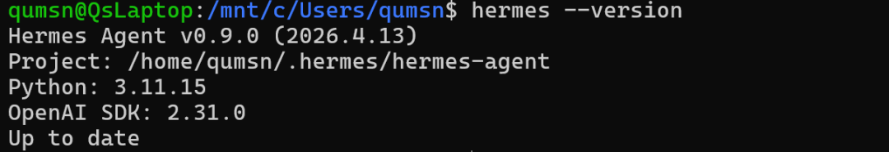

如果显示 command not found，试试：

```
# 检查 Hermes 安装位置which hermes# 如果找到路径，手动添加到 PATHexport PATH=$PATH:~/.local/binsource ~/.bashrc
```

---

## 三、配置 LLM大模型---以MiniMax为例

### 3.1 启动配置向导

```
hermes setup
```

这会进入交互式配置向导。

### 3.2 选择模型提供商

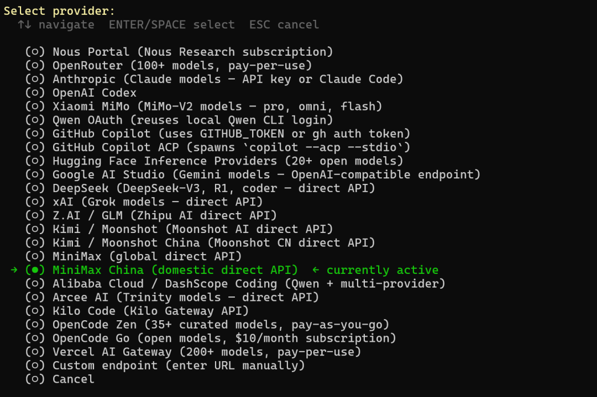

用方向键选择 MiniMax，按回车。

### 3.3 输入 MiniMax Base URL 及 API Key

根据配置向导，一步步输入相关内容即可。

### 3.4 选择默认模型

```
Current model:    MiniMax-M2.7 Active provider:  MiniMax (China)
```

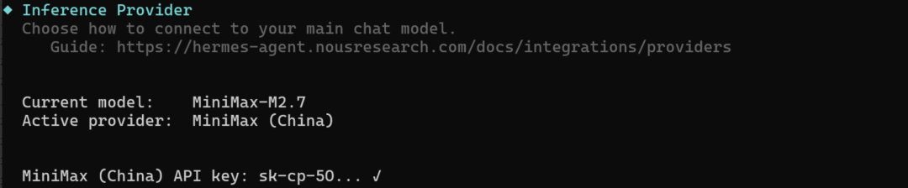

### 3.5 配置文件位置（技术细节）

配置完成后，配置文件保存在：

```
~/.hermes/config.yaml
```

查看配置：

```
cat ~/.hermes/config.yaml
```

示例内容：

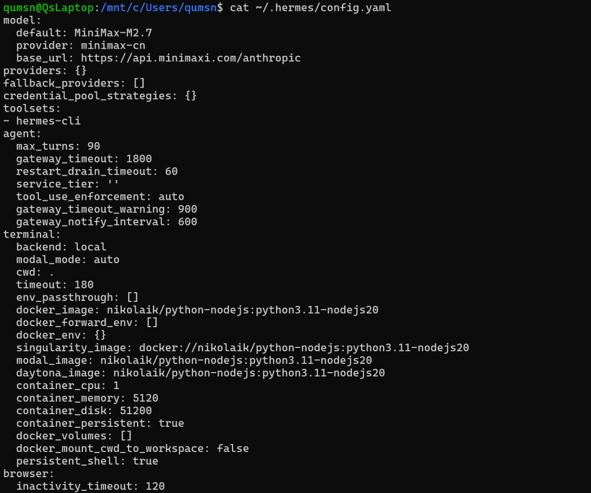

### 3.6 解读主要配置参数

Hermes config.yaml 配置参数太多，下面挑选几个核心模块的参数进行解读：

🔧 核心模型配置

model:

default: MiniMax-M2.7 # 默认使用的模型

provider: minimax-cn # 模型提供商标识

base\_url: https://api.minimaxi.com/anthropic # API endpoint 地址

🛠️ Agent 行为控制

agent:

max\_turns: 90 # 单次对话最大工具调用轮次

gateway\_timeout: 1800 # Gateway 模式超时（秒）

restart\_drain\_timeout: 60 # 重启时等待现有任务完成的时间

tool\_use\_enforcement: auto # 工具使用策略（auto/required/restricted）

gateway\_timeout\_warning: 900 # 超时警告阈值（秒）

gateway\_notify\_interval: 600 # 通知间隔（秒）

🖥️ 终端配置

terminal:

backend: local # 终端后端：local/docker/ssh/modal/singularity

modal\_mode: auto # Modal 模式：auto/quiet/eager

cwd: . # 默认工作目录

timeout: 180 # 命令执行超时（秒）

# 容器配置（docker/modal/singularity/daytona 通用）

docker\_image: nikolaik/python-nodejs:python3.11-nodejs20

container\_cpu: 1 # CPU 核心数

container\_memory: 5120 # 内存 MB

container\_disk: 51200 # 磁盘 MB

container\_persistent: true # 容器复用（保留会话）

# 环境变量传递

env\_passthrough: [] # 从宿主机透传到容器的环境变量

docker\_forward\_env: [] # 转发到容器的额外环境变量

🧠 智能路由（LLM 费用优化）

smart\_model\_routing:

enabled: false # 是否启用自动路由

max\_simple\_chars: 160 # 少于 160 字符 → 路由到便宜模型

max\_simple\_words: 28 # 少于 28 个词 → 路由到便宜模型

cheap\_model: {} # 便宜模型配置

📦 辅助服务（Auxiliary Providers）

auxiliary:

vision: # 图像理解

web\_extract: # 网页内容提取

compression: # 上下文压缩

session\_search:# 跨会话搜索

skills\_hub: # 技能市场

approval: # 审批模块

mcp: # MCP 协议

flush\_memories:# 记忆刷新

每个子项都有：provider, model, base\_url, api\_key, timeout

🧠 记忆系统

memory:

memory\_enabled: true # 启用持久记忆

user\_profile\_enabled: true # 启用用户画像

memory\_char\_limit: 2200 # 单条记忆最大字符

user\_char\_limit: 1375 # 用户信息最大字符

provider: '' # 记忆提供者（空=内置）

---

## 四、配置消息网关

### 4.1 选择消息网关

根据Hermes官方文档的介绍，支持Telegram, Discord, Slack, WhatsApp, Signal, SMS, Email, Home Assistant, Mattermost, Matrix, DingTalk, Feishu/Lark, WeCom, Weixin, BlueBubbles (iMessage), QQ等工具作为消息网关。

但只有飞书、Discord、Matrix等三个消息工具对Hermes的支持是最全面的，那我们当然首选飞书作为消息网关。

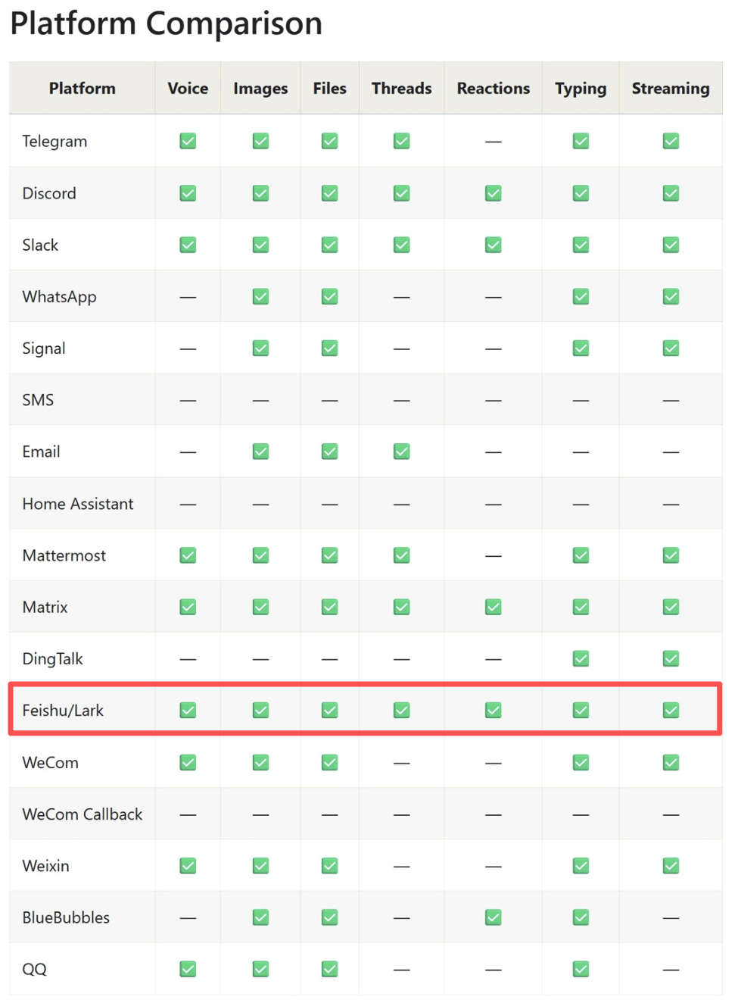

### 4.2 飞书配置

按照官方文档，应该使用“hermes gateway setup”启动配置向导

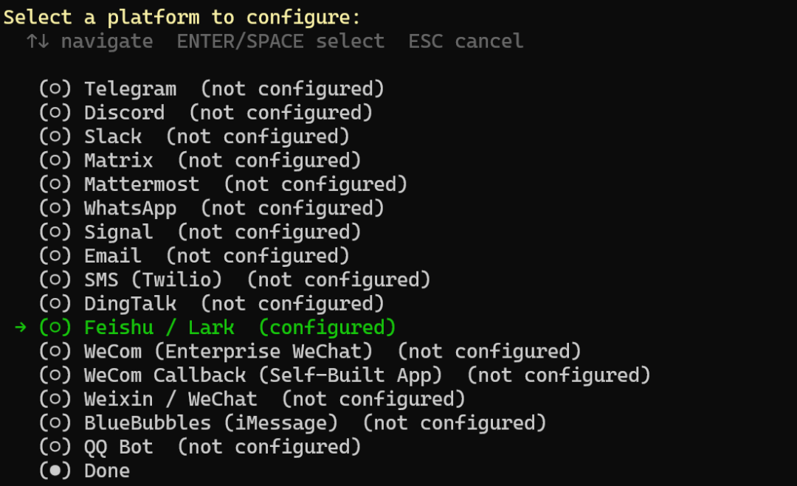

但我在这里偷了个懒，没有使用配置向导，而是让CLI帮我自动配置

```
#在powershell中启动wslwsl#在wsl中启动hermeshermes
```

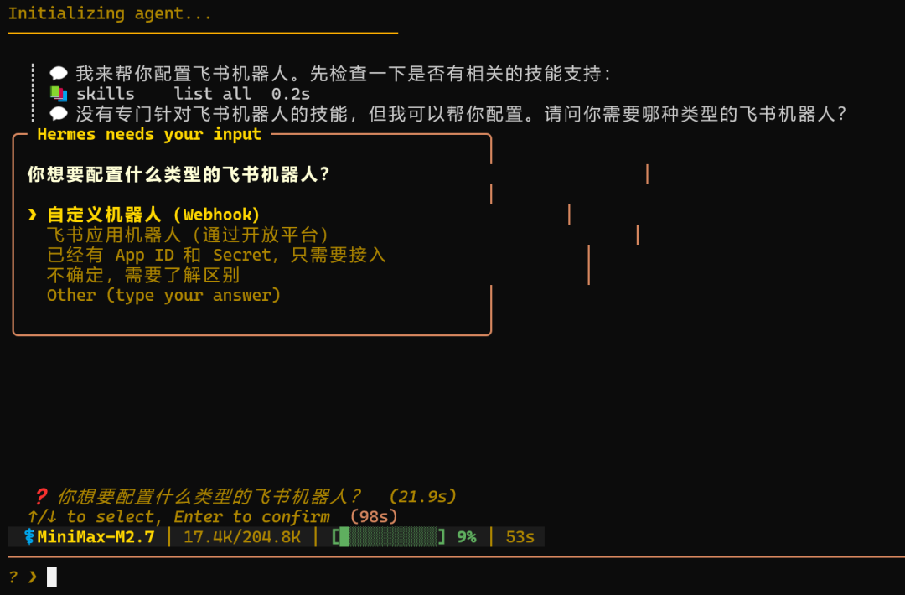

按照hermes cli提示提供飞书 app id 及 secret token

这个过程和openclaw的飞书机器人配置基本一样，此处不再赘述

### 4.3 测试飞书

飞书在hermes上的表现和openclaw基本一样，比openclaw更先进的是他在执行命令前，会要求人工审核，而不想openclaw那么奔放，这一点类似于Claude code的权限机制

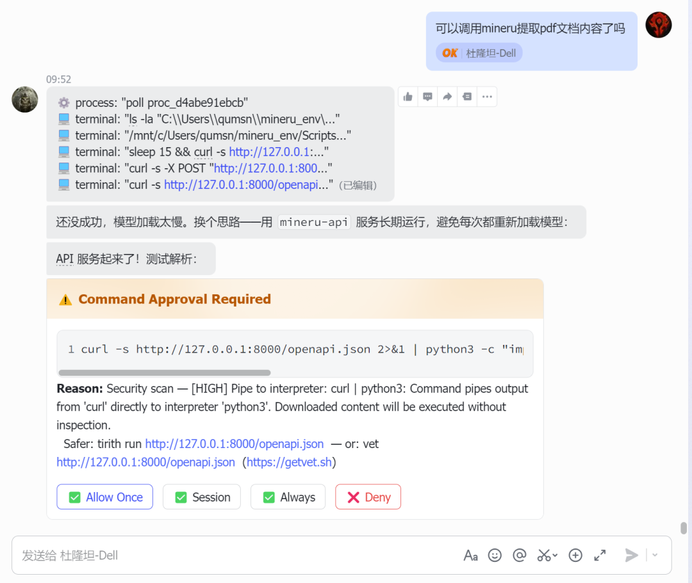

此时，hermes已经基础功能已经部署完毕，飞书消息网关也已经跑起来了。

后续文章将深入测试hermes的自动进化、skills生成等功能

欢迎继续关注
