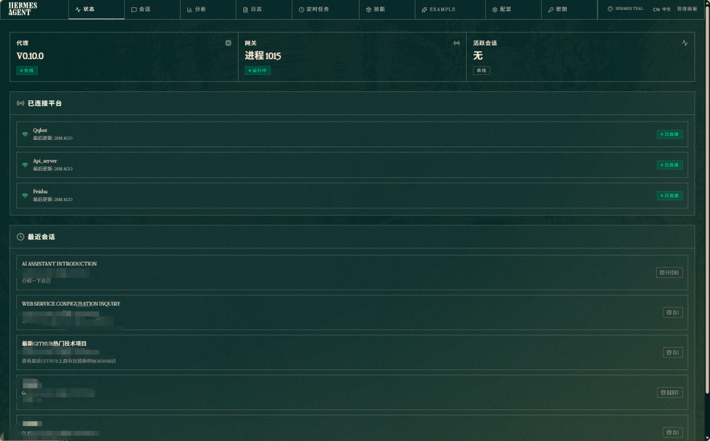
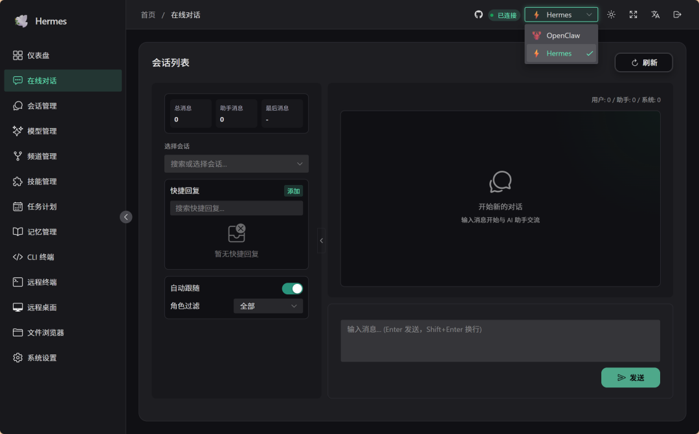
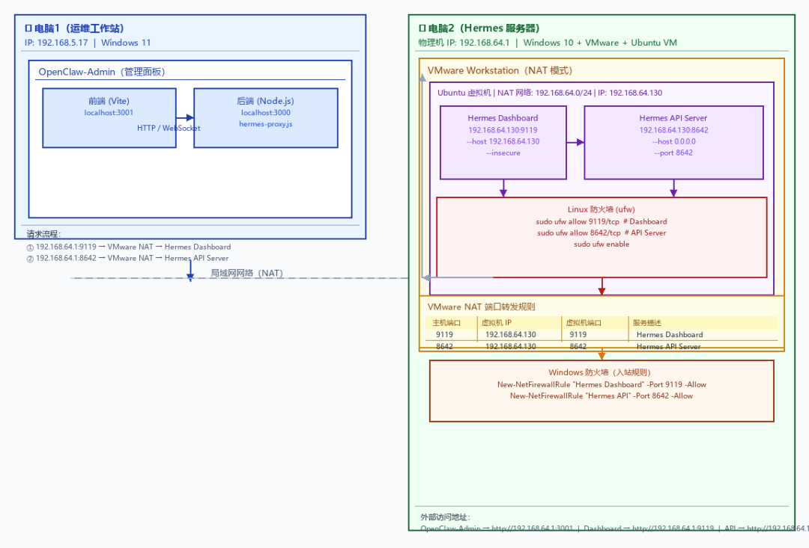

> 📎 来源: [前沿AI运维](https://mp.weixin.qq.com/s?__biz=MzY5NzI4MjU1NA==&mid=2247483684&idx=1&sn=895e29a075f942822455828c76ef0ff7&chksm=f53a02285cc43300ac92270f37f631967ca757339502a15562f559225e49a3b45bbd92f0e9d2&mpshare=1&scene=1&srcid=0423Z7LI85vRbNHutqBm2dDY&sharer_shareinfo=bd5bb203434036fde1d1247165adba25&sharer_shareinfo_first=bd5bb203434036fde1d1247165adba25) | 时间: 2026-04-23 21:43

---

> **摘要**：Hermes+OpenClaw 部署实战指南

---

## 一、Hermes vs OpenClaw：谁才是你的菜？

先说结论：**两者是互补关系，不是替代关系。**

| 对比项 | Hermes | OpenClaw |
| --- | --- | --- |
| **定位** | 🚀 Agent 执行引擎 + API 网关 | 🎛️ Agent 管理平台 |
| **核心能力** | 会话管理、OpenAI 兼容 API、插件执行 | Skills 生态、任务编排、可视化界面 |
| **部署方式** | 轻量，支持远程部署 | 必须本地 Gateway |
| **适合场景** | 远程接入、多设备管理、API 集成 | 本地调试、复杂任务、多工具协同 |
| **上手难度** | ⭐⭐ 简单 | ⭐⭐⭐ 稍复杂 |

**我的建议**：多任务用 OpenClaw，专项任务用 Hermes，想同时操控一把抓就用 OpenClaw-Admin。

---

## 二、Hermes 安装部署

### 2.1 Linux 安装（推荐，官方支持）

**一行命令安装**：

```
# Linux / macOS / WSL2curl -fsSL https://raw.githubusercontent.com/NousResearch/hermes-agent/main/scripts/install.sh | bash
```

安装完成后，重新加载 shell：

```
source ~/.bashrc  # 或 source ~/.zshrc
```

验证安装：

```
hermes --version# 输出: hermes-agent 0.10.0
```

**初始化配置**：

```
# 配置 LLM 提供商hermes model# 配置工具hermes tools# 完整设置向导hermes setup
```

### 2.2 Windows 安装（非官方支持，需要绕坑）

> ⚠️ 官方明确说明：Native Windows is not supported，需要用 WSL2。

**WSL2 方式（推荐）**：

```
# 1. 安装 WSL2wsl --install# 2. 进入 WSL2 Ubuntuwsl# 3. 执行安装脚本curl -fsSL https://raw.githubusercontent.com/NousResearch/hermes-agent/main/scripts/install.sh | bash
```

**原生 Windows 方式（有坑，不推荐）**：

如果一定要在 Windows 原生环境运行，可以手动安装：

```
# 1. 安装 uvpip install uv# 2. 克隆仓库git clone https://github.com/nousresearch/hermes-agent.git# 3. 安装依赖cd hermes-agentuv sync# 4. 验证.venv\Scripts\python.exe -m hermes_cli --version
```

**Windows 已知问题**：

- ● Dashboard build 会 SIGKILL
- ● 需要手动构建 Web UI
- ● 建议用 WSL2 或直接在 Linux 虚拟机部署

---

## 三、API Server 与 Web UI 配置

### 3.1 核心配置文件

Hermes 的配置文件位于 

```
~/.hermes/.env
```

，以下是关键配置项：

```
# === API Server 配置 ===API_SERVER_ENABLED=true          # 启用 API ServerAPI_SERVER_PORT=8642             # API 端口（默认 8642）API_SERVER_HOST=192.168.64.130   # 绑定 IP（支持远程访问）API_SERVER_KEY=hermes20260422    # API Key（用于认证）# === Gateway 配置 ===GATEWAY_ALLOW_ALL_USERS=true     # 允许所有用户访问
```

### 3.2 启动命令

**Web UI（Dashboard）**：

```
# 基础启动（只能本机访问 localhost:9119）hermes dashboard# ✅ 正确方式 - 绑定到指定 IP，支持局域网远程访问hermes dashboard --host 192.168.64.130 --insecure# 输出：# → Building web UI...# ✓ Web UI built# Hermes Web UI → http://192.168.64.130:9119
```

**API Server**：

```
# 启动 API Server（OpenAI 兼容接口）hermes api-server --host 0.0.0.0 --port 8642
```

**Gateway（集成 API Server）**：

```
hermes gateway start
```

### 3.3 常用命令汇总

| 命令 | 用途 |
| --- | --- |
| ``` hermes dashboard --host  --insecure ``` | 启动 Web UI，绑定指定 IP |
| ``` hermes api-server --host 0.0.0.0 --port 8642 ``` | 启动 API Server |
| ``` hermes gateway start ``` | 启动 Gateway（含 API Server） |
| ``` hermes model ``` | 配置 LLM 提供商 |
| ``` hermes tools ``` | 配置启用哪些工具 |
| ``` hermes doctor ``` | 诊断检查 |
| ``` hermes config check ``` | 检查配置状态 |

### 3.4 API 端点说明

启动 API Server 后，可用的端点：

| 端点 | 方法 | 用途 |
| --- | --- | --- |
| ``` /v1/health ``` | GET | 健康检查 |
| ``` /v1/chat/completions ``` | POST | 对话接口（OpenAI 兼容） |
| ``` /v1/models ``` | GET | 模型列表 |
| ``` /api/sessions ``` | GET | 会话列表 |
| ``` /api/config ``` | GET | 配置信息 |
| ``` /api/skills ``` | GET | 技能列表 |

---

## 四、一把抓：OpenClaw-Admin 同时管理两者

### 什么是 OpenClaw-Admin？

一个可视化面板，可以同时管理 OpenClaw 的 Gateway 和 Hermes Agent，界面清爽，配置简单。

**GitHub 地址**：https://github.com/itq5/OpenClaw-Admin

为什么要用Openclaw-Admin，hermes是主打CLI命令行工具，自身的WEB UI 操作操作不友好。



如果需要远程Web访问需要第三方的Web UI进行连接,这里介绍一个既可以连接openclaw又可以连接连接hermes的一个github的项目，openclaw-admin。



### 安装步骤

```
# 1. 克隆项目git clone https://github.com/itq5/OpenClaw-Admin.git# 2. 进入目录cd OpenClaw-Admin# 3. 安装依赖npm install# 4. 配置（复制配置文件）cp .env.example .env# 5. 启动npm run dev:all
```

访问 http://localhost:3001，用 

```
admin
```

 / 

```
admin123
```

 登录。

### 配置 Hermes 连接

编辑 

```
.env
```

 文件：

```
# === OpenClaw Gateway ===OPENCLAW_WS_URL=ws://127.0.0.1:28789OPENCLAW_AUTH_TOKEN=your_token_here# === Hermes Agent ===HERMES_WEB_URL=http://192.168.64.130:9119HERMES_API_URL=http://192.168.64.130:8642HERMES_API_KEY=hermes20260422# === 基础配置 ===PORT=3000DEV_PORT=3001AUTH_USERNAME=adminAUTH_PASSWORD=admin123
```

---

## 五、🌡️ 实战：虚拟机安装 Hermes，另一台电脑的 OpenClaw-Admin 连接

### 5.1 网络架构图



### 5.2 实战环境

| 角色 | IP | 操作系统 |
| --- | --- | --- |
| 电脑1（运维工作站） | 192.168.5.17 | Windows 11 |
| 电脑2（Hermes 服务器） | 物理机 192.168.64.1，虚拟机 192.168.64.130 | Windows 10 + VMware + Ubuntu |

### 5.3 Step 1：在虚拟机上安装 Hermes

```
# 一行命令安装curl -fsSL https://raw.githubusercontent.com/NousResearch/hermes-agent/main/scripts/install.sh | bash# 重新加载 shellsource ~/.bashrc# 配置 LLM 提供商hermes model# 验证安装hermes --version
```

### 5.4 Step 2：配置 API Server

编辑 

```
~/.hermes/.env
```

：

```
# === API Server 配置 ===API_SERVER_ENABLED=trueAPI_SERVER_PORT=8642API_SERVER_HOST=192.168.64.130API_SERVER_KEY=hermes20260422# === Gateway 配置 ===GATEWAY_ALLOW_ALL_USERS=true
```

### 5.5 Step 3：启动 Hermes

```
# 启动 Dashboard（绑定到虚拟机 IP）hermes dashboard --host 192.168.64.130 --insecure# 新终端：启动 API Serverhermes api-server --host 0.0.0.0 --port 8642
```

### 5.6 Step 4：配置 Linux 防火墙（ufw）

在虚拟机 Ubuntu 上开放端口：

```
# 查看防火墙状态sudo ufw status# 开放 Hermes 端口sudo ufw allow 9119/tcp comment 'Hermes Dashboard'sudo ufw allow 8642/tcp comment 'Hermes API Server'# 启用防火墙sudo ufw enable# 验证规则sudo ufw status numbered
```

输出示例：

```
Status: active     To                         Action      From     --                         ------      ----[ 1] 22/tcp                     ALLOW IN    Anywhere[ 2] 9119/tcp                   ALLOW IN    Anywhere                   # Hermes Dashboard[ 3] 8642/tcp                   ALLOW IN    Anywhere                   # Hermes API Server
```

### 5.7 Step 5：配置 VMware 端口转发

**打开 VMware 端口转发设置**：

1. 打开 VMware Workstation
2. 点击 **编辑** → **虚拟网络编辑器**
3. 选择 **VMnet8 (NAT 模式)**
4. 点击 **NAT 设置**
5. 在 **端口转发** 中添加规则：

| 主机端口 | 虚拟机 IP | 虚拟机端口 | 描述 |
| --- | --- | --- | --- |
| 9119 | 192.168.64.130 | 9119 | Hermes Dashboard |
| 8642 | 192.168.64.130 | 8642 | Hermes API Server |

**配置示意图**：

```
┌────────────────────────────────────────────────────────┐│ VMware 虚拟网络编辑器 - NAT 设置                         ││                                                        ││  端口转发:                                              ││  ┌────────────────────────────────────────────────────┐││  │ 主机端口  │ 类型 │ 虚拟机 IP        │ 虚拟机端口    │││  ├────────────────────────────────────────────────────┤││  │ 9119     │ TCP  │ 192.168.64.130   │ 9119         │││  │ 8642     │ TCP  │ 192.168.64.130   │ 8642         │││  └────────────────────────────────────────────────────┘││                                                        ││  [添加][删除][确定][取消]                          │└────────────────────────────────────────────────────────┘
```

### 5.8 Step 6：配置 Windows 防火墙

在电脑2（宿主机）上开放端口：

**方式一：PowerShell（管理员）**：

```
# 开放 9119 端口（Hermes Dashboard）New-NetFirewallRule-DisplayName"Hermes Dashboard" `    -Direction Inbound -Protocol TCP -LocalPort9119-Action Allow# 开放 8642 端口（Hermes API Server）New-NetFirewallRule-DisplayName"Hermes API Server" `    -Direction Inbound -Protocol TCP -LocalPort8642-Action Allow# 验证规则Get-NetFirewallRule-DisplayName"Hermes*"
```

**方式二：图形界面**：

1. 打开 **控制面板** → **Windows Defender 防火墙**
2. 点击 **高级设置**
3. 选择 **入站规则** → **新建规则**
4. 选择 **端口** → **TCP** → 输入 

   ```
   9119, 8642
   ```
5. 选择 **允许连接**
6. 应用到所有配置文件
7. 命名规则为 "Hermes Agent"

### 5.9 Step 7：验证网络连通性

在电脑1上测试：

```
# 测试 Dashboard 连接Test-NetConnection-ComputerName192.168.64.1-Port9119# 测试 API Server 连接Test-NetConnection-ComputerName192.168.64.1-Port8642# 测试 API 健康检查Invoke-RestMethod-Uri"http://192.168.64.1:8642/v1/health"
```

### 5.10 Step 8：配置 OpenClaw-Admin

在电脑1上，编辑 OpenClaw-Admin 的 

```
.env
```

：

```
# === Hermes Agent ===HERMES_WEB_URL=http://192.168.64.1:9119HERMES_API_URL=http://192.168.64.1:8642HERMES_API_KEY=hermes20260422
```

然后启动 OpenClaw-Admin：

```
cd C:\Users\Administrator\AppData\LocalLow\OpenClaw-Adminnpm run dev:all
```

---

## 六、踩坑实录（今天的真实问题）

### 坑 1：Dashboard 启动后直接 SIGKILL

```
Process running, then: SIGKILL
```

**原因**：Windows 原生环境不兼容，Dashboard build 会崩溃。

**解决**：加 

```
--host
```

 参数，手动绑定 IP：

```
hermes dashboard --host 192.168.64.130 --insecure
```

### 坑 2：OpenClaw-Admin 报 ECONNREFUSED

```
[backend] ECONNREFUSED localhost:3000
```

**原因**：只启动了前端，没启动后端。

**解决**：必须用 

```
npm run dev:all
```

 同时启动前后端。

### 坑 3：API 返回 401 Unauthorized

```
[backend] 401 Response body: {"detail":"Unauthorized"}
```

**原因**：API Key 认证机制与预期不同。

**解决**：从 Hermes Web UI 获取 Session Token，或检查 

```
API_SERVER_KEY
```

 配置。

### 坑 4：虚拟机能访问，宿主机访问不到

**原因**：VMware NAT 没配置端口转发，或防火墙拦截。

**解决**：

1. VMware 虚拟网络编辑器 → NAT 设置 → 添加端口转发
2. Linux 虚拟机开放防火墙：

   ```
   sudo ufw allow 9119/tcp
   ```
3. Windows 宿主机开放防火墙：

   ```
   New-NetFirewallRule ...
   ```

---

## 七、🤔 Hermes 能帮运维做什么？

说了这么多，Hermes 到底能干嘛？结合最近的实操经验，想象几个场景：

**1. 远程告警处理**

值班时不在电脑前？用手机通过 API Server 发消息，Hermes 自动分析日志、查监控，推送结论到钉钉/飞书。

**2. 批量设备巡检**

一个命令下发到多台服务器的 Hermes Agent，并行执行脚本，汇总结果，自动生成巡检报告。

**3. 知识库问答**

把运维文档、SOP 内嵌到 Hermes，构建本地知识库。半夜故障时问 AI，比翻文档快。

**4. 自动化流水线**

结合 OpenClaw 的 Skills 生态，Hermes 作为执行器，OpenClaw 作为编排器，实现"监控→分析→处理→报告"全自动闭环。

---

## 后续预告

下一期我们会讲：

- ● 🔧 如何给 Hermes 接入更多工具（监控、日志、工单系统）
- ● 🤖 Hermes + OpenClaw 双 Agent 协作实战
- ● 📊 如何让 Hermes 自动生成运维日报

**关注「前沿AI运维」，第一时间接收更新。**
