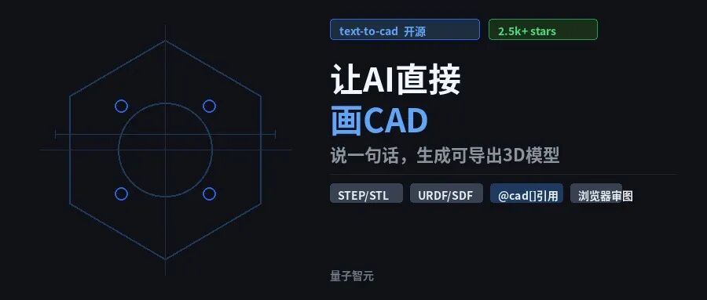
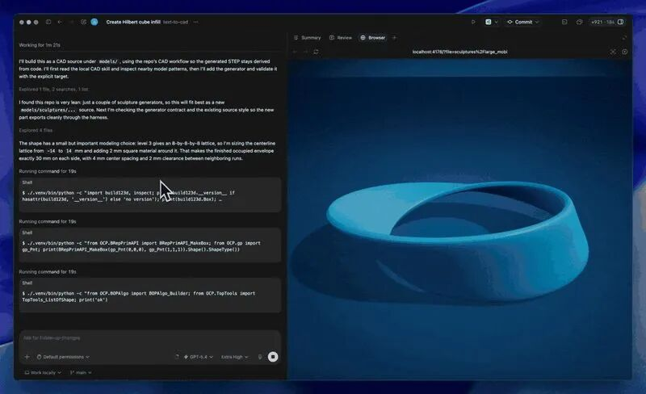
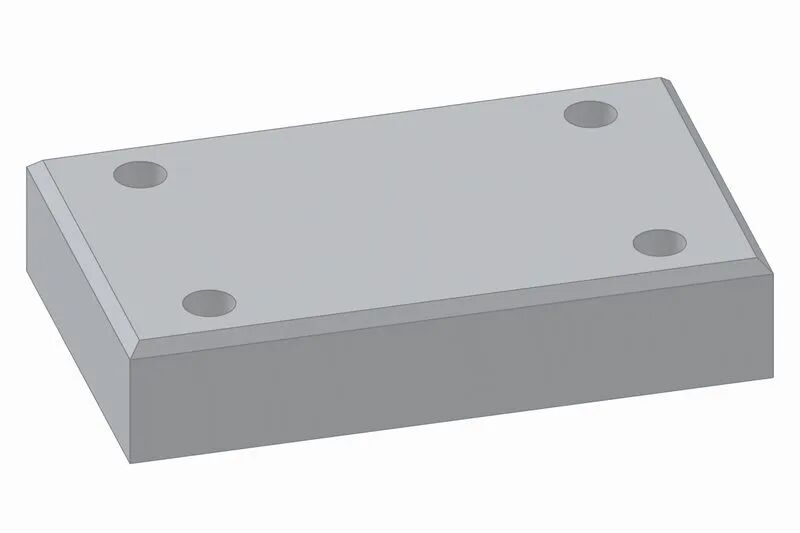
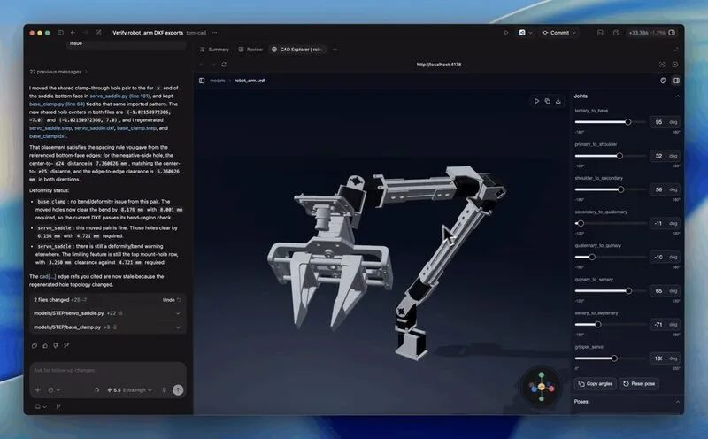

> 📎 来源: [量子智元](https://mp.weixin.qq.com/s?__biz=MzkwMTc4NTkwNg==&mid=2247489112&idx=4&sn=e09215507f3cbfeb2277966c387635ad&chksm=c174dd46836d80a9bee5db6c61292fe7276e1818b2ef4d46c7d8c2c791e2fad69e0fa9acd8b3&mpshare=1&scene=1&srcid=0517LzkdKdfjPpIrKjf97hQA&sharer_shareinfo=b4790b0a8386666b7caf990dedfdda10&sharer_shareinfo_first=b4790b0a8386666b7caf990dedfdda10) | 时间: 2026-05-17 16:26

---

上个月我遇到一个挺尴尬的事。同事指着屏幕上一张零件截图问我："这个法兰盘，外径多少，孔位怎么分布的？"我张嘴比划了半天，最后打开SolidWorks重新画了一遍给他看。明明脑子里是完整的三维造型，传到另一个人那里就变成了一堆说不清的数字和手势。

设计协作的痛点从来不是"画不出来"，而是"讲不明白"。直到我试了 text-to-cad 这个项目——准确说，是它背后的那套逻辑，让我突然意识到一件事：我们可能一直搞错了方向。AI辅助设计的终点不是"帮人画得更快"，而是让机器能像读代码一样读懂几何。

## AI不是在"画"，是在"写"几何

大多数人对AI做CAD的想象是这样的：你描述一个零件，AI像Midjourney一样"生成"一张图出来。但 text-to-cad 不是这么做的。它的底层是 build123d 这个Python库加上OpenCASCADE几何内核。你给AI一句"生成一个100x60x20mm的矩形块，四角打M6通孔，顶部边缘倒角2mm"——AI不是在脑海里渲染一幅画面，而是在背后写了一串Python代码。

换句话说，AI生成的是一份用代码写成的设计文档，不是一张图片。这份代码可以被执行、被调试、被局部修改、被复用。这和传统CAD里"画个矩形→拉伸→打孔→倒角"的操作流有本质区别：前者把设计意图翻译成了结构化的程序，后者只留下了不可回溯的操作历史。

装起来极简单，一条命令就行：

|  |
| --- |
| npx agent-skills-cli add earthtojake/text-to-cad |

装完之后，不管是Codex、Claude Code、Gemini CLI还是OpenClaw和Hermes，都能直接用它当"CAD助手"。项目在GitHub上一天涨了2500多个星（earthtojake/text-to-cad），文档和demo在 www.cadskills.xyz，我建议你先去看一眼那个demo动画，往下读之前会有体感。

text-to-cad demo：从一句话描述到可浏览3D模型全流程

## @cad[] 是这个项目最聪明的设计

用过AI生成代码的都有这个体验：第一次生成的代码能用，但你要改一个小功能，得把整个上下文重说一遍，AI重新写一堆代码，中间可能跑偏三次。Text-to-CAD 之前的AI设计工具也面临同样的问题——你说"左边那个孔往右移5mm"，AI不知道"左边那个孔"是哪个孔，只好把整个零件重新生成一遍。

@cad[] 引用机制解决的正是这个问题。AI在生成几何体的时候，会给每个零件、特征或者组件分配一个引用句柄。比如你让AI生成了一个法兰盘，AI会在代码里自动把它标记成 @cad[flange]。下次你只需要说："把 @cad[flange] 的厚度改成5mm，上面四个孔的直径改成8mm"。AI直接定位到那段几何代码，做精准的局部编辑，不用推翻重来。

这听着像一个小功能，但它解决了一个根本矛盾：语言是模糊的，几何是精确的。"左边那个孔"这种自然语言表达，在传统设计流程里只能靠人来猜。而 @cad[] 本质上是在自然语言和三维几何之间搭了一座双向桥——你说"flange"，AI知道你指的是代码里那个BoundaryBox(100, 100, 20)经过一系列布尔运算之后的结果。这不是关键词匹配，这是句柄绑定。

对协作场景来说，这个设计的价值更明显。你可以把一个带有 @cad[] 引用的设计丢给团队里的其他人，对方不需要打开CAD文件、不需要翻操作历史，直接说"@cad[bracket] 转90度"，AI就改了。设计变更变成了一条可追溯的对话记录，而不是混乱的版本号之争。

## 从单个零件到整台机器人，甚至直接发工厂

这个项目还内置了一个叫CAD Explorer的东西，直接在浏览器里查看模型，不需要装SolidWorks或者Fusion 360。导出格式涵盖了几乎所有常用场景：STEP/STP给传统CAD用，STL/3MF给3D打印，DXF给激光切割。但真正让我觉得"有点东西"的是它对机器人领域的支持。

text-to-cad 能直接导出URDF、SDF和SRDF文件——这些是机器人仿真和控制的行业标准格式。意味着你从一句话描述的"四足机器人腿部结构"，到能在Gazebo或者MuJoCo里仿真运行的模型，中间只隔了一次AI代码生成。项目benchmark里有10个样例，从最简单的矩形块到行星齿轮组、螺旋楼梯、离心叶轮，每个都附带了完整的AI生成代码。我照着跑了一遍行星齿轮组的demo，从描述到可导出的STEP文件，不到两分钟。

Benchmark #1：矩形校准块（100×60×20mm，四角打孔，顶部倒角）

还有一个细节值得提：SendCutSend预检。AI生成的零件在导出之前，系统自动检查材料厚度、最小特征尺寸、倒角半径这些加工可行性参数，直接对接在线制造商。你设计完、AI预检通过、点一下提交，就到生产线上了。设计到制造的链路，短得有点不真实。

URDF skill demo：机器人结构描述文件直接在浏览器中可视化预览

我试过在Claude Code里用text-to-cad，从描述"一个带四根支撑柱的离心叶轮，底部有安装法兰"到生成可导出的模型，一共花了大概90秒。浏览器里打开CAD Explorer转了一圈，确认外形没问题，直接导出STEP发给同事。整个过程没有打开过一次传统CAD软件。

当然，目前它还没法替代工业级的复杂曲面设计和装配体管理。但方向对了：当AI把"设计"这件事从视觉操作变成代码操作之后，设计就不再是"一个人对着屏幕点鼠标"的手艺活，而变成了一种可以通过对话、通过引用、通过版本管理来协作的工程活动。几何变成了可读、可写、可引用的"一等公民"。

我猜下一步的逻辑延伸是：当所有的几何模型都是代码，当每个特征都有@cad句柄——那么一个设计团队就不再需要"发文件、等反馈、改完再发"这个循环了。配置即设计，对话即变更。设计自动化的终点不是AI替人画图，而是人用语言直接操作三维几何。你描述，AI写代码，代码即模型。

回到开头那个尴尬的场景。如果我的同事当时有一个text-to-cad环境，他根本不需要问我"法兰盘数据是什么"——他只需要说一句："把 @cad[flange] 的模型发给我。"

问题是，如果你是那个设计法兰盘的人，你会在创建第一个几何体的时候主动给它一个@cad句柄吗？或者说，你觉得设计协作里"最想引用但引用不到"的东西是什么？欢迎留言聊聊。

⭐点赞、转发、关注和推荐一键三连⭐
