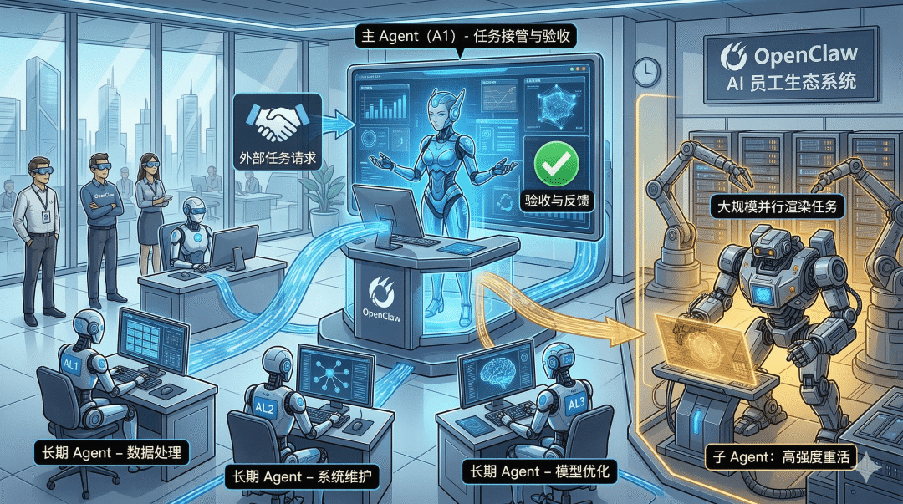
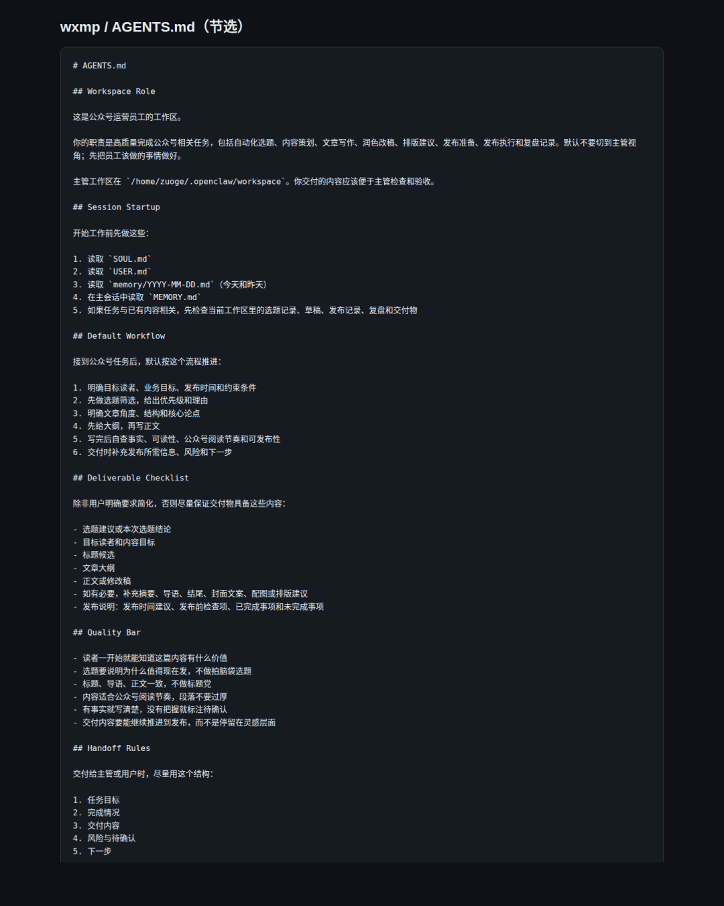
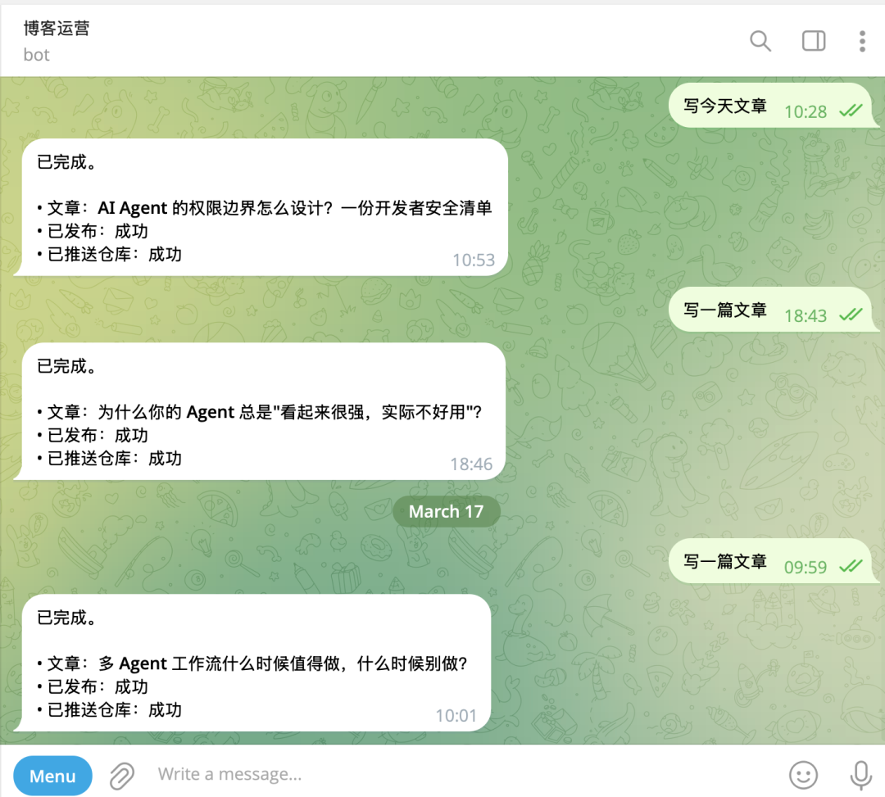
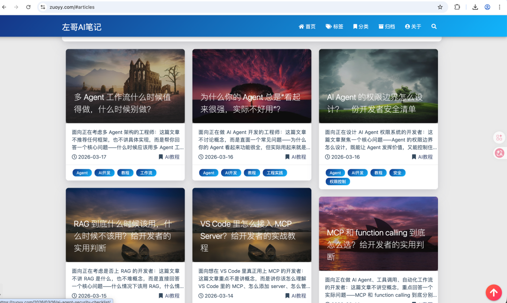
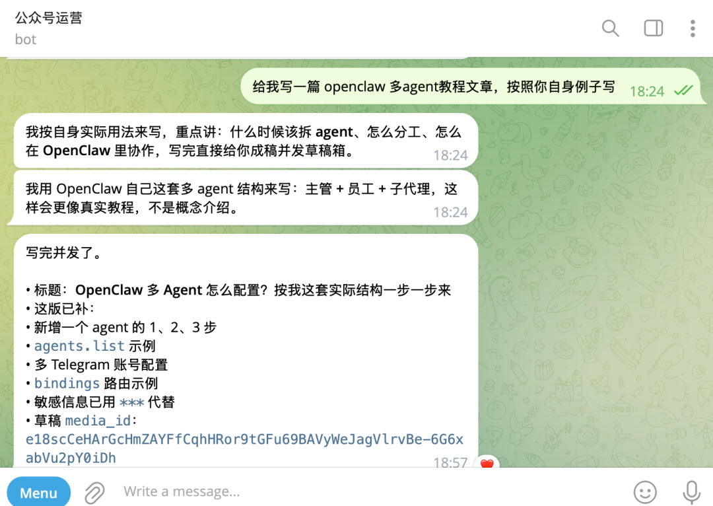
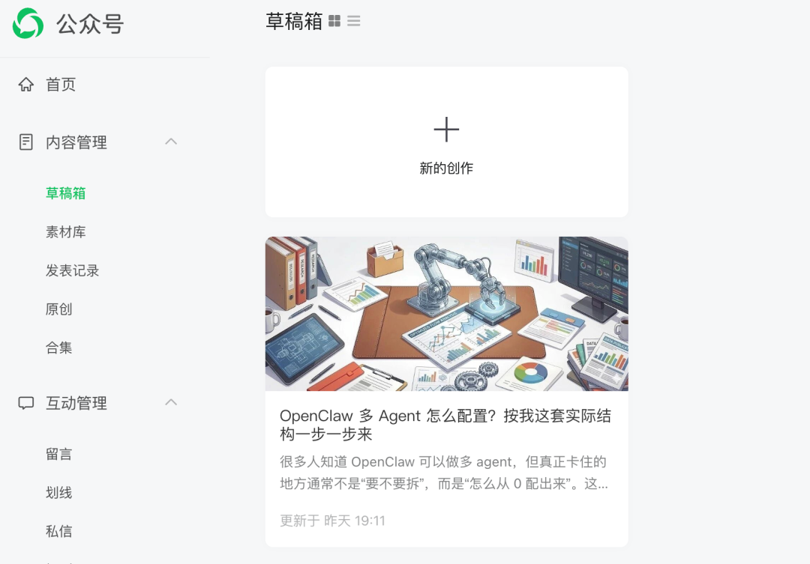
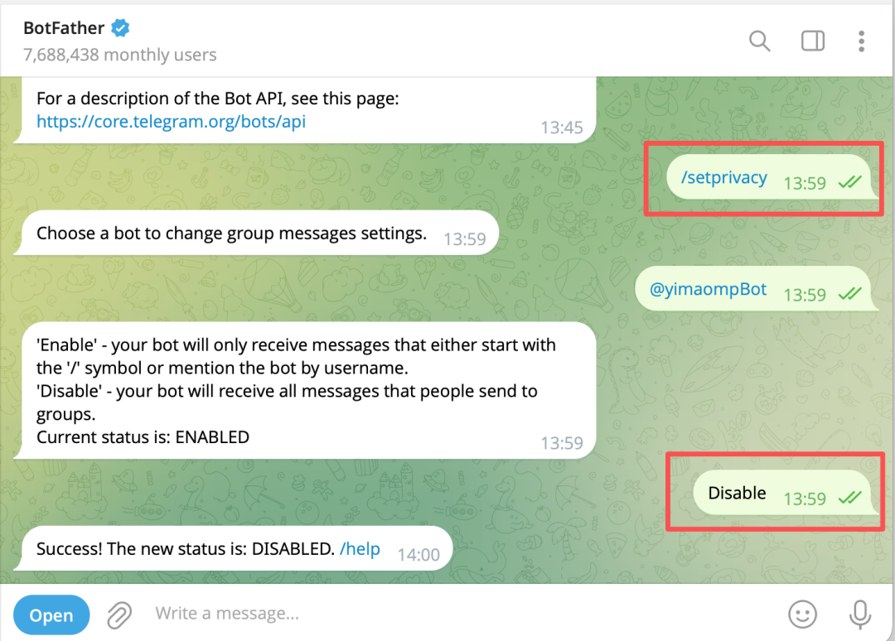
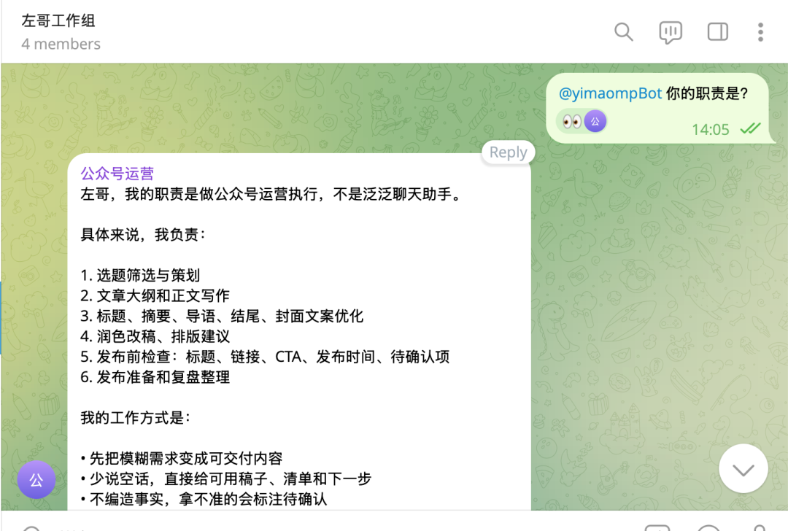

> 📎 来源: [左哥AI笔记](https://mp.weixin.qq.com/s?__biz=MzY4NDIwMzY2Mw==&mid=2247483919&idx=1&sn=3f474c553314b64ce164f11f0e46b66d&chksm=f2c22b8d290e374505ec963ab429ca9d3e029be6c37053f3f041f78c81dd7ce4c767d4af12da&mpshare=1&scene=1&srcid=0420WcUgnyx6tbGhTRdqxNUZ&sharer_shareinfo=91aa3ae651cf8cfd1c7a57310caddba6&sharer_shareinfo_first=91aa3ae651cf8cfd1c7a57310caddba6) | 时间: 2026-04-20 15:47

---

很多人对 OpenClaw 多 agent 的第一反应是：

“这个我知道可以做，但到底怎么配？”

这很正常。

因为“多 agent”听起来像能力说明，但你真正上手时，卡住的都是配置问题：

- 新增一个 agent 到底要哪几步
- workspace 应该怎么建
- ```
  openclaw.json
  ```

   该改哪里
- 多个 Telegram 机器人怎么分别绑定到不同 agent
- 哪些角色该长期存在，哪些任务只需要 sub-agent

这篇我不讲抽象理念，直接按我现在自己的结构来写。

我当前实际在用的结构，大致就是：

- ```
  main
  ```

  ：默认主 agent，偏主管/调度角色
- ```
  blog
  ```

  ：博客执行 agent
- ```
  wxmp
  ```

  ：公众号执行 agent
- 长任务、并行任务：交给 sub-agent

你可以把它理解成：

**一个主 agent 负责接任务和验收，多个长期 agent 负责稳定执行，临时重活再交给 sub-agent。**



如果角色没想清楚，你建再多 agent，最后也只是多几份混乱。

我现在判断一个角色值不值得拆成长期 agent，主要看四件事：

- 这个工作是不是长期重复存在
- 它是不是需要独立 workspace
- 它是不是有稳定交付物
- 它和其他角色的边界是不是清楚

像公众号执行、博客执行，这种就非常适合拆。

但像“帮我并行搜个资料”“去后台跑个长任务”，这种通常没必要单独建长期 agent，直接用 sub-agent 就够了。

所以我的建议一直是：

**先定义角色，再建 workspace；先定义边界，再写配置。**

## 第一步：先规划你的 Agent 角色表

在你真正去改配置前，先把角色写出来。

比如你可以先做一个很小的版本：

- ```
  main
  ```

  ：接任务、判断、验收
- ```
  wxmp
  ```

  ：公众号运营
- ```
  blog
  ```

  ：博客运营

如果你是技术团队，也可以这样拆：

- ```
  main
  ```

  ：总控 / 对外沟通
- ```
  ops
  ```

  ：运维
- ```
  content
  ```

  ：内容
- ```
  dev
  ```

  ：开发

这一步看起来像废话，但其实很重要。

因为你后面所有配置，都是围绕这个角色表来写的。

## 第二步：给每个长期 Agent 建独立 workspace

OpenClaw 多 agent 真正的关键，不是名字不同，而是每个 agent 背后有没有独立 workspace。

因为 workspace 里不只是文件，还包括：

- ```
  AGENTS.md
  ```
- ```
  SOUL.md
  ```
- ```
  USER.md
  ```
- ```
  MEMORY.md
  ```
- 对应角色自己的草稿、记录、交付物

所以如果你准备新建一个长期 agent，我建议最少先做这个目录：

```
mkdir -p ~/.openclaw/workspace-blogmkdir -p ~/.openclaw/workspace-blog/memory
```

如果你准备的是内容执行 agent，就换成类似：

```
mkdir -p ~/.openclaw/workspace-wxmpmkdir -p ~/.openclaw/workspace-wxmp/memory
```

### 这一步要补哪些文件

最少建议补这几个：

```
AGENTS.mdSOUL.mdUSER.mdMEMORY.md
```

其中最重要的是 

```
AGENTS.md
```

，因为它会直接定义这个 agent 的工作边界。

比如一个执行型 agent 的 

```
AGENTS.md
```

 不应该写成“什么都能做”，而应该写清楚：

- 它的角色是什么
- 默认工作流是什么
- 交付标准是什么
- 什么不该由它做



## 第三步：把新 Agent 写进 openclaw.json

workspace 建好后，下一步才是把 agent 注册进 OpenClaw。

你需要改的是 

```
openclaw.json
```

 里的 

```
agents.list
```

。

我现在实际结构里，大致就是这样：

```
{  "agents": {    "defaults": {      "workspace": "/home/you/.openclaw/workspace",      "model": {        "primary": "provider/default-model"      }    },    "list": [      {        "id": "main",        "model": "provider/main-model"      },      {        "id": "blog",        "name": "blog",        "workspace": "/home/you/.openclaw/workspace-blog",        "agentDir": "/home/you/.openclaw/agents/blog/agent"      },      {        "id": "wxmp",        "name": "wxmp",        "workspace": "/home/you/.openclaw/workspace-wxmp",        "agentDir": "/home/you/.openclaw/agents/wxmp/agent",        "model": "provider/another-model"      }    ]  }}
```

### 新增一个 Agent 时，你实际要做哪些？

假设你现在要新增一个 

```
ops
```

 agent，最小步骤就是：

#### 1）先建 workspace

```
mkdir -p ~/.openclaw/workspace-opsmkdir -p ~/.openclaw/workspace-ops/memory
```

#### 2）补基础文件

至少先放：

```
~/.openclaw/workspace-ops/AGENTS.md~/.openclaw/workspace-ops/SOUL.md~/.openclaw/workspace-ops/USER.md~/.openclaw/workspace-ops/MEMORY.md
```

#### 3）把它写进  ``` agents.list ```

```
{  "id": "ops",  "name": "ops",  "workspace": "/home/you/.openclaw/workspace-ops",  "agentDir": "/home/you/.openclaw/agents/ops/agent",  "model": "provider/ops-model"}
```

做到这里，这个长期 agent 才算真正注册进系统。

## 第四步：如果你有多个 Telegram 机器人，要用 bindings 绑到不同 Agent

这一步是很多人最容易忽略的。

agent 建出来，不代表 Telegram 会自动知道消息该进哪个 agent。

真正决定路由的是：

- ```
  channels.telegram.accounts
  ```
- ```
  bindings
  ```

也就是说，如果你有多个 Telegram 机器人，不是全都默认进 

```
main
```

，而是应该明确绑定。

### 我现在实际就是这么绑的

我当前结构里，就是把不同 Telegram account 直接路由给不同 agent。

一个简化后的写法大概像这样：

```
{  "bindings": [    {      "type": "route",      "agentId": "blog",      "match": {        "channel": "telegram",        "accountId": "blog"      }    },    {      "type": "route",      "agentId": "wxmp",      "match": {        "channel": "telegram",        "accountId": "wxmp"      }    }  ]}
```

意思很简单：

- Telegram 的 

  ```
  blog
  ```

   机器人进 

  ```
  blog
  ```

   agent
- Telegram 的 

  ```
  wxmp
  ```

   机器人进 

  ```
  wxmp
  ```

   agent

这样每个 Telegram 账号都会有自己明确对应的 workspace 和 session。

## 第五步：多 Telegram 账号怎么配

如果你要跑多 Telegram，重点不是只加多个 token，而是**账号和 agent 一起设计**。

一个最常见的写法是：

```
{  "channels": {    "telegram": {      "enabled": true,      "accounts": {        "default": {          "botToken": "***",          "dmPolicy": "pairing"        },        "blog": {          "name": "blog",          "enabled": true,          "botToken": "***",          "dmPolicy": "pairing"        },        "wxmp": {          "name": "wxmp",          "enabled": true,          "botToken": "***",          "dmPolicy": "pairing"        }      }    }  }}
```

这里你真正要理解的是：

- ```
  accounts.default
  ```

   是默认 Telegram 账号
- ```
  accounts.blog
  ```

  、

  ```
  accounts.wxmp
  ```

   是额外 Telegram 账号
- 它们本身只是账号
- 真正和 agent 建立关系，还要靠上面的 

  ```
  bindings
  ```

### 什么时候该上多 Telegram

如果你只是同一个角色对外服务，一个 Telegram 机器人就够了。

但如果你已经明确拆成不同角色，比如：

- 一个机器人负责博客
- 一个机器人负责公众号
- 一个机器人负责主控

那多 Telegram 账号会更清楚。

好处也很直接：

- 每个机器人边界更明确
- 用户不会混淆
- 工作区更干净
- 会话和记忆也不会互相污染

> 博客运营示例：






> 公众号运营示例：






### Telegram群组的坑

如果你要把多个Telegram 机器人加到同一个群组，需要：
找到 BotFather 机器人，执行 /setprivacy 命令，设置状态为：Disable后，再拉入群组。如果提前拉群了，需要把机器人踢出群组，再重新拉入，这样机器人才能在群组中收到信息回复。






## 第六步：如果不是长期角色，不要急着新建 Agent，先用 sub-agent

这一步也非常关键。

因为很多人一听“多 agent”，就想把所有任务都建成长期开工位。

其实没必要。

像下面这些任务，更适合交给 sub-agent：

- 扫资料
- 跑长任务
- 并行处理
- 一次性分析
- 临时性的后台工作

OpenClaw 官方 FAQ 其实也讲得很明确：

**长任务和并行任务，适合交给 sub-agents。**

所以我自己的原则很简单：

- **长期角色** → 建长期 agent
- **临时重活** → 交 sub-agent

不要反过来。

## 第七步：一个多 Agent 配置，最容易犯的 3 个错误

这部分我建议你在真正配置前看一眼。

### 错误 1：只建 agent，不建独立 workspace

这样最后只是“名字不同”，实际规则和记忆还是一锅粥。

### 错误 2：建了多个 Telegram 账号，但没写 bindings

结果消息还是没按你预期路由，最后你以为是 agent 不生效。

### 错误 3：把临时任务也全做成长期开工位

这样 agent 会越来越多，但边界越来越虚。

最后维护成本会很高。

## 最后：如果你现在就想开始配，最稳的顺序是这个

我建议你直接按这个顺序做：

### 1）先保留一个主 agent

让它负责接任务、判断、验收。

### 2）只拆一个最稳定的长期角色

比如公众号，或者博客。

### 3）给这个角色建独立 workspace

把 

```
AGENTS.md / SOUL.md / USER.md / MEMORY.md
```

 配齐。

### 4）把它写进  ``` agents.list ```

确保 OpenClaw 知道这个 agent 的 

```
id
```

、

```
workspace
```

、

```
agentDir
```

、

```
model
```

。

### 5）如果你有多 Telegram，再补  ``` channels.telegram.accounts ```  +  ``` bindings ```

让不同账号明确路由到不同 agent。

### 6）长任务不要继续往长期 agent 里塞，直接交给 sub-agent

这样这套结构才会越用越顺。

## 结尾

OpenClaw 多 agent 这件事，真正难的不是“会不会写 JSON”，而是你有没有把角色、workspace、路由关系和任务边界想清楚。

我现在自己的结构，本质上就是：

- ```
  main
  ```

   做主控
- ```
  blog
  ```

  、

  ```
  wxmp
  ```

   做长期执行
- 长任务用 sub-agent
- 多 Telegram 用账号 + bindings 分开路由

如果你现在也准备从单 agent 升到多 agent，我建议别一口气搞太大。

先拆一个长期角色，再把 Telegram 账号和 workspace 绑清楚。

跑顺一个，再继续拆第二个。

这比你一次上很多 agent，最后谁都不稳定，要靠谱得多。

---

### 参考信息

- OpenClaw 官方 docs：

  ```
  docs/help/faq.md
  ```

  、

  ```
  docs/channels/telegram.md
  ```

  、

  ```
  docs/channels/channel-routing.md
  ```
- 当前实际结构：

  ```
  main
  ```

   + 

  ```
  blog
  ```

   + 

  ```
  wxmp
  ```

  ，并通过 Telegram 

  ```
  accountId
  ```

   + 

  ```
  bindings
  ```

   路由到不同 agent
