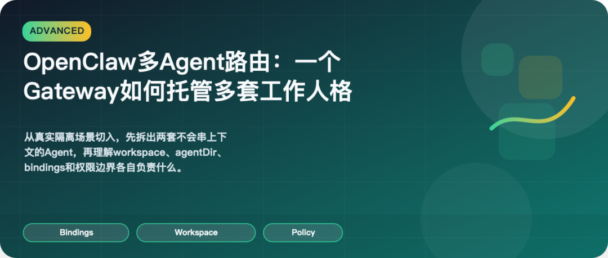
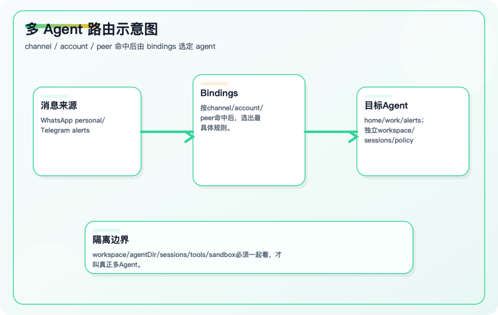

> 📎 来源: [超级AI技术](https://mp.weixin.qq.com/s?__biz=MzUyNzA1NDY0MQ==&mid=2247484564&idx=1&sn=193a2ce52ff164b3638e024d392ae1dc&chksm=fbdc4623d93aa37b2375283941692866d748971f9c0463d8b8f120ab925867fa8e6036a6759c&mpshare=1&scene=1&srcid=04245YqfbwAgJtfoGtlCo8Wz&sharer_shareinfo=eb65ef4b8b659b9813e3dbb31d720f71&sharer_shareinfo_first=eb65ef4b8b659b9813e3dbb31d720f71) | 时间: 2026-04-24 21:31

---

AI推荐

适合读者：想让一个 Gateway 托管多套隔离工作人格的高级用户和技术负责人。

预计阅读：6 分钟

你将看到：

•多 Agent 的本质是 workspace、agentDir、sessions 和 policy 的隔离。

•bindings 决定消息该路由到哪个 agent。

•目录隔离不是安全隔离，真正边界还要靠 sandbox 和 tool policy。





如果你已经把一个 OpenClaw 入口跑稳，用不了多久就会碰到一个更现实的问题：

**工作消息、家庭消息、自动化任务，到底要不要共用同一个脑子。**

很多人第一次做多 Agent，会从“一个研究、一个写作”这种概念分工开始。但在 OpenClaw 里，真正值得先拆开的，通常不是 prompt，而是边界：

• 不同 workspace

• 不同 auth / state

• 不同 session

• 不同工具权限

所以这一篇不先讲抽象架构，而是先解决一个实际问题：

**怎么让一个 Gateway 托管两套不会串上下文、不会串账号、也不会串权限的 Agent。**

## 一、先定本篇起点和完成标志

### 你的起点状态

1. 你已经至少有一个可用的 OpenClaw agent

2. 你已经理解单 agent 的 workspace、session 和通道入口

3. 你开始希望把不同工作模式隔离开

### 本篇完成标志

到最后，你应该至少做到：

1. 知道什么时候真的需要多 Agent

2. 会先拆出 

```
home
```

 / 

```
work
```

 这种最小双 Agent 结构

3. 理解 bindings、workspace、agentDir 和权限边界之间的关系

## 二、先用一个真实场景理解为什么要多 Agent

最典型的场景不是“我想玩高级架构”，而是下面这种冲突：

1. 你希望工作消息有自己的 workspace 和长期上下文

2. 你不想家庭消息读到工作项目里的技能和文件

3. 你希望自动化任务走更严格的权限边界

如果这些东西还共用同一套 session、同一套 workspace、同一套工具权限，那所谓“多角色”大概率只是表面人设，不是真正隔离。

所以多 Agent 在 OpenClaw 里的本质，不是多几段 prompt，而是：

**多套独立运行边界。**

## 三、第一版不要建很多 Agent，先拆出两个

刚开始最稳的做法，不是一次建 

```
research / writing / alerts / family / coding
```

 五六个 agent，而是先拆出两个最容易解释清楚的：

1. 

```
home
```

2. 

```
work
```

官方文档提供了 helper：

openclaw agents add home

openclaw agents add work

然后你可以查看当前 agents 和 bindings：

openclaw agents list --bindings

这一轮的目标非常简单：

• 

```
home
```

 处理个人和家庭消息

• 

```
work
```

 处理工作相关消息

只要这两套上下文能稳定分开，你后面再增加 

```
alerts
```

、

```
ops
```

、

```
social
```

 都会顺得多。

## 四、真正决定消息去哪的，是 bindings

很多人会误以为多 Agent 的核心是“我建了几个 workspace”。

其实不是。

真正决定消息进入哪个 agent 的，是 bindings，也就是路由匹配规则。

最常见的匹配条件包括：

• 

```
channel
```

• 

```
accountId
```

• 

```
peer
```

你可以把 bindings 理解成消息路由表。谁先命中、谁更具体，谁就接管这个会话。

例如：

• WhatsApp 个人号走 

```
home
```

• Telegram 工作 bot 走 

```
work
```

• 某个特定群聊固定走 

```
family
```

所以多 Agent 的第一原则不是“先起名字”，而是：

**先定义清楚什么消息该归谁。**

## 五、一个最小多 Agent 闭环，先长什么样

如果你现在只想验证“多 Agent 真的能把边界拆开”，可以先用下面这种最小思路：

{

  agents: {

    list: [

      { id: "home", workspace: "~/.openclaw/workspace-home" },

      { id: "work", workspace: "~/.openclaw/workspace-work" }

    ]

  },

  bindings: [

    { agentId: "home", match: { channel: "whatsapp" } },

    { agentId: "work", match: { channel: "telegram" } }

  ]

}

这段配置背后的重点，不是字段多复杂，而是你已经回答了两个关键问题：

1. 两套消息入口怎么分

2. 两套工作目录怎么分

当这个最小闭环跑通后，你再继续细分同一 channel 下的不同账号、不同 peer，才不会乱。

## 六、现在再回头讲：一个 agent 到底是什么

在 OpenClaw 里，一个 agent 不是只多了一个名字。

它至少拥有：

• 自己的 workspace，用来放 

```
AGENTS.md
```

、

```
SOUL.md
```

、

```
USER.md
```

、本地文件和 

```
skills/
```

• 自己的状态目录 

```
agentDir
```

，里面有 auth profiles、模型注册和 agent 配置

• 自己的会话存储目录，通常在 

```
~/.openclaw/agents//sessions
```

官方文档给出的常见路径大致是：

• 配置文件：

```
~/.openclaw/openclaw.json
```

• 全局状态目录：

```
~/.openclaw
```

• 默认 workspace：

```
~/.openclaw/workspace
```

• 多 agent workspace：

```
~/.openclaw/workspace-
```

 或你自定义的路径

• agentDir：

```
~/.openclaw/agents//agent
```

• sessions：

```
~/.openclaw/agents//sessions
```

这时候你会更容易理解一句话：

**多 Agent 的价值，不是“角色设定更多”，而是上下文、状态和路由终于分开了。**

## 七、多 Agent 最容易踩的两个坑

### 1. 复用  ``` agentDir ```

官方文档明确提醒：不要在多个 agent 之间复用同一个 

```
agentDir
```

，否则会引发 auth 和 session 冲突。

这不是小问题，而是会直接破坏隔离性。

### 2. 把 workspace 当成硬沙箱

文档里也说得很清楚：workspace 是默认工作目录，不是强制沙箱。相对路径通常在 workspace 内解析，但绝对路径仍然可能访问主机其他位置，除非你显式启用了 sandbox。

所以“目录分开了”不等于“安全隔离了”。

## 八、多 Agent 还有两层很容易被忽视的隔离

### 1. Skills 隔离

每个 agent 可以有自己的 

```
/skills
```

。这让你能做到：

• 家庭 agent 只带生活技能

• 工作 agent 带研发与发布技能

• 公共 agent 只暴露最小能力

### 2. 权限隔离

从官方文档看，OpenClaw 已支持 per-agent sandbox 和 tool policy。也就是说，不同 agent 不仅人格不同，连可用工具范围也可以不同。

这才是多 Agent 真正进入长期可用状态的关键。

## 九、什么时候你才真的需要多 Agent

不是“我觉得多 Agent 很酷”的时候，而是当下面至少一项成立时：

1. 你需要不同 workspace 和长期上下文

2. 你需要不同渠道对应不同工作模式

3. 你需要不同模型预算和响应速度

4. 你需要不同权限边界

如果只是想做概念分工，但底层路径、会话、权限仍然混在一起，那不算真正的多 Agent。

## 十、这一篇之后，你该建立什么认知

到这里，你应该把多 Agent 理解成：

**多套 workspace + state + session + routing + policy 的组合。**

它解决的是边界问题，不是文案问题。

下一篇我们继续深入，直接进入 OpenClaw 最核心的运行路径：Agent Loop。

## 参考链接

• Multi-Agent Routing：
https://docs.openclaw.ai/concepts/multi-agent

• Skills：
https://docs.openclaw.ai/tools/skills

• Security：
https://docs.openclaw.ai/gateway/security

---

这一篇属于 OpenClaw 系列的「深入」阶段。

上一篇：OpenClaw 会话与记忆：让 Agent 记住，而不只是多轮聊天

下一篇：OpenClaw 深入机制：Agent Loop、流式事件与 Hook 扩展
